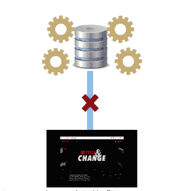

# 数据科学 vs 大数据 vs 数据分析

> 原文：<https://medium.com/edureka/data-science-vs-big-data-vs-data-analytics-4c1c20e2876b?source=collection_archive---------0----------------------->

我们生活在一个数据驱动的世界。事实上，现有的数字数据量正在快速增长，每两年翻一番，并改变着我们的生活方式。现在 Hadoop 和其他框架已经解决了存储的问题，对数据的主要关注已经转移到处理这种巨大的数据量上。当我们谈论数据处理时，人们可能会想到数据科学、大数据和数据分析，但它们之间一直存在混淆。

在这篇关于数据科学与大数据和数据分析的文章中，我将涵盖以下主题，以便让您了解它们之间的相似之处和不同之处。

*   ***数据科学、大数据简介&数据分析***
*   ***数据科学家、大数据专业人士&数据分析师是做什么的？***
*   ***成为数据科学家、大数据专家所需的技能组合&数据分析师***
*   ***薪资前景如何？***
*   ***实时用例***

# 数据科学、大数据和数据分析简介

让我们从理解数据科学、大数据和数据分析这几个术语开始。

## 什么是数据科学？

数据科学融合了各种工具、算法和机器学习原理，目标是从原始数据中发现隐藏的模式。

[Source: gfycat.com]

它还涉及以各种方式解决问题以获得解决方案，另一方面，它涉及使用各种原型、算法、预测模型和定制分析来设计和构建数据建模和生产的新流程。

## 什么是大数据？

大数据是指从各种数据源涌入的大量数据，具有不同的格式。它可以用来分析洞察力，从而做出更好的决策和战略性业务举措。

[Source: gfycat.com]

# 什么是数据分析？

数据分析是检查原始数据的科学，目的是得出关于该信息的结论。这一切都是为了从数据中发现有用的信息来支持决策。这个过程包括检查、清理、转换和建模数据。

[Source: ibm.com]

# 数据科学家、大数据专家和数据分析师是做什么的？

## 数据科学家是做什么的？

数据科学家执行探索性分析，从数据中发现真知灼见。他们还使用各种先进的机器学习算法来识别未来特定事件的发生。这包括识别隐藏的模式、未知的相关性、市场趋势和其他有用的商业信息。

Roles of Data Scientist

## 大数据专业人士是做什么的？

大数据专业人员的职责在于处理大量异构数据，这些数据是从各种来源高速收集而来的。

Roles of Big Data Professional

大数据专业人员描述大数据解决方案的结构和行为，以及如何使用 Hadoop、Spark、Kafka 等大数据技术交付大数据解决方案。基于需求。

## 数据分析师是做什么的？

数据分析师将数字翻译成简单的英语。每个企业都收集数据，如销售数字、市场研究、物流或运输成本。数据分析师的工作就是获取数据，并利用这些数据帮助公司做出更好的商业决策。

Roles of Data Analyst

# 成为数据科学家、大数据专家和数据分析师所需的技能

# 薪资前景如何？

下图显示了数据科学家、大数据专家和数据分析师的平均薪资结构。

# 说明数据科学、大数据和数据分析用途的场景。

现在，让我们试着理解如何将这三者结合在一起才能获得益处。

让我们以网飞为例，看看他们如何联合起来实现目标。

首先，让我们了解一下*大数据专家*在网飞例子中的作用。

网飞生成大量文本、音频、视频文件等形式的非结构化数据。如果我们试图使用传统方法处理这些黑暗(非结构化)数据，这将成为一项复杂的任务。

Traditional Data Processing Approach in Netflix

因此，大数据专家设计并创建了一个使用大数据工具的环境，以简化网飞数据的处理。

Big Data approach to process Netflix data

现在，让我们看看*数据科学家*如何优化网飞流媒体体验。

Role of Data Scientist in Optimizing the Netflix streaming experience

## **1。了解 QoE 对用户行为的影响**

用户行为是指用户与网飞服务交互的方式，数据科学家使用数据来理解和预测行为。例如，网飞产品的变化会如何影响会员观看的小时数？为了改善流媒体体验，数据科学家关注可能对用户行为产生影响的 QoE 指标。一个感兴趣的指标是再缓冲率，它衡量回放被暂时中断的频率。另一个衡量标准是比特率，它指的是提供/观看的图片的质量——非常低的比特率对应于模糊的图片。

## **2。改善流媒体体验**

一旦会员在网飞点击“播放”，数据科学家如何利用数据提供最佳用户体验？

一种方法是查看一旦回放开始就实时或接近实时运行的算法，这些算法确定应该提供什么比特率、从什么服务器下载该内容等。

例如，与在蜂窝网络上的移动设备上具有低带宽的成员相比，在家庭网络上具有高带宽连接的成员可能具有非常不同的期望和体验。

通过确定所有这些因素，可以改善流式传输体验。

## **3。优化内容缓存**

内容交付端也存在一系列大数据问题。

这里的关键思想是将内容放在离网飞会员更近的地方(就网络跳数而言),以提供更好的体验。通过观察接受服务的成员的行为和体验，可以优化有关内容缓存的决策。

## **4。提高内容质量**

另一种改善用户体验的方法包括查看内容的质量，即视频、音频、字幕、隐藏字幕等。是电影或节目的一部分。网飞以数字资产的形式从工作室接收内容，然后在内容服务器上直播之前对其进行编码和质量检查。

除了内部质量检查之外，数据科学家在查看时发现问题，也会收到来自我们成员的反馈。

通过结合会员反馈和与观看行为相关的内在因素，他们建立了模型来预测特定内容是否存在质量问题。机器学习模型以及自然语言处理(NLP)和文本挖掘技术可用于构建强大的模型，以提高上线内容的质量，并使用网飞用户提供的信息来关闭质量环路，替换不符合用户期望的内容。

这就是*数据科学家*优化网飞流媒体体验的方式。

现在，让我们来了解一下*数据分析*是如何被用来推动网飞取得成功的。

Role of Data Analyst in Netflix

上图显示了在网飞上观看视频/播放的不同类型的用户。他们每个人都有自己的选择和偏好。

***那么数据分析师是做什么的呢？***

Data Analyst 根据用户的偏好创建用户流。例如，如果用户 1 和用户 2 具有相同的偏好或视频选择，则 data analyst 会为这些选择创建一个用户流。还有-

1.  以个性化的方式为每个会员档案订购网飞系列。
2.  我们知道，每个成员的相同类型行有完全不同的视频选择。
3.  从整个目录中挑选出最佳个性化推荐，重点关注排名靠前的书目。
4.  通过捕捉网飞上的所有事件和用户活动，data analyst 会弹出趋势视频。
5.  对最近观看的标题进行分类，并估计该成员是否将继续观看、重新观看或停止观看等。

我希望您已经理解了数据科学、大数据和数据分析之间的区别和相似之处。

如果你想查看更多关于 Python、DevOps、Ethical Hacking 等市场最热门技术的文章，那么你可以参考 [Edureka 的官方网站。](https://www.edureka.co/blog/?utm_source=medium&utm_medium=content-link&utm_campaign=data-science-vs-bigdata-vs-data-analytics)

请留意本系列中的其他文章，它们将解释数据科学的各个方面。

> *1。* [*数据科学教程*](/edureka/data-science-tutorial-484da1ff952b)
> 
> *2。* [*数据科学的数学与统计*](/edureka/math-and-statistics-for-data-science-1152e30cee73)
> 
> *3。*[*R 中的线性回归*](/edureka/linear-regression-in-r-da3e42f16dd3)
> 
> *4。* [*数据科学教程*](/edureka/data-science-tutorial-484da1ff952b)
> 
> *5。*[*R 中的逻辑回归*](/edureka/logistic-regression-in-r-2d08ac51cd4f)
> 
> *6。* [*分类算法*](/edureka/classification-algorithms-ba27044f28f1)
> 
> *7。* [*随机森林中的 R*](/edureka/random-forest-classifier-92123fd2b5f9)
> 
> *8。* [*决策树中的 R*](/edureka/a-complete-guide-on-decision-tree-algorithm-3245e269ece)
> 
> *9。* [*机器学习入门*](/edureka/introduction-to-machine-learning-97973c43e776)
> 
> *10。* [*朴素贝叶斯在 R*](/edureka/naive-bayes-in-r-37ca73f3e85c)
> 
> *11。* [*统计与概率*](/edureka/statistics-and-probability-cf736d703703)
> 
> *12。* [*如何创建一个完美的决策树？*](/edureka/decision-trees-b00348e0ac89)
> 
> *13。* [*关于数据科学家角色的十大神话*](/edureka/data-scientists-myths-14acade1f6f7)
> 
> *14。* [*顶级数据科学项目*](/edureka/data-science-projects-b32f1328eed8)
> 
> *15。* [*数据分析师 vs 数据工程师 vs 数据科学家*](/edureka/data-analyst-vs-data-engineer-vs-data-scientist-27aacdcaffa5)
> 
> *16。* [*人工智能的种类*](/edureka/types-of-artificial-intelligence-4c40a35f784)
> 
> *17。*[*5 大机器学习算法*](/edureka/machine-learning-algorithms-29eea8b69a54)
> 
> 18。 [*人工智能 vs 机器学习 vs 深度学习*](/edureka/ai-vs-machine-learning-vs-deep-learning-1725e8b30b2e)
> 
> 19。 [*机器学习项目*](/edureka/machine-learning-projects-cb0130d0606f)
> 
> *二十。* [*数据分析师面试问答*](/edureka/data-analyst-interview-questions-867756f37e3d)
> 
> *21。* [*面向非程序员的数据科学和机器学习工具*](/edureka/data-science-and-machine-learning-for-non-programmers-c9366f4ac3fb)
> 
> 22。 [*十大机器学习框架*](/edureka/top-10-machine-learning-frameworks-72459e902ebb)
> 
> *23。* [*用于机器学习的统计*](/edureka/statistics-for-machine-learning-c8bc158bb3c8)
> 
> *二十四。* [*随机森林中的 R*](/edureka/random-forest-classifier-92123fd2b5f9)
> 
> *25。* [*广度优先搜索算法*](/edureka/breadth-first-search-algorithm-17d2c72f0eaa)
> 
> *26。*[*R 中的线性判别分析*](/edureka/linear-discriminant-analysis-88fa8ad59d0f)
> 
> *27。* [*机器学习的先决条件*](/edureka/prerequisites-for-machine-learning-68430f467427)
> 
> *28。* [*互动 WebApps 使用 R 闪亮*](/edureka/r-shiny-tutorial-47b050927bd2)
> 
> *29。* [*机器学习十大书籍*](/edureka/top-10-machine-learning-books-541f011d824e)
> 
> *三十。* [*无监督学习*](/edureka/unsupervised-learning-40a82b0bac64)
> 
> *31.1* [*0 最佳数据科学书籍*](/edureka/10-best-books-data-science-9161f8e82aca)
> 
> *32。* [*监督学习*](/edureka/supervised-learning-5a72987484d0)

*原载于 2018 年 9 月 17 日*[*https://www.edureka.co*](https://www.edureka.co/blog/data-science-vs-big-data-vs-data-analytics/)*。*