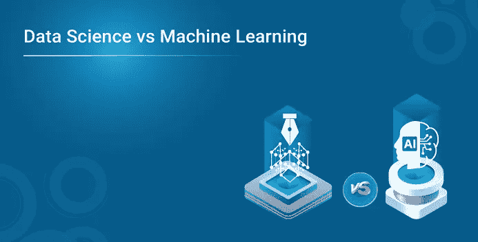

# 数据科学与机器学习——有什么区别？

> 原文：<https://medium.com/edureka/data-science-vs-machine-learning-578a652876a3?source=collection_archive---------3----------------------->

# 数据科学 vs 机器学习:

机器学习和数据科学是当今世界最重要的领域。你在世界上看到的所有科幻作品都是来自数据科学、人工智能(AI)和机器学习等领域的贡献。在这篇关于数据科学与机器学习的博客中，我们将讨论机器学习和数据科学的重要性和区别。

在这篇数据科学与机器学习的博客中，我将涉及以下主题:

1.  什么是数据科学？
2.  什么是机器学习？
3.  数据科学领域
4.  用例

# **什么是数据科学？**

在我们进入数据科学的细节之前，让我们了解一下数据科学是如何产生的。你们还记得大多数数据存储在 Excel 表格中的时候吗？那是更简单的时代，因为我们生成的数据更少，而且数据是结构化的。当时，简单的商业智能(BI)工具用于分析和处理数据。

但是时代变了。每天都会产生超过 250 亿字节的数据，而且这个数字还会继续增长。据估计，到 2020 年，地球上每个人每秒将产生 170 万字节的数据。你能想象这是多少数据吗？我们如何处理这么多数据？

*What Is Data Science — Data Science vs Machine Learning — Edureka*

不仅如此，如今生成的数据大部分是非结构化或半结构化的，简单的 BI 工具再也无法完成这项工作。我们需要更复杂和有效的算法来处理数据并从中提取有用的见解。这就是数据科学的用武之地。

例如，你肯定看过《网飞》。网飞数据公司挖掘其用户的电影观看模式，以了解是什么驱动了用户的兴趣，并利用这一点来决定制作哪个网飞系列。

同样，Target 通过从数据库中提取模式来识别每个客户的购物行为，这有助于他们做出更好的营销决策。

现在你知道了数据科学为什么重要，让我们继续讨论什么是机器学习。

# 什么是机器学习？

机器学习背后的想法是，你通过给机器输入数据来教它们，让它们自己学习，而不需要任何人工干预。为了理解机器学习，我们来考虑一个小场景。

假设你报名参加了滑冰课，但是你以前没有滑冰的经验。最初，你会很不擅长，因为你不知道如何滑冰。但是随着你观察和获取更多的信息，你会变得更好。观察只是收集数据的另一种方式。

就像我们人类如何从我们的观察和经验中学习一样，当机器获得大量数据时，它们也能够自主学习。这正是机器学习的工作方式。

机器学习从阅读和观察训练数据开始，以找到有用的见解和模式，从而建立一个预测正确结果的模型。然后通过使用测试数据集来评估模型的性能。这个过程一直进行到，机器自动学习并将输入映射到正确的输出，而无需任何人工干预。

我希望你对什么是机器学习有一个概念，如果你想了解更多关于机器学习的知识，请查看我们的机器学习专家的视频。

# 数据科学领域

数据科学涵盖了广泛的领域，包括人工智能(AI)、机器学习和深度学习。数据科学使用各种人工智能、机器学习和深度学习方法来分析数据，并从中提取有用的见解。为了让事情更清楚，让我给你定义这些术语:

*   **人工智能:**人工智能是数据科学的一个子集，使机器能够模拟类似人类的行为。
*   **机器学习:**机器学习是人工智能的一个子领域，它为机器提供了自动学习的能力&根据经验进行改进，而无需显式编程。
*   **深度学习:**深度学习是机器学习的一部分，它使用各种计算方法和算法，这些方法和算法受到大脑结构和功能的启发，被称为人工神经网络。

总之，数据科学涉及从数据中提取知识。为了做到这一点，它使用了来自不同学科的一系列不同方法，如机器学习，人工智能和深度学习。这里要注意的一点是，数据科学是一个更广泛的领域，并不完全依赖于这些技术。

现在，你已经清楚地区分了人工智能、机器学习和深度学习，让我们讨论一个用例，在这个用例中，我们将看到数据科学和机器学习如何用于推荐引擎的工作。

# 用例:推荐引擎:

在我们讨论机器学习和数据科学如何在推荐系统中实现之前，让我们看看推荐引擎到底是什么。

# 什么是推荐引擎？

当然，你们都用过亚马逊网上购物。你有没有注意到，当你在亚马逊上寻找一个特定的商品时，你会得到类似商品的推荐？好吧，亚马逊是怎么知道这个的？

亚马逊、沃尔玛、网飞等公司之所以做得这么好，是因为它们处理用户生成数据的方式。

每个用户都有一个基于他/她的个人资料的电子商务网站的个性化视图，这允许他们选择相关的产品。例如，如果你在亚马逊上寻找一台新的笔记本电脑，你可能还想买一个电脑包。基于这样的联想，亚马逊会给你推荐更多的商品。

接下来，让我们讨论如何在推荐引擎中使用数据科学和机器学习。

***一个数据科学工作流有六个明确定义的阶段:***

1.  业务需求
2.  数据采集
3.  数据争论
4.  数据探索
5.  数据建模
6.  部署和优化

**第一步:业务需求**

数据科学项目总是从定义业务需求开始。理解你试图解决的问题是很重要的。这个阶段的主要重点是确定项目的不同目标。

在我们的例子中，目标是构建一个推荐引擎，根据客户生成的数据向他们推荐相关的商品。

**第二步:数据采集**

既然您已经定义了项目的目标，是时候开始收集数据了。数据可以从不同的来源收集，如显式来源和隐式来源:

*   **显式数据:**这包括用户输入的数据，如对产品的评分和评论
*   **隐式数据:**购买历史、购物车详情、搜索历史等都属于这个类别

收集这样的数据很容易，因为用户已经在使用这个应用程序，所以不需要做任何额外的工作。
由于每个用户必然会对产品有不同的看法，因此他们的数据集也将是不同的。

在调查中，几位数据科学家接受了采访，了解他们的经历。他们中的大多数人认为他们 50%到 80%的时间都花在了清理数据上。数据清理被认为是数据科学中最耗时的任务之一。

*数据清洗是去除不相关和不一致数据的过程。在这个阶段，你必须将你的数据转换成想要的格式，以便你的机器学习模型可以解释它。有必要消除任何不一致，因为它们可能导致不准确的结果。*

例如，从不太重要的日志中过滤重要的日志，识别虚假评论，删除不必要的评论，丢失值等。这些问题都是在这个阶段处理的。

**第四步:数据探索**

*数据探索包括理解数据中的模式，并从中获取有用的见解。在这一阶段，将评估每位顾客的购物模式，以便向他们推荐相关产品。*

例如，如果你想在亚马逊上购买《哈利·波特》系列图书，你可能也想购买《指环王》或同类书籍。所以，亚马逊推荐类似的书给你。
从今以后，随着你向引擎提供更多的数据，它会更好地提供建议。

**第五步:数据建模**

如前所述，机器学习是数据科学的一部分，在我们数据周期的这个阶段，机器学习已经实现。如果需要，机器学习也可以是数据探索或可视化的一部分，但这个阶段是专门用于建立机器学习模型的。

为了理解数据建模，我们来分解一下机器学习的过程。

***机器学习分 5 个不同阶段进行:***

1.  导入数据
2.  数据清理
3.  创建模型
4.  模特培训
5.  模型检验
6.  提高模型的准确性

**导入数据:**在这个阶段，收集的数据被导入到机器学习过程中。数据必须是可读的格式，例如 CSV 文件或表格。

**数据清理:**数据可以有多个重复值、缺失值或不适用值。数据中的这种不一致会导致错误的预测，必须在这个阶段处理。

**创建模型:**该阶段包括将数据集分成 2 组，一组用于训练，另一组用于测试。之后，您必须使用定型数据集来构建模型。模型是使用机器学习算法构建的，如逻辑回归、线性回归、随机森林、支持向量机等。

*Machine Learning Process — Data Science vs Machine Learning — Edureka*

**模型训练:**在这个阶段，在训练数据集上训练机器学习模型。数据集的大部分用于训练，以便模型可以学习根据一组不同的值将输入映射到输出。

**模型测试:**模型训练完成后，使用测试数据集进行评估。在这个阶段，模型被输入新的数据点，它必须通过在先前构建的机器学习模型上运行新的数据点来预测结果。

**改进模型:**利用测试数据对模型进行评估后，计算其精度。有 n 种方法可以提高模型的效率。交叉验证等方法用于使模型更加准确。

这就是关于机器学习过程的全部内容。进入数据生命周期的最后阶段。

**第六步:部署&优化**

此阶段的目标是将最终模型部署到生产环境中，以供最终用户接受。在此阶段，用户必须验证模型的性能，如果模型有任何问题，则必须在此阶段解决。

*机器学习通过提供一套用于数据探索、数据建模、决策制定等的算法来辅助数据科学。另一方面，数据科学结合在一起，一套机器学习算法来预测结果。*

在我结束这篇博客之前，我想总结一下，数据科学和机器学习是相互关联的领域，因为机器学习是数据科学的一部分，所以它们之间没有太多的可比性。

至此，我们结束了这篇关于数据科学与机器学习的博客。就这样，我们到了这篇文章的结尾。如果你对这个话题有任何疑问，请在下面留下评论，我们会尽快回复你。如果你想查看更多关于 Python、DevOps、Ethical Hacking 等市场最热门技术的文章，你可以参考 Edureka 的官方网站。

请留意本系列中解释数据科学各个方面的其他文章。

> *1。* [*数据科学教程*](/edureka/data-science-tutorial-484da1ff952b)
> 
> *2。* [*数据科学的数学与统计*](/edureka/math-and-statistics-for-data-science-1152e30cee73)
> 
> *3。*[*R 中的线性回归*](/edureka/linear-regression-in-r-da3e42f16dd3)
> 
> *4。* [*数据科学教程*](/edureka/data-science-tutorial-484da1ff952b)
> 
> *5。*[*R 中的逻辑回归*](/edureka/logistic-regression-in-r-2d08ac51cd4f)
> 
> *6。* [*分类算法*](/edureka/classification-algorithms-ba27044f28f1)
> 
> *7。* [*随机森林中的 R*](/edureka/random-forest-classifier-92123fd2b5f9)
> 
> *8。* [*决策树中的 R*](/edureka/a-complete-guide-on-decision-tree-algorithm-3245e269ece)
> 
> *9。* [*机器学习入门*](/edureka/introduction-to-machine-learning-97973c43e776)
> 
> *10。* [*朴素贝叶斯在 R*](/edureka/naive-bayes-in-r-37ca73f3e85c)
> 
> *11。* [*统计与概率*](/edureka/statistics-and-probability-cf736d703703)
> 
> *12。* [*如何创建一个完美的决策树？*](/edureka/decision-trees-b00348e0ac89)
> 
> *13。* [*关于数据科学家角色的 10 大误区*](/edureka/data-scientists-myths-14acade1f6f7)
> 
> *14。* [*排名前 5 的机器学习算法*](/edureka/machine-learning-algorithms-29eea8b69a54)
> 
> 15。 [*数据分析师 vs 数据工程师 vs 数据科学家*](/edureka/data-analyst-vs-data-engineer-vs-data-scientist-27aacdcaffa5)
> 
> *16。* [*人工智能的种类*](/edureka/types-of-artificial-intelligence-4c40a35f784)
> 
> *17。*[*R vs Python*](/edureka/r-vs-python-48eb86b7b40f)
> 
> 18。 [*人工智能 vs 机器学习 vs 深度学习*](/edureka/ai-vs-machine-learning-vs-deep-learning-1725e8b30b2e)
> 
> 19。 [*机器学习项目*](/edureka/machine-learning-projects-cb0130d0606f)
> 
> 20。 [*数据分析师面试问答*](/edureka/data-analyst-interview-questions-867756f37e3d)
> 
> *21。* [*面向非程序员的数据科学和机器学习工具*](/edureka/data-science-and-machine-learning-for-non-programmers-c9366f4ac3fb)
> 
> *22。* [*十大机器学习框架*](/edureka/top-10-machine-learning-frameworks-72459e902ebb)
> 
> *23。* [*用于机器学习的统计*](/edureka/statistics-for-machine-learning-c8bc158bb3c8)
> 
> *24。* [*随机森林中的 R*](/edureka/random-forest-classifier-92123fd2b5f9)
> 
> *25。* [*广度优先搜索算法*](/edureka/breadth-first-search-algorithm-17d2c72f0eaa)
> 
> *26。*[*R 中的线性判别分析*](/edureka/linear-discriminant-analysis-88fa8ad59d0f)
> 
> *27。* [*机器学习的先决条件*](/edureka/prerequisites-for-machine-learning-68430f467427)
> 
> *28。* [*互动 WebApps 使用 R 闪亮*](/edureka/r-shiny-tutorial-47b050927bd2)
> 
> *29。* [*机器学习十大书籍*](/edureka/top-10-machine-learning-books-541f011d824e)
> 
> *30。* [*无监督学习*](/edureka/unsupervised-learning-40a82b0bac64)
> 
> *31.1* [*0 最佳数据科学书籍*](/edureka/10-best-books-data-science-9161f8e82aca)
> 
> 32。 [*监督学习*](/edureka/supervised-learning-5a72987484d0)

*原载于 2019 年 2 月 8 日 https://www.edureka.co***。**