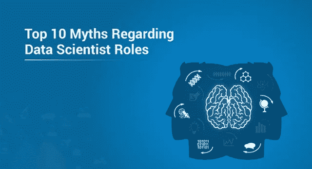
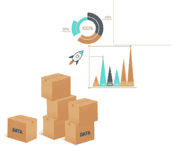
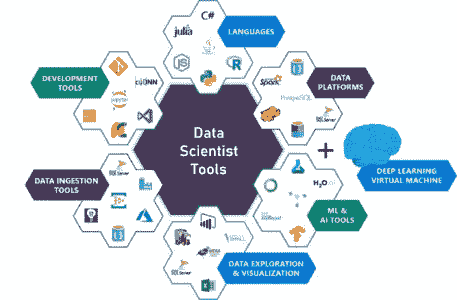

# 关于数据科学家角色的 10 大误区

> 原文：<https://medium.com/edureka/data-scientists-myths-14acade1f6f7?source=collection_archive---------0----------------------->

**数据科学**已经成为最近最热门的领域之一。它正以惊人的速度增长，对数据科学家的需求也在增长。数据科学家的角色是极其动态的；对他们来说，没有两天是一样的，这就是为什么它如此独特和令人兴奋。因为这是一个新领域，所以既兴奋又困惑。因此，让我们按照以下顺序来澄清这些数据科学家的神话:

*   谁是数据科学家？
*   数据科学家的神话与现实

# 谁是数据科学家？

尽管数据科学家有几种定义，但基本上他们是实践数据科学艺术的专业人士。数据科学家利用他们在科学领域的专业知识解决复杂的数据问题。这是一个专家的职位。

他们擅长不同类型的技能，如演讲、文本分析(NLP)、图像和视频处理、医学和材料模拟等。这些专家角色中的每一个在数量上都非常有限，因此这样一个专家的价值是巨大的。任何快速获得动力的东西都有可能成为每个人谈论的话题。而且，人们谈论的越多，误解和神话就越多。因此，让我们揭穿一些数据科学家的神话。

# 数据科学家的神话与现实

## **你需要有博士学位**

毫无疑问，博士学位是一项非常大的成就。做研究需要很多努力和奉献。但是成为数据科学家有必要吗？这取决于你想从事的工作类型。

如果你想应聘**的应用数据科学职位**，该职位主要基于使用现有算法并理解它们的工作原理。大多数人都属于这一类，你看到的大多数职位空缺和工作描述都只针对这些角色。对于这个角色，你不需要博士学位。

但是，如果你想从事研究工作，那么你可能需要一个博士学位。如果研究算法或写任何论文是你的事情，那么博士是你的方向。

## **数据科学家将很快被 AI 取代**

如果你觉得一堆数据科学家可以做一个 AI/ML 项目相关的一切。这不是一个实用的解决方案，因为如果你专注于任何一个人工智能项目，它都有过多的工作岗位。人工智能是一个非常复杂的领域，有许多不同的角色，例如:

*   数据工程师
*   统计员
*   领域专家
*   物联网专家
*   项目经理

光靠数据科学家无法解决所有问题，人工智能也不可能做到。所以，如果你是害怕这个的人之一，DONT。人工智能还不能做这样的事情，你需要不同领域的大量知识。

## **数据越多，精确度越高**

有一个非常大的误解，大数据科学家的一个误区是“数据越多，模型的准确性就越高”。更多的数据**不会将**转化为更高的精度。另一方面，维护良好的小型数据可能具有更好的质量和准确性。最重要的是理解数据及其可用性。最重要的是**的质量**。

## **深度学习只适用于大型组织**

一个最常见的误区是，你需要相当多的硬件来运行深度学习任务。嗯，这并不完全错误，当有强大的硬件设置运行时，深度学习模型总是会更有效地执行。但是可以在本地系统或者 Google Colab (GPU + CPU)上运行。在您的机器上训练模型可能需要比预期更长的时间。

## **数据收集很容易**

数据正以每天大约 2.5 万亿字节的惊人速度生成，以正确的格式收集正确的数据仍然是一项艰巨的任务。你需要为你的项目建立一个合适的管道。有很多来源可以获得数据。成本和质量很重要。维护数据和管道的完整性是一个非常重要的部分，不应该乱来。

## **数据科学家只与工具打交道/一切都与工具有关**

人们通常开始学习一种工具，认为他们会在数据科学领域找到一份工作。作为一名数据科学家，学习一种工具很重要，但正如我之前提到的，他们的角色更加多样化。数据科学家应该超越使用工具来获得解决方案；相反，他们需要掌握必要的技能。是的，掌握一种工具创造了轻松进入数据科学的希望，但雇佣数据科学家的公司不会只考虑工具专业知识；相反，他们寻找的是掌握了技术和商业技能的专业人士。

## **你需要有编码/计算机科学背景**

大多数数据科学家擅长编码，可能有计算机科学、数学或统计学方面的经验。这并不意味着其他背景的人不能成为数据科学家。所以，要记住的一件事是，这些来自这些背景的人有优势，但那只是在初始阶段。你只需要保持奉献精神和努力工作，很快对你来说也会很容易。

## **数据科学竞赛和真实项目是一样的**

这些竞赛是数据科学漫长旅程中的一个良好开端。你要处理大型数据集和算法。一切都很好，但将它视为一个项目并将其放在你的简历上肯定不是一个好主意**因为这些比赛与现实生活中的项目相去甚远。你不能清理杂乱的数据，或者建立任何**管道**，或者检查时间限制。重要的是模型的准确性。**

## **这都是关于预测模型的建立**

****

**人们通常认为数据科学家预测未来的结果。预测建模是数据科学的一个非常重要的方面，但它本身并不能帮助你。任何一个项目，从数据收集、扯皮、分析数据、训练算法、建立模型、测试模型到最后部署的**全周期**都有**多个步骤**参与。你需要知道整个**端到端的流程**。让我们看看最终的数据科学家神话。**

## **人工智能一旦建成就会继续进化**

****

**这是一个普遍的误解，即人工智能会自己继续成长、进化和推广。嗯，科幻电影一直在传达同样的信息。现在，这完全不是真的，事实上，我们落后了。我们最多能做的就是训练模型，如果有新的数据输入，这些模型就会自我训练。他们无法适应环境的变化和新的数据类型。**

***如此。如果你认为一日机器将做所有的工作？好吧，你得离开电影了！我希望你所有的数据科学家神话现在都被澄清了。*如果你想查看更多关于 Python、DevOps、Ethical Hacking 等市场最热门技术的文章，你可以参考 [Edureka 的官方网站。](https://www.edureka.co/blog/?utm_source=medium&utm_medium=content-link&utm_campaign=data-scientists-myths)**

**请留意本系列中的其他文章，它们将解释数据科学的各个方面。**

> ***1。* [*数据科学教程*](/edureka/data-science-tutorial-484da1ff952b)**
> 
> ***2。* [*数据科学的数学与统计*](/edureka/math-and-statistics-for-data-science-1152e30cee73)**
> 
> ***3。*[*R 中的线性回归*](/edureka/linear-regression-in-r-da3e42f16dd3)**
> 
> ***4。* [*数据科学教程*](/edureka/data-science-tutorial-484da1ff952b)**
> 
> ***5。*[*R 中的逻辑回归*](/edureka/logistic-regression-in-r-2d08ac51cd4f)**
> 
> ***6。* [*分类算法*](/edureka/classification-algorithms-ba27044f28f1)**
> 
> ***7。* [*随机森林中的 R*](/edureka/random-forest-classifier-92123fd2b5f9)**
> 
> ***8。* [*决策树中的 R*](/edureka/a-complete-guide-on-decision-tree-algorithm-3245e269ece)**
> 
> ***9。* [*机器学习入门*](/edureka/introduction-to-machine-learning-97973c43e776)**
> 
> **10。 [*朴素贝叶斯在 R*](/edureka/naive-bayes-in-r-37ca73f3e85c)**
> 
> ***11。* [*统计与概率*](/edureka/statistics-and-probability-cf736d703703)**
> 
> ***12。* [*如何创建一个完美的决策树？*](/edureka/decision-trees-b00348e0ac89)**
> 
> ***13。*[*5 大机器学习算法*](/edureka/machine-learning-algorithms-29eea8b69a54)**
> 
> ***14。* [*顶级数据科学项目*](/edureka/data-science-projects-b32f1328eed8)**
> 
> **15。 [*数据分析师 vs 数据工程师 vs 数据科学家*](/edureka/data-analyst-vs-data-engineer-vs-data-scientist-27aacdcaffa5)**
> 
> ***16。* [*人工智能的种类*](/edureka/types-of-artificial-intelligence-4c40a35f784)**
> 
> ***17。*[*R vs Python*](/edureka/r-vs-python-48eb86b7b40f)**
> 
> ***18。* [*人工智能 vs 机器学习 vs 深度学习*](/edureka/ai-vs-machine-learning-vs-deep-learning-1725e8b30b2e)**
> 
> ***19。* [*机器学习项目*](/edureka/machine-learning-projects-cb0130d0606f)**
> 
> ***20。* [*数据分析师面试问答*](/edureka/data-analyst-interview-questions-867756f37e3d)**
> 
> ***21。* [*面向非程序员的数据科学和机器学习工具*](/edureka/data-science-and-machine-learning-for-non-programmers-c9366f4ac3fb)**
> 
> ***22。* [*十大机器学习框架*](/edureka/top-10-machine-learning-frameworks-72459e902ebb)**
> 
> ***23。* [*统计机器学习*](/edureka/statistics-for-machine-learning-c8bc158bb3c8)**
> 
> **24。 [*随机森林中的 R*](/edureka/random-forest-classifier-92123fd2b5f9)**
> 
> ***25。* [*广度优先搜索算法*](/edureka/breadth-first-search-algorithm-17d2c72f0eaa)**
> 
> ***26。*[*R 中的线性判别分析*](/edureka/linear-discriminant-analysis-88fa8ad59d0f)**
> 
> **27。 [*机器学习的先决条件*](/edureka/prerequisites-for-machine-learning-68430f467427)**
> 
> ***二十八。* [*互动 WebApps 使用 R 闪亮*](/edureka/r-shiny-tutorial-47b050927bd2)**
> 
> ***29。* [*机器学习十大书籍*](/edureka/top-10-machine-learning-books-541f011d824e)**
> 
> ***30。* [*无监督学习*](/edureka/unsupervised-learning-40a82b0bac64)**
> 
> ***31.1* [*0 最佳数据科学书籍*](/edureka/10-best-books-data-science-9161f8e82aca)**
> 
> ***32。* [*监督学习*](/edureka/supervised-learning-5a72987484d0)**

***原载于 2019 年 5 月 10 日*[*https://www.edureka.co*](https://www.edureka.co/blog/data-scientists-myths)*。***