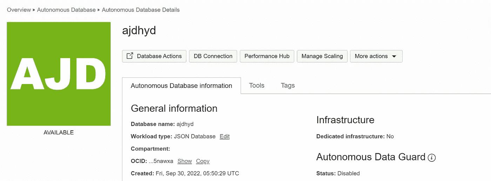

# Oracle 云中的数据流处理——简介

> 原文：<https://medium.com/oracledevs/data-stream-processing-in-oracle-cloud-an-introduction-59408bcb442?source=collection_archive---------0----------------------->


随着公司希望近乎实时地处理和分析数据，并向用户提供相关的商业见解，数据流正日益流行。

什么是数据流？这是从各种来源生成的连续数据流。可以使用各种流处理技术来存储、分析和处理数据。

数据流的一些常见使用案例包括:

1.  信息发送
2.  操作遥测
3.  网络点击流数据
4.  应用程序日志等。

上述用例可以使用 Oracle Cloud 中的各种服务来开发。

**Oracle 云基础设施(OCI)流服务**为实时接收和使用大容量数据流提供全面管理、可扩展的持久解决方案，并符合企业级安全性。

让我们以一个天气应用的开始来考察一个简单的流媒体用例。

*在 OCI 流媒体服务中摄取天气 API 数据。数据将存储在 JSON 数据库中，可以进一步用于分析用例。*

**实现步骤:**

*   调用由第三方源管理的天气 API
*   使用 python SDK 在 OCI 流服务中将消息发布为数据流
*   每当在流中发布数据时，使用 OCI 服务连接器来调用 OCI 函数。
*   使用 OCI 函数转换数据
*   使用 REST API 将数据存储在自治的 JSON 数据库(AJD)中
*   保护 REST API
*   使用 OCI 保险库存储 REST API 的秘密

这里，AJD(自治 JSON 数据库)被用作数据存储。它有许多优点，例如:

*   它为开发人员提供了模式灵活性
*   它赋予开发人员关系数据库和文档数据库的优势

**架构:**


**组件:**

为了实现这个用例，将在 OCI 租赁中部署以下 OCI 服务:

*   OCI 车厢
*   网络资源(VCN、子网、安全列表、路由表)
*   IAM 策略，动态组
*   用于调用 API、OCI 函数设置和 python SDK 的 OCI Linux VM
*   带私人通道的流池
*   服务连接器
*   OCI 函数
*   OCI 金库
*   自治 JSON 数据库

**实施步骤:**

1.  使用控制台/OCICLI/Python SDK 创建流池


2.创建一个名为 produce_weather_data.py 的 python 脚本来调用天气 API

3.创建一个名为 weatherstrm 的新流，或者使用流池 OCID 获取现有流的详细信息。OCI python SDK 可用于此目的(publish_weather_data_strm.py)。

4.创建一个名为 weatherstrmfunc 的演示函数。

注意:根据以下快速入门指南，需要事先完成必要的策略和设置。

[https://docs . Oracle . com/en-us/iaas/Content/Functions/Tasks/Functions quickstartocicouteininstance . htm](https://docs.oracle.com/en-us/iaas/Content/Functions/Tasks/functionsquickstartocicomputeinstance.htm)


5.创建服务连接器


6.提供自治的 JSON 数据库



7.创建一个演示用户，并启用 rest 服务


8.创建一个名为 weather_data 的表来存储天气数据

```
CREATE TABLE "DEMO"."WEATHER_DATA" 
   ( "location" CLOB constraint VALID_JSON_1 CHECK ("location" IS JSON ) , 
 "current" CLOB constraint VALID_JSON_2 CHECK ("current" IS JSON )
   ) ;
```

9.为 weather_data 表启用 rest 服务


10.通过启用客户端身份验证令牌来保护 rest API


11.创建一个存储库来存储客户端身份验证令牌机密


12.修改函数以执行以下任务:

*   以适当的 JSON 格式处理消息
*   破译信息
*   从 OCI 金库获取誓言客户端令牌
*   通过调用带有承载令牌的 REST API 将数据插入自治 json 数据库

功能详情:

a.函数. py

b.func.yaml

c.requirements.txt

13.在函数配置中添加 client_id 和 client_secret ocid，以从 OCI 保险库中获取详细信息


是时候观察它的工作了！

*   以流的形式发布天气数据


*   检查溪流


*   服务连接器将自动调用该功能。
*   检查功能日志


*   检查 AJD 表中的数据。它应该以 JSON 格式插入


*   以用户友好的表格格式访问数据

```
select w."location".region,w."location".name,w."location".country, w."current".last_updated,w."current".temp_c,w."current".condition.text  FROM WEATHER_DATA w;
```


**结论:**

这只是 OCI 流和云原生服务如何帮助实时处理数据的一个简单用例。您可以将它用于本博客开头提到的其他几个用例，或者尝试其他用例。请进入我们的[开发者空闲时间](https://bit.ly/odevrel_slack)，让我们知道你在做什么，或者提出问题。当然，你也可以[在我们的免费等级](https://signup.cloud.oracle.com/?language=en)上试试这个。

快乐阅读！