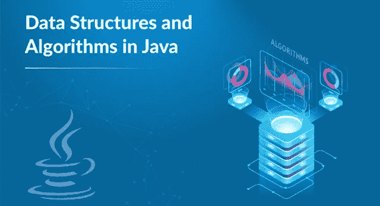
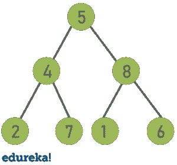
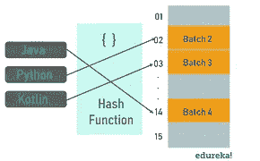

# 你需要知道的 Java 顶级数据结构和算法

> 原文：<https://medium.com/edureka/data-structures-algorithms-in-java-d27e915db1c5?source=collection_archive---------1----------------------->



Data Structures and Algorithms in Java — Edureka

如果我必须选择软件开发中最重要的一个话题，那就是数据结构和算法。你可以把它看作是每个计算机程序员都可以使用的基本工具。在编程时，我们使用*数据结构*来存储和组织数据，使用*算法*来操作这些结构中的数据。本文包含了对 Java 中所有常见数据结构和算法的详细回顾，以帮助读者做好准备。

下面列出了本文中讨论的主题:

*   Java 中的数据结构

1.  线性数据结构
2.  分层数据结构

*   Java 中的算法

1.  排序算法
2.  搜索算法

# Java 中的数据结构

*数据结构是在计算机中存储和组织数据的一种方式，以便可以有效地使用。它提供了一种有效管理大量数据的方法。高效的数据结构是设计高效算法的关键。*

在这篇“Java 中的数据结构和算法”文章中，我们将讨论基本的数据结构，例如:

*   线性数据结构

1.  数组
2.  链表
3.  大量
4.  行列

*   分层数据结构

1.  二叉树
2.  很
3.  哈希表

让我们逐一检查一下。

# Java 中的线性数据结构

Java 中的线性数据结构是那些其元素是连续的并且以这样的方式排序的:只有一个*第一个元素*并且只有一个*下一个元素*，只有一个*最后一个元素*并且只有一个*前一个元素*，而所有其他元素都有一个*下一个*和一个*前一个*元素。

## 数组

数组是表示一组相似元素的线性数据结构，通过索引访问。在存储数据之前，必须提供数组的大小。下面列出了阵列的属性:

*   数组中的每个元素都具有相同的数据类型和大小
*   数组的元素存储在连续的存储位置，第一个元素从最小的存储位置开始
*   可以随机访问数组的元素
*   数组数据结构不是完全动态的


***例如*** ，我们可能想要一个视频游戏来记录该游戏的前十名得分。在这项任务中，我们可以用一个名字来代表整个组，而不是用十个不同的变量，并用指数来表示该组中的高分。

## 链表

链表是一个由多个节点组成的线性数据结构，其中每个元素存储自己的数据和指向下一个元素位置的指针。链表中的最后一个链接指向 null，表示链的结束。链表中的一个元素称为**节点**。第一个节点称为**头**。最后一个节点叫做**尾**。

## **链表的类型**

单向链表(单向)


双向链表(双向)


循环链表


***这里有一个简单的例子:*** 想象一个链表就像一串连接在一起的回形针。您可以轻松地在顶部或底部添加另一个回形针。中间插一个甚至很快。你所要做的就是从中间断开链条，装上新的回形针，然后重新连接另一半。链表也是类似的。

# 大量

*栈，一种抽象的数据结构，是按照 ***【后进先出】*** 原则插入和移除的对象的集合。可以在任何时间点将对象插入到堆栈中，但是任何时候都只能移除最近插入的(即“最后一个”)对象。下面列出了堆栈的属性:*

**

*   *这是一个只能在一端执行插入和删除的有序列表，称为*顶部**
*   *指针指向其顶部元素的递归数据结构*
*   *遵循 ***后进先出*** 的原则*
*   *支持两种最基本的方法*

1.  *push(e):将元素 e 插入堆栈的顶部*
2.  *pop():移除并返回栈顶元素*

*栈的实际例子包括反转一个单词，检查括号序列的正确性，在浏览器中实现后退功能等等。*

## *行列*

****队列*** 也是另一种类型的抽象数据结构。与堆栈不同，队列是根据 ***先进先出(FIFO)*** 原则插入和移除的对象集合。也就是说，可以在任何时间点插入元素，但是任何时候都只能删除队列中时间最长的元素。下面列出了队列的属性:*

**

*   *通常被称为先进先出清单*
*   *支持两种最基本的方法*

1.  *enqueue(e):在队列的*后面*插入元素 e*
2.  *dequeue():从队列的*前端*移除并返回元素*

*队列用于两个进程之间的异步数据传输、CPU 调度、磁盘调度以及多个用户共享资源并基于先来先服务的其他情况。接下来，在这篇“Java 中的数据结构和算法”文章中，我们将介绍分层数据结构。*

# *Java 中的层次数据结构*

## *二叉树*

*二叉树是一种分层的树形数据结构，其中*每个节点最多有两个子节点*，分别称为*左子节点*和*右子节点*。每个二叉树都有以下节点组:*

*   *根节点:它是最顶层的节点，通常被称为主节点，因为所有其他节点都可以从根节点到达*
*   *左边的子树，也是二叉树*
*   *右子树，也是二叉树*

**

*下面列出了二叉树的属性:*

*   *二叉树有两种遍历方式:*

1.  **深度优先遍历*:按序(左-根-右)、前序(根-左-右)和后序(左-右-根)*
2.  **广度优先遍历*:层次顺序遍历*

*   *树遍历的时间复杂度:O(n)*
*   *级别“l”的最大节点数= 2l-1。*

*二叉树的应用包括:*

*   *在许多数据不断进出的搜索应用程序中使用*
*   *作为合成数字图像以获得视觉效果的工作流程*
*   *几乎每个高带宽路由器都使用它来存储路由表*
*   *也用于无线网络和内存分配*
*   *用于压缩算法和许多其他算法*

## *二元堆*

*二叉堆是一棵完整的二叉树，它符合堆的性质。简单来说，它是二叉树的一种变体，具有以下属性:*

*   **Heap 是一棵完全二叉树:*如果一棵树的所有层次都是完全的，除了可能最深的层次之外，则称该树是完全的。二进制堆的这个属性使它适合存储在数组中。*
*   **遵循堆属性:*二进制堆或者是*最小堆*或者是*最大堆*。*

1.  *最小二进制堆:对于堆中的每个节点，节点的值小于或等于子节点的值*
2.  *最大二进制堆:对于堆中的每个节点，节点的值大于或等于子节点的值*

*二进制堆的流行应用包括实现有效的优先级队列、有效地找到数组中 k 个最小(或最大)的元素等等。*

## *哈希表*

*假设你有一个对象，你想给它分配一个键来使搜索变得非常容易。要存储键/值对，可以使用一个简单的数组，比如数据结构，其中键(整数)可以直接用作存储数据值的索引。但是，如果键太大，不能直接用作索引，就要使用一种叫做散列的技术。*

*在散列法中，通过使用**散列函数**将大密钥转换成小密钥。然后，这些值被存储在一个名为**哈希表的数据结构中。**哈希表是实现字典 ADT 的数据结构，字典 ADT 是可以将唯一键映射到值的结构。*

**

*通常，哈希表有两个主要组成部分:*

1.  ****桶数组:*** 哈希表的桶数组是一个大小为 N 的数组 A，其中 A 的每个单元格都被认为是一个“桶”，即一个键值对的集合。整数 N 定义了数组的容量。*
2.  ****Hash 函数:*** 它是将我们映射中的每个键 k 映射到范围[0，n1]内的一个整数的任何函数，其中 N 是这个表的桶数组的容量。*

*当我们将对象放入哈希表时，不同的对象可能有相同的 hashcode。这被称为**碰撞**。为了处理冲突，有像链接和开放寻址这样的技术。*

*这些是 Java 中最基本和最常用的数据结构。现在您已经了解了每一项，可以开始在 Java 程序中实现它们了。至此，我们已经完成了“Java 中的数据结构和算法”这篇文章的第一部分。在下一部分，我们将学习基本算法以及如何在实际应用中使用它们，例如排序和搜索、分治、贪婪算法、动态规划。*

# *Java 中的算法*

*历史上，算法被用作解决复杂数学计算的工具，它与计算机科学，尤其是数据结构有着密切的联系。*算法是* *描述在有限时间内解决特定问题的方法的指令序列。*它们有两种表现方式:*

*   ****流程图*** —算法控制流程的可视化表示*
*   ****伪代码*** —它是一种算法的文本表示，近似于最终的源代码*

****注:*** *基于时间复杂度和空间复杂度来衡量算法的性能。大多数情况下，任何算法的复杂性都取决于问题和算法本身。**

*让我们探讨一下 Java 中的两大类算法，它们是:*

*   *Java 中的排序算法*
*   *Java 中的搜索算法*

# *Java 中的排序算法*

*排序算法是将列表元素按一定顺序排列的算法。最常用的顺序是数字顺序和词典顺序。在这篇“数据结构和算法”文章中，让我们探索一些排序算法。*

## ***Java 中的冒泡排序***

*冒泡排序，通常被称为下沉排序，是最简单的排序算法。它反复遍历要排序的列表，比较每对相邻的元素，如果它们的顺序不对，就交换它们。冒泡排序得名于它过滤掉数组顶部的元素，就像浮在水面上的气泡一样。*

*下面是代表冒泡排序算法的伪代码(升序排序上下文)。*

```
*a[] is an array of size N
begin BubbleSort(a[])

declare integer i, j
for i = 0 to N - 1
   for j = 0 to N - i - 1
      if a[j] > a[j+1] then 
         swap a[j], a[j+1]
      end if
   end for
  return a

end BubbleSort*
```

*这段代码将 N 个数据项的一维数组按升序排序。外部循环在阵列上进行 N-1 遍。每次传递都使用一个内部循环来交换数据项，使得下一个最小的数据项“冒泡”到数组的开头。但问题是，算法需要一次完整的传递，而没有任何交换，才能知道列表已排序。*

****最坏和平均情况时间复杂度:****

*O(n*n)。最坏的情况发生在数组反向排序时。*

****最佳情况时间复杂度:****

*O(n)。最好的情况发生在数组已经排序的时候。*

# *Java 中的选择排序*

*选择排序是搜索和排序的结合。该算法通过从未排序的部分中重复查找最小元素(考虑升序)并将其放在数组中的适当位置来对数组进行排序。*

*下面是代表选择排序算法(升序排序上下文)的伪代码。*

```
*a[] is an array of size N
begin SelectionSort(a[])

 for i = 0 to n - 1
   /* set current element as minimum*/
      min = i    
      /* find the minimum element */
       for j = i+1 to n 
         if list[j] < list[min] then
            min = j;
         end if
      end for
  /* swap the minimum element with the current element*/
      if min != i  then
         swap list[min], list[i]
      end if
   end for

end SelectionSort*
```

*从代码中可以看出，排序通过数组的次数比数组中的项数少 1。内部循环查找下一个最小值，外部循环将该值放入适当的位置。选择排序从不进行超过 O(n)次的交换，当内存写操作开销很大时会很有用。*

***时间复杂度:**O(n ^ 2)因为有两个嵌套循环。*

***辅助空间:** O(1)。*

# *Java 中的插入排序*

*插入排序是一种简单的排序算法，它通过一次消耗一个输入元素来遍历列表，并构建最终的排序数组。它非常简单，在较小的数据集上更有效。这是一种稳定的原位排序技术。*

*下面是代表插入排序算法(升序排序上下文)的伪代码。*

```
*a[] is an array of size N
begin InsertionSort(a[])

for i = 1 to N
   key = a[ i ]
   j = i - 1
   while ( j >= 0 and a[ j ] > key0
      a[ j+1 ] = x[ j ]
      j = j - 1
   end while
   a[ j+1 ] = key
end for

end InsertionSort*
```

*从代码中可以理解，插入排序算法从输入数据中删除一个元素，在排序列表中找到它所属的位置，并将其插入到那里。重复这一过程，直到没有输入元素保持未排序状态。*

***最佳情况:**最佳情况是当输入是一个已经排序的数组时。在这种情况下，插入排序具有线性运行时间(即θ(n))。*

***最坏情况:**最简单的最坏情况输入是一个逆序排序的数组。*

# *Java 中的快速排序*

*快速排序算法是一种快速的、递归的、不稳定的排序算法，其工作原理是分而治之。它选取一个元素作为轴心，并围绕该选取的轴心划分给定的数组。*

## ***实现快速排序的步骤:***

1.  *挑一个合适的“支点”。*
2.  *基于此 pivot 元素将列表分为两个列表。小于 pivot 元素的每个元素都放在左侧列表中，大于 pivot 元素的每个元素都放在右侧列表中。如果一个元素等于 pivot 元素，那么它可以出现在任何列表中。这称为分区操作。*
3.  *递归排序每个较小的列表。*

*这是代表快速排序算法的伪代码。*

```
*QuickSort(A as array, low as int, high as int){
    if (low < high){
        pivot_location = Partition(A,low,high)
        Quicksort(A,low, pivot_location)
        Quicksort(A, pivot_location + 1, high)
    }
}
Partition(A as array, low as int, high as int){
     pivot = A[low]
     left = low

     for i = low + 1 to high{
         if (A[i] < pivot) then{
             swap(A[i], A[left + 1])
             left = left + 1
         }
     }
     swap(pivot,A[left])

    return (left)}*
```

*在上面的伪代码中， *partition()* 函数执行分区操作， *Quicksort()* 函数为生成的每个较小的列表重复调用分区函数。快速排序的复杂度在一般情况下是θ(n log(n))在最坏情况下是θ(N2)。*

# *Java 中的合并排序*

*Mergesort 是一种快速、递归、稳定的排序算法，它也是按照分治原则工作的。与快速排序类似，合并排序将元素列表分为两个列表。这些列表被独立排序，然后被组合。在组合列表的过程中，元素被插入(或合并)到列表中的正确位置。*

*下面是代表合并排序算法的伪代码。*

```
*procedure MergeSort( a as array )
   if ( n == 1 ) return a

   var l1 as array = a[0] ... a[n/2]
   var l2 as array = a[n/2+1] ... a[n]

   l1 = mergesort( l1 )
   l2 = mergesort( l2 )

   return merge( l1, l2 )
end procedure

procedure merge( a as array, b as array )

   var c as array
   while ( a and b have elements )
      if ( a[0] > b[0] )
         add b[0] to the end of c
         remove b[0] from b
      else
         add a[0] to the end of c
         remove a[0] from a
      end if
   end while

   while ( a has elements )
      add a[0] to the end of c
      remove a[0] from a
   end while

   while ( b has elements )
      add b[0] to the end of c
      remove b[0] from b
   end while

   return c

end procedure*
```

**mergesort()* 函数将列表一分为二，分别对这些列表调用 *mergesort()* ，然后将它们作为参数发送给 merge()函数进行组合。该算法的复杂度为 O(n log (n))，具有广泛的应用前景。*

# *Java 中的堆排序*

*Heapsort 是一种基于比较的二进制堆数据结构排序算法。你可以把它看作是改进版的 f 选择排序，它把输入分成一个排序的和一个未排序的区域，通过提取最大的元素并把它移动到排序的区域，迭代地缩小未排序的区域。*

## ***实施快速排序的步骤(按递增顺序):***

1.  *用排序数组构建一个最大堆*
2.  *此时，最大的项存储在堆的根。用堆的最后一项替换它，并将堆的大小减少 1。最后，清理树根*
3.  *重复上述步骤，直到堆的大小大于 1*

*下面是代表堆排序算法的伪代码。*

```
*Heapsort(a as array)

for (i = n / 2 - 1) to i >= 0
        heapify(a, n, i); 

    for i = n-1 to 0
        swap(a[0], a[i])
        heapify(a, i, 0); 
    end for
end for

heapify(a as array, n as int, i as int)
    largest = i //Initialize largest as root 
    int l eft = 2*i + 1; // left = 2*i + 1 
    int right = 2*i + 2; // right = 2*i + 2 

    if (left < n) and (a[left] > a[largest])
        largest = left

    if (right < n) and (a[right] > a[largest])
        largest = right

    if (largest != i)
        swap(a[i], A[largest])
        Heapify(a, n, largest)
end heapify*
```

*除此之外，还有其他不太为人所知的排序算法，如 Introsort、Counting Sort 等。继续这篇“数据结构和算法”文章的下一组算法，让我们探索搜索算法。*

# *Java 中的搜索算法*

*搜索是常规业务应用程序中最常见和最频繁执行的操作之一。搜索算法是用于在项目集合中查找具有指定属性的项目的算法。让我们探索两种最常用的搜索算法。*

# *Java 中的线性搜索算法*

*线性搜索或顺序搜索是最简单的搜索算法。它包括在给定的数据结构中顺序搜索一个元素，直到找到该元素或到达该结构的末尾。如果找到了元素，则返回该项的位置，否则算法返回 NULL。*

*下面是代表 Java 中线性搜索的伪代码:*

```
*procedure linear_search (a[] , value)
for i = 0 to n-1
   if a[i] = value then
      print "Found "
      return i
   end if
print "Not found"
end for

end linear_search*
```

*这是一种暴力算法。虽然它肯定是最简单的，但由于效率低下，它肯定不是最常用的。线性搜索的时间复杂度为 *O(N)* 。*

# *Java 中的二分搜索法算法*

*二分搜索法，也称为对数搜索，是一种在已经排序的数组中查找目标值位置的搜索算法。它将输入集合分成相等的两半，并将条目与列表的中间元素进行比较。如果找到了元素，搜索就在这里结束。否则，我们继续寻找元素，根据目标元素是小于还是大于中间的元素，划分并选择数组的适当分区。*

*下面是用 Java 表示二分搜索法的伪代码:*

```
*Procedure binary_search
   a; sorted array
   n; size of array
   x; value to be searched

    lowerBound = 1
    upperBound = n 

   while x not found
      if upperBound < lowerBound 
         EXIT: x does not exists.

      set midPoint = lowerBound + ( upperBound - lowerBound ) / 2

      if A[midPoint] < x set lowerBound = midPoint + 1 if A[midPoint] > x
         set upperBound = midPoint - 1

      if A[midPoint] = x 
         EXIT: x found at location midPoint
   end while

end procedure*
```

*当上限(我们的指针)经过下限(最后一个元素)时，搜索终止，这意味着我们已经搜索了整个数组，并且该元素不存在。这是最常用的搜索算法，主要是因为它的快速搜索时间。二分搜索法的时间复杂度为 *O(N)* ，这是对线性搜索的 *O(N)* 时间复杂度的显著改进。*

*这就把我们带到了这篇“Java 中的数据结构和算法”文章的结尾。我已经介绍了 Java 最基本也是最重要的主题之一。希望你清楚这篇文章中与你分享的所有内容。*

*确保你尽可能多的练习，恢复你的经验。*

*如果你想查看更多关于人工智能、DevOps、道德黑客等市场最热门技术的文章，那么你可以参考 [Edureka 的官方网站。](https://www.edureka.co/blog/?utm_source=medium&utm_medium=content-link&utm_campaign=data-structures-algorithms-in-java)*

*请留意本系列中的其他文章，它们将解释 Java 的各个方面。*

> *1.[面向对象编程](/edureka/object-oriented-programming-b29cfd50eca0)*
> 
> *2.[Java 中的继承](/edureka/inheritance-in-java-f638d3ed559e)*
> 
> *3.[Java 中的多态性](/edureka/polymorphism-in-java-9559e3641b9b)*
> 
> *4.[Java 中的抽象](/edureka/java-abstraction-d2d790c09037)*
> 
> *5. [Java 字符串](/edureka/java-string-68e5d0ca331f)*
> 
> *6. [Java 数组](/edureka/java-array-tutorial-50299ef85e5)*
> 
> *7. [Java 集合](/edureka/java-collections-6d50b013aef8)*
> 
> *8. [Java 线程](/edureka/java-thread-bfb08e4eb691)*
> 
> *9.[Java servlet 简介](/edureka/java-servlets-62f583d69c7e)*
> 
> *10. [Servlet 和 JSP 教程](/edureka/servlet-and-jsp-tutorial-ef2e2ab9ee2a)*
> 
> *11.[Java 中的异常处理](/edureka/java-exception-handling-7bd07435508c)*
> 
> *12.[高级 Java 教程](/edureka/advanced-java-tutorial-f6ebac5175ec)*
> 
> *13. [Java 面试问题](/edureka/java-interview-questions-1d59b9c53973)*
> 
> *14. [Java 程序](/edureka/java-programs-1e3220df2e76)*
> 
> *15. [Kotlin vs Java](/edureka/kotlin-vs-java-4f8653f38c04)*
> 
> *16.[使用 Spring Boot 的依赖注入](/edureka/what-is-dependency-injection-5006b53af782)*
> 
> *17.[Java 中的可比性](/edureka/comparable-in-java-e9cfa7be7ff7)*
> 
> *18.[十大 Java 框架](/edureka/java-frameworks-5d52f3211f39)*
> 
> *19. [Java 反射 API](/edureka/java-reflection-api-d38f3f5513fc)*
> 
> *20.Java 中的 30 大模式*
> 
> *21.[核心 Java 备忘单](/edureka/java-cheat-sheet-3ad4d174012c)*
> 
> *22.[Java 中的套接字编程](/edureka/socket-programming-in-java-f09b82facd0)*
> 
> *23. [Java OOP 备忘单](/edureka/java-oop-cheat-sheet-9c6ebb5e1175)*
> 
> *24.[Java 中的注释](/edureka/annotations-in-java-9847d531d2bb)*
> 
> *25.[Java 中的图书管理系统项目](/edureka/library-management-system-project-in-java-b003acba7f17)*
> 
> *26.[Java 中的树](/edureka/java-binary-tree-caede8dfada5)*
> 
> *27.[Java 中的机器学习](/edureka/machine-learning-in-java-db872998f368)*
> 
> *28. [Java 教程](/edureka/java-tutorial-bbdd28a2acd7)*
> 
> *29. [Java 开发者技能](/edureka/java-developer-skills-83983e3d3b92)*
> 
> *30.[前 55 个 Servlet 面试问题](/edureka/servlet-interview-questions-266b8fbb4b2d)*
> 
> *31. [](/edureka/java-exception-handling-7bd07435508c) [顶级 Java 项目](/edureka/java-projects-db51097281e3)*
> 
> *32. [Java 字符串备忘单](/edureka/java-string-cheat-sheet-9a91a6b46540)*
> 
> *33.[Java 中的嵌套类](/edureka/nested-classes-java-f1987805e7e3)*
> 
> *34. [Java 集合面试问答](/edureka/java-collections-interview-questions-162c5d7ef078)*
> 
> *35.[Java 中如何处理死锁？](/edureka/deadlock-in-java-5d1e4f0338d5)*
> 
> *36.[你需要知道的 50 大 Java 集合面试问题](/edureka/java-collections-interview-questions-6d20f552773e)*
> 
> *37.[Java 中的字符串池是什么概念？](/edureka/java-string-pool-5b5b3b327bdf)*
> 
> *38.[C、C++和 Java 有什么区别？](/edureka/difference-between-c-cpp-and-java-625c4e91fb95)*
> 
> *39.[Java 中的回文——如何检查一个数字或字符串？](/edureka/palindrome-in-java-5d116eb8755a)*
> 
> *40.[你需要知道的顶级 MVC 面试问答](/edureka/mvc-interview-questions-cd568f6d7c2e)*
> 
> *41.[Java 编程语言的十大应用](/edureka/applications-of-java-11e64f9588b0)*
> 
> *[42。Java 中的死锁](/edureka/deadlock-in-java-5d1e4f0338d5)*
> 
> *43.[Java 中的平方和平方根](/edureka/java-sqrt-method-59354a700571)*
> 
> *44.[Java 中的类型转换](/edureka/type-casting-in-java-ac4cd7e0bbe1)*
> 
> *45.[Java 中的运算符及其类型](/edureka/operators-in-java-fd05a7445c0a)*
> 
> *46.[Java 中的析构函数](/edureka/destructor-in-java-21cc46ed48fc)*
> 
> *47.[爪哇的二分搜索法](/edureka/binary-search-in-java-cf40e927a8d3)*
> 
> *48.[Java 中的 MVC 架构](/edureka/mvc-architecture-in-java-a85952ae2684)*
> 
> *49.[冬眠面试问答](/edureka/hibernate-interview-questions-78b45ec5cce8)*

**原载于 2019 年 7 月 19 日*[*https://www.edureka.co*](https://www.edureka.co/blog/data-structures-algorithms-in-java/)*。**