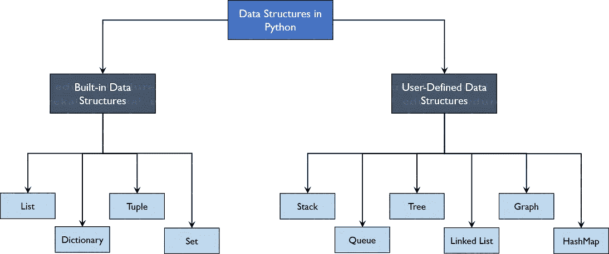
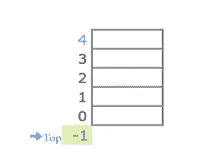
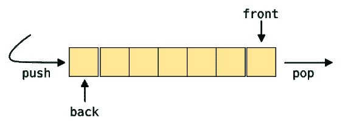
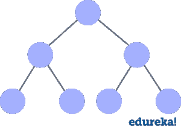
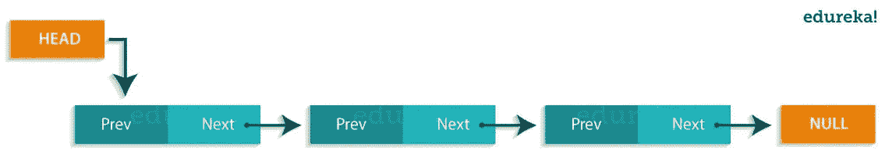
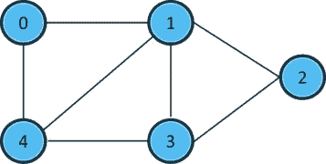
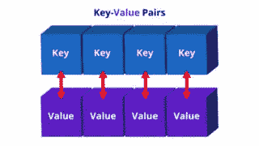

# 在 Python 中你需要学习的数据结构

> 原文：<https://medium.com/edureka/data-structures-in-python-ed958fc78e23?source=collection_archive---------3----------------------->


Data Structures in Python — Edureka

Python 已经在世界范围内被用于不同的领域，比如制作网站、人工智能等等。但是要使这一切成为可能，**数据**起着非常重要的作用，这意味着这些数据应该被有效地存储，并且对其的访问必须是及时的。那么如何实现这一点呢？我们使用一种叫做数据结构的东西。话虽如此，让我们浏览一下我们将在 Python 中的**数据结构**中涉及的主题。

这篇文章被分成以下几个部分:

*   什么是数据结构？
*   Python 中的数据结构类型
*   内置数据结构

1.  目录
2.  词典
3.  元组
4.  设置

*   用户定义的数据结构

1.  数组与列表
2.  堆
3.  长队
4.  树
5.  链接列表
6.  图表
7.  散列表

# 什么是数据结构？

**组织**、**管理、**和**存储**数据非常重要，因为这使得访问更加容易，修改更加高效。数据结构允许您以这样一种方式组织数据，使您能够存储数据集合，关联它们，并相应地对它们执行操作。

# Python 中的数据结构类型

Python 对数据结构有**隐含的**支持，使你能够存储和访问数据。这些结构被称为列表、字典、元组和集合。

Python 允许其用户创建自己的数据结构，使他们能够完全控制自己的功能。最突出的数据结构是堆栈、队列、树、链表等等，这些在其他编程语言中也可以使用。既然你已经知道了你可以使用的类型，为什么我们不继续学习数据结构并用 Python 来实现它们呢？



# 内置数据结构

顾名思义，这些数据结构是 Python 内置的，这使得编程更容易，并帮助程序员使用它们更快地获得解决方案。我们来详细讨论一下每一个。

# 列表

列表用于按顺序存储不同数据类型的数据。列表中的每个元素都分配有地址，这称为索引。索引值从 0 开始，一直持续到称为正索引的最后一个元素。还有从-1 开始的**负索引**，允许你从最后一个到第一个访问元素。现在让我们在一个示例程序的帮助下更好地理解列表。

## 创建列表

要创建一个列表，可以使用方括号并相应地向其中添加元素。如果您不传递方括号内的任何元素，您将得到一个空列表作为输出。

```
my_list = [] #create empty list
print(my_list)
my_list = [1, 2, 3, 'example', 3.132] #creating list with data
print(my_list)
```

**输出:**

【1，2，3，‘例’，3.132】

## 添加元素

使用 append()、extend()和 insert()函数可以在列表中添加元素。

*   append()函数将传递给它的所有元素作为单个元素相加。
*   extend()函数将元素逐个添加到列表中。
*   insert()函数添加了传递给索引值的元素，并增加了列表的大小。

```
my_list = [1, 2, 3]
print(my_list)
my_list.append([555, 12]) #add as a single element
print(my_list)
my_list.extend([234, 'more_example']) #add as different elements
print(my_list)
my_list.insert(1, 'insert_example') #add element i
print(my_list)
```

**输出:**
【1，2，3】
【1，2，3，[555，12]】
【1，2，3，[555，12]，234，'更多 _ 示例'】
【1，'插入 _ 示例'，2，3，[555，12]，234，'更多 _ 示例'】

## 删除元素

*   要删除元素，使用 Python 内置的 *del* 关键字，但这不会返回任何东西给我们。
*   如果想要元素返回，可以使用 pop()函数，该函数接受索引值。
*   要按值移除元素，可以使用 remove()函数。

**举例:**

```
my_list = [1, 2, 3, 'example', 3.132, 10, 30]
del my_list[5] #delete element at index 5
print(my_list)
my_list.remove('example') #remove element with value
print(my_list)
a = my_list.pop(1) #pop element from list
print('Popped Element: ', a, ' List remaining: ', my_list)
my_list.clear() #empty the list
print(my_list)
```

**输出:**
【1，2，3，'例'，3.132，30】
【1，2，3，3.132，30】
弹出元素:剩余 2 个列表:[1，3，3.132，30]
[]

## 访问元素

在 Python 中访问元素和访问字符串是一样的。您传递索引值，因此可以根据需要获取这些值。

```
my_list = [1, 2, 3, 'example', 3.132, 10, 30]
for element in my_list: #access elements one by one
    print(element)
print(my_list) #access all elements
print(my_list[3]) #access index 3 element
print(my_list[0:2]) #access elements from 0 to 1 and exclude 2
print(my_list[::-1]) #access elements in reverse
```

**输出:**
1
2
3
例
3.132
10
30
【1，2，3，'例'，3.132，10，30】
例
【1，2]
【30，10，3.132，'例'，3，2，1】

## 其他功能

在处理列表时，您还可以使用其他几个函数。

*   len()函数返回列表的长度。
*   index()函数在第一次遇到的地方查找传递的值的索引值。
*   count()函数查找传递给它的值的计数。
*   sorted()和 sort()函数做同样的事情，即对列表中的值进行排序。sorted()具有返回类型，而 sort()修改原始列表。

```
my_list = [1, 2, 3, 10, 30, 10]
print(len(my_list)) #find length of list
print(my_list.index(10)) #find index of element that occurs first
print(my_list.count(10)) #find count of the element
print(sorted(my_list)) #print sorted list but not change original
my_list.sort(reverse=True) #sort original list
print(my_list)
```

**输出:**

```
6
3
2
[1, 2, 3, 10, 10, 30]
[30, 10, 10, 3, 2, 1]
```

# 词典

字典用于存储**键值**对。为了更好地理解，想象一个添加了成百上千个名字及其对应号码的电话号码簿。这里的常量是名字和电话号码，它们被称为键。各种各样的名字和电话号码是输入给按键的值。如果您访问密钥的值，您将获得所有的姓名和电话号码。这就是键-值对。在 Python 中，这种结构是用字典存储的。让我们通过一个示例程序来更好地理解这一点。

## 创建字典

可以使用花括号或使用 dict()函数来创建字典。无论何时使用字典，都需要添加键值对。

```
my_dict = {} #empty dictionary
print(my_dict)
my_dict = {1: 'Python', 2: 'Java'} #dictionary with elements
print(my_dict)
```

**输出:**
{}
{1: 'Python '，2: 'Java'}

## 更改和添加键、值对

要更改字典的值，您需要使用键来完成。因此，您首先访问密钥，然后相应地更改值。要添加值，只需添加另一个键-值对，如下所示。

```
my_dict = {'First': 'Python', 'Second': 'Java'}
print(my_dict)
my_dict['Second'] = 'C++' #changing element
print(my_dict)
my_dict['Third'] = 'Ruby' #adding key-value pair
print(my_dict)
```

**输出:**
{ '第一':' Python '，'第二':' Java'}
{ '第一':' Python '，'第二':' C++'}
{ '第一':' Python '，'第二':' C++ '，'第三':' Ruby'}

## 删除键、值对

*   要删除这些值，可以使用 pop()函数，该函数返回已删除的值。
*   要检索键-值对，可以使用 popitem()函数，该函数返回键和值的元组。
*   要清除整个字典，可以使用 clear()函数。

```
my_dict = {'First': 'Python', 'Second': 'Java', 'Third': 'Ruby'}
a = my_dict.pop('Third') #pop element
print('Value:', a)
print('Dictionary:', my_dict)
b = my_dict.popitem() #pop the key-value pair
print('Key, value pair:', b)
print('Dictionary', my_dict)
my_dict.clear() #empty dictionary
print('n', my_dict)
```

**输出:**

值:Ruby
字典:{'First': 'Python '，' Second': 'Java'}

键，值对:(' Second '，' Java')
字典{'First': 'Python'}

{}

## 访问元素

您只能使用键来访问元素。您可以使用 get()函数或者只传递键值，然后您将检索这些值。

```
my_dict = {'First': 'Python', 'Second': 'Java'} print(my_dict['First']) #access elements using keys print(my_dict.get('Second'))
```

**输出:**
Python
Java

## 其他功能

你有不同的函数返回给我们键或者键-值对的值，对应于 keys()、values()、items()函数。

```
my_dict = {'First': 'Python', 'Second': 'Java', 'Third': 'Ruby'}
print(my_dict.keys()) #get keys
print(my_dict.values()) #get values
print(my_dict.items()) #get key-value pairs
print(my_dict.get('First'))
```

**输出:**
dict_keys(['First '，' Second '，' Third '])
dict _ values([' Python '，' Java '，' Ruby '])
dict _ items([(' First '，' Python ')，(' Second '，' Java '，(' Third '，' Ruby ')
Python

# 元组

元组和列表是一样的，除了数据一旦进入元组就不能被改变。唯一的例外是当元组中的数据是可变的时，只有这时元组数据才可以被改变。示例程序将帮助您更好地理解。

## 创建元组

您可以使用括号或 tuple()函数来创建元组。

```
my_tuple = (1, 2, 3) #create tuple
print(my_tuple)
```

**输出:**
(1，2，3)

## 访问元素

访问元素与访问列表中的值是一样的。

```
my_tuple2 = (1, 2, 3, 'edureka') #access elements
for x in my_tuple2:
    print(x)
print(my_tuple2)
print(my_tuple2[0])
print(my_tuple2[:])
print(my_tuple2[3][4])
```

**输出:**
1
2
3
爱德华卡
(1，2，3，'爱德华卡')
1
(1，2，3，'爱德华卡')
e

## 追加元素

要追加这些值，可以使用'+'操作符，该操作符将另一个元组追加到它的后面。

```
my_tuple = (1, 2, 3)
my_tuple = my_tuple + (4, 5, 6) #add elements
print(my_tuple)
```

**输出:**
(1，2，3，4，5，6)

## 其他功能

这些功能与列表的功能相同。

```
my_tuple = (1, 2, 3, ['hindi', 'python'])
my_tuple[3][0] = 'english'
print(my_tuple)
print(my_tuple.count(2))
print(my_tuple.index(['english', 'python']))
```

# 设置

集合是唯一的无序元素的集合。这意味着，即使数据重复多次，它也只会被输入到集合中一次。它类似于你学过的算术集合。运算也与算术集合相同。一个示例程序会帮助你更好地理解。

## 创建集合

集合是使用花括号创建的，但不是添加键值对，而是将值传递给它。

```
my_set = {1, 2, 3, 4, 5, 5, 5} #create set
print(my_set)
```

**输出:**
{1，2，3，4，5}

## 添加元素

要添加元素，可以使用 add()函数并将值传递给它。

```
my_set = {1, 2, 3}
my_set.add(4) #add element to set
print(my_set)
```

## 集合运算

不同的操作开始，如并集、交集等，如下所示。

```
my_set = {1, 2, 3, 4}
my_set_2 = {3, 4, 5, 6}
print(my_set.union(my_set_2), '----------', my_set | my_set_2)
print(my_set.intersection(my_set_2), '----------', my_set & my_set_2)
print(my_set.difference(my_set_2), '----------', my_set - my_set_2)
print(my_set.symmetric_difference(my_set_2), '----------', my_set ^ my_set_2)
my_set.clear()
print(my_set)
```

*   union()函数组合两个数据集中的数据。
*   intersection()函数只查找两个集合中的数据。
*   difference()函数删除两者中存在的数据，并输出只存在于传递的集合中的数据。
*   symmetric_difference()与 difference()函数的作用相同，但输出的是两个集合中剩余的数据。

**输出:**
{1，2，3，4，5，6 }——{ 1，2，3，4，5，6}
{3，4 } ——{ 3，4 }—
{ 1，2 }——{ 1，2 }—
{ 1，2，5，6 }——{ 1，2，5，6}
集合()

现在您已经理解了内置数据结构，让我们从用户定义的数据结构开始。用户定义的数据结构，这个名字本身表明用户定义了数据结构的工作方式，并在其中定义了函数。这使得用户可以完全控制数据需要如何保存、操作等等。

让我们继续学习大多数编程语言中最突出的数据结构。

# 用户定义的数据结构

## 数组与列表

数组和列表是相同的结构，只有一点不同。列表允许异构数据元素存储，而数组只允许在其中存储同构元素。

## 堆

堆栈是基于后进先出(LIFO)原则的线性数据结构，其中最后输入的数据将首先被访问。它是使用数组结构构建的，并且有一些操作，即推入(添加)元素，弹出(删除)元素，以及只从堆栈中称为顶部的一点访问元素。这个顶部是指向堆栈当前位置的指针。堆栈主要用于递归编程、反转单词、单词编辑器中的撤销机制等应用程序中。



# 长队

队列也是一种基于先进先出(FIFO)原则的线性数据结构，其中先进入的数据将首先被访问。它是使用数组结构构建的，并且具有可以从队列两端执行的操作，即首尾或前后操作。诸如添加和删除元素的操作被称为入队和出队，并且可以执行对元素的访问。队列被用作流量拥塞管理的网络缓冲区，在操作系统中用于作业调度等等。



# 树

树是具有根和节点的非线性数据结构。根是数据来源的节点，节点是我们可用的其他数据点。前面的节点是父节点，后面的节点称为子节点。一棵树有不同的层次来显示信息的深度。最后的节点叫做叶子。树创建了一个层次结构，可以在很多现实世界的应用程序中使用，比如 HTML 页面使用树来区分哪个标签属于哪个块。这也是有效的搜索目的和更多。



# 链表

链表是线性数据结构，它不被存储，而是使用指针相互链接。链表的节点由数据和一个名为 next 的指针组成。这些结构最广泛地用于图像浏览应用、音乐播放器应用等。



# 图表

图形用于存储称为顶点(节点)和边(边)的点的数据集合。图表可以被称为是真实世界地图的最精确的表示。它们用于查找称为节点的各种数据点之间的各种距离成本，从而找到最短路径。许多应用程序，如谷歌地图、优步等，都使用图形来寻找最短的距离，并以最佳方式增加利润。



# 散列表

散列表和 Python 中的字典是一样的。它们可以用来实现应用程序，如电话簿，根据列表填充数据等等。



这包含了 Python 中所有突出的数据结构。我希望你已经理解了 Python 中内置的和用户定义的数据结构，以及它们为什么重要。

如果你想查看更多关于人工智能、DevOps、道德黑客等市场最热门技术的文章，你可以参考 Edureka 的官方网站。

请留意本系列中的其他文章，它们将解释 Python 和数据科学的各个方面。

> *1。*[*Python 中的机器学习分类器*](/edureka/machine-learning-classifier-c02fbd8400c9)
> 
> *2。*[*Python Scikit-Learn Cheat Sheet*](/edureka/python-scikit-learn-cheat-sheet-9786382be9f5)
> 
> *3。* [*机器学习工具*](/edureka/python-libraries-for-data-science-and-machine-learning-1c502744f277)
> 
> *4。* [*用于数据科学和机器学习的 Python 库*](/edureka/python-libraries-for-data-science-and-machine-learning-1c502744f277)
> 
> *5。*[*Python 中的聊天机器人*](/edureka/how-to-make-a-chatbot-in-python-b68fd390b219)
> 
> *6。* [*Python 集合*](/edureka/collections-in-python-d0bc0ed8d938)
> 
> *7。* [*Python 模块*](/edureka/python-modules-abb0145a5963)
> 
> *8。* [*Python 开发者技能*](/edureka/python-developer-skills-371583a69be1)
> 
> *9。* [*哎呀面试问答*](/edureka/oops-interview-questions-621fc922cdf4)
> 
> 10。 [*一个 Python 开发者的简历*](/edureka/python-developer-resume-ded7799b4389)
> 
> *11。*[*Python 中的探索性数据分析*](/edureka/exploratory-data-analysis-in-python-3ee69362a46e)
> 
> *12。* [*蛇与蟒蛇的游戏*](/edureka/python-turtle-module-361816449390)
> 
> 13。 [*Python 开发者工资*](/edureka/python-developer-salary-ba2eff6a502e)
> 
> *14。* [*主成分分析*](/edureka/principal-component-analysis-69d7a4babc96)
> 
> 15。[*Python vs c++*](/edureka/python-vs-cpp-c3ffbea01eec)
> 
> *16。* [*剪贴簿教程*](/edureka/scrapy-tutorial-5584517658fb)
> 
> *17。*[*Python SciPy*](/edureka/scipy-tutorial-38723361ba4b)
> 
> *18。* [*最小二乘回归法*](/edureka/least-square-regression-40b59cca8ea7)
> 
> *19。* [*Jupyter 笔记本小抄*](/edureka/jupyter-notebook-cheat-sheet-88f60d1aca7)
> 
> *20。* [*Python 基础知识*](/edureka/python-basics-f371d7fc0054)
> 
> *21。* [*Python 模式程序*](/edureka/python-pattern-programs-75e1e764a42f)
> 
> *22。*[*Python 中的*](/edureka/generators-in-python-258f21e3d3ff) 生成器
> 
> *23。* [*Python 装饰器*](/edureka/python-decorator-tutorial-bf7b21278564)
> 
> *24。*[*Python Spyder IDE*](/edureka/spyder-ide-2a91caac4e46)
> 
> *25。*[*Python 中使用 Kivy 的移动应用*](/edureka/kivy-tutorial-9a0f02fe53f5)
> 
> *26。* [*十大最佳学习书籍&练习 Python*](/edureka/best-books-for-python-11137561beb7)
> 
> *27。* [*机器人框架与 Python*](/edureka/robot-framework-tutorial-f8a75ab23cfd)
> 
> *28。* [*蟒蛇游戏中使用 PyGame*](/edureka/snake-game-with-pygame-497f1683eeaa)
> 
> 29。 [*Django 面试问答*](/edureka/django-interview-questions-a4df7bfeb7e8)
> 
> *三十。* [*十大 Python 应用*](/edureka/python-applications-18b780d64f3b)
> 
> *31。*[*Python 中的哈希表和哈希表*](/edureka/hash-tables-and-hashmaps-in-python-3bd7fc1b00b4)
> 
> 32。[*Python 中的套接字编程是什么*](/edureka/socket-programming-python-bbac2d423bf9)
> 
> *33。* [*支持向量机*](/edureka/support-vector-machine-in-python-539dca55c26a)
> 
> 34。 [*Python 教程*](/edureka/python-tutorial-be1b3d015745)

【https://www.edureka.co】最初发表于[](https://www.edureka.co/blog/data-structures-in-python)**。**