# 数据结构:遍历树

> 原文：<https://medium.com/quick-code/data-structures-traversing-trees-9473f6d9f4ef?source=collection_archive---------0----------------------->

树是非线性数据结构，因为它们是通过关系或层次结构来组织的。这允许我们以多种方式遍历它们。为了澄清，树遍历指的是恰好访问每个单独节点一次的过程。对于我们的遍历，我们将关注二叉树，这是最多有两个孩子的树。你可以通过下面的链接查看我之前关于二分搜索法树的文章。

[](/@mbetances1002/data-structures-binary-search-trees-explained-5a2eeb1a9e8b) [## 数据结构:二分搜索法树解释

### 二分搜索法树允许我们按照排序的顺序高效地存储和更新动态变化的数据集。当…

medium.com](/@mbetances1002/data-structures-binary-search-trees-explained-5a2eeb1a9e8b) 

# **如何遍历树？**

遍历树有两种主要方法:

1.  广度优先
2.  深度优先

## *广度优先遍历*

当树的层次背后有某种意义时，就利用了广度优先的方法。在广度优先中，从上到下访问树中的每一层，直到遍历完整个树。在每一层，你从左到右访问每个节点一次。让我们使用我之前文章中的构造函数来构建我们的二叉查找树(BST)。

```
function BinarySearchTree (val) {
  this.value = val;
  this.left = null;  // the left child node
  this.right = null; // the right child node
}let newTree = BinarySearchTree(20); // 20 node becomes our rootnewTree.insert(25)
newTree.insert(21)
newTree.insert(16)
...
```

让我们演练一下广度优先利用`newTree`会发生什么。请注意，广度优先在 BST 中不太有用，因为级别没有任何本质意义，但为了简化这一审查，我们将对所有示例使用相同的 BST:

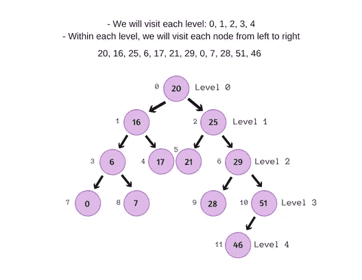

为了解决广度优先的问题，我们需要一个数据结构来跟踪每个节点之间的关系。简单地沿着二叉树往下走，我们将失去对存在的父子关系的访问。这是指已经建立的`this.left`和`this.right`连接。例如:

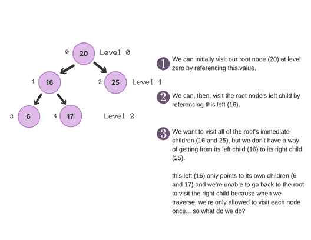

我们将需要使用队列数据结构，以便能够从左到右访问每个级别中的每个节点。队列是遵循先入先出(FIFO)规则的线性数据结构。你可以把排队想象成消费者在你当地的星巴克排队等候；它是基于先到先得的原则。消费者按照他们排队等候的顺序得到服务。排在队首的人会比排在队尾的人先得到服务。如果你是初学者，你可以从[最佳数据结构算法教程](https://blog.coursesity.com/best-data-structure-algorithms-tutorials/)中受益。

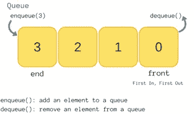

## 编码我们的广度优先遍历

为了编写广度优先遍历的代码，让我们假设我们想要创建一个数组，按照级别顺序保存二叉查找树中的所有值。让我们写出一个回调函数，它是一个作为参数传递给另一个函数的函数，这个函数将接受一个值并将其推送到一个数组中。稍后，我们将把这个回调函数传递给广度优先方法。

```
let levelOrderArray = [];// ES6 syntax
const pushOrderNodes = (num) => {
  levelOrderArray.push(num);
};
```

我们现在将编写一个简单的广度优先方法，该方法可以将回调函数作为参数(我们将不考虑错误处理)。为了节省内存，我们将利用构造函数的原型来创建这个方法。

```
BinarySearchTree.prototype.traverseBreadthFirst = function (func) {
  let queue = [this];

  while (queue.length) {
    let currentNode = queue.shift();

    if (currentNode.left) {
      queue.push(currentNode.left)
    }

    if (currentNode.right) {
      queue.push(currentNode.right)
    }

    func(currentNode.value)
  }
};
```

让我们分解这段代码中的前几个循环，以了解到底发生了什么…

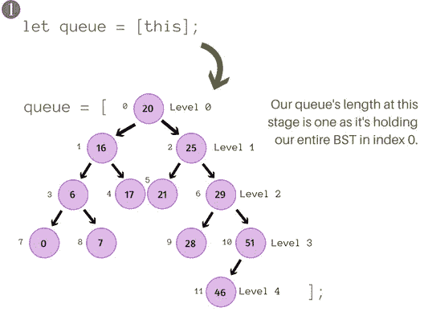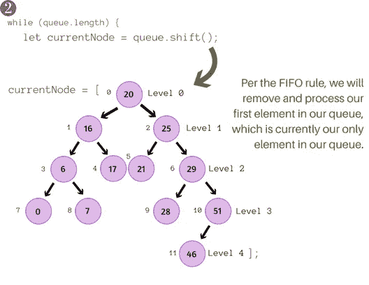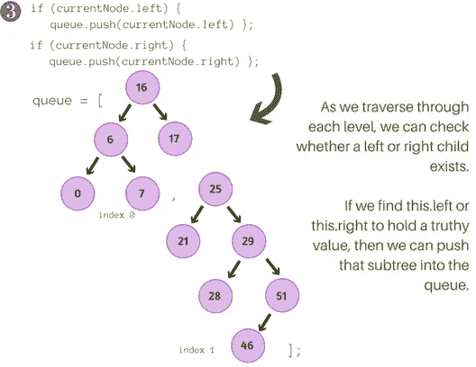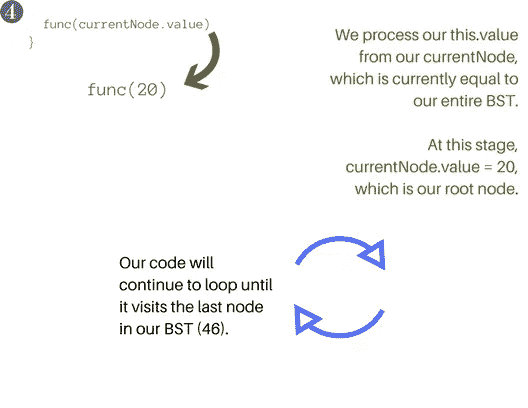

现在让我们将回调函数`pushOrderNodes`传递给我们的`traverseBreadthFirst`方法。这将遍历我们的`newTree`，并为每个节点执行一次传入的函数`pushOrderNodes`。

```
newTree.traverseBreadthFirst(pushOrderNodes)
```


Our levelOrderArray now holds all our nodes in breadth-first order.

## *深度优先遍历*

深度优先遍历有三种类型:

1.  **预排序:**访问父节点，然后访问所有左边的子节点，然后访问所有右边的子节点。
2.  **按顺序:**访问左边的孩子，然后是父母，然后是右边的孩子。这种方法对于 BST 很有用，因为它按照排序的顺序遍历节点。
3.  **后顺序:**先访问左边的孩子，再访问右边的孩子，然后再访问家长。

对于深度优先遍历，我们需要一个堆栈数据结构，它遵循后进先出(LIFO)规则。你可以把一叠想象成一叠报纸；最上面的报纸是最后添加到报纸堆中的，但却是第一个被顾客抢去购买的。

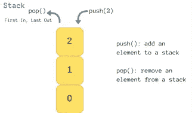

我们可以编写一个方法来涵盖三种不同类型的深度优先遍历。让我们详细回顾一下我们的方法应该做什么:

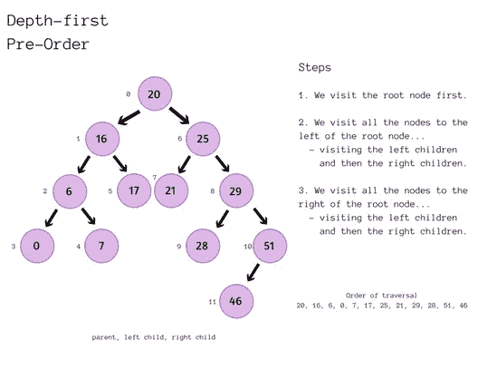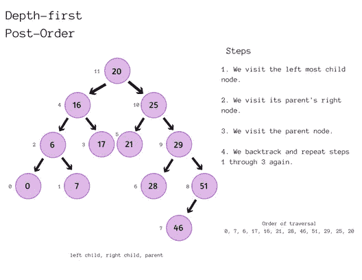

## **编码我们的深度优先遍历**

我们将利用 BinarySearchTree 的原型来创建`traverseDepthFirst`方法。我们的`traverseDepthFirst`方法将接受一个回调函数，类似于我们的`traverseBreadthFirst`方法。回调函数将操纵或处理每个节点。

```
BinarySearchTree.prototype.traverseDepthFirst = function (func, type) {
  if (type === 'pre-order') {
    func(this.value)
  } if (this.left) {
    this.left.traverseDepthFirst(func, type)
  } if (type === 'in-order') {
    func(this.value)
  } if (this.right) {
    this.right.traverseDepthFirst(func, type)
  } if (type === 'post-order') {
    func(this.value)
  }
};
```

让我们利用前面的回调函数，`pushOrderNodes`。

```
newTree.traverseDepthFirst(pushOrderNodes, 'post-order')
```

让我们回顾一下我们如何在`traverseDepthFirst`方法中利用栈数据结构来进行后序遍历:

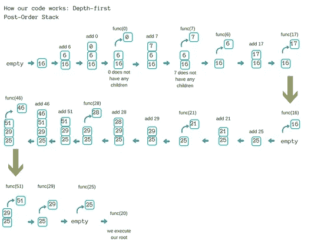

## **广度优先和深度优先的应用**

我们已经实现了一些基本的遍历方法，您可能想知道，这些方法在现实应用程序中实际上是如何使用的？广度优先和深度优先遍历有多种方式:社交网络推荐你可能认识的用户，在线旅游公司为你的旅行推荐航班，GPS 导航系统查找附近的位置，等等。现在让我们庆祝用 JavaScript 实现了树遍历。