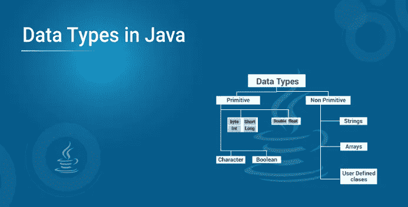
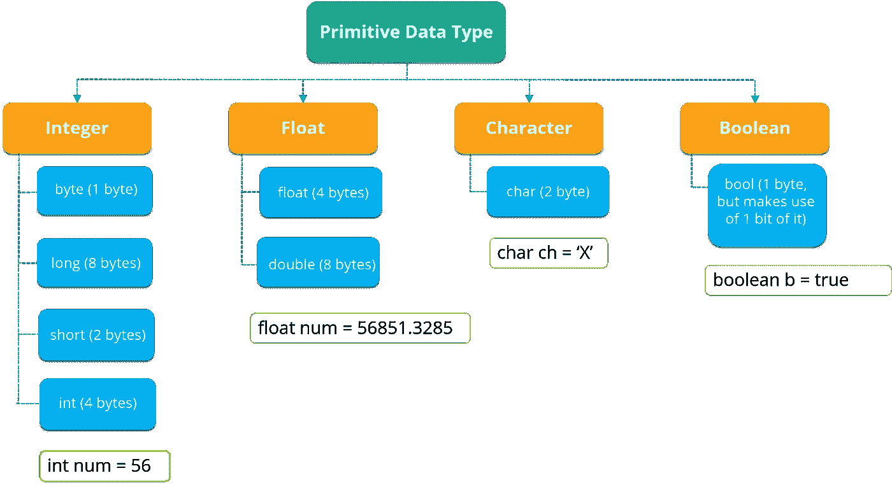
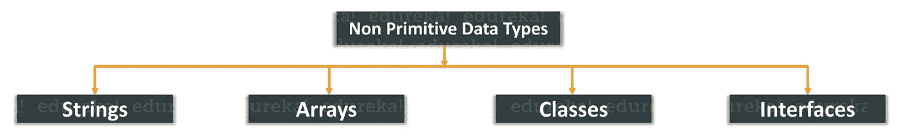

# 了解 Java 中的各种数据类型

> 原文：<https://medium.com/edureka/data-types-in-java-98c8dcd5176?source=collection_archive---------1----------------------->



**数据类型**是变量的属性，它告诉编译器或解释器程序员打算如何使用变量。它定义了可以对数据执行的操作以及可以存储什么类型的值。在本文中，我将简要介绍一下 **Java** 中的不同数据类型。根据数据类型拥有的属性，数据类型分为两组:

1.  **原始数据类型**
2.  **非原始数据类型**

**原始数据类型:**原始数据类型是由编程语言预先定义的。变量值的大小和类型是指定的，它没有额外的方法。

**非原语数据类型:**这些数据类型实际上不是由编程语言定义的，而是由程序员创建的。它们也被称为“引用变量”或“对象引用”，因为它们引用存储数据的内存位置。

现在，让我们进一步深入原始数据类型的细节。

# 原始数据类型

Java 中的数据类型分为四个方面，分别是**整型、浮点型、字符型、**和**布尔型**。但是，一般来说，有 8 种数据类型。它们如下:

*   **布尔**数据类型
*   **字节**数据类型
*   **char** 数据类型
*   **短数据类型**
*   **int** 数据类型
*   **long** 数据类型
*   **浮点**数据类型
*   **双**数据类型

您可以参考下图来了解不同的数据类型与分配给它们的内存的关系。



现在，让我们深入了解每一种数据类型。首先我会告诉你什么是布尔数据类型。

# 布尔数据类型

布尔数据类型由一位信息组成，并且只能存储**真**或**假**值。该数据类型用于跟踪**真/假** **条件**。现在我们来写一个小程序，了解一下它的工作原理。

```
**class** booleanDataType{
**public** **static** **void** main(String args[]){
// Setting the values for boolean data type
**boolean** Java = **true**;
**boolean** Python = **false**;
System.out.println(Java);   // Output will be true
System.out.println(Python);  // Output will be false
}
}
```

这就是关于布尔数据类型的全部内容。我希望你能理解。现在让我们进一步了解下一种数据类型，即字节数据类型。

# 字节数据类型

这是一个原始数据类型的例子。它是一个 8 位有符号二进制补码整数。它存储介于-128 到 127 之间的整数。字节数据类型有助于节省大量内存。现在我们来写一个小程序，了解一下它的工作原理。

```
**class** ByteExample {
**public** **static** **void** main(String[] args) {
**byte** n, a;
n = 127;
a=177;
System.out.println(n); // prints 127
System.out.println(a); // throws an error because it cannot store more than 127 bits
}
}
```

这就是关于字节数据类型的全部内容。现在让我们进一步理解以下数据类型，即 char。

# 字符数据类型

该数据类型用于存储一个**单个**字符。该字符必须用单引号括起来，如“E”或“E”。或者，您也可以使用 ASCII 值来显示某些字符。我们举个小例子，看看效果如何。

```
char alpha = 'J'; char a = 65, b = 66, c = 67; System.out.println(alpha); // prints J System.out.println(a); // Displays 65 System.out.println(b); // Displays 66 System.out.println(c); // Displays 67
```

这就是关于 char 数据类型的全部内容。我希望你能理解。现在让我们进一步理解列表中的下一个数据类型，即短数据类型。

# 短数据类型

短数据类型的大小大于字节，小于整数。它存储范围从-32，768 到 32767 的值。该数据类型的默认大小:2 字节。我们举个例子，了解一下短数据类型。

```
**class** ShortExample {
**public** **static** **void** main(String[] args) {
**short** n= 3435,
System.out.println(n); // prints the value present in n i.e. 3435
}
}
```

接下来，让我们进一步看看下一种数据类型，即 int 数据类型

# int 数据类型

此数据类型可以存储从-2147483648 到 2147483647 的整数。通常，当你用数值创建[变量](https://www.edureka.co/blog/java-tutorial/#variables)时，int 是首选的数据类型。

**比如:**

```
int num = 5464564;
System.out.println(num); // prints 5464564
```

理解了这一点，现在让我们看看列表中的下一个数据类型是什么。

# 长数据类型

此数据类型是 64 位二进制补码整数。默认情况下，长数据类型的大小为 64 位，其值的范围为-2 63 到 2 63–1。

**例如:**

```
long num = 15000000000L;
System.out.println(num); // prints 15000000000
```

以上都是关于长数据类型的。现在我们来看看浮动数据类型。

# 浮动数据类型

只要需要带小数的数字，如 8.88 或 3.14515，就应该使用浮点类型。

# 浮点数据类型

此数据类型可以存储从 3.4e 038 到 3.4e+038 的分数。请注意，该值应以“f”结尾。让我们举一个小例子，详细了解一下这种数据类型。

```
float num =67;
System.out.println(num); // prints the floating number value
```

这就是你使用浮点数据类型的方法。现在让我们看看另一种浮点数据类型，即 double。

# 双数据类型

double 数据类型可以存储从 1.7e 308 到 1.7e+308 的分数。请注意，该值应以“d”结尾:

```
double num = 79.678d;
System.out.println(num); // prints double value
```

这都是关于 Double 数据类型的，这就把我们带到了原始数据类型的结尾。现在让我们弄清楚原始数据类型和非原始数据类型之间的区别。

# 非原始数据类型

非原始数据类型引用对象，因此它们被称为**引用类型。**非原语类型的例子包括字符串、数组、类、接口等。下图描述了各种非原始数据类型。



现在让我们简单地理解一下这些非原始数据类型。

是一个字符序列。但是在 Java 中，字符串是表示一系列字符的对象。**Strings:**String*Java . lang . String*类用于创建 String 对象。如果你想了解更多关于 Java 字符串的知识，你可以参考这篇关于 Java 中字符串的文章。

Java 中的数组是作为对象在 Java 中实现的同构数据结构。数组存储一个或多个特定数据类型的值，并提供索引访问来存储这些值。数组中的特定元素通过其索引来访问。如果您希望详细了解数组，请查看这篇关于**数组的文章:** Java 数组。

一个**类:Java 中的**类是一个包含所有数据的蓝图。一个类包含描述对象行为的字段(变量)和方法。

**接口:**和类一样，*接口*可以有方法和变量，但是声明的方法默认是抽象的(只有方法签名，没有主体)。

这就是所有关于非原始数据类型的内容。现在让我们来理解原始数据类型和非原始数据类型的区别。

# 原始数据类型和非原始数据类型的区别

**原语和** **非原语**数据类型的区别如下:

*   基本类型是在 Java 中预定义的。非基本类型是由程序员创建的，不是由 Java 定义的。
*   非基元类型可以用来调用方法来执行某些操作，而基元类型则不能。
*   基本类型总是有一个值，而非基本类型可以为空。
*   基本类型以小写字母开头，而非基本类型以大写字母开头。
*   基本类型的大小取决于数据类型，而非基本类型的大小都相同。

这就把我们带到了关于 Java 中的数据类型的文章的结尾。我希望你发现它信息丰富。如果你想查看更多关于人工智能、DevOps、道德黑客等市场最热门技术的文章，你可以参考 [Edureka 的官方网站。](https://www.edureka.co/blog/?utm_source=medium&utm_medium=content-link&utm_campaign=PrimitiveDataTypes)

请留意本系列中解释 Java 其他各方面的其他文章。

> *1。* [*面向对象编程*](/edureka/object-oriented-programming-b29cfd50eca0)
> 
> *2。* [*继承 Java 中的*](/edureka/inheritance-in-java-f638d3ed559e)
> 
> *3。*[*Java 中的多态性*](/edureka/polymorphism-in-java-9559e3641b9b)
> 
> *4。*[*Java 中的抽象*](/edureka/java-abstraction-d2d790c09037)
> 
> *5。* [*Java 字符串*](/edureka/java-string-68e5d0ca331f)
> 
> *6。* [*Java 数组*](/edureka/java-array-tutorial-50299ef85e5)
> 
> *7。* [*Java 集合*](/edureka/java-collections-6d50b013aef8)
> 
> *8。* [*Java 线程*](/edureka/java-thread-bfb08e4eb691)
> 
> *9。*[*Java servlet 简介*](/edureka/java-servlets-62f583d69c7e)
> 
> 10。 [*Servlet 和 JSP 教程*](/edureka/servlet-and-jsp-tutorial-ef2e2ab9ee2a)
> 
> *11。*[*Java 中的异常处理*](/edureka/java-exception-handling-7bd07435508c)
> 
> *12。* [*Java 教程*](/edureka/java-tutorial-bbdd28a2acd7)
> 
> *13。* [*Java 面试题*](/edureka/java-interview-questions-1d59b9c53973)
> 
> *14。* [*Java 程序*](/edureka/java-programs-1e3220df2e76)
> 
> 15。 [*科特林 vs Java*](/edureka/kotlin-vs-java-4f8653f38c04)
> 
> *16。* [*依赖注入使用 Spring Boot*](/edureka/what-is-dependency-injection-5006b53af782)
> 
> *17。* [*堪比 Java 中的*](/edureka/comparable-in-java-e9cfa7be7ff7)
> 
> *18。* [*十大 Java 框架*](/edureka/java-frameworks-5d52f3211f39)
> 
> *19。* [*Java 反射 API*](/edureka/java-reflection-api-d38f3f5513fc)
> 
> *20。*[*Java 中的 30 大模式*](/edureka/pattern-programs-in-java-f33186c711c8)
> 
> *21。* [*核心 Java 备忘单*](/edureka/java-cheat-sheet-3ad4d174012c)
> 
> *22。*[*Java 中的套接字编程*](/edureka/socket-programming-in-java-f09b82facd0)
> 
> *23。* [*Java OOP 备忘单*](/edureka/java-oop-cheat-sheet-9c6ebb5e1175)
> 
> *24。*[*Java 中的注释*](/edureka/annotations-in-java-9847d531d2bb)
> 
> *25。*[*Java 中的图书馆管理系统项目*](/edureka/library-management-system-project-in-java-b003acba7f17)
> 
> 26。[*Java 中的树*](/edureka/java-binary-tree-caede8dfada5)
> 
> *27。*[*Java 中的机器学习*](/edureka/machine-learning-in-java-db872998f368)
> 
> *28。* [*顶级数据结构&Java 中的算法*](/edureka/data-structures-algorithms-in-java-d27e915db1c5)
> 
> 29。 [*Java 开发者技能*](/edureka/java-developer-skills-83983e3d3b92)
> 
> 三十。 [*前 55 名 Servlet 面试问题*](/edureka/servlet-interview-questions-266b8fbb4b2d)
> 
> 31。[](/edureka/java-exception-handling-7bd07435508c)*[*顶级 Java 项目*](/edureka/java-projects-db51097281e3)*
> 
> **32。* [*Java 字符串备忘单*](/edureka/java-string-cheat-sheet-9a91a6b46540)*
> 
> *33。[*Java 中的嵌套类*](/edureka/nested-classes-java-f1987805e7e3)*
> 
> **34。* [*Java 集合面试问答*](/edureka/java-collections-interview-questions-162c5d7ef078)*
> 
> **35。*[*Java 中如何处理死锁？*](/edureka/deadlock-in-java-5d1e4f0338d5)*
> 
> **36。* [*你需要知道的 50 个 Java 合集面试问题*](/edureka/java-collections-interview-questions-6d20f552773e)*
> 
> **37。*[*Java 中的字符串池是什么概念？*](/edureka/java-string-pool-5b5b3b327bdf)*
> 
> **38。*[*C、C++和 Java 有什么区别？*](/edureka/difference-between-c-cpp-and-java-625c4e91fb95)*
> 
> **39。*[*Java 中的回文——如何检查一个数字或字符串？*](/edureka/palindrome-in-java-5d116eb8755a)*
> 
> **40。* [*你需要知道的顶级 MVC 面试问答*](/edureka/mvc-interview-questions-cd568f6d7c2e)*
> 
> *41。[*Java 编程语言十大应用*](/edureka/applications-of-java-11e64f9588b0)*
> 
> *42。[*Java 中的死锁*](/edureka/deadlock-in-java-5d1e4f0338d5)*
> 
> **43。*[*Java 中的平方和平方根*](/edureka/java-sqrt-method-59354a700571)*
> 
> **44。*[*Java 中的类型转换*](/edureka/type-casting-in-java-ac4cd7e0bbe1)*
> 
> *45。[*Java 中的运算符及其类型*](/edureka/operators-in-java-fd05a7445c0a)*
> 
> *46。[*Java 中的析构函数*](/edureka/destructor-in-java-21cc46ed48fc)*
> 
> *47。[*Java 中的二分搜索法*](/edureka/binary-search-in-java-cf40e927a8d3)*
> 
> **48。*[*Java 中的 MVC 架构*](/edureka/mvc-architecture-in-java-a85952ae2684)*
> 
> **49。* [*冬眠面试问答*](/edureka/hibernate-interview-questions-78b45ec5cce8)*

**原载于 2019 年 6 月 19 日*[*https://www.edureka.co*](https://www.edureka.co/blog/data-types-in-java/)*。**