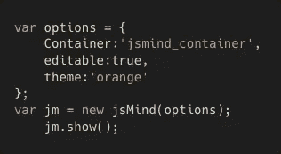
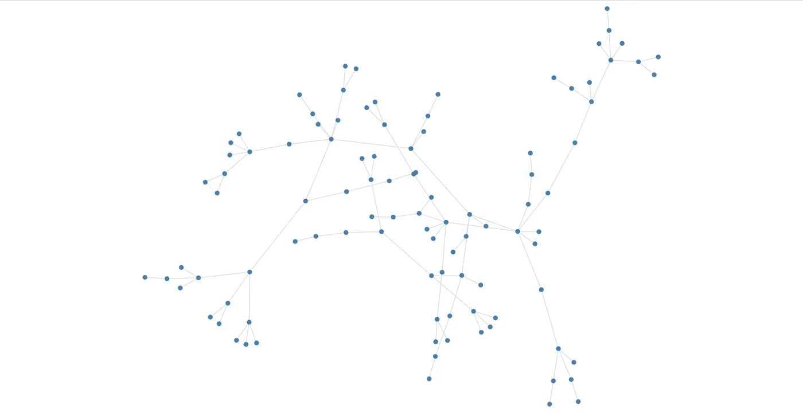

# 思维导图中使用角度的数据可视化

> 原文：<https://medium.com/globant/data-visualisation-in-mindmap-using-angular-13204fa5eccc?source=collection_archive---------0----------------------->

对于每一项业务或交易，追踪所有必要的投资和投资组合，分析利益相关者，以及公司的利润和损失是至关重要的。获得用于该业务的资源的报告也是至关重要的。这就是数据分析发挥作用的地方。比较和分析一直是一个专业问题。它对特定行业的经济产生了巨大的影响，并获得了可用数据的可视化表示。

javascript 框架市场上有许多可用的库，这些库使开发人员能够实现响应性结构，如可视化组件可用的数据点的图形或图表。现在，在单页应用程序中分析数据也变得更加容易。然而，这取决于数据的大小和业务所需的图形表示，因此，必须选择任何 javascript 库。

思维导图就是这样一种图表，它可以帮助组织和可视化思想，并表示实体和其他资源之间的关系。它通常是在整理了公司的所有想法和要求后在纸上创建的。对于这种可视化，可以使用力定向图或不相交定向图。我们已经尝试和测试了一些库，它们提供的用户界面有点接近我们的要求。

让我们来看看几个库和它们各自的特性。

## [Ngx 图](https://swimlane.github.io/ngx-graph/)

Ngx-Graph 是一个由自动化网络安全平台 Swimlane 开发的开源库。这个库使用户能够用它的小地图和主图创建一个图。此外，还有缩放、动画和偏移等功能，图表适合用户提供的窗口。

生成图形的主要输入是具有以下格式的节点和边:

nodes and links data format for ngx-graph

Graph generated using ngx-graph

## [JSmind](https://github.com/hizzgdev/jsmind)

Jsmind 是一个纯粹用 javascript 设计的开源库，可以和其他 javascript 框架集成。jsMind 支持三种格式:节点树格式、节点数组格式和 freemind 格式。jsMind 可以加载以下任一格式，并导出任何格式的数据。您可以创建一个新的 jsmind 对象并传递选项。

jsmind options object format

还为 Angular、React 等特定框架创建了包装器库。，因此开发人员可以根据组件的生命周期来调整代码。

特点:

*   动画也使用角度素材库。所以，生成的图形不能用 CSS 和数据定制。
*   Javascript 容器用于呈现图形。
*   数据格式需要两个 JSON——数据和边。
*   加载图形时需要动画，但无法添加。

Graph generated by jsmind

## [D3.js](https://d3js.org/)

数据驱动文档或 D3.js 是一个 JavaScript 库，用于 SVG、canvas 或 HTML 形式的数据可视化。它使用各种数据驱动技术操作 DOM，并且可以同时定制。它也兼容几乎所有的网络浏览器。它还支持节点和 web workers，因此数据也可以在服务器端呈现时可视化。

D3.js 被认为是数据可视化的标准库，许多其他库也作为相同的包装器被开发出来。

Observable 是用来玩 D3.js 最新版本的。D3.js 版本 4 及以下纯 javascript，支持 IE 浏览器。由于 D3.js 支持 javascript，它可以很容易地从 UI 端适应任何框架，并完全根据需求进行定制，因为它直接与 HTML DOM 一起工作。

Graph generated using D3.js version 7

## [力图](https://github.com/vasturiano/force-graph)

一个呈现在 HTML5 画布上的图形和一个使用 d3.js 的 d3-force 开发的 javascript 库，以创建一个支持缩放、拖动、平移和使用其配置选项进行定制的结果。

在安装库之后，应该创建一个新对象，并且应该在如下所示的代码中提供数据:

ForceGraph Variable Declaration

这个库的一个有趣的特性是它还为用户提供了暂停动画的选项。

Graph generated using Force-Graph

## [心灵连线](https://www.npmjs.com/package/@mind-wired/core)

Mind-Wired(mind-wired.js)及其各自的样式库(mind-wired.css)是专门为思维导图创建而设计的 javascript 库。此库在缩放和拖动功能方面存在未解决的问题。因此，如果开发人员的需求只是创建图形，并用 CSS 和图像对节点和边缘进行样式化，那么这个库很容易适应，代码结构也很容易理解。javascript 代码中指定了一个节点数组，其中包含其子节点，每个节点都包含坐标和视图对象。

节点结构通常由三个值组成——模型、视图和子视图。

Model for Data Point 2 in Graph generated by Mind Wired

Graph generated by mind-wired.js

## 结论

在研究了相当多的库之后，我们得出结论，d3.js 是用于生成图形的旧的黄金标准库，因为它通过手动指定的节点和边来创建 UI，并给出了开发人员需要的样式。但是，如果样式不是问题，并且创建思维导图的主要目的是记录想法和创意，那么上述所有内容都可以很容易地使用，因为它们都是基于 javascript 的开源库，所以它们也是有成本效益的。

特别提到[穆昆德](https://medium.com/u/733fa45e5564?source=post_page-----13204fa5eccc--------------------------------)和[哈什尔](https://www.linkedin.com/in/harshal-patil-17868168)帮助我完成这篇文章。