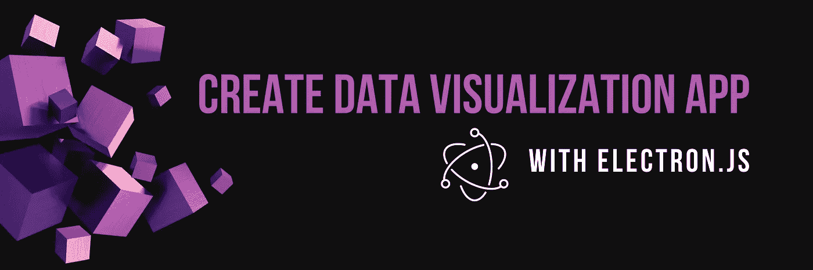
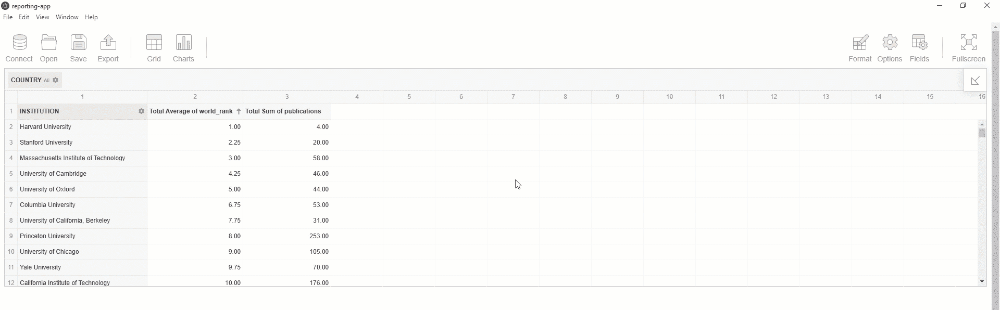
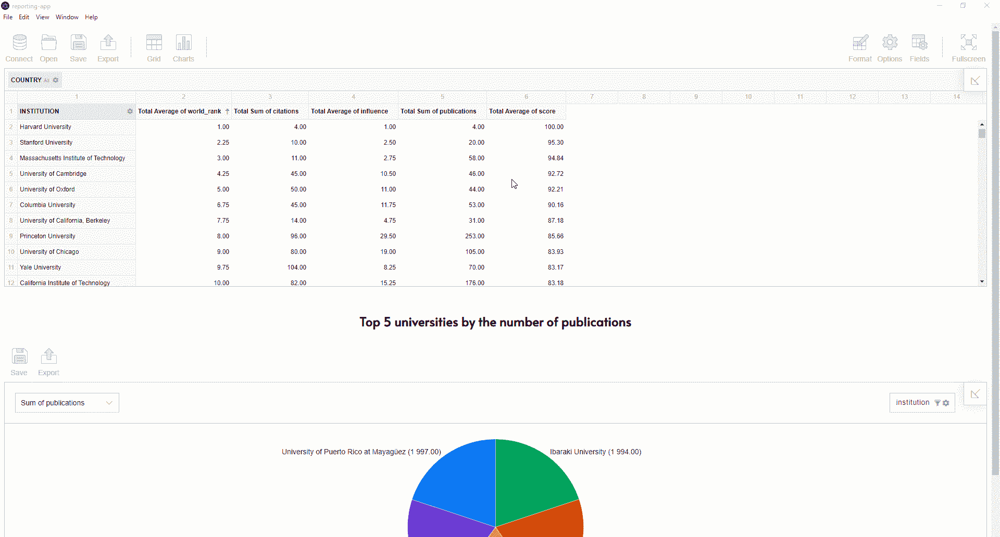

# 带有 Electron.js 的数据可视化和报告应用程序

> 原文：<https://medium.com/quick-code/data-visualization-and-reporting-app-with-electron-js-8c01bf0e952b?source=collection_archive---------0----------------------->

随着 Electron.js 的出现，使用 JavaScript、HTML 和 CSS(web 技术)开发跨平台的桌面应用程序成为可能。

本教程旨在介绍使用 Electron 构建跨平台应用程序的基础知识，并为其提供数据可视化和报告功能。

框架的哲学是“一次编写，到处分发”。因此，您的报告应用程序可以在所有流行的平台上运行，适合广大的最终用户。

如果您已经有了一个 Electron.js 应用程序，直接跳到**获取数据透视表库**部分。

# 你会得到什么

完成教程后，您将获得一个可以在 Windows、macOS 和 Linux 上运行的桌面应用程序。它将提供一个**强大的交互式仪表板**，终端用户可以通过拖放界面编写定制的报告。报告工具可以配置为使用静态 JSON/CSV 文件、[来自 SQL 数据库的数据](https://www.flexmonster.com/doc/connect-to-relational-database/?r=qc3) (Oracle、MySQL、PostgreSQL 等)、 [MongoDB](https://www.flexmonster.com/doc/mongodb-connector/?r=qc3) 、 [SSAS](http://flexmonster.com/doc/connecting-to-microsoft-analysis-services/?r=qc3) 、 [Elasticsearch](https://www.flexmonster.com/doc/connecting-to-elasticsearch/?r=qc3) 或[自定义数据源](https://www.flexmonster.com/doc/introduction-to-custom-data-source-api/?r=qc3)。

我们将反复构建仪表板。

所以，用你最喜欢的 IDE 武装自己，让我们开始吧。

# 步骤 0:准备数据

数据永远是第一位的。一旦您决定了测试报告应用程序的数据集，请进入下一步。

出于演示的目的，我选择了 Kaggle 的[大学排名数据](https://www.kaggle.com/mylesoneill/world-university-rankings)。通过我们的数据仪表板，我们将能够根据不同的标准找出哪些大学是最好的。

# 步骤 1:创建一个 Electron.js 应用程序

让我们按照官方指南中的步骤创建一个简单的 Electron.js 应用程序。

# 步骤 2:配置项目

在`main.js`文件(我们应用程序的入口点)中，编写负责在应用程序准备就绪后打开应用程序窗口的代码:

如果您的数据应该存储在本地，创建一个`data`文件夹。为了我们的报告，我们将从这个文件夹中访问数据文件。

# 步骤 3:获取数据透视表库

安装数据透视表的 npm 包:

`*npm install flexmonster*`

打开`index.html`并添加一个容器，在其中呈现数据透视表控件:

接下来，创建一个`.js`文件(例如`dashboard.js`，并在其中包含该模块:

`*require(‘flexmonster’);*`

# 步骤 4:配置数据透视表报表

定义保存报表的变量。一个[报表对象](https://www.flexmonster.com/doc/configuring-report/)描述了应该如何在网格上排列字段，对值应用哪个聚合，如何过滤数据，等等。

在`dashboard.js`中创建一个透视表实例，并设置该报表:

下一步是将数据透视表嵌入到`index.html`文件中。只需添加一个新脚本:

最后，让我们通过将组件包含到`index.html`中来关注组件的样式:

您可以切换到另一个[报告主题](https://www.flexmonster.com/doc/customizing-appearance/?r=qc3)，使仪表板与您的应用程序设计相匹配。

从控制台运行项目:

`*npm start*`

恭喜你。您的数据透视表已启动并运行。它可以协助数据分析。

# 步骤 5:添加数据透视图

要为您的项目提供更多数据可视化功能，请重复相同的步骤，但要添加一个新组件—数据透视表。您可以指定一个类似的报告，但是使用在[选项](https://www.flexmonster.com/doc/options/?r=qc3)中指定的`chart`视图类型。

你都准备好了！让我们再次运行该项目:

`*npm start*`

# 结果

太棒了。

这是你目前所得到的:

# 结论

这次，您学习了如何为自助分析创建一个**桌面应用程序。**

这是您构建企业分析软件的第一步。

您可以将它交付给您的最终用户，让他们与数据进行交互并发现真知灼见。

每个最终用户都可以成为报告设计者，因为所有必需的报告功能都可以通过用户界面获得:

*   **汇总**数据(汇总、平均、计数等)
*   分层**分组**
*   交互式**排序**和**过滤**数据(按标签、数值或日期)
*   条件&数字**格式**

撰写的报告可以很容易地[导出为 PDF、Excel 或 HTML](https://www.flexmonster.com/doc/export-and-print/?r=qc3) 。

作为开发人员，您可以通过[本地化](https://www.flexmonster.com/doc/localizing-component/?r=qc3)和[丰富多彩的报告主题](https://www.flexmonster.com/demos/themes/?r=qc3)定制其功能，使其符合最终用户的特定需求，并个性化他们的报告体验。

# 项目代码

欢迎您在 GitHub 上获取[数据可视化项目并运行。](https://github.com/veronikaro/dataviz-electronjs-app)

# 有用的链接

如果您的项目依赖于来自 SQL 数据库的数据，您可能会从使用 [Flexmonster 数据服务器](https://www.flexmonster.com/demos/connect-flexmonster-data-server/?r=qc3)中受益，Flexmonster 数据服务器是一种在所有三种主要操作系统上运行的服务器端数据处理解决方案。就像你的应用一样。此外，它允许处理大量数据。如果用作 DLL 库，您还可以配置对报表系统的基于角色的访问。

*   [Electron.js 快速入门指南](https://www.electronjs.org/docs/tutorial/quick-start)
*   [Electron.js 应用分发](https://www.electronjs.org/docs/tutorial/application-distribution)
*   【Flexmonster Pivot 入门
*   [电子支点. js:集成指南](https://www.flexmonster.com/doc/integration-with-electron-js/?r=qc3)
*   [自定义透视表工具栏](https://www.flexmonster.com/doc/customizing-toolbar/?r=qc3)