# Excel 中的数据可视化和条件格式

> 原文：<https://medium.com/edureka/data-visualization-using-excel-724b96a8f85e?source=collection_archive---------0----------------------->

在当今世界，数据是新的货币。数据无处不在，因此可视化数据是理解数据的第一步。如果您曾经想在不需要单独的(基于许可的)工具的情况下进行快速的数据可视化，那么本文就是为您准备的。在这一系列文章中，我们将讨论如何使用 MS Excel 进行 ***数据可视化。***

在本文中，您将深入了解使用 MS Excel 进行数据可视化的便利性。我们将讨论以下主题:

*   ***为什么要对 MS Excel 进行数据可视化？***
*   ***如何在 excel 中导入数据？***
*   ***使用切片器进行视觉过滤***
*   ***使用条件格式赋予数据生命***

现在我想到的第一个问题是，

# 为什么使用 MS Excel 进行数据可视化？

使用 Excel 是 ***数据可视化*** 的理想选择有很多原因，包括但不限于以下原因:

*   不需要为其他工具支付单独的许可费用(因为可以安全地假设我们大多数人的计算机上都安装了 MS Excel)
*   易于使用，因为不需要学习单独的工具
*   因为接收者也不需要单独的可视化工具，所以易于与他人共享可视化(例如仪表板)。

# 使用 Excel 进行初始数据可视化:在 Excel 中导入数据

许多数据文件直接位于。xlsx 格式，这样我们可以直接使用它们。然而，对于其他格式，如 CSV 等，Excel 提供了一个简单的导入它们。

*   打开 MS Excel 的一个新实例，在顶部功能区，点击*数据*图标。点击之后，你会看到下面的屏幕。

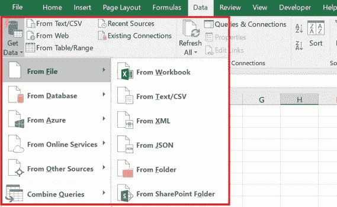

*   Excel 提供了一种从各种格式(如 CSV、XML、JSON 等)导入数据的简单方法。
*   点击相关的数据源。选择正确的导入选项(例如 CSV 文件中的分隔符)，数据将导入 excel。例如:将 CSV 文件导入 excel 后，数据如下所示:

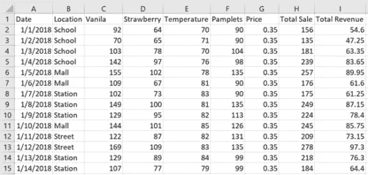

*   加载数据后的下一个重要步骤是将数据转换成表格。
*   要将数据转换成表格，转到图标，然后点击*格式为表格*选项。选择所需的格式，然后选择整个数据作为范围。转换成表格格式后的数据如下所示。

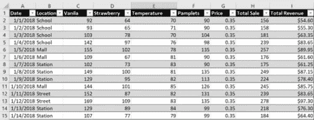

*   转换成表格格式后，数据看起来可读性更好。此外，Excel 将其识别为**表**，这意味着许多功能可以直接应用于数据，如过滤、排序等。

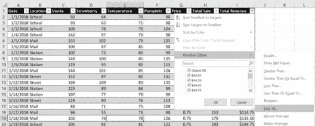

# 使用 Excel 的初始数据可视化:使用切片器的可视化过滤器

需要对数据执行的常见操作之一是应用数据过滤器。尽管可以通过点击每个属性名称来应用过滤器，但有一个更好、更直观的方法，即 ***切片器。***

*   点击*插入*图标，然后点击 ***切片机*** 图标。

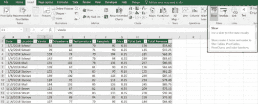

*   单击切片器后，会出现一个名为 ***插入切片器*** 的对话框，其中显示了所有属性及其对应的复选框。

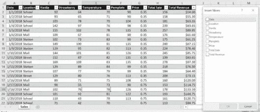

*   点击所需的属性名称，并按 ***确定*** 。请注意，也可以选择多个属性。在本例中，选择位置然后按 ***确定*** 。

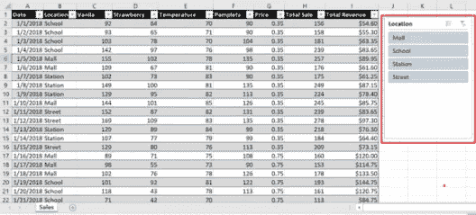

*   按下 Ok 后，将打开一个名为 Location 的新对话框。现在可以在对话框中看到数据集中出现的所有不同位置。只需单击任何值，就可以根据该值过滤数据。

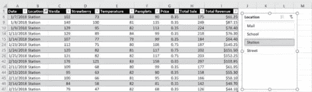

*   要选择多个值，请单击右上角的图标(带有三行和复选框)。

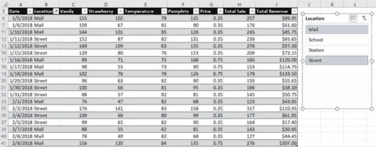

# 使用 Excel 的初始数据可视化:使用条件格式赋予数据生命

条件格式有助于直观地探索和分析数据、检测问题以及识别趋势和模式。使用条件格式，很容易突出显示感兴趣的单元格或单元格区域，并通过使用数据条、色标和图标集来可视化数据。

## 1.数据栏

数据条有助于分析某个单元格相对于其他单元格的值。数据条的长度与单元格中的值成正比。较长的条形代表较高的值，较短的条形代表较低的值。数据条对于发现较高和较低的值很有用，尤其是对于大量数据。

*   选择可以使用数据栏浏览其值的任何列的所有值。选择数值后，点击 ***首页*** 菜单下的 ***条件格式*** 图标。下拉菜单出现后，点击 ***数据栏*** 选项，选择所需颜色。

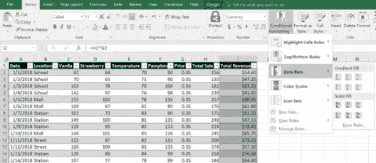

*   选择所需的颜色后，*总收入*列中的数据将类似于下面的快照。请注意，现在只需目测数据，就可以很容易地看出总收入属性中的模式。

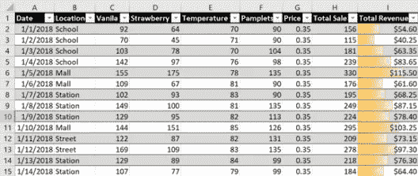

## 2.色阶

色标是帮助理解数据分布和变化的直观指南。三色标有助于使用三种颜色的渐变来比较单元格范围。颜色的阴影代表较高、中等或较低的值。同样，在双色标度中，颜色的阴影代表较高或较低的值。

*   选择任何列的所有值，您可以使用色标来查看其值。选择数值后，点击 ***首页*** 菜单下的 ***条件格式*** 图标。下拉菜单出现后，点击 ***色阶*** 选项，选择所需的颜色样式。

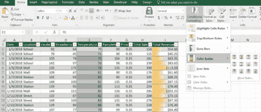

*   选择所需的颜色样式后， ***温度*** 栏中的数据如下图所示。请注意，Excel 用绿色显示较冷的温度，用红色显示较热的温度，用黄色显示中等温度范围。

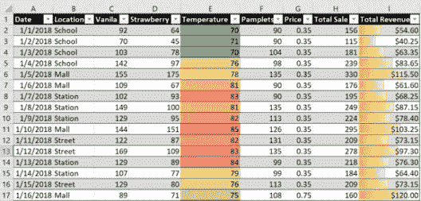

## 3.图标集

您可以使用图标集将数据分为由阈值分隔的不同类别。每个图标代表一个数值范围。

*   选择其值可以作为图标集浏览的任何列的所有值。选择数值后，点击 ***首页*** 菜单下的 ***条件格式*** 图标。下拉菜单出现后，点击*I*图标设置 选项，选择所需样式。

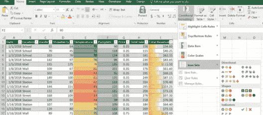

*   选择所需的图标样式后， ***小册子*** 栏中的数据将如下图所示。请注意，星号是根据分发的小册子数量填写的。

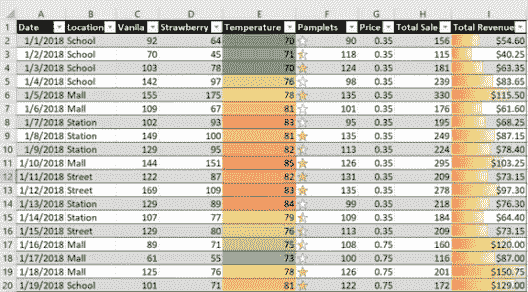

## 4.顶部/底部规则

您基本上使用顶部/底部规则来快速查找并突出显示顶部值、底部值、平均值等。

*   选择必须突出显示顶部或底部值的任何列的所有值。选择数值后，点击 ***主页*** 菜单下的 ***条件格式*** 图标。一旦出现下拉菜单，点击 ***顶部/底部规则*** 选项，即可看到多个选项。

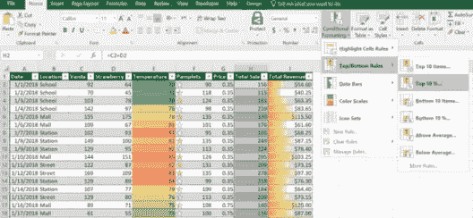

*   选择前 10%选项后，选择所需的颜色样式。“总销售额”列中的数据将类似于下面的快照。在下图中，突出显示了前 10%的值(22 个值中的 2 个值)。

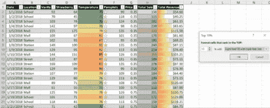

*   我们可以在同一个属性中应用多个规则。例如，下图用红色显示前 10%的值，用黄色显示后 10%的值。

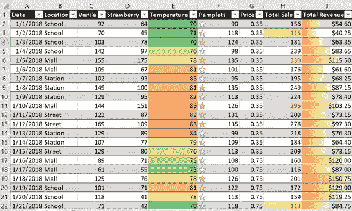

如本文所示， ***MS Excel*** 是一个强大的工具，它提供了许多有用的数据可视化选项，如切片器、数据条、色标、图标集、顶部/底部规则等。使用这些选项，用户可以快速分析数据模式并可视化地浏览数据。

因此，下次给你一些数据时，试着使用这些选项来使你的数据更有意义。在下一篇文章中，将介绍使用 MS Excel 的高级数据可视化技术，这将有助于详细的数据分析。

如果你想查看更多关于人工智能、DevOps、道德黑客等市场最热门技术的文章，你可以参考 Edureka 的官方网站。

请留意本系列中的其他文章，它们将解释 Excel 的各个方面。

> 1.[使用 Excel 进行高级数据可视化](/edureka/excel-charts-advanced-data-visualization-edb3f380c8bd)

*原载于 2019 年 6 月 19 日*[*https://www.edureka.co*](https://www.edureka.co/blog/data-visualization-using-excel/)*。*