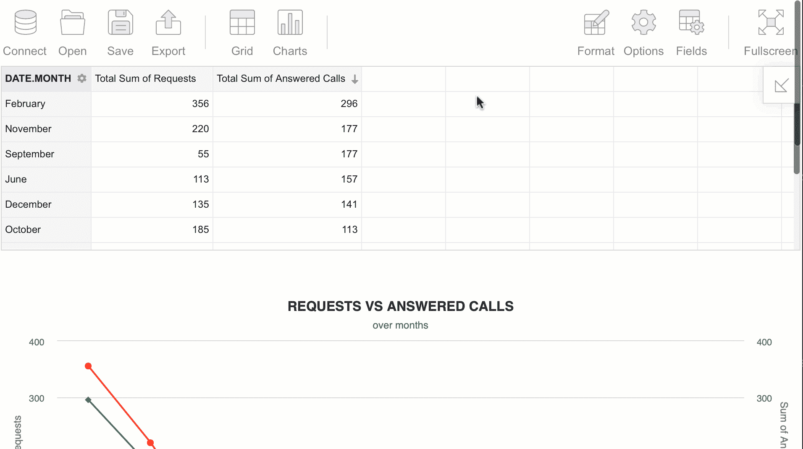

# 通过 Highcharts、Flexmonster Pivot、Elasticsearch & React 实现数据可视化

> 原文：<https://medium.com/quick-code/data-visualization-with-highcharts-flexmonster-pivot-elasticsearch-react-c94b98549991?source=collection_archive---------3----------------------->


在本教程中，我将向您展示我最近发现的一种工具组合。和往常一样，它是关于数据分析和使用 React 进行数据可视化的，但这次我给数据源添加了一点趣味。这是我第一次使用 Elasticsearch，但结果非常好，所以我想在这里与你分享创建这个仪表板的过程:



# 为什么要用 Elasticsearch？

[Elasticsearch](https://www.elastic.co/?ultron=B-Stack-Trials-EMEA-S-BMM&gambit=Stack-Core&blade=adwords-s&hulk=paid&Device=c&thor=elasticsearch&gclid=Cj0KCQjwsdiTBhD5ARIsAIpW8CJTfB5oTsZHAgHk2nP4AxK96h-FMdfafOhspyfO61eyqmf04vXVfLcaAhqJEALw_wcB) 是最受欢迎的大数据搜索引擎之一，是一个可扩展的全文搜索和分析工具，允许您快速存储、搜索和实时分析大量数据。

我想强调一下它的最佳特性:

*   **接近实时的搜索** —它使用一个轻量级的过程，通过每秒刷新一次每个碎片来使新文档变得可搜索；
*   将 Elasticsearch 添加到您的架构设计中是一个轻松的过程。**实施花费最少的努力**却产生最大的效果；
*   这种独特的方法使得**的可扩展性变得容易**并且**的性能超级平滑**；
*   Elasticsearch 自动对文档进行索引，并自动推断其类型和字段，因此非常灵活；
*   Elasticsearch 的所有特性都是通过 RESTful**接口展示的；**
*   这是一个**开源**产品，具有**良好的组织和最新的文档**；
*   最重要的是——它是免费的！

所以对我个人来说，当我处理复杂数据时，弹性搜索是关于速度和灵活性的。并且易于实施和使用。

所以让我们直接开始吧！

# 要求

本教程需要的是:

*   [flex monster Pivot](https://www.flexmonster.com/demos/react/pivot-table/?r=qc1)2 . 7 . 0 或更高版本
*   Elasticsearch 版本 6.x 或 7.x
*   [Node.js 和 npm](https://docs.npmjs.com/downloading-and-installing-node-js-and-npm)
*   [Flexmonster CLI](https://www.flexmonster.com/doc/cli-overview/?r=qc1)
*   [高图表](https://www.highcharts.com)

和大约 30-40 分钟的空闲时间来使用所有这些工具构建 React 应用程序结构。

整体流程将如下所示——我们将创建一个 React 应用程序，在页面上添加一个数据透视表，将其连接到数据源，在我们的例子中是 elasticsearch，然后添加图表，并通过一个特殊的连接器将来自网格的聚合数据传递给它们。但是现在让我们来详细看看每一步。

## 创建 React 应用程序

在终端中运行以下命令来创建一个 React 项目:

```
npx create-react-app my-app
cd my-app
```

这将创建一个 ES6 项目，但实际上您可以在 ES6 和 TypeScript 项目之间进行选择。

## 安装并添加 Flexmonster Pivot

通过从包含`package.json`的文件夹运行这个 CLI 命令，您将把`react-flexmonster`包安装到`node_modules/`文件夹，并将其作为 npm 依赖项添加到`package.json`本身:

```
flexmonster add react-flexmonster
```

现在，通过向`index.js`添加以下导入语句来导入 Flexmonster 样式:

```
import 'flexmonster/flexmonster.css';
```

将下面的 import 语句添加到`App.js`中，将`FlexmonsterReact`组件包含到 React 项目中。

```
import * as FlexmonsterReact from 'react-flexmonster';
```

最后将数据透视表插入`App.js`:

```
function App() {
  return (
    <div className="App">
      <FlexmonsterReact.Pivot 
       toolbar={true}
       componentFolder="https://cdn.flexmonster.com/"
       width="100%"
       report="https://cdn.flexmonster.com/reports/report.json"
      />
    </div>
  );
}
```

这些道具相当于 Flexmonster 的初始化参数。您可以查看[可用参数的完整列表](https://www.flexmonster.com/api/new-flexmonster/#parameters/?r=qc1)了解更多详情。

报告参数可以定义为一个变量，其内有一个[报告对象](https://www.flexmonster.com/api/report-object/?r=qc1)，其中包含构建正确的表格可视化所需的所有信息(我们将在此处写入从何处获取数据进行聚合)。

## 将 Flexmonster Pivot 网格连接到 Elasticsearch

Flexmonster 将扮演 React Elasticsearch UI 的角色，并给我们一个机会来快速更改切片和数据，并根据我们的需要简单地旋转它。

如果你还没有索引，这里有一个关于创建和管理你的索引的小片段。

所以要从启用 CORS 开始，允许跨域请求。为此，打开`elasticsearch.yml`并添加以下几行:

```
http.cors.enabled: true
http.cors.allow-origin: "*"
http.cors.allow-credentials: true
http.cors.allow-headers: "X-Requested-With, Content-Type, Content-Length, Authorization"
```

要允许从本地主机以外的机器连接到 Elasticsearch 服务器，请在防火墙中打开一个适当的端口。默认端口是`9200`，但根据您在`elasticsearch.yml`文件中的配置可能会有所不同。

所以现在我们需要将透视网格连接到数据源。为此，用您的具体值定义`node`和`index`参数:

```
 report: {
        "dataSource": {
            "type": "elasticsearch",
            /* the host for the connection */ 
            "node": "https://olap.flexmonster.com:9200",
            /* the name of Elasticsearch index to connect */ 
            "index": "your-index-name"
        }
    }
```

为了减少数据加载时间，还可以使用 [dataSource.subquery](https://www.flexmonster.com/api/data-source-object/#subquery) 属性。它设置了一个服务器端过滤器，所以 Flexmonster 将只获取需要的数据部分。这种方法还允许您定义在网格上显示哪些数据。这里有一个例子:

```
subquery: {
            "bool": {
                "filter": [{
                    "terms": {
                        "Category.keyword": ["Bikes", "Accessories"],
                    }
                },
                {
                    "terms": {
                        "Color.keyword": ["blue", "red"]
                    }
                }]
            }
        }
```

它演示了如何通过过滤来加载`Category`和`Color`字段的特定成员。

## 向 React 应用程序添加高图表

因此，我们需要完成 React 数据可视化教程的最后一件事是将 Highcharts 库添加到项目中。

这种整合的主要元素是:

1.  在`App.js`中添加 Highcharts 模块和用于 Highcharts 的 Flexmonster 连接器:

```
import ‘flexmonster/lib/flexmonster.highcharts.js’;
import Highcharts from ‘highcharts’;
```

2.为高图表添加容器:

```
<div id="highcharts-container"></div>
```

3.定义`reportcomplete`事件；当它被触发时，图表绘制功能被调用。

```
reportComplete = () => {
        this.myRef.current.flexmonster.off(this.reportComplete);
        //creating charts after Flexmonster instance is launched
        this.createChart();
    }
```

4.编写`drawChart()`函数:

```
createChart = () => {
        //Running Flexmonster's getData method for Highcharts
        this.myRef.current.flexmonster.highcharts.getData(
            {
                type: "area"
            },
            function (data) {
                Highcharts.chart('highcharts-container', data);
            },
            function (data) {
                Highcharts.chart('highcharts-container', data);
            }
        );
    }
```

另外，不要忘记将报告完成事件添加到报告道具中:

```
reportcomplete={this.reportComplete}
```

现在您可以开始您的项目并查看结果:

```
npm start
```

# 摘要

现在你有了一个使用 Elasticsearch 的 React pivot table 示例，并且可以通过 Highcharts 快速查看。你可以使用这个数据可视化教程作为参考，并添加你自己的工具和实现你自己的逻辑。这里使用的所有工具要么完全免费，要么可以免费试用，这样您就可以轻松地探索它们，并决定在您的开发中是否需要它们。

希望这篇文章对你有用，你能在 30 分钟内抽出时间)
我也很高兴在评论中听到你的想法！