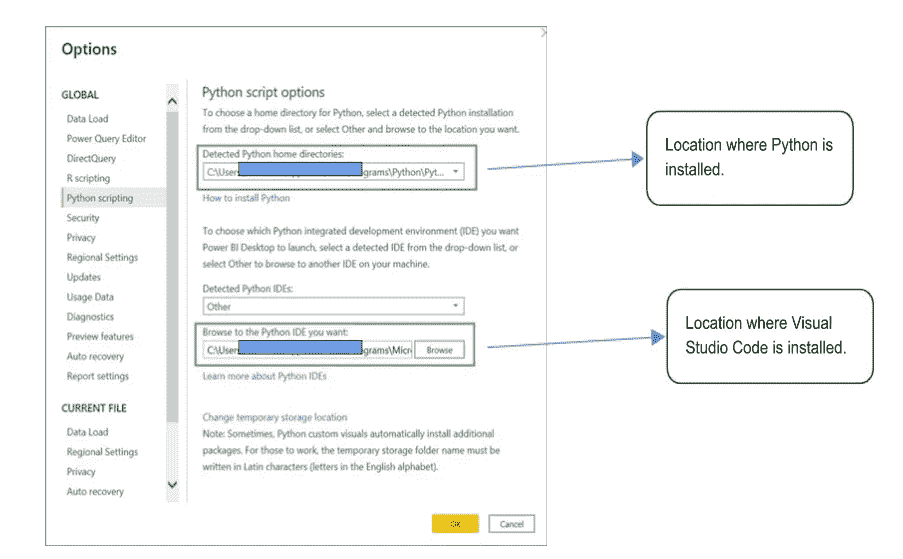
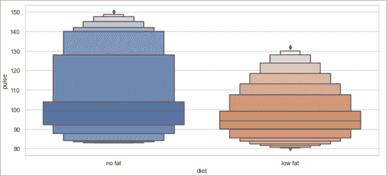
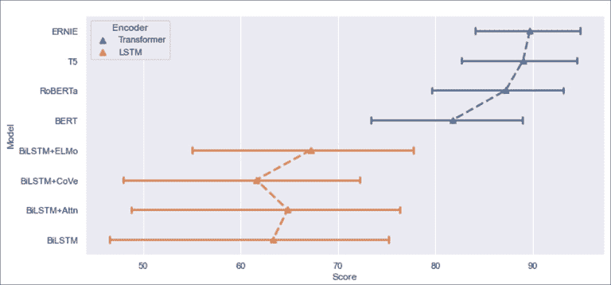

# 使用 Seaborn Plots 在 Power BI 中使用 Python 进行数据可视化

> 原文：<https://medium.com/globant/data-visualization-with-python-in-power-bi-using-seaborn-plots-1a8c6d1889b5?source=collection_archive---------0----------------------->


Python integration with Power BI

`[Power BI](https://powerbi.microsoft.com/en-au/)`是一个数据可视化工具，现在我们可以通过`[Python](https://www.w3schools.com/python/)` 和`[R](https://www.w3schools.com/r/)`来增强 Power BI 的功能，从而简化接收和转换活动。在这篇博客中，我将使用 Python 的`[Seaborn](https://seaborn.pydata.org/#:~:text=Seaborn%20is%20a%20Python%20data,introductory%20notes%20or%20the%20paper.)` 和`[Matplotlib](https://matplotlib.org/)` 库进行数据可视化。通过结合 Power BI 和 Python，可以扩展 Power BI 的数据接收、转换、增强和可视化功能。

这是众多业务用例中的一个——一个电子商务网站希望更好地了解其用户。该公司的数据分析师可以使用 Python 来分析公司的销售情况，突出显示可预测的趋势，并使用定制的 Python 视觉效果在报告中显示出来。

我们将了解 Power BI 和 Python 集成功能，并在下面看到一些视觉效果。如果您想跳到实现部分，请转到下面的“*使用 Seaborn 进行数据可视化*”部分。

# 在 Power BI 中使用 Python 的功能

`[M language](https://learn.microsoft.com/en-us/powerquery-m/)`和`[DAX](https://learn.microsoft.com/en-us/dax/)` 已经是微软 Power BI(数据分析表达式)支持的语言，但是使用 Python 进行数据准备有时候更实用。这是因为它允许您访问几个 Python 库，这是一些实用函数的集合，可以减少从头编写代码的需要。

您可以使用 Python 对数据集执行数据清理、复杂的数据整形和分析，例如填充缺失数据和进行预测。Python 和 Power BI 的结合拓宽了处理数据的全新机会。多亏了 Python，Power BI 已经成为一个几乎无限的平台。

在 Power BI 中使用 Python 可以执行的作业类型的几个示例如下:

*   **数据清理—** Python 脚本可用于自动化一些重复的数据清理活动。
*   **数据转换** — Python 脚本对于需要在导入之前进行数据转换的数据集非常有用，这在 Power Query 编辑器中可能很难执行。
*   **高级可视化** —使用 Python 时，您可以在报告中包含的可视化内容没有任何限制。您可以向 Power BI 添加高度定制的独特可视化效果，而无需下载定制的可视化效果。
*   **连接** —即使 Power BI 没有内置的数据源连接，Python 也允许您连接到几乎任何数据源。

# **在 Power BI 中使用 Python 的先决条件**

按照以下步骤在 Power BI 中使用 Python。

## **1。下载并安装 Python**

建立集成环境是第一步。要做到这一点，你需要在你的电脑上安装一个 Python 的发行版。您可以参考[这些](https://www.javatpoint.com/how-to-install-python)步骤进行安装。Power BI 服务支持 Python 3.7.7 运行时。参见页面[上的*Python 包*的要求和限制部分。](https://docs.microsoft.com/en-us/power-bi/connect-data/service-python-packages-support)

## **2。安装所需的库**

Power BI 服务支持很少的库，但是安装在 Python 包之下就足够了。

1.  `[**Pandas**](https://pandas.pydata.org/)`:用于处理数据集。它提供了数据探索、清理、分析和操作的工具。
2.  `[**Matplotlib**](https://matplotlib.org/)`:用于在 Python 中构建静态的、动画的、交互式的可视化。
3.  `[**Seaborn**](https://seaborn.pydata.org/#:~:text=Seaborn%20is%20a%20Python%20data,introductory%20notes%20or%20the%20paper.)`:这是一个基于 Matplotlib 的 Python 数据可视化库，名为 Seaborn。它提供了一个复杂的绘图工具，用于创建引人注目的、有教育意义的统计图像。

要安装这些包，在命令行应用程序中运行`[pip](https://www.w3schools.com/python/python_pip.asp)`命令。

```
C:\>pip install pandas
C:\>pip install matplotlib
C:\>pip install seaborn
```

## **3。下载并安装 Python IDE(可选步骤)**

这不是一个必要的步骤，因为 Power BI 脚本编辑器也允许您创建 Python 脚本。然而，任何外部代码编辑器都有助于快速创建脚本。因为它包括语法突出显示，所以我建议使用 Visual Studio 代码。你可以从[官网](https://code.visualstudio.com/download)下载，在这里参考 Visual Studio 代码[的安装步骤。参考](https://learn.microsoft.com/en-us/visualstudio/install/install-visual-studio?view=vs-2022)[文档](https://docs.microsoft.com/en-us/power-bi/connect-data/desktop-python-ide)了解更多关于带 Power BI 的外部 Python IDE 的详细信息。

## **4。在 Power BI Desktop 中启用 Python 脚本**

要启用 Python 脚本，请打开 Power BI Desktop，单击左上角的“文件”，单击“选项和设置”，单击“选项”，然后单击“Python 脚本”，如下所示。



Power BI setting for enabling Python scripting

# **使用 Seaborn 进行数据可视化**

Seaborn 提供了各种各样的[地块](https://seaborn.pydata.org/examples/index.html)。但是，在这篇博客中，我们将重点讨论 Boxen 和 Point 情节。

## **Boxen Plot:(seaborn . Boxen Plot)**

Boxen 图是一种高级盒状图，可用于大型数据集。当绘制非参数分布表示时，类似于箱线图，所有特征都对应于实际观察值。通过绘制更多的分位数，可以更好地理解分布的形状，尤其是尾部。点击[此处](https://seaborn.pydata.org/generated/seaborn.boxenplot.html#seaborn.boxenplot)了解更多剧情。

```
import matplotlib.pyplot as plt
import seaborn as sns
#Set aspects of the visual theme
sns.set_theme(style="whitegrid", color_codes=True)
#Take a sample dataset from the Github repository
dataset = sns.load_dataset("exercise")
#Ordering of diet values
pulse_ranking = ["no fat", "low fat"]
sns.boxenplot(x="diet",y="pulse",scale="linear",order=pulse_ranking,
data=dataset,k_depth="proportion")
#Use to display the visual
plt.show()
```

运行上面的脚本后，您将看到下面的 Boxen 图。



Boxen Plot

*   `[set_theme](https://seaborn.pydata.org/generated/seaborn.set_theme.html):`该功能为所有地块设置视觉主题的各个方面。
*   `[load_dataset](https://seaborn.pydata.org/generated/seaborn.load_dataset.html):`你可以在这个[函数](https://seaborn.pydata.org/generated/seaborn.load_dataset.html)的帮助下加载必要的数据集。我使用了[这个](https://github.com/mwaskom/seaborn-data/blob/master/exercise.csv)数据集作为参考。您可以参考其他数据集进行学习[这里](https://github.com/mwaskom/seaborn-data/)。

## **点绘图:(seaborn.pointplot)**

点状图使用点的位置来表示数值变量集中趋势的估计值，误差线用于显示该估计值的不确定程度。

对于一个或多个分类变量的不同水平之间的比较，点状图可能是有帮助的。对于眼睛来说，通过斜率的差异来检测相互作用比通过比较各种点组的高度来检测相互作用更简单。该图仅显示平均值。点击[这里](https://seaborn.pydata.org/generated/seaborn.boxenplot.html#seaborn.boxenplot)了解更多关于这个剧情。

```
import matplotlib.pyplot as plt
import seaborn as sns
#Set aspects of the visual theme
sns.set_theme(color_codes=True)
#Take a sample dataset from the Github repository
df = sns.load_dataset("glue")
sns.pointplot(data=df, x="Score", y="Model", hue="Encoder",capsize=.2, 
 linestyles=" - " ,markers='^')
#Use to display the visual
plt.show()
```

运行上面的脚本(它使用与上一个示例相同的数据集)后，您将看到下面的点图。



Point Plot

# **Python 在 Power BI 中的局限性**

Python visual 是与 Power BI 一起使用的一个优秀特性，但是它有一些限制，在编写脚本时应该记住:

## **数据大小限制**

*   Python visual 只能使用 150，000 行数据进行绘图。如果选择超过 150，000 行，则使用前 150，000 行。
*   输入数据有 250 MB 的限制。如果您正在处理非常大的数据集，那么这可能是一个问题。
*   Python 可视化输入数据集中字符串值超过 32766 个字符的列将被截断。

## **分辨率限制**

*   Python 视觉效果以 72 DPI 显示。

## **时间限制**

*   耗时超过五分钟的 Python 可视化计算会产生执行超时错误。

## **视觉限制**

*   当数据被更新、过滤或高亮显示时，Python 的视觉效果会被刷新。然而，视觉本身不是交互式的。
*   Python 视觉效果对突出显示其他视觉效果做出响应，但是您不能单击 Python 视觉效果中的元素来交叉过滤其他元素。

# **结论**

在这篇博客中，我们学习了如何将 Power BI 与 Python 集成，以及如何在集成环境中使用 Boxen 和 Point plots。这仅仅是 Python 和 Power BI 集成的冰山一角。我建议您浏览 seaborn 的官方文档,了解更多关于在 Power BI 中利用 Python 的信息。

*拜*[费德里科](https://medium.com/u/cfab8f825ee8?source=post_page-----1a8c6d1889b5--------------------------------) *！*

# **参考文献**

[Seaborn 安装](https://seaborn.pydata.org/installing.html)

[面向初学者的 Python Seaborn 教程](https://www.mygreatlearning.com/blog/seaborn-tutorial/)

[Seaborn 对象接口](https://seaborn.pydata.org/api.html)