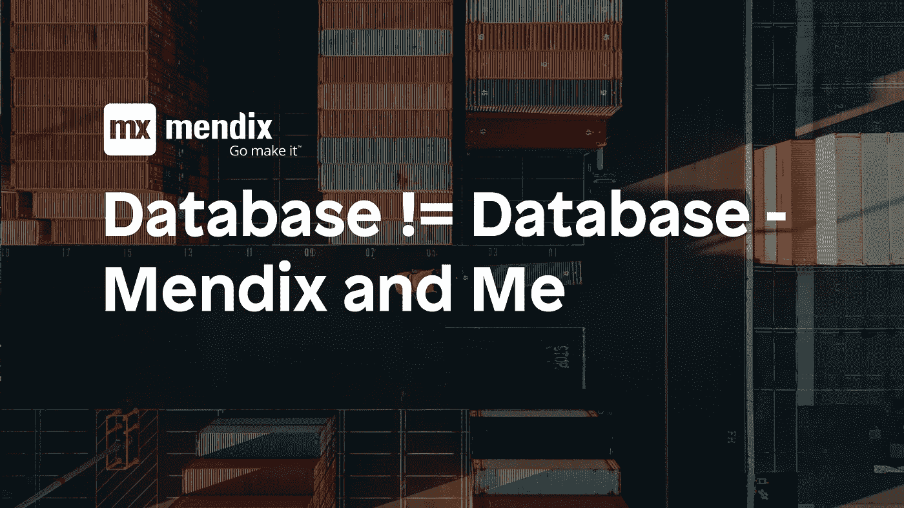

# 数据库！=数据库— Mendix 和我

> 原文：<https://medium.com/mendix/database-database-mendix-and-me-e9d54c63fb23?source=collection_archive---------7----------------------->

Mendix 云中的默认数据库是 Postgresql。大多数 Mendix 应用程序可能会在这个数据库上运行。与运行 Mendix 应用程序所需的其他组件不同，Postgresql 不与 Mendix Studio Pro 一起安装。相反，Mendix Studio Pro 使用不同的内置数据库。

如果您开发一个应用程序，那么在本地使用内置数据库而不是安装一个额外的数据库服务器当然很有吸引力。然而，我建议无论如何都要选择后者。如果您希望您的应用程序在本地的行为方式与在生产环境中的行为方式相同，那么您应该确保这两种条件尽可能相等。

**一些差异**

Postgresql 比内置数据库的性能高得多。
好吧，这可能一点也不奇怪。然而，这是你应该考虑的事情。数据库负载高的应用程序不应在内置数据库上运行。这些的内存消耗很快达到极限，并导致意外错误。

查询在所有数据库中的行为并不相同。
不同的数据库处理查询的方式不同。例如，Postgresql 中的查询是区分大小写的，而内置数据库则不是。

*   [string attribute =‖ABC ']
*   [string attribute =‖ABC ']

在 Mendix 附带的数据库中，这两个查询返回相同的结果。在 Postgresql 中，这两个查询返回不同的结果。

因此，如果您想确保您已经在本地测试过的程序逻辑仍然可以在云环境中工作，建议您在相同的数据库系统上工作。

[点击此处](https://www.mendix.com/evaluation-guide/app-capabilities/data-management)了解更多关于 Mendix 应用程序的数据库管理。

*于 2020 年 2 月 24 日在*[*https://mendixamme . de*](https://mendixandme.de/index.php/2020/02/24/datenbank-datenbank/)*以德语原文发表。*