# 数据库检查器

> 原文：<https://medium.com/androiddevelopers/database-inspector-9e91aa265316?source=collection_archive---------0----------------------->

## 我们期待已久的实时数据库工具！

创建和管理本地数据库是大多数移动应用的核心组件。但是不管你是直接使用 **SQLite** 还是通过 [**Room**](https://developer.android.com/topic/libraries/architecture/room) 持久性库，Android 开发者一直在寻求一种更好的方法来检查和调试他们正在运行的应用程序中的数据库。要了解更多信息，请观看视频或阅读下面的博客。

最新版本的 Android Studio 4.1(目前在 Canary 中可用)附带了一个名为**数据库检查器**、的新工具，可以帮助您检查、查询和修改正在运行的应用程序中的数据库。

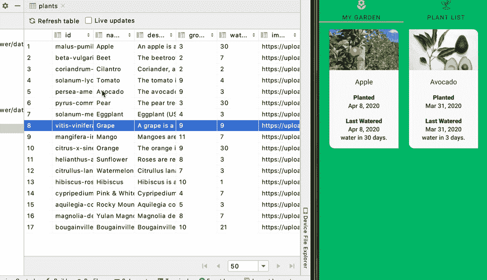

Database Inspector helps you to modify the data just like editing a spreadsheet.

使用 Database Inspector，修改数据库中的数据并不比编辑电子表格困难多少；如果您正在使用 Room 并观察查询结果，这些变化将立即反映在您的应用程序中！

在本帖中，我们将使用带有 [**向日葵**](https://github.com/android/sunflower) app 的数据库检查器来测试一些边缘案例。向日葵是一个园艺应用程序，它用 Android Jetpack 展示了 Android 开发的最佳实践。我鼓励你克隆回购协议，并在阅读这篇文章时跟随它。

# 开始

向日葵应用程序的用户界面包括两个选项卡。为了给我的花园添加一些植物，让我们看看**植物列表**选项卡，它列出了我的花园可用的植物。在右上角，有一个过滤器按钮。当我按下此按钮时，会显示以下植物列表:

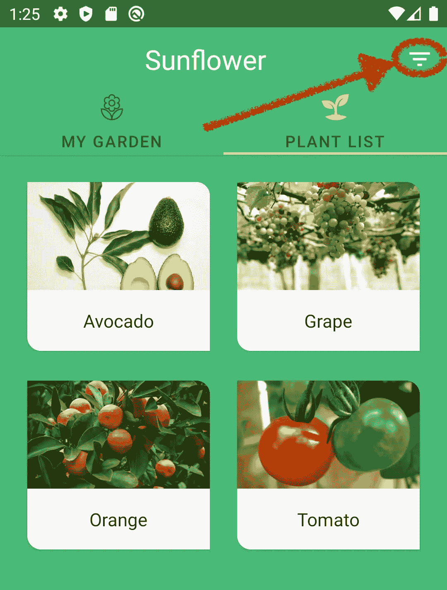

Click to filter Plant List

显然，这个按钮根据一些标准过滤植物。但是让我们假设我对这个项目不是很熟悉，我想通过使用 Database Inspector 弄清楚过滤是如何工作的。

要在 Android Studio 中打开数据库检查器，我需要从菜单栏中选择**视图>工具窗口>数据库检查器**。

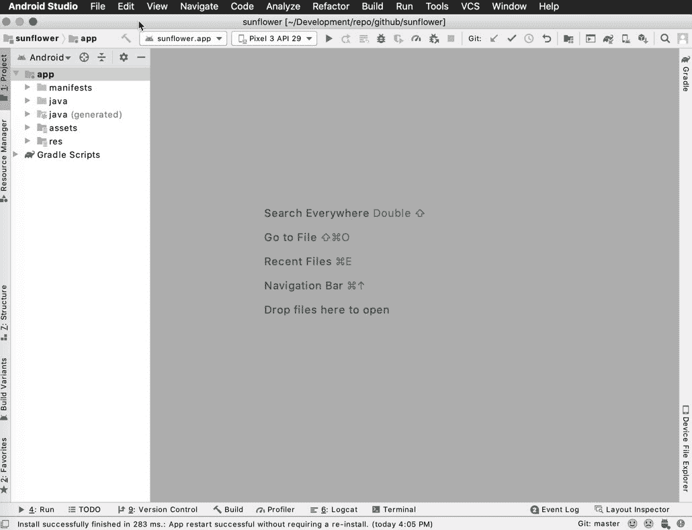

Select View > Tool Windows > Database Inspector from the menu bar to open Database Inspector.

这将打开数据库检查器。

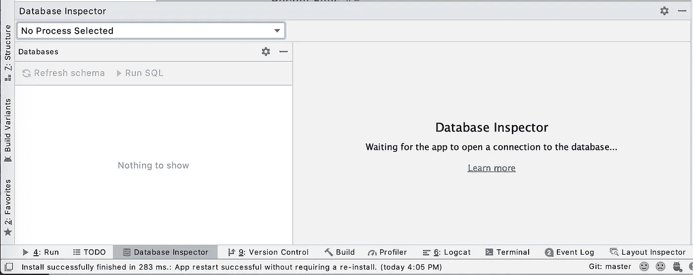

Database Inspector window

现在，我需要在运行 API 级别 26 或更高的设备上运行应用程序，然后从下拉菜单中选择应用程序流程。

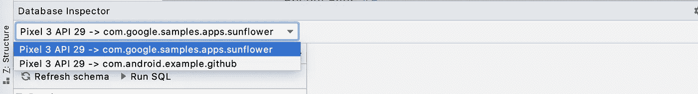

Select the running app process from the dropdown menu.

在我选择了要检查的应用程序进程后，数据库模式出现在下面的面板中。要查看 Sunflower 数据库表，我需要展开**…/databases/Sunflower-db**模式。

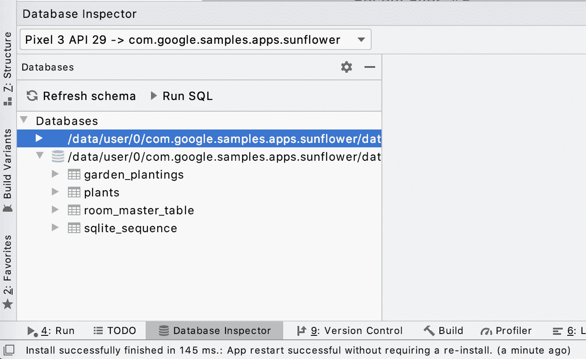

Once you select a process, the app databases are listed.

让我们回到应用程序，看看过滤后的植物列表。名单中有*牛油果*、*葡萄*、*橙子*和*番茄*。如果我能把植物表按植物名称排序，就不难找到*鳄梨*。让我们看看数据库检查员是否能做到这一点！

首先，我双击 *plants* 表来显示它的数据。数据显示的默认页面大小为 50，但是您可以减少这个数字，并在较短的结果列表之间分页。点击*名称*列，根据条目名称对*工厂*表进行排序。不出所料，*鳄梨*在列表的下方不远，我在表格的第二行找到了它。

# 查询您的数据库

查看 *Avocado* 的数据条目， *growZoneNumber* 很可能是应用程序用于过滤的属性。为了验证这一点，让我们在 *growZoneNumber，*上运行一个查询，对于 *Avocado* 来说是 9。实际上，这个查询已经存在于 PlantDao.kt 中，我可以直接从 Room 的 *@Query* 注释中运行这个查询。每个 *@Query* 注释的行号旁边都有一个小的运行图标。

当我点击 getPlantsWithGrowZoneNumber()查询的运行图标并选择正确的数据库时，会出现一个弹出窗口，询问我 *:growZoneNumber* 的值。

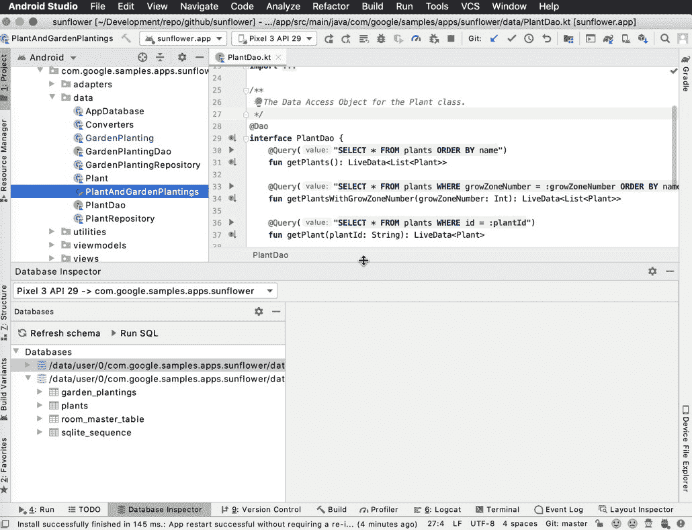

You can run queries directly from @Query annotation.

我可以输入值 *9* 并点击**运行**来查看查询结果。

或者，我可以键入自己的查询并在工具窗口中运行它。这给了我更多的自由，因为我不局限于在 DAO 接口中定义的查询。要运行我自己的查询，我单击 **Run SQL** 并从右边新打开的选项卡中选择 *plants* 数据库。

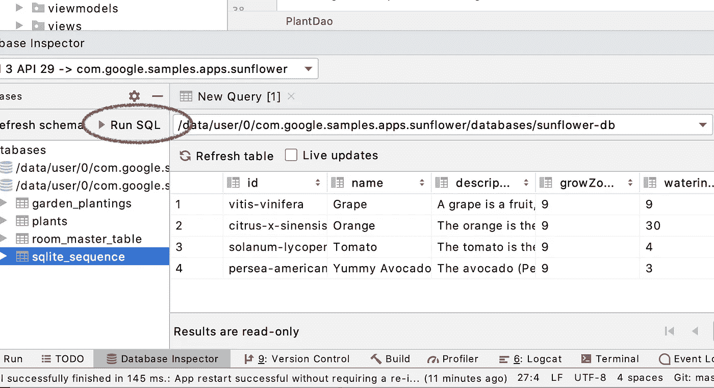

Click Run SQL and select the app database.

接下来，我在数据库选择下拉列表旁边的框中键入以下查询，并单击**运行**。

"*Select * from plants where grow zone number = 9*"

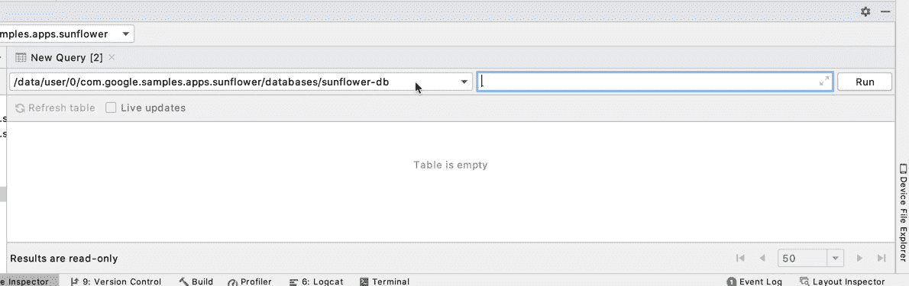

You can execute SQL queries in Database Inspector

在这里！当过滤器打开时，我们有完全相同的植物列表。

# 修改和调试您的数据库

数据库检查器允许您在设备上运行应用程序时修改应用程序数据库中的值，从而使调试应用程序变得轻而易举。

首先，我想测试真正长的植物名称的应用程序 UI。我将使用 Database Inspector 直接在数据库上编辑值，而不是更改数据源并用新数据刷新数据库。

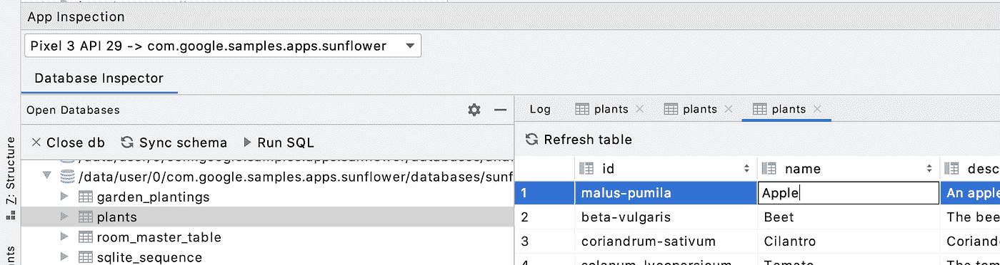

You can edit your database in Database Inspector

现在单元格是可编辑的了，我把名字从*苹果*改成*一种非常特殊的苹果*，然后按回车键。如果您正在跟进，您可以在应用程序 UI 中键入任何您想要测试的长度。

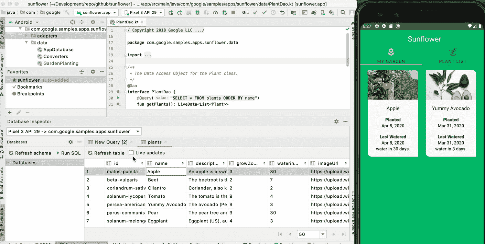

If your app uses Room and observes the query results, you don’t need to restart the app to see the changes.

现在让我们回到应用程序。请注意，在我们不做任何事情的情况下，应用程序正在显示更新的数据！如果您的应用程序使用 Room 并观察查询结果(使用 LiveData/Flow ),您不需要触发数据库查询来刷新数据。否则，根据您的应用程序触发查询的方式，您可能需要重新启动应用程序或再次导航到相关活动/片段。为了充分发挥 Database Inspector 的潜力，这可能是一个将您的应用程序迁移到使用 LiveData 或 Flow 的好借口。

回头看看我们的应用程序，看起来卡片视图不是为处理这么长的植物名称而设计的。我稍后会解决这个问题，但是让我们继续下一个测试。

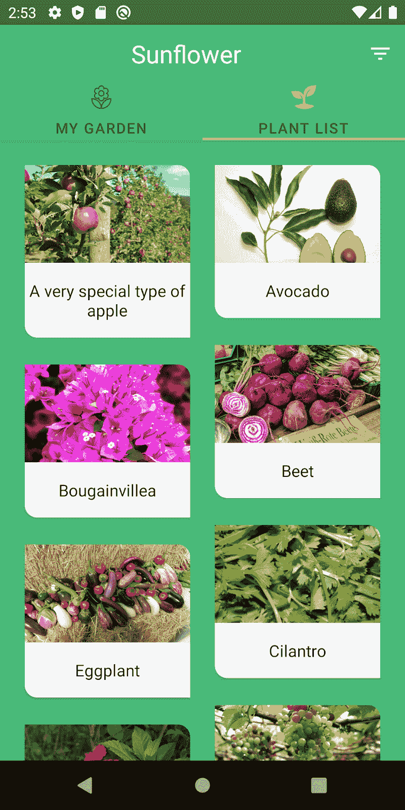

The app doesn’t seem to handle long text well.

每种植物都有不同的浇水时间间隔，我想看看浇水时间过了会发生什么。为此，我需要在我的花园里添加一些植物；但是首先，我在数据库检查器中选择了**实时更新**复选框。选中**实时更新**时，数据库检查器会自动显示您的应用程序对其数据库所做的任何更改。

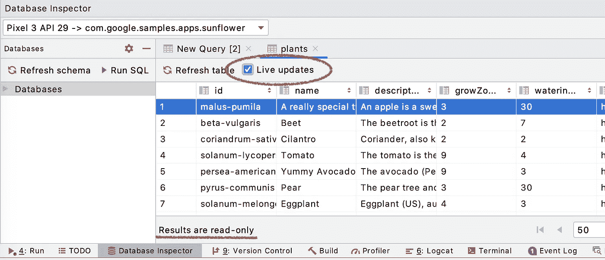

Select Live Updates.

我回到**我的花园**标签，添加一些植物，比如*鳄梨*和*茄子；首先，我回到数据库检查器，双击 *garden_plantings* 来观察这个表。请注意，当我添加新植物时，garden_plantings 表中的数据是如何自动更新的。*

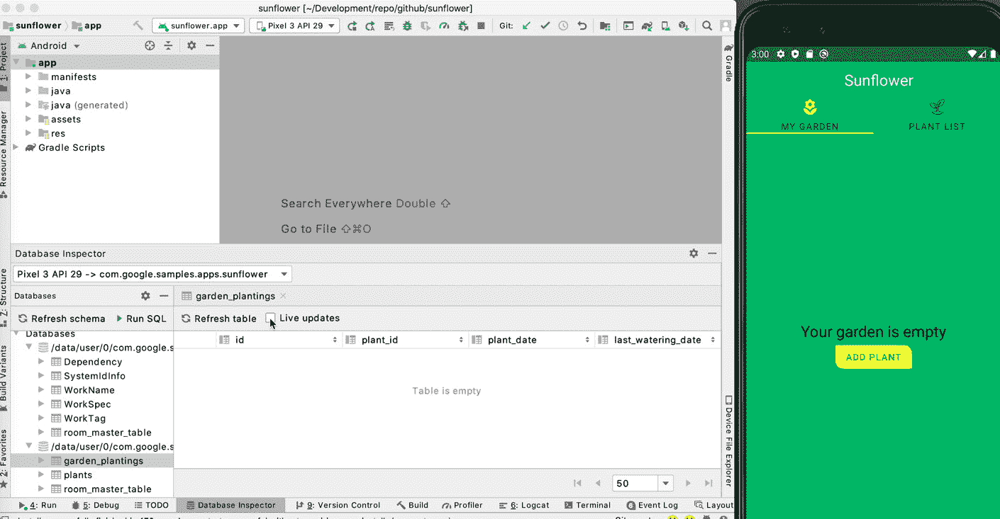

Database Inspector can automatically display changes.

这两种植物每隔 3 天浇水一次。我真的不想等 3 天看看会发生什么，所以我会编辑数据库并更改 *last_watering_day* 。我再次回到数据库检查器，双击 *garden_plantings* 。*最后浇水日期*是表格的最后一列。我将把两个记录的值都改为较小的值，以反映今天之前的某个时间。

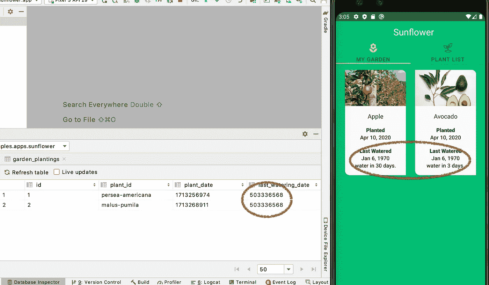

Edits to your databases are visible instantly!

好的，看起来我回到过去有点太远了，但是这对于我的测试来说应该仍然有效。应用程序用户界面显示到期日期似乎很好。对于未来的发展，也许我们可以建议添加一个警告时，浇水一天过去了用户。

继续前进，给新的数据库检查员一个尝试！让我们知道你的想法；如果你遇到任何问题，请不要忘记[归档 bug](https://issuetracker.google.com/issues/new?component=192708&template=840533&title=%23database-inspector)！