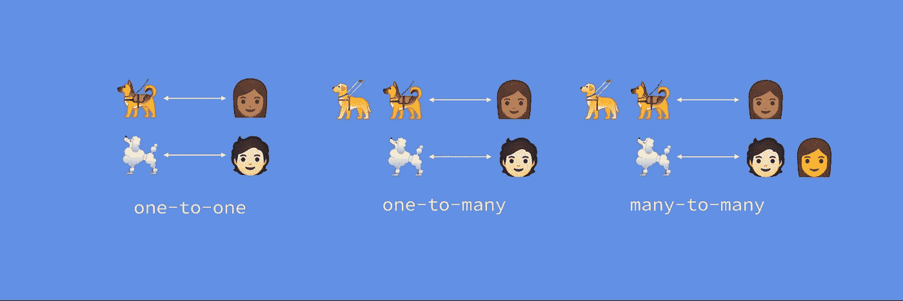

# 数据库与房间的关系

> 原文：<https://medium.com/androiddevelopers/database-relations-with-room-544ab95e4542?source=collection_archive---------0----------------------->



Database relations: one-to-one, one-to-many, many-to-many

设计关系数据库的一个重要部分是将数据拆分到相关的表中，并以有意义的方式将数据放在一起。从 [Room 2.2](https://developer.android.com/jetpack/androidx/releases/room#version_220_3) (现在稳定)开始，我们支持表之间所有可能的关系:一对一、一对多和多对多，只有一个注释:`[@Relation](https://developer.android.com/reference/android/arch/persistence/room/Relation)`。


One-to-one relations

# 一对一的关系

假设我们生活在一个(可悲的)世界里，一个人只能拥有一只狗，一只狗只能有一个主人。这是一对一的关系。为了在关系数据库中建模，我们创建了两个表:`Dog`和`Owner`，其中`Dog`表引用了主人 id，或者`Owner`表引用了狗 id。在房间中，我们创建两个实体:

```
@Entity
data class Dog(
    @PrimaryKey val dogId: Long,
    val dogOwnerId: Long,
    val name: String,
    val cuteness: Int,
    val barkVolume: Int,
    val breed: String
)@Entity
data class Owner(@PrimaryKey val ownerId: Long, val name: String)
```

假设我们想在屏幕上显示所有狗及其主人的列表。为此，我们将创建一个`DogAndOwner`数据类:

```
data class DogAndOwner(
    val owner: Owner,
    val dog: Dog
)
```

要使用 SQLite 进行查询，我们需要 1)运行两个查询:一个获取所有主人，另一个基于主人 id 获取所有狗，然后 2)处理对象映射。

```
SELECT * FROM OwnerSELECT * FROM Dog
    WHERE dogOwnerId IN (ownerId1, ownerId2, …)
```

为了获得一个`List<DogAndOwner>`使用空间，我们不需要自己实现两个查询并处理对象映射，而是使用`@Relation`注释。

在我们的示例中，由于`Dog`有所有者的信息，我们将`@Relation`注释添加到 dog 变量中，指定父变量(即`Owner`实体)上的`ownerId`列对应于`dogOwnerId`:

```
data class DogAndOwner(
    @Embedded val owner: Owner,
    @Relation(
         parentColumn = "ownerId",
         entityColumn = "dogOwnerId"
    )
    val dog: Dog
)
```

我们的[刀](https://developer.android.com/reference/android/arch/persistence/room/Dao)现在简化为:

```
@Transaction
@Query("SELECT * FROM Owner")
fun getDogsAndOwners(): List<DogAndOwner>
```

注意:因为 Room 在幕后为我们运行这两个查询，所以添加了`[@Transaction](https://developer.android.com/reference/android/arch/persistence/room/Transaction)`注释，以确保这是自动发生的。


One-to-many relations

# 一对多关系

假设一个主人可以养多只狗(耶！);我们在`Dog`和`Owner`之间有一个一对多的关系。我们之前定义的数据库模式没有改变——我们仍然有相同的表，因为相关的键已经在关系的“多”表中。

现在，为了显示主人及其狗的列表，我们需要创建一个新的数据类来对此进行建模:

```
data class OwnerWithDogs(
    val owner: Owner,
    val dogs: List<Dog>
)
```

为了避免运行两个独立的查询，我们可以在`Dog`和`Owner`之间定义一个一对多的关系，方法是像前面一样用`@Relation`来注释`List<Dog>`:

```
data class OwnerWithDogs(
     @Embedded val owner: Owner,
     @Relation(
          parentColumn = "ownerId",
          entityColumn = "dogOwnerId"
     )
     val dogs: **List**<Dog>
)
```

道就变成了:

```
@Transaction
@Query("SELECT * FROM Owner")
fun getDogsAndOwners(): List<OwnerWithDogs>
```


Many-to-many relations

# 多对多关系

现在假设我们生活在一个完美的世界里，一个主人可以有多只狗，一只狗可以有多个主人。为了对这个模式建模，我们的`Dog`和`Owner`表是不够的。因为一只狗可以有多个主人，所以我们需要相同狗 id 的多个条目，匹配不同的主人 id。因为`dogId`是`Dog`中的主键，所以我们不能插入多个 id 相同的狗。为了克服这一点，我们需要创建一个[关联](https://en.wikipedia.org/wiki/Associative_entity)表(也称为交叉引用表),用于保存`(dogId,ownerId)`对:

```
@Entity(primaryKeys = ["dogId", "ownerId"])
data class DogOwnerCrossRef(
    val dogId: Long,
    val ownerId: Long
)
```

如果我们现在想要获得所有拥有狗的主人的列表:`List<OwnerWithDogs>`，仅使用 SQLite 查询，我们需要编写两个查询:一个获取所有主人，另一个连接`Dog`和`DogOwnerCrossRef`表:

```
SELECT * FROM OwnerSELECT
     Dog.dogId AS dogId,
     Dog.dogOwnerId AS dogOwnerId,
     Dog.name AS name,
     _junction.ownerId
FROM
     DogOwnerCrossRef AS _junction
INNER JOIN Dog ON (_junction.dogId = Dog.dogId)
WHERE _junction.ownerId IN (ownerId1, ownerId2, …)
```

为了在 Room 中实现这一点，我们需要更新我们的`OwnerWithDogs`数据类，并告诉 Room 为了获得`Dogs`，它需要使用`DogOwnerCrossRef`关联表。我们通过使用`[Junction](https://developer.android.com/reference/androidx/room/Junction)`来引用该表:

```
data class OwnerWithDogs(
    @Embedded val owner: Owner,
    @Relation(
         parentColumn = "ownerId",
         entityColumn = "dogId",
         **associateBy = Junction(DogOwnerCrossRef::class)** )
    val dogs: List<Dog>
)
```

在我们的 Dao 中，我们需要从所有者中选择并返回正确的数据类:

```
@Transaction
@Query("SELECT * FROM Owner")
fun getOwnersWithDogs(): List<OwnerWithDogs>
```

# 高级关系用例

当使用`@Relation`注释时，默认情况下，Room 从注释属性的类型中推断出要使用的实体。例如，到目前为止，我们用`@Relation`注释了一个`Dog`(或者一个`List<Dog>`)，告诉 Room 如何对类建模以及要查询哪些列

如果我们想要返回一个不同的对象，例如一个`Pup`，它不是一个实体，但是包含一些字段，我们可以在`@Relation`注释中指定要使用的实体:

```
data class Pup(
     val name: String,
     val cuteness: Int = 11
)data class OwnerWithPups(
     @Embedded val owner: Owner,
     @Relation(
          parentColumn = "ownerId",
          entity = Dog::class,
          entityColumn = "dogOwnerId"
     )
     val dogs: List<Pup>
)
```

如果我们只想从一个实体返回特定的列，你需要通过在`@Relation`的 projection 属性中定义它们来告诉 Room 这些是什么。例如，假设我们只想获得我们的`OwnerWithDogs`数据类中所有狗的名字。由于我们需要一个`List<String>`，Room 无法推导出那些字符串是对应于名字还是对应于品种，所以我们需要在投影中指定列:

```
data class OwnerWithDogs(
     @Embedded val owner: Owner,
     @Relation(
           parentColumn = "ownerId",
           entity = Dog::class,
           entityColumn = "dogOwnerId",
           projection = ["name"]
     )
     val dogNames: List<String>
)
```

如果您想在`dogOwnerId`和`ownerId`之间定义一个更严格的关系，不管您正在创建哪种关系，在字段之间使用一个`[ForeignKey](https://developer.android.com/reference/android/arch/persistence/room/ForeignKey)`约束。请记住， [SQLite 外键](https://sqlite.org/foreignkeys.html)定义了索引，并且可以拥有级联触发器来更新或删除表中的条目。因此，根据您是否想在数据库中使用这种功能来决定是否要使用外键。

无论您需要一对一、一对多还是多对多的支持，Room 都为您(和您的狗狗)提供了一个注解:`[@Relation](https://developer.android.com/reference/android/arch/persistence/room/Relation)`。从我们的 Android Dev Summit’19 演讲中了解更多关于 [Room 2.2 特性的信息](https://developer.android.com/jetpack/androidx/releases/room#version_220_3):