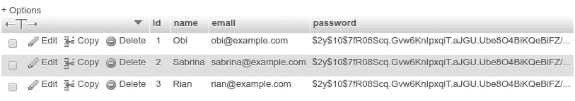
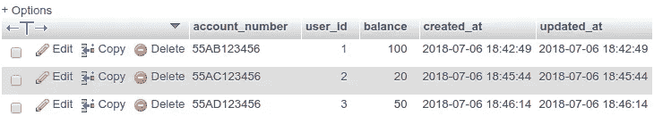
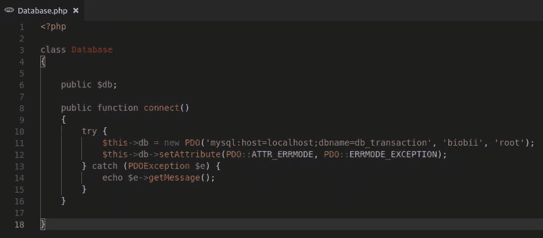
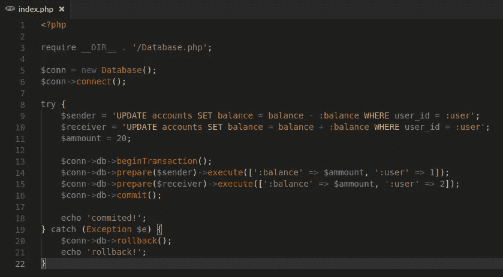
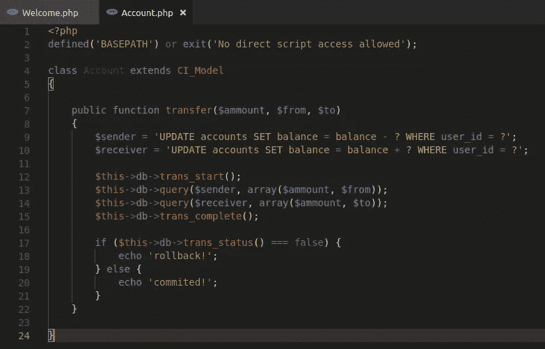
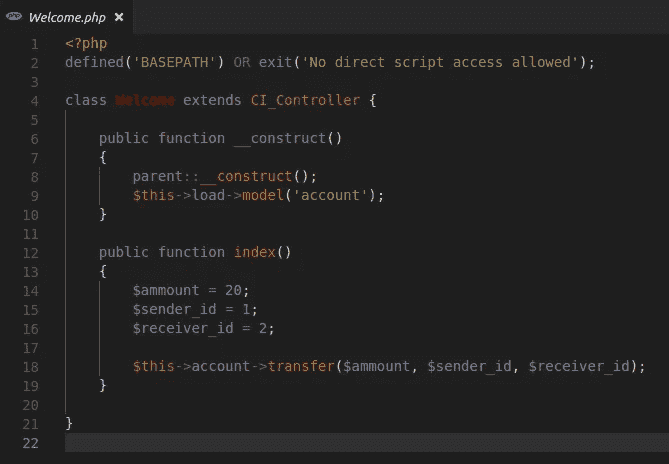
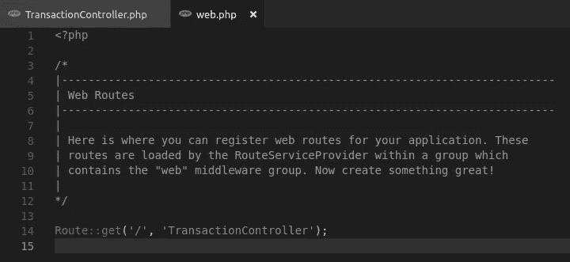
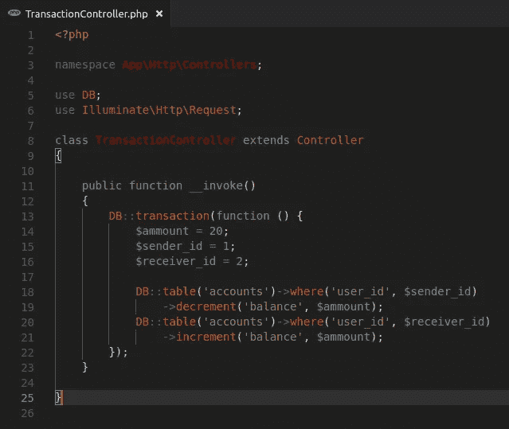

# Database Transaction dengan PDO, Codeigniter dan Laravel

> 原文：<https://medium.easyread.co/database-transaction-dengan-pdo-codeigniter-dan-laravel-d368c15d9b1a?source=collection_archive---------2----------------------->

Secara sederhana *database transaction* sebenarnya tidak jauh berbeda dengan yang terjadi di dunia nyata. Bayangkan teman-teman mempunyai suatu akun bank dan akan melakukan transfer sejumlah uang kepada seorang teman. Akan terjadi proses transaksi yang melalui beberapa tahap perubahan data. Melalui tulisan ini saya tertarik untuk belajar mengimplementasikan kasus sederhana ini dalam bahasa pemrograman PHP dan beberapa frameworknya.

Sebagai contoh, asumsikan saya mempunyai uang sebanyak $100 yang saya simpan dalam akun bank. Saya akan melakukan transfer kepada teman saya, Sabrina, sebesar $20 untuk membayar hutang. Logikanya, saldo saya yang semula $100 akan dipotong $20 dan saldo Sabrina akan bertambah sebesar $20\. Lalu apa yang terjadi bila ditengah-tengah proses transaksi terjadi masalah? Misalnya *request* terputus saat proses perubahan data hanya sampai pada pemotongan saldo saya? Saldo saya akan berkurang $20 sedangkan saldo Sabrina tidak bertambah $20\. Kemana yang $20? Tentu saja hal seperti ini yang ingin dihindari. *Database transaction* bisa diterapkan untuk kasus seperti ini, karena apabila pemrosesan data atau *query* belum selesai dapat dilakukan *rollback* untuk mengembalikan data seperti sebelumnya.

Saya telah membuat *database* sederhana untuk bahan latihan. Terdiri dari tabel *users* dan *accounts* dengan relasi satu *user* hanya mempunyai satu akun bank. Saya sengaja tidak membuat tabel *log* transaksi supaya lebih ringkas dan sederhana.

tabel users

tabel accounts

# PDO

Saya telah menyiapkan satu *class* khusus dengan nama *Database* untuk menangani koneksi. Berikutnya pada *file* index.php saya memiliki dua *query* yang saya simpan dalam variabel *$sender* dan *$receiver* . Cukup masuk akal karena nantinya *query $sender* digunakan untuk mengurangi saldo si pengirim, sebaliknya *$receiver* menambah jumlah saldo si penerima sesuai dengan nominal yang ditentukan. Pada kode yang saya tulis, seluruh eksekusi *query* ditempatkan pada blok *try-catch* untuk menangani kesalahan. Eksekusi *query* pun sama seperti menggunakan *PDO* biasa, hanya perlu memanggil fungsi *beginTransaction()* sebelum operasi *query* dimulai, dan fungsi *commit()* setelah semua *query* selesai dieksekusi. Untuk melakukan *rollback* , panggil fungsi *rollback()* pada blok *catch* . Untuk mengujinya, teman-teman bisa coba modifikasi *query* kedua sehingga terjadi kesalahan dan fungsi *rollback* akan dijalankan.

# Codeigniter

Codeigniter telah menyediakan fitur *database transaction* yang dapat langsung digunakan. Dalam kode yang saya tulis, saya hanya perlu memanggil fungsi *trans_start()* sebelum eksekusi *query* dimulai dan fungsi *trans_complete()* setelah semua *query* selesai dieksekusi. Teman-teman bisa memanfaatkan fungsi *trans_status()* untuk mengetahui status *transaction* apakah berhasil atau tidak. Untuk mengujinya saya telah menyambungkan model tersebut dengan *default controller* yang sudah datang saat pertama kali instal.

# Laravel

Sama seperti Codeigniter, framework sebesar Laravel pastinya sudah menyediakan fitur *database transaction* . Teman-teman dapat langsung menggunakan *DB facade* untuk fitur ini. Dalam kasus ini saya membuat satu *controller* baru dan menghubungkannya pada file *routing* terlebih dahulu. Oiya, bila dalam satu *file controller* hanya ada satu *method* , teman-teman dapat menggunakan *method __invoke()* dan memanggil nama *controller* tanpa perlu menulis nama *method* secara spesifik pada *file routing* . Untuk implementasi pada Laravel, teman-teman perlu memanggil fungsi *DB::transaction()* dan melakukan eksekusi *query* di dalam *callback* parameter fungsi tersebut.

Kurang lebih demikian implementasi *database transaction* dengan contoh kasus yang sederhana. *Database* yang saya gunakan untuk contoh di atas adalah MySQL dengan *table engine InnoDB* . Bila ada masukan atau koreksi tentu akan sangat membantu. Semoga kita belajar sesuatu yang baru hari ini.

## Referensi:

*https://* [*stackoverflow*](https://stackoverflow.com/questions/974596/what-is-a-database-transaction) *.com/questions/974596/what-is-a-database-transaction*

[*https://stackoverflow.com/questions/2708237/php-mysql-transactions-examples*](https://stackoverflow.com/questions/2708237/php-mysql-transactions-examples)

[https://www.codeigniter.com/user_guide/database/transactions.html](https://www.codeigniter.com/user_guide/database/transactions.html)

[*https://laravel.com/docs/5.6/database#database-transactions*](https://laravel.com/docs/5.6/database#database-transactions)