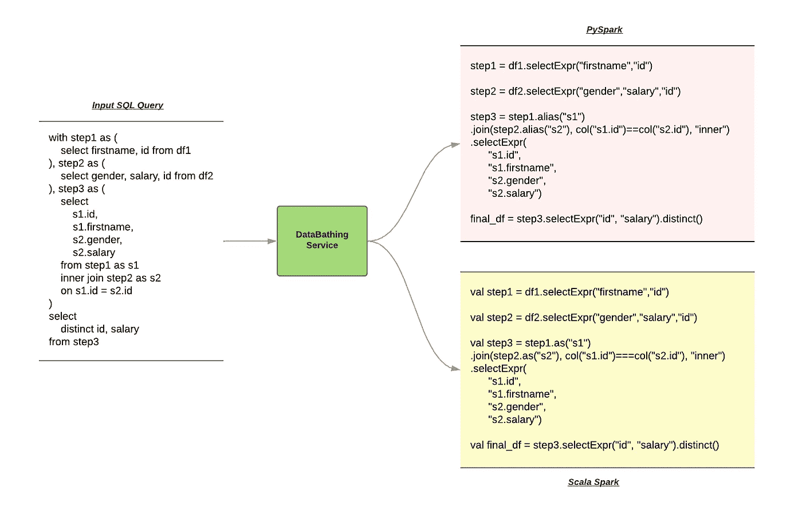
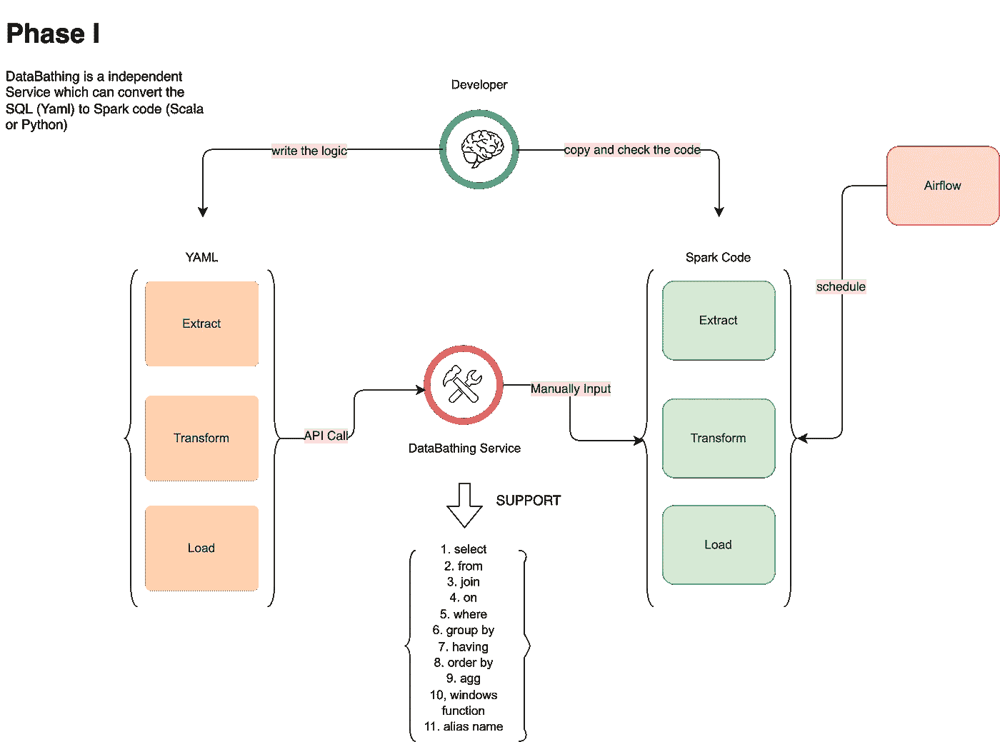
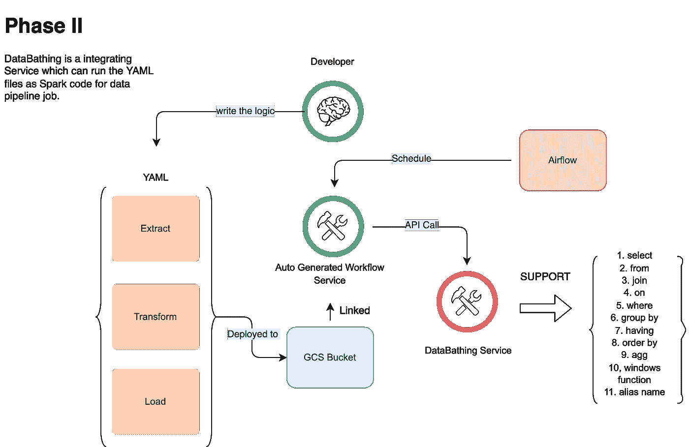

# 数据打包——一个将查询转移到 Spark 代码的框架

> 原文：<https://medium.com/walmartglobaltech/databathing-a-framework-for-transferring-the-query-to-spark-code-484957a7e049?source=collection_archive---------0----------------------->

关于查询配置驱动编码的迷你指南

Photo credit: Pixabay

我们的团队已经成功地从 Hive SQL 驱动转变为代码驱动的数据工程。我们每天都在用 Spark (Scala 或者 Python)，计算性能大幅提升。(我们已经将平均运行时间减少了 10–80%。)

然而，编码会花费更多的时间，不同的开发人员会有不同版本的编码风格，这会影响 spark 作业的性能。

那么如何才能解决上述问题呢？我们能否有一些标准化的方法来将 SQL 用于复杂的管道？— *我会在下面的博客中解释为什么我们不想直接使用 Spark SQL。*

***是的，这就是为什么 DataBathing 要来了！！！***

# 议程

*   数据打包即将到来
*   Spark 数据框架与 Spark SQL
*   英雄:mo _ sql _ 解析
*   小演示
*   当前支持的功能
*   下一个路线图
*   贡献
*   谢谢
*   摘要

# **数据交换即将到来**

DataBathing 是一个可以将 SQL 转换为 Spark Dataframe 计算流程代码的库。我们可以在图 1 中找到高级示例。DataBathing 可以解析 SQL 查询，输出将是 PySpark 或 Scala Spark 代码。

Figure 1 — What DataBathing can do !!!

在图 1 中，我们将逻辑保存为数据帧，以备将来在数据谱系的每个阶段使用。我们将在下一节讨论这种设计的原因。简而言之，我们使用*“with statement”*来链接我们管道中的逻辑。

在第一阶段，我们使用数据打包来提取 SQL 的逻辑和数据血统。通常，在使用 *"with statement"* 创建逻辑之后，我们可以轻松地将数据帧计算复制并粘贴到我们的实际管道中。图 2 显示了流程。

Figure 2 — Phase I for DataBathing Usage

# Spark 数据框架与 Spark SQL

如果您以前使用过 Spark，您可能会奇怪为什么我们需要将 SQL 转换为 Spark Dataframe 计算。我会解释的。

## **技术问题**

*   直到运行时我们才知道语法错误——尤其是 Scala 部分——当使用 Spark SQL 时。这将是巨大的发展成本。然而，对于 Dataframe 计算流，我们没有这个问题，因为错误将在编译时被捕获。
*   如果我们将一个大型 SQL 查询放入 Spark SQL 运行任务中，并且该查询是低效的，那么这将是 ETL 作业*的一个问题。*另一方面，紧凑的火花数据帧计算可以提高性能并提供清晰的数据谱系。这是我们从数据打包中得到的好处之一:将复杂的逻辑分割成更小的部分。

## **下一步计划**

DataBathing 不仅是一个可以帮助开发人员将 SQL 解析成 Spark Dataframe 计算流的库；这也是我们下一代*自动生成管道框架*使用的重要基础。

> 自动生成的管道框架:简而言之，用了这个框架之后，就不需要写 spark 代码了；它可以帮助我们用框架生成基于逻辑本身的管道。(我会在以后的博客里解释。)

在数据打包的第二阶段，所有的 SQL 查询都在一个管道中被解析和连接；如果我们想利用一些中间件逻辑，框架可以帮助我们。使用 DataBathing 的*“with statement”*设计，我们可以轻松实现我们的目标。在图 3 中，我们的下一代*自动生成的管道*在内部顺序调用我们的 DataBathing 服务，以获取 Spark 数据帧计算流并组合它们。我们将在下一篇[博客](/walmartglobaltech/modularization-using-auto-generated-pipeline-with-databathing-8f78b94dad08)中详述这种用法。

Figure 3— Phase II for DataBathing Usage

# **英雄:mo _ sql _ 解析**

如何将 SQL 解析成结构化格式？用 mo_sql_parsing！

> mo_sql_parsing 是一个将 sql 解析成 JSON 的库。

请参考下面的例子和 Github 链接:

> > > > parse("select a as hello，b as world from jobs ")
> { ' select ':[{ ' value ':' a '，' name': 'hello'}，{'value': 'b '，' name': 'world'}]，' from': 'jobs'}

 [## GitHub-klahnakoski/mo-sql-parsing:让我们制作一个 SQL 解析器，这样我们就可以提供一个熟悉的接口…

### 将 SQL 解析为 JSON，这样我们就可以将其转换为其他数据存储！查看更改 SQL 是一种熟悉的语言，用于访问…

github.com](https://github.com/klahnakoski/mo-sql-parsing) 

# **小演示**

您还可以从给定的 SQL 查询中生成 PySpark 代码。请安装 PyPI 的[数据打包](https://pypi.org/project/databathing/)包。

> `*pip install databathing*`
> 
> `>>> from databathing import Pipeline
> >>> pipeline = Pipeline("SELECT * FROM Test WHERE info = 1")
> 'final_df = Test\\\n.filter("info = 1")\\\n.selectExpr("a","b","c")\n\n'`

# 当前支持的功能

特性和功能— PySpark 版本

*   `SELECT`特写
*   `FROM`功能
*   `INNER` `JOIN`和`LEFT` `JOIN`功能
*   `ON`特色
*   `WHERE`特性
*   `GROUP BY`功能
*   `HAVING`功能
*   `ORDER BY`功能
*   `AGG`功能
*   WINDOWS 功能特性(`SUM`、`AVG`、`MAX`、`MIN`、`MEAN`、`COUNT`、`COLLECT_LIST`、`COLLECT_SET`)
*   别名功能
*   `WITH`报表功能
*   `SPLIT`特性

# 下一个路线图

在下一个路线图中，我将重点关注:

*   更多测试案例
*   PySpark 中 12 个特性的 Scala 版本
*   更多加入功能，如`OUTER, FULL, FULLOUTER, LEFTSEMI, LEFTANTI`

# 贡献

如果您需要来自数据打包的更多特性，您可以提出一个问题并显示错误，或者您可以创建一个带有新特性和测试的 PR。如果你也提交了一个补丁，那么我会感谢你的。

请按照以下说明在提交 PR 时更新版本，因为我们将 cicleci 用于 CICD 流程:

 [## 发布 Python 包

### 对于许多软件工程师和开发人员来说，使用标准库或内置对象是不够的。为了拯救…

circleci.com](https://circleci.com/blog/publishing-a-python-package/) 

您可以在 GitHub 主页上找到 DataBathing:

 [## GitHub-Jason-JZ-Zhu/data bathing

### 将 SQL 解析为 JSON，这样我们就可以将其转换为其他数据存储！查看从 sql 转换到 spark 后的变化，数据…

github.com](https://github.com/jason-jz-zhu/databathing) 

# 谢谢

当我开始设计和实现数据打包时，我发现这篇文章很有帮助。我要感谢作者，尽管我不知道他们是谁。

 [## 在线 SQL 到 PySpark 转换器

### 最近很多人向我寻求帮助，问我是否可以帮助他们学习 PySpark，我想到了…

sqlandhadoop.com](https://sqlandhadoop.com/online-sql-to-pyspark-converter/) 

# 摘要

*   我们可以通过使用 SQL 风格*“with statement”*和简洁明了的代码*，使用数据打包来减少我们的开发时间。*
*   在此期间，我们可以使用它来欣赏 Spark 的性能计算。
*   最重要的是，当与*自动生成的管道框架*结合时，将会有巨大的不同。
*   **下期见** [***自动生成管道框架*博客**](/walmartglobaltech/modularization-using-auto-generated-pipeline-with-databathing-8f78b94dad08) **！**