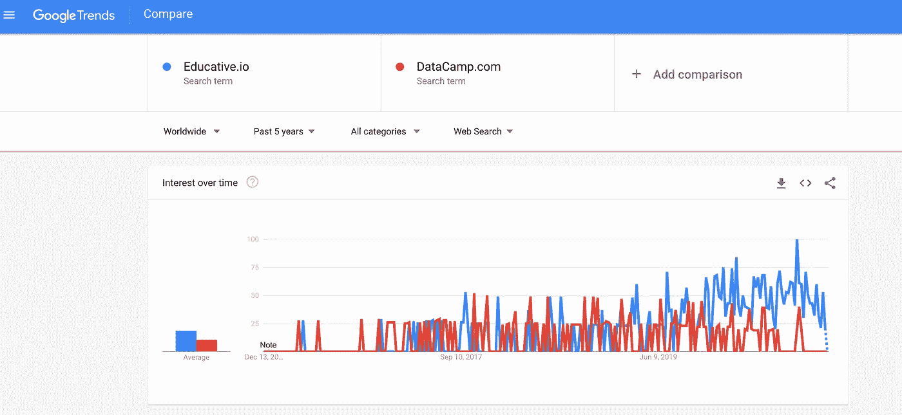

# 数据营与教育性 io

> 原文：<https://medium.com/double-pointer/datacamp-vs-educative-io-809ed819a32b?source=collection_archive---------2----------------------->

***请考虑支持我们通过*** [***注册***](https://bit.ly/3OvimpR) ***一个付费媒介账户。***

显然，Educative 比 [DataCamp](https://bit.ly/3c9zrm5) 更受欢迎，正如下面的截图所示。虽然数据营已经筹集了比教育更多的资金，但它只迎合数据科学领域。另一方面，Educative.io 采取了一种大胆的方法，在其平台上提供涵盖整个技术领域的课程。本质上，两者都是在线课程的市场，一些由独立作者编写，而另一些由平台的内容团队编写。

Educative.io shown in blue vs DataCamp.com in red

[Educative.io](https://bit.ly/3oGEdNL) 提供多样化的课程，但缺乏 [DataCamp](https://bit.ly/3c9zrm5) 提供的数据科学内容和材料的专注度和深度。如果你想在数据科学领域工作，那么 [DataCamp](https://bit.ly/3c9zrm5) 绝对适合你。然而，如果你正在寻找广泛接触新兴技术或去参考指南，那么教育性是你的茶。目前，Educative 提供以下 AI/ML/DataScience 课程:

[***Grokking Modern System Design for Software Engineers and Managers***](https://bit.ly/3bD3IOS)

*   [**数据科学面试手册**](https://bit.ly/3oGEdNL)
*   [**大数据和 Hadoop 简介**](https://www.educative.io/courses/introduction-to-big-data-and-hadoop?affiliate_id=5457430901161984)
*   [**钻研数据科学**](https://bit.ly/2SGYEMG)
*   [**面向非程序员的数据科学**](https://www.educative.io/courses/data-science-for-non-programmers?affiliate_id=5457430901161984)
*   [**用 Bash Shell 学习数据科学**](https://www.educative.io/courses/learn-data-science-with-bash-shell?affiliate_id=5457430901161984)
*   [**生产中的数据科学:构建可扩展的模型管道**](https://www.educative.io/courses/data-science-in-production-building-scalable-model-pipelines?affiliate_id=5457430901161984)
*   [**Python 数据分析与可视化**](https://www.educative.io/courses/python-data-analysis-and-visualization?affiliate_id=5457430901161984)
*   [**面向软件工程师的机器学习**](https://bit.ly/2xH4mXO)
*   [**应用机器学习:TensorFlow 的行业案例研究**](https://www.educative.io/courses/industry-case-study-tensorflow?affiliate_id=5457430901161984)

相比之下，DataCamp 的平台上有超过 340 门课程，全部属于数据科学领域。然而，DataCamp 的一个明显的遗漏是没有任何与采访相关的内容，Educative.io 在其 [**数据科学采访手册**](https://bit.ly/3oGEdNL) 课程中很好地涵盖了这一点。总而言之，当比较[教育](https://bit.ly/3oGEdNL)和[数据营](https://bit.ly/3c9zrm5)的时候，感觉就像比较苹果和橘子，因为两个平台的目标不同。然而，如果 Educative 赶上并提供与 DataCamp 同等的数据科学课程，它可以与 DataCamp 竞争。

[**Grokking the Coding Interview: Patterns for Coding Questions**](https://bit.ly/3agTSNt)