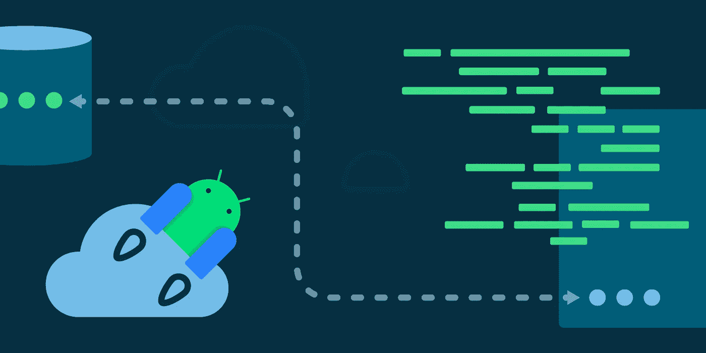

# 数据存储和数据迁移

> 原文：<https://medium.com/androiddevelopers/datastore-and-data-migration-fdca806eb1aa?source=collection_archive---------6----------------------->

在我们的 [**Jetpack 数据存储系列**](/androiddevelopers/introduction-to-jetpack-datastore-3dc8d74139e7) 的这篇文章中，我们将介绍如何进行**数据存储到数据存储的迁移**。希望这将为您提供将数据存储成功添加到应用程序所需的所有信息。我们将参考[**偏好** **codelab**](https://developer.android.com/codelabs/android-preferences-datastore#0) 贯穿本文，获取代码示例。

# 数据迁移

我们之前讨论过使用`[SharedPreferencesMigration](https://developer.android.com/reference/kotlin/androidx/datastore/migrations/SharedPreferencesMigration)`从`SharedPreferences`迁移到数据存储。然而，在某些时候，您可能还需要进行**数据存储到数据存储的迁移**，例如，当您对数据集进行一些**重大更改时(比如重命名您的数据模型值或更改它们的类型)。**

这个过程和`SharedPreferences`的移民非常相似。事实上，`SharedPreferencesMigration`只是 `[**DataMigration**](https://cs.android.com/androidx/platform/frameworks/support/+/androidx-main:datastore/datastore-core/src/main/java/androidx/datastore/core/DataMigration.kt?q=DataMigration)` **接口**的一个**实现:**

为了理解如何使用`DataMigration`，我们来分解一下:

*   `DataMigration<T>` —我们的数据存储迁移界面。如果数据存储在将新迁移的数据写入磁盘时遇到问题，或者如果任何迁移抛出`Exception`，则可能会多次调用此迁移的方法(`shouldMigrate`、`migrate`和`cleanUp` ) **。**
*   `shouldMigrate()` —指定是否需要执行此迁移。如果返回 false，则不会进行迁移或清理。这将在每次数据存储初始化时调用**。**
*   `migrate()` —执行迁移。如果失败，数据存储将不会向磁盘提交任何数据，`cleanUp()`将不会被调用，并且**异常将被传播回**触发迁移的数据存储调用。未来对数据存储的调用将导致再次尝试迁移。注意，这将总是在调用`cleanUp()`之前被调用。
*   `cleanUp()`—您可以在这里添加您的实现，用于**从先前的存储**中清除任何迁移到新数据存储中的旧数据。如果迁移失败，将不会调用此函数。如果`cleanUp()`抛出异常，该异常将被传播回触发迁移的数据存储调用，未来对数据存储的调用将导致再次尝试迁移。

# 首选项数据存储迁移

为了创建一个满足我们迁移需求的实现，让我们想象一个场景，我们想要从 `**oldPreferencesDataStore**` **迁移到** `**newPreferencesDataStore**`。我们希望:

1.  将一个特定的旧`Float`键值对重新映射并重命名为一个新的`Int`键值对
2.  照原样将所有其他键-值对从旧的迁移到新的
3.  清理旧仓库

为了简单起见，我们将在我们的[首选项](https://developer.android.com/codelabs/android-preferences-datastore#0)代码实验室的`TasksActivity`中使用首选项数据存储委托来完成所有这些，但是您可以按照关于句柄注入 的 [**指令来将它移动到一个注入模块中。**](/androiddevelopers/datastore-and-dependency-injection-ea32b95704e3)

我们实现了`DataMigration`,并以如下方式覆盖了它的函数:

`produceMigrations`将确保`migrate()`在对新数据存储的任何潜在数据访问之前**运行。这意味着您的**迁移必须在数据存储发出任何进一步的值之前和开始对数据进行任何新的更改之前已经成功**。**

当`produceMigrations`参数接受一个`DataMigration`列表时，你可以从**转移你想要的**的旧存储器。这就是安全迁移您的数据所需的一切！您可以很容易地按照相同的模式将 **Proto 迁移到 Proto DataStore**——唯一的区别是如何转换数据。

# 待续

我们已经介绍了从不同的数据存储库执行数据迁移——`DataMigration`接口如何工作，如何覆盖其功能以将旧数据转换为新数据，迁移数据，然后进行相应的清理。

加入我们系列的下一篇也是最后一篇文章，我们将探讨如何测试数据存储库。

您可以在这里找到我们的 Jetpack DataStore 系列的所有帖子:
[Jetpack DataStore 简介](/androiddevelopers/introduction-to-jetpack-datastore-3dc8d74139e7)
[所有关于首选项 DataStore](/androiddevelopers/all-about-preferences-datastore-cc7995679334)
[所有关于 Proto DataStore](/androiddevelopers/all-about-proto-datastore-1b1af6cd2879)
[DataStore 和依赖注入](/androiddevelopers/datastore-and-dependency-injection-ea32b95704e3)
[DataStore 和 Kotlin 序列化](/androiddevelopers/datastore-and-kotlin-serialization-8b25bf0be66c)
[DataStore 和同步工作](/androiddevelopers/datastore-and-synchronous-work-576f3869ec4c)
[DataStore 和数据迁移](/androiddevelopers/datastore-and-data-migration-fdca806eb1aa)
[DataStore 和测试](/androiddevelopers/datastore-and-testing-edf7ae8df3d8)