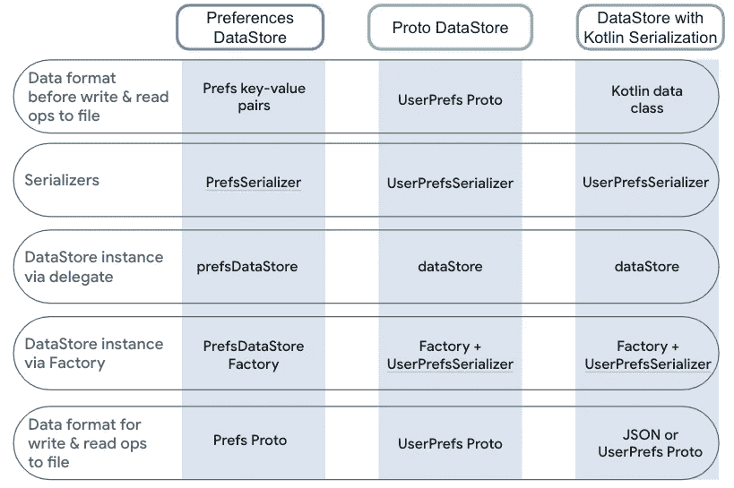

# 数据存储和 Kotlin 序列化

> 原文：<https://medium.com/androiddevelopers/datastore-and-kotlin-serialization-8b25bf0be66c?source=collection_archive---------4----------------------->

在我们的 [**Jetpack DataStore 系列**](/androiddevelopers/introduction-to-jetpack-datastore-3dc8d74139e7) 的以下帖子中，我们将涵盖几个额外的概念，以了解 DataStore 如何与其他 API 交互，以便您可以在**生产环境**中使用它。在本帖中，我们将重点关注 [**科特林连载**](https://kotlinlang.org/docs/serialization.html) 。在这篇文章中，我们将参考 [**首选项**](https://developer.android.com/codelabs/android-preferences-datastore#0) 和 [**原型**](https://developer.android.com/codelabs/android-proto-datastore#0)codelab，获取代码示例。

# 具有 Kotlin 序列化的数据存储

在我们之前的帖子中，我们已经介绍了 [**Preferences**](https://developer.android.com/topic/libraries/architecture/datastore#datastore-preferences) 和[**Proto**](https://developer.android.com/topic/libraries/architecture/datastore#datastore-typed)DataStore 方法如何构造和序列化持久化的数据:Proto 使用由 [**协议缓冲区**](https://developers.google.com/protocol-buffers)**支持的**类型化对象，而 Preferences 使用**键值对**作为我们的数据表示，类似于`SharedPreferences`。在幕后，**两种实现都使用协议缓冲区将数据保存在磁盘上的一个文件中。**但是，DataStore 也允许你定制这个，使用数据类和 [**Kotlin 序列化**](https://kotlinlang.org/docs/serialization.html) ，给你 Proto DataStore 的**类型安全优势**，但是不必使用 protobufs。让我们来看看对于这些方法中的每一种，默认情况下序列化是如何工作的:****

****

**Serialization options with DataStore**

**Preferences DataStore 通过在其底层 Proto 实现之上添加一个附加层**来简化 protobufs 的工作。这样，您可以从使用数据存储库**中获得**的很多好处，但是使用类似于`SharedPreferences`的方式来组织数据，使用**键值对**。****

**如果我们看看 Preferences API 的`[PreferencesSerializer](https://cs.android.com/androidx/platform/frameworks/support/+/androidx-main:datastore/datastore-preferences-core/src/main/java/androidx/datastore/preferences/core/PreferencesSerializer.kt;l=36?q=PreferencesSerializer&sq=)`和我们的自定义原型`UserPreferencesSerializer`，你会注意到它们几乎做了同样的事情。`PreferencesSerializer`只是增加了一个将**键值对转换成 proto buf**的步骤，反之亦然:**

## **使用 Kotlin 序列化实现数据存储**

**如果你想使用 [**Kotlin 序列化**](https://kotlinlang.org/docs/serialization.html) 来组织你的数据，你需要做的就是定义一个**完全不可变的数据类**并实现一个数据存储`Serializer`。**

**数据存储依赖于为数据类自动生成的`equals`和`hashCode`。数据类还生成`toString`和`copy`函数，这些函数对于调试和更新数据很有用:**

**🚨确保你的类是不可变的非常重要，因为数据存储与可变类型不兼容。由于数据不一致和竞争条件，对数据存储使用可变类型将导致**错误。默认情况下，数据类**不一定是不可变的**，所以要确保在任何地方都使用 val，而不是 vars:****

****数组是可变的**，所以你不应该暴露它们。即使我们使用只读的`List`作为数据类的成员，它仍然是可变的。相反，你应该考虑使用**不可变/持久集合**:**

**使用可变类型作为数据类的成员使其可变。相反，你应该确保所有的成员都是不可变的类型。**

**Kotlin 序列化支持[**多种格式**](https://kotlinlang.org/docs/serialization.html#formats) ，包括 JSON 和[协议缓冲区](https://developers.google.com/protocol-buffers)。在这个例子中，我们将继续使用 JSON。**

**为了使用 Kotlin 序列化在 JSON 中读写数据类，需要用`@Serializable`注释数据类，并覆盖`Serializer’s` `writeTo()`和`readFrom()`。这里有一个关于`UserPreferences`的例子:**

**⚠️ **Parcelables 与 DataStore 一起使用是不安全的**，因为不同 Android 版本之间的数据格式可能会有所不同。**

**在构建数据存储时，将新创建的`UserPreferencesSerializer`传递到数据存储中:**

**读取数据看起来与使用 protobufs 相同:**

**您可以使用生成的`.copy()`函数来更新数据:**

**使用带有 Kotlin 序列化和数据类**的 DataStore 可以减少样板文件并帮助简化您的代码**，但是，您必须小心不要通过可变性引入**错误。您需要做的就是定义您的数据类并实现序列化程序。****

# **待续**

**我们已经介绍了 [**Kotlin 序列化**](https://kotlinlang.org/docs/serialization.html) 以及如何使用它来**构建数据存储持久化数据的必要步骤——使用完全不可变的数据类**，用`[@Serializable](http://twitter.com/Serializable)`注释将它们写入 JSON，覆盖我们的`Serializer’s` `writeTo()`和`readFrom()`，最后将它们传递给我们的数据存储实例。**

**加入我们系列的下一篇文章，我们将研究如何与数据存储库进行**同步工作。****

**你可以在这里找到我们 Jetpack DataStore 系列的所有帖子:
[Jetpack DataStore 简介](/androiddevelopers/introduction-to-jetpack-datastore-3dc8d74139e7)
[所有关于首选项 DataStore](/androiddevelopers/all-about-preferences-datastore-cc7995679334)
[所有关于原型 DataStore](/androiddevelopers/all-about-proto-datastore-1b1af6cd2879)
[DataStore 和依赖注入](/androiddevelopers/datastore-and-dependency-injection-ea32b95704e3)
[DataStore 和 Kotlin 序列化](/androiddevelopers/datastore-and-kotlin-serialization-8b25bf0be66c)
[DataStore 和同步工作](/androiddevelopers/datastore-and-synchronous-work-576f3869ec4c)
[DataStore 和数据迁移](/androiddevelopers/datastore-and-data-migration-fdca806eb1aa)
[DataStore 和测试](/androiddevelopers/datastore-and-testing-edf7ae8df3d8)**