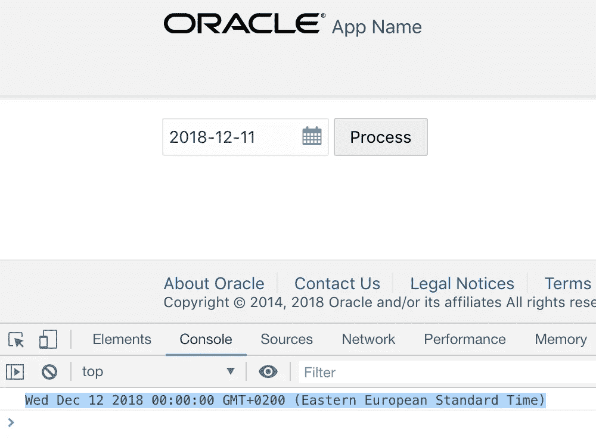
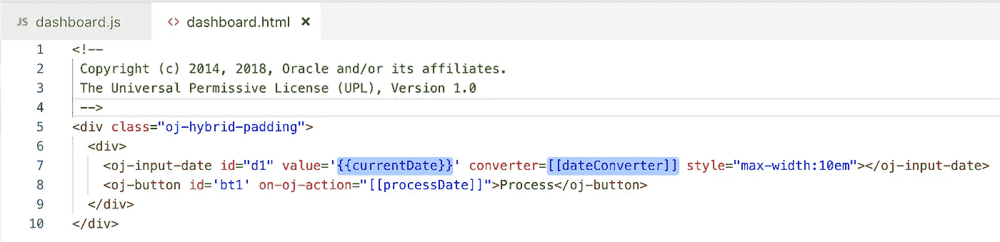
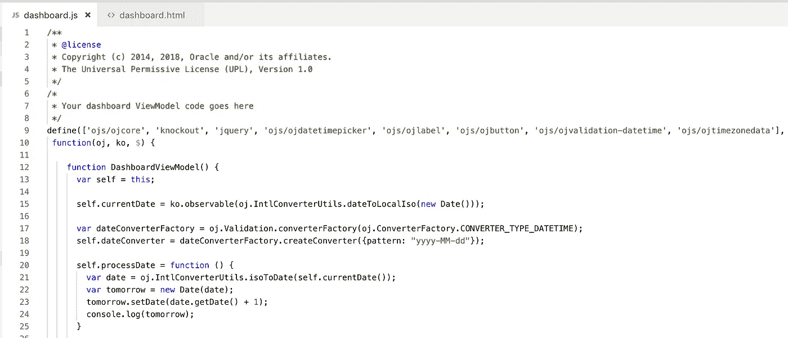

# Oracle JET 中的日期格式处理

> 原文：<https://medium.com/oracledevs/date-format-handling-in-oracle-jet-a8f76f738cf9?source=collection_archive---------0----------------------->

Oracle JET 提供了对日期转换器的开箱即用支持，请参阅 cookbook — [日期转换器](https://www.oracle.com/webfolder/technetwork/jet/jetCookbook.html?component=date&demo=converter)了解更多信息。这使得用 JavaScript 格式化日期变得非常方便。以下是应用了 yyyy-MM-dd 格式的日期选取器字段示例:

当按下 Process 按钮时，我从日期选择器中获取日期值并添加一天—结果打印在日志中。这只是为了测试 JavaScript 中简单的日期操作。

日期选择器由 JET 标记定义。通过转换器属性分配格式:

当前日期由可观察变量显示。此变量从当前日期开始初始化，转换为本地 ISO。转换器配置有模式。在计算明天日期的 JS 方法中，确保从 ISO 本地日期转换:

希望这个简单的例子能帮助您在 Oracle JET 应用程序中处理日期。源代码可以在我的 [GitHub](https://github.com/abaranovskis-redsamurai/datesjetapp) 目录中找到。

*原载于 2018 年 12 月 11 日*[*andrejusb.blogspot.com*](https://andrejusb.blogspot.com/2018/12/date-format-handling-in-oracle-jet.html)*。*