# 2021 年前 50 个 DBMS 面试问题

> 原文：<https://medium.com/edureka/dbms-interview-questions-a63e96d16fcd?source=collection_archive---------2----------------------->


没有数据不存在的地方！在当今的市场上，每天都会产生大约 2.5 万亿字节的数据。因此，对我们所有人来说，分析这些数据并得出所需的结果非常重要。但是，在此之前，我们必须使用数据库管理系统(DBMS)来处理数据库。嗯，了解 DBMS 为你成为数据库管理员打开了大门。我相信你已经意识到了这些事实，这也让你看到了这篇关于 DBMS 面试问题的文章。

在这篇关于 DBMS 面试问题的文章中，我将讨论在你的面试中被问到的与 DBMS 相关的主要问题。这些问题是在咨询了在这一领域拥有卓越技能的人之后收集的。为了让您更好地理解，我将文章分成了以下几个部分:

*   通用 DBMS 面试问题
*   SQL 面试问题
*   基于 SQL 查询的面试问题

我们开始吧！

# DBMS 面试问题

## 通用 DBMS 面试问题

## Q1。DBMS 和 RDBMS 之间有什么区别？

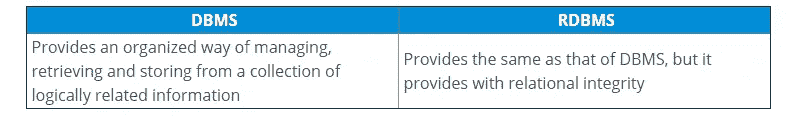

## Q2。解释术语数据库和 DBMS。此外，提及不同类型的数据库管理系统。

与数据库、应用程序和用户交互以捕获和分析所需数据的软件应用程序。存储在数据库中的数据可以根据客户的要求进行检索、删除和修改。

不同类型的数据库管理系统如下:

*   **关系型数据库管理系统(RDBMS):** 这种类型的数据库管理系统使用一种结构，允许用户访问与数据库中另一段数据相关的数据。在这种类型的 DBMS 中，数据以表的形式存储。
*   **分级 DBMS:** 顾名思义，这种类型的 DBMS 具有类似于树的结构，其中节点表示记录，树的分支表示字段。
*   **网络 DBMS:** 这种类型的 DBMS 支持多对多关系，其中可以链接多个成员记录。
*   **面向对象的数据库管理系统:**使用被称为 Object 的小型独立软件来存储数据和对数据进行操作的指令。

## Q3。DBMS 的优势是什么？

DBMS 的优势如下:

*   **数据独立性:**允许改变数据的结构，而不影响任何正在运行的应用程序的结构。
*   **数据共享:**多个用户可以同时使用同一个数据库中的数据。
*   **完整性约束:**这些约束允许数据以精确的方式存储在数据库中。
*   **冗余控制:**支持通过将所有数据集成到一个数据库中来控制数据冗余的机制。
*   **提供备份和恢复功能:**提供“备份和恢复”功能，可根据需要自动创建数据备份和恢复数据。

## Q4。提及 DBMS 中存在的不同语言

DBMS 中存在的不同语言如下:

*   **数据定义语言(DDL)** —由用于定义数据库的命令组成。
*   **数据操作语言(DML)** —由用于操作数据库中数据的命令组成。
*   **数据控制语言(DCL)** —由处理用户权限和数据库系统控制的命令组成。
*   **事务控制语言(TCL)** —由处理数据库事务的命令组成。

## Q5。你所理解的查询优化是什么？

查询优化是确定具有最低估计成本的评估查询计划的阶段。当有很多算法和方法来执行相同的任务时，这个阶段就出现了。

查询优化的优势如下:

*   更快地提供输出
*   可以在更短的时间内执行更多的查询
*   降低时间和空间复杂性

## Q6。我们认为空值等同于空格或零吗？

空值与零或空格完全不同。空值表示不可用、未知、已分配或不适用的值，而零是数字，空格是字符。

## Q7。你所理解的聚合和原子性是什么？

这是 E-R 模型的一个特性，它允许一个关系集参与另一个关系集。

该属性声明数据库修改要么必须遵循所有规则，要么根本不遵循任何规则。因此，如果事务的一部分失败，那么整个事务都会失败。

## Q8。DBMS 中的不同抽象层次是什么？

DBMS 中有三个层次的数据抽象。它们是:

*   **物理层:**它是最低的抽象层，描述了数据是如何存储的。
*   **逻辑层:**这是物理层之后的下一个抽象层。这一层决定了什么数据存储在数据库中，以及数据点之间的关系是什么。
*   **视图级别:**视图级别是最高的抽象级别，它只描述了整个数据库的一部分。

## Q9。什么是实体关系模型？

这是一种数据库设计的图解方法，其中您将现实世界的对象表示为实体，并提及它们之间的关系。这种方法有助于 DBA 团队轻松理解模式。

## Q10。你对 DBMS 中的实体、实体类型、实体集这些术语的理解是什么？

*   **实体:**实体是现实世界中具有属性的对象，这些属性只不过是该特定对象的特征。例如，员工可以是一个实体。这个特定的实体可以具有诸如 empid、empname 等属性。
*   **实体类型:**实体类型就是实体的集合，具有相同的属性。通常，实体类型是指特定数据库中的一个或多个相关表。所以，你可以理解，实体类型作为唯一标识实体的特征。例如，一个雇员可以有 empid、empname、department 等属性。
*   **实体集:**实体集是数据库中特定实体类型的所有实体的集合。例如，一组雇员、一组公司和一组人可以归入实体集。

## Q11。什么是关系，并提及 DBMS 中不同类型的关系

DBMS 中的关系是两个实体相互关联的场景。在这种情况下，由外键组成的表引用另一个表的主键。

DBMS 中不同类型的关系如下:

*   **一对一关系** —当表 A 中的一行与表 b 中的一行相关时使用。
*   **一对多关系** —当表 A 中的一行与表 b 中的多行相关时使用。
*   **多对多关系** —当表 A 中的许多行可以与表 b 中的许多行相关时使用。
*   **自引用关系** —当表 A 中的记录与同一个表本身相关时使用。

## Q12。什么是并发控制？

这是一个管理数据库中同步操作的过程，这样数据库的完整性就不会受到损害。以下是并发控制中涉及的两种方法:

*   **乐观方法** —涉及版本控制
*   **悲观方法** —涉及锁定

## Q13。DBMS 中的 ACID 属性有哪些？

酸代表原子性、一致性、隔离性和持久性。它用于确保在数据库系统中可靠地处理数据事务。

*   **原子性:**原子性是指那些完全成功或失败的事务。这里，每个事务指的是数据的单个逻辑操作。因此，即使任何事务的一部分失败，整个事务也会失败，并且数据库状态保持不变。
*   一致性:一致性确保数据必须符合所有的验证规则。简而言之，您可以说您的事务在没有完成其状态之前不会离开数据库。
*   **隔离:**隔离的主要目标是并发控制。
*   **持久性:**持久性是指如果一个事务已经被提交，它将在任何情况下发生。

## Q14。什么是正常化，正常化有哪些不同的类型？

组织数据以避免数据重复和冗余的过程称为规范化。有许多连续的标准化级别，它们被称为**范式**。每个连续的范式都依赖于前一个范式。以下是前三种范式。除了这些，你有更高的范式，如 BCNF。

*   **第一范式(1NF)** —行内无重复组
*   **第二范式(2NF)** —每个非键(支持)列值都依赖于整个主键。
*   **第三范式(3NF)** —仅依赖于主键，不依赖于其他非键(支持)列值。

## Q15。数据库中有哪些不同类型的键？

数据库中主要有 7 种类型的键。我将考虑下面的表格，向您解释各种密钥。

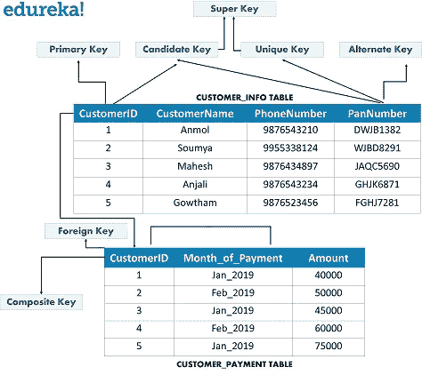

图 1:数据库中不同类型的关键字— DBMS 面试问题

*   **候选键—** 这是一组可以唯一标识一个表的属性。每个表可以有多个候选键。除此之外，在所有候选键中，可以选择一个键作为主键。在上面的示例中，由于 CustomerID 和 PanNumber 可以唯一地标识每个元组，因此它们将被视为候选键。
*   **超级键—** 这是一组可以唯一标识一个元组的属性。因此，候选键、主键和唯一键是超级键，但反之亦然。
*   **主键** —这是一组用于唯一标识每个元组的属性。在上面的示例中，由于 CustomerID 和 PanNumber 是候选键，因此它们中的任何一个都可以被选为主键。这里选择 CustomerID 作为主键。
*   **唯一键—** 唯一键类似于主键，但在列中允许空值。在这里，PanNumber 可以被认为是一个唯一的键。
*   **备用键—** 备用键是候选键，不会被选为主键。从上面的例子来看，备用键是 PanNumber
*   **外键—** 只能将当前值作为某个其他属性的值的属性，是它所引用的属性的外键。在上面的示例中，Customers 表中的 CustomerID 被称为 Customer_Payment 表中的 CustomerID。
*   **组合键—** 组合键是唯一标识每个元组的两列或更多列的组合。这里，CustomerID 和 Date_of_Payment 可以组合在一起，以唯一地标识表中的每个元组。

## Q16。你所理解的 DBMS 中的相关子查询是什么？

相关子查询也是一种依赖于另一个查询的子查询。因此，当对外部查询的每一行执行子查询时，它们被称为相关子查询。对于外部查询的每一行，每个子查询只执行一次。

您也可以将相关子查询理解为那些由父语句用于逐行处理的查询。这里，父语句可以是 SELECT、UPDATE 或 DELETE 语句。

## Q17。解释数据库分区及其重要性。

数据分区是为了提高可用性、性能和可管理性而将逻辑数据库划分为独立单元的过程。

数据库分区的重要性如下:

*   使您能够访问特定分区的大部分
*   更便宜和更慢的存储器可以用来存储数据
*   提高查询性能

## Q18。DBMS 中的函数依赖和传递依赖你是怎么理解的？

**函数依赖:**函数依赖是一种约束，用于描述关系中不同属性之间的关系。

考虑具有属性 X 和 Y 的关系“A1”。这两个属性之间的函数依赖关系将是*示例:* **X - > Y，**这意味着 Y 在函数上依赖于 X

**传递依赖:**传递依赖是一种只能出现在三个或三个以上属性的关系中的约束。

*示例:*考虑具有属性 X、Y 和 Z 的关系“A1”。现在，只有当以下函数依赖性成立时，X- > Z 被认为具有传递依赖性:

## Q19。两层和三层架构有什么区别？

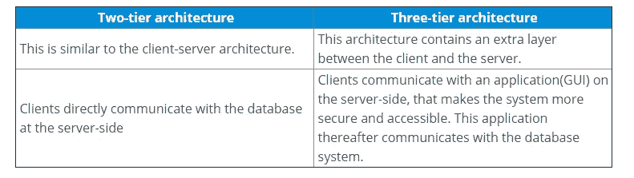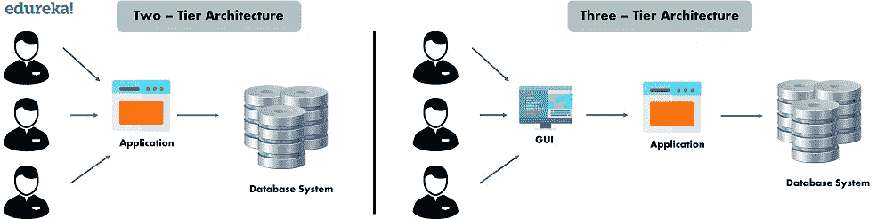

## 问题 20。提及唯一键和主键之间的区别

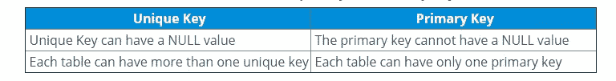

## 问题 21。什么是 DBMS 中的检查点，什么时候出现？

检查点是一种机制，所有以前的日志都从系统中删除，并永久存储在存储磁盘上。因此，基本上，检查点是事务日志记录可以用来恢复到崩溃点的所有提交数据的点。

接下来，让我们讨论一个最常见的 DBMS 面试问题，即:

## 问题 22。提及触发器和存储过程之间的差异

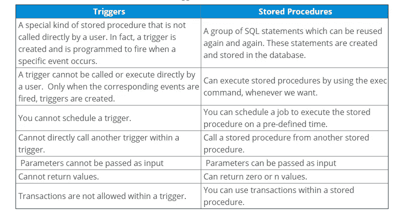

## 问题 23。散列连接、合并连接和嵌套循环有什么区别？

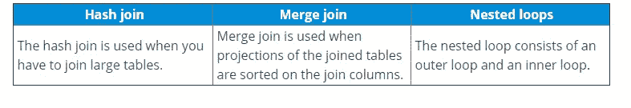

## 问题 24。你所理解的主动、追溯和同步更新是什么？

*   **主动更新:**这些更新在数据库在现实环境中生效之前应用于数据库。
*   **追溯更新:**这些追溯更新在数据库在现实环境中生效后应用于数据库。
*   **同步更新:**这些更新在现实环境中生效的同时应用于数据库。

## 问题 25。什么是索引？提及聚集索引和非聚集索引之间的差异

索引是负责提高表上数据检索操作速度的数据结构。这种数据结构通过使用额外的写入来使用更多的存储空间来维护额外的数据副本。因此，索引主要用于搜索算法，在这种情况下，您希望以快速的方式检索数据。

聚集索引和非聚集索引之间的差异如下:

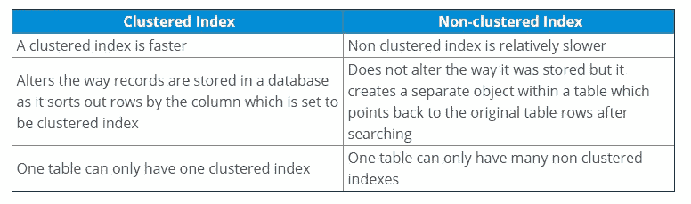

## 问题 26。你理解的内涵和外延是什么？

**内涵:**内涵或者最俗称的数据库模式定义了数据库的描述。这是在数据库设计期间指定的，大多数情况下保持不变。

**Extension:** Extension 是数据库中任意时刻可用的元组数量。该值随着元组的创建、更新和销毁而不断变化。因此，数据库中特定时刻的数据被称为数据库的扩展，或者最常见的是数据库的快照。

## Q27。光标你懂什么？提及不同类型的光标

游标是一种数据库对象，有助于逐行操作数据，并代表一个结果集。

光标的类型如下:

*   **隐式游标:**一旦执行 [SQL](https://www.edureka.co/blog/sql-commands) 就会自动声明这种类型的游标。这里，没有向用户提示光标的声明。
*   **显式游标:**这种类型的游标由 PL/ SQL 定义，因为它处理不止一行中的查询。

## 问题 28。解释术语专门化和一般化

*   **专门化:**专门化是定义实体类型的一组子类的过程。这里，每个子类将包含父实体的所有属性和关系。除此之外，子类还可能包含其他特定于自身的属性和关系。
*   **概括:**概括是为一组特定的实体寻找关系、共同属性的过程；最后为它们定义一个公共超类。

## 问题 29。你所理解的数据独立是什么？

当您说应用程序具有数据独立性时，这意味着应用程序独立于数据的存储结构和数据访问策略。

## Q30。DBMS 中有哪些不同的完整性规则？

DBMS 中的不同完整性规则如下:

*   **实体完整性:**该规则规定主键的值不能为空。因此，列中被标识为主键的所有元组都应该有一个值。
*   **参照完整性:**该规则声明外键的值要么为空，要么应该是任何其他关系的主键。

## Q31。对于索引来说，填充因子概念意味着什么？

填充因子用于表示每个叶级页面上剩余空间的百分比，其中包含数据。通常，默认值为 100。

## Q32。什么是索引搜索，它如何帮助提高查询性能？

提升索引集合的过程称为索引搜寻。这样做是因为索引提高了查询性能和处理速度。

它通过以下方式帮助提高查询性能:

*   使用查询优化器建议最佳查询。
*   索引、查询分布及其性能被用作检查效果的指标
*   数据库被调成一个问题查询的小集合。

## Q33。网络数据库模型和层次数据库模型有什么区别？

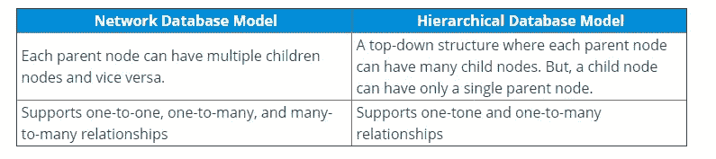

## Q34。解释什么是死锁，并说明如何解决死锁？

死锁是当两个事务等待一个被锁定的资源或其他事务等待时发生的情况。可以通过让所有事务在同一时刻获取所有锁来防止死锁。因此，一旦发生死锁，唯一的解决方法是中止其中一个事务，并删除部分完成的工作。

## Q35。独占锁和共享锁有什么区别？

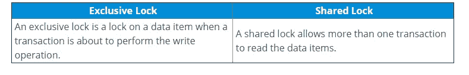

接下来，在这篇关于 DBMS 面试问题的文章中，让我们讨论一下关于 SQL 的常见问题。

# SQL 面试问题

## Q1。DROP、TRUNCATE 和 DELETE 命令有什么区别？

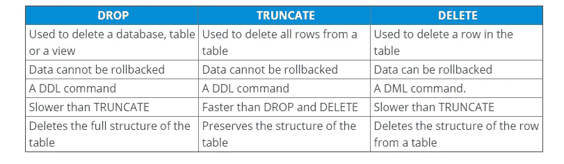

## Q2。什么是 SQL，用在什么地方？

SQL 即结构化查询语言是关系数据库的核心，用于访问和管理数据库。这种语言用于以表格的形式从结构化数据格式中操作和检索数据，并保存这些表格之间的关系。所以，通俗地说，你可以用 SQL 和数据库沟通。

## Q3。你所理解的 SQL 中的子查询是什么？

子查询是另一个查询中的一个查询，其中的查询被定义为从数据库中检索数据或信息。在子查询中，外部查询称为主查询，而内部查询称为子查询。子查询总是首先执行，子查询的结果传递给主查询。它可以嵌套在 SELECT、UPDATE 或任何其他查询中。子查询还可以使用任何比较运算符，如>、

## Q4。提及 UNION 和 UNION ALL 之间的区别

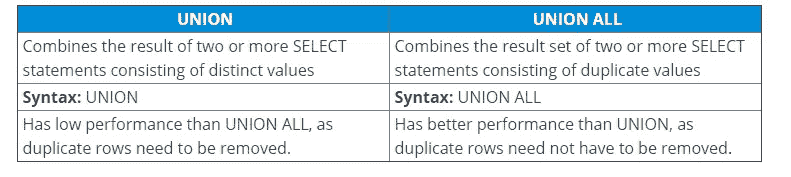

## Q5。你所理解的 SQL 中的 by 子句是什么？

子句通过在查询中提及一个条件来限制结果集。因此，您可以使用子句从整个记录集中筛选行。

**例:** WHERE HAVING 子句。

## Q6。提及 HAVING 和 WHERE 子句的区别？

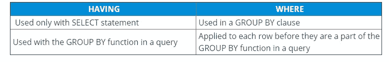

**注意:**每当不使用 GROUP BY 时，HAVING 的行为类似于 WHERE 子句。

# Q7。如何在 SQL 中执行模式匹配？

您可以使用 LIKE 运算符在 SQL 中执行模式匹配。通过 LIKE 运算符，您可以使用以下符号:

1.  **%** (百分号)—匹配零个或多个字符。
2.  **_ (** 下划线)-精确匹配一个字符。

**举例:**

从 CustomerName 喜欢的客户中选择*

SELECT * FROM Customers 喜欢“xyz_”的客户

## Q8。提到几个 SQL 中的大小写操作函数

SQL 中有三个大小写操作函数，即:

**LOWER:** 这个函数返回小写的字符串。它接受一个字符串作为参数，并通过将它转换成小写来返回它。

语法:LOWER(“string”)

**UPPER:** 这个函数返回大写的字符串。它将一个字符串作为参数，并通过将其转换为大写形式来返回它。

```
Syntax: UPPER('string')
```

**INITCAP:** 该函数返回第一个字母大写，其余字母小写的字符串。

语法:INITCAP('string ')

## Q9。什么是 SQL 中的连接？连接有哪些不同的类型？

JOIN 子句用于根据两个或多个表之间的相关列来组合它们中的行。它用于合并两个表或从中检索数据。SQL 中有 4 个连接，即:

*   内部连接
*   右连接
*   左连接
*   完全连接

## Q10。你对视图的理解是什么，并提到创建、更新和删除视图的步骤？

SQL 中的视图是从其他表派生的单个表。因此，视图包含类似于真实表的行和列，并且具有来自一个或多个表的字段。

要创建视图，请使用以下语法:

```
CREATE VIEW ViewName AS
SELECT Column1, Column2, ..., ColumnN
FROM TableName
WHERE Condition;
```

要更新视图，请使用以下语法:

```
CREATE VIEW OR REPLACE ViewName AS
SELECT Column1, Column2, ..., ColumnN
FROM TableName
WHERE Condition;
```

要删除视图，请使用以下语法:

```
DROP VIEW ViewName;
```

接下来，在这篇关于 DBMS 面试问题的文章中，让我们讨论一下关于 SQL 最常见的问题。

# 基于 SQL 查询的面试问题

## Q1。编写一个查询来创建一个包含和不包含数据的重复表。

假设您有一个名为 Customers 的表，其中包含 CustomerID、CustomerName 等详细信息。现在，如果您想要创建一个名为“DuplicateCustomer”的重复表，其中包含数据，您可以使用下面的查询:

```
CREATE TABLE DuplicateCustomer AS SELECT * FROM Customers;
```

同样，如果您想要创建一个没有数据的重复表，请使用下面的查询:

```
CREATE TABLE DuplicateCustomer AS SELECT * FROM Customers WHERE 1=2;
```

## Q2。提到一个从表中计算偶数和奇数记录的查询

要编写查询来计算表中的偶数和奇数记录，可以使用 MOD 函数编写两个不同的查询。

因此，如果希望从表中检索偶数记录，可以编写如下查询:

```
SELECT CustomerID FROM (SELECT rowno, CustomerID from Customers) where mod(rowno,2)=0;
```

同样，如果您想从表中检索奇数记录，可以编写如下查询:

```
SELECT CustomerID FROM (SELECT rowno, CustomerID from Customers) where mod(rowno,2)=1;
```

## Q3。编写一个查询来删除表中的重复行？

要从表中删除重复的行，必须先从表中选择重复的行，而不使用 DISTINCT 关键字。因此，要从表中选择重复的行，可以编写如下查询:

```
SELECT CustomerNumber FROM Customers WHERE ROWID (SELECT MAX (rowid) FROM Customers C WHERE CustomerNumber = C.CustomerNumber);
```

现在，要删除 Customers 表中的重复记录，请参考以下查询:

```
DELETE FROM Customers WHERE ROWID(SELECT MAX (rowid) FROM Customers C WHERE CustomerNumber = C.CustomerNumber);
```

## Q4。提及一个查询，将电子邮件验证添加到您的数据库中

嗯，有多种方法可以将电子邮件验证添加到您的数据库中，但其中一种方法如下:

```
SELECT Email FROM Customers WHERE NOT REGEXP_LIKE(Email, '[A-Z0-9._%+-]+@[A-Z0-9.-]+.[A-Z]{2,4}', 'i');
```

## Q5。编写一个查询以在 Oracle 中检索下个月的最后一天。

要编写查询以在 Oracle 中检索下个月的最后一天，可以编写如下查询:

```
SELECT LAST_DAY (ADD_MONTHS (SYSDATE,1)) from dual;
```

这就把我们带到了 DBMS 面试问题文章的结尾。希望这套 DBMS 面试问题能帮助你在求职面试中获得 ace。祝你面试顺利！如果你想查看更多关于人工智能、DevOps、道德黑客等市场最热门技术的文章，你可以参考 [Edureka 的官方网站。](https://www.edureka.co/blog/?utm_source=medium&utm_medium=content-link&utm_campaign=dbms-interview-questions)

请留意本系列中解释 SQL 其他各方面的其他文章。

> *1。* [*数据科学 SQL*](/edureka/sql-for-data-science-a8fe10fe2ef9)
> 
> *2。* [*甲骨文面试前 50 题*](/edureka/oracle-interview-and-answers-d1a99534e2d0)
> 
> [*3。前 65 个 SQL 面试问题*](/edureka/sql-interview-questions-162f97f37ac2)

*原载于 2020 年 7 月 13 日 https://www.edureka.co**的* [*。*](https://www.edureka.co/blog/interview-questions/dbms-interview-questions)