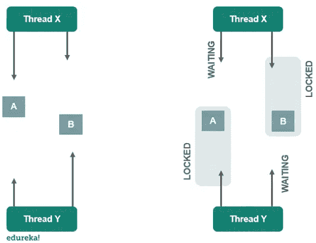

# Java 中如何避免死锁？

> 原文：<https://medium.com/edureka/deadlock-in-java-5d1e4f0338d5?source=collection_archive---------2----------------------->


Java 编程语言支持多线程。它涉及多个线程同时运行进行多任务处理。但是在某些情况下或者由于某些缺点，线程发现自己永远处于等待状态。在本文中，我们将了解 Java 中的死锁条件以及避免死锁的不同方法。以下是本文讨论的主题:

*   Java 中的死锁是什么？
*   死锁示例
*   Java 中如何避免死锁？

# Java 中的死锁是什么？

Java 中的死锁是两个或多个线程被永远阻塞，互相等待的情况。

当多个线程需要相同的锁，但以不同的顺序获得它们时，通常会发生这种情况。由于 synchronized 关键字，Java 中的多线程编程会遇到死锁情况。

它导致正在执行的线程在等待与指定对象相关联的锁或监视器时被阻塞。



# 死锁示例

```
public class Example
{
   public static void main(String[] args)
     { 
     final String r1 = "edureka";
     final String r2 = "java"; Thread t1 = new Thread()
       {
       public void run()
        { 
        synchronized(r1)
         {
          System.out.println("Thread 1: Locked r1");
          try
           { Thread.sleep(100);} catch(exception e) {} 
     synchronized(r2)
      { 
     System.out.println("Thread 1: Locked r2"); 
      }  
     } 
    } 
}; Thread t2 = new Thread()
  {
      public void run()
       { 
      synchronized(r1)
       { 
       System.out.println("Thread 2: Locked r1"); 
       try{ Thread.sleep(100);} catch(exception e) {}     synchronized(r2)
      {
      System.out.println("Thread 2: Locked r2");
       } 
      } 
    } 
}; 
t1.start();
t2.start(); 
}
}
```

**输出:**
线程 1:锁定 r1
线程 2:锁定 r2

# Java 中如何避免死锁？

虽然不可能完全避免死锁情况，但我们可以遵循某些措施或指针来避免它们:

*   **避免嵌套锁** —你必须避免给多线程加锁，这是死锁的主要原因。这通常发生在您给多个线程加锁的时候。
*   **避免不必要的锁** —锁应该给重要的线程。给导致死锁情况的不必要的线程加锁。
*   **使用线程连接** —死锁通常发生在一个线程等待另一个线程完成的时候。在这种情况下，我们可以使用 Thread.join 和一个线程将花费的最大时间。

这就把我们带到了本文的结尾，我们已经了解了 Java 中的死锁以及如何避免它。我希望你清楚本教程中与你分享的所有内容。

如果你想查看更多关于人工智能、DevOps、道德黑客等市场最热门技术的文章，你可以参考 Edureka 的官方网站。

请留意本系列中的其他文章，它们将解释 Java 的各个方面。

> *1。* [*面向对象编程*](/edureka/object-oriented-programming-b29cfd50eca0)
> 
> *2。*[*Java 中的继承*](/edureka/inheritance-in-java-f638d3ed559e)
> 
> *3。*[*Java 中的多态性*](/edureka/polymorphism-in-java-9559e3641b9b)
> 
> *4。*[*Java 中的抽象*](/edureka/java-abstraction-d2d790c09037)
> 
> *5。* [*Java 字符串*](/edureka/java-string-68e5d0ca331f)
> 
> *6。* [*Java 数组*](/edureka/java-array-tutorial-50299ef85e5)
> 
> *7。* [*Java 集合*](/edureka/java-collections-6d50b013aef8)
> 
> *8。* [*Java 线程*](/edureka/java-thread-bfb08e4eb691)
> 
> 9。 [*Java 教程*](/edureka/java-tutorial-bbdd28a2acd7)
> 
> *10。* [*Servlet 和 JSP 教程*](/edureka/servlet-and-jsp-tutorial-ef2e2ab9ee2a)
> 
> *11。*[*Java 中的异常处理*](/edureka/java-exception-handling-7bd07435508c)
> 
> *12。* [*高级 Java 教程*](/edureka/advanced-java-tutorial-f6ebac5175ec)
> 
> *13。* [*Java 面试题*](/edureka/java-interview-questions-1d59b9c53973)
> 
> *14。* [*Java 程序*](/edureka/java-programs-1e3220df2e76)
> 
> *15。*[*kot Lin vs Java*](/edureka/kotlin-vs-java-4f8653f38c04)
> 
> *16。* [*依赖注入使用 Spring Boot*](/edureka/what-is-dependency-injection-5006b53af782)
> 
> *17。* [*堪比 Java 中的*](/edureka/comparable-in-java-e9cfa7be7ff7)
> 
> *18。* [*十大 Java 框架*](/edureka/java-frameworks-5d52f3211f39)
> 
> *19。* [*Java 反射 API*](/edureka/java-reflection-api-d38f3f5513fc)
> 
> *20。*[*Java 中的 30 大模式*](/edureka/pattern-programs-in-java-f33186c711c8)
> 
> *21。* [*核心 Java 备忘单*](/edureka/java-cheat-sheet-3ad4d174012c)
> 
> *22。*[*Java 中的套接字编程*](/edureka/socket-programming-in-java-f09b82facd0)
> 
> *23。* [*Java OOP 备忘单*](/edureka/java-oop-cheat-sheet-9c6ebb5e1175)
> 
> *24。*[*Java 中的注释*](/edureka/annotations-in-java-9847d531d2bb)
> 
> *25。*[*Java 中的图书馆管理系统项目*](/edureka/library-management-system-project-in-java-b003acba7f17)
> 
> 26。[*Java 中的树*](/edureka/java-binary-tree-caede8dfada5)
> 
> *27。*[*Java 中的机器学习*](/edureka/machine-learning-in-java-db872998f368)
> 
> *28。* [*顶级数据结构&Java 中的算法*](/edureka/data-structures-algorithms-in-java-d27e915db1c5)
> 
> 29。 [*Java 开发者技能*](/edureka/java-developer-skills-83983e3d3b92)
> 
> 三十。 [*前 55 名 Servlet 面试问题*](/edureka/servlet-interview-questions-266b8fbb4b2d)
> 
> 31。[](/edureka/java-exception-handling-7bd07435508c)*[*顶级 Java 项目*](/edureka/java-projects-db51097281e3)*
> 
> **32。* [*Java 字符串备忘单*](/edureka/java-string-cheat-sheet-9a91a6b46540)*
> 
> *33。[*Java 中的嵌套类*](/edureka/nested-classes-java-f1987805e7e3)*
> 
> *34. [Java 集合面试问答](/edureka/java-collections-interview-questions-162c5d7ef078)*
> 
> *35.[Java 中的字符串池是什么概念？](/edureka/java-string-pool-5b5b3b327bdf)*
> 
> *36.[你需要知道的 50 大 Java 集合面试问题](/edureka/java-collections-interview-questions-6d20f552773e)*
> 
> *37. [Java 教程](/edureka/java-tutorial-bbdd28a2acd7)*
> 
> *38.[C、C++和 Java 有什么区别？](/edureka/difference-between-c-cpp-and-java-625c4e91fb95)*
> 
> *39.[Java 中的回文——如何检查一个数字或字符串？](/edureka/palindrome-in-java-5d116eb8755a)*
> 
> *40.[你需要知道的顶级 MVC 面试问答](/edureka/mvc-interview-questions-cd568f6d7c2e)*
> 
> *41.[Java 编程语言的十大应用](/edureka/applications-of-java-11e64f9588b0)*
> 
> *42.[Java 中的死锁](/edureka/deadlock-in-java-5d1e4f0338d5)*
> 
> *43.[Java 中的平方和平方根](/edureka/java-sqrt-method-59354a700571)*
> 
> *44.[Java 中的类型转换](/edureka/type-casting-in-java-ac4cd7e0bbe1)*
> 
> *45.[Java 中的运算符及其类型](/edureka/operators-in-java-fd05a7445c0a)*
> 
> *46.[Java 中的析构函数](/edureka/destructor-in-java-21cc46ed48fc)*
> 
> *47.[爪哇的二分搜索法](/edureka/binary-search-in-java-cf40e927a8d3)*
> 
> *48.[Java 中的 MVC 架构](/edureka/mvc-architecture-in-java-a85952ae2684)*
> 
> *49. [Hibernate 面试问答](/edureka/hibernate-interview-questions-78b45ec5cce8)*

**原载于 2019 年 8 月 30 日*[*https://www.edureka.co*](https://www.edureka.co/blog/deadlock-in-java/)*。**