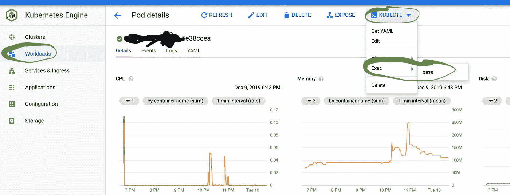

# 调试在 Kubernetes 中静默的 Python 工作负载

> 原文：<https://medium.com/compendium/debug-a-python-workload-that-has-gone-silent-hung-inside-kubernetes-9a597e163a86?source=collection_archive---------0----------------------->

今天，我在帮助一位客户优化他们的 [Cloud Composer](https://cloud.google.com/composer/) 设置。Cloud Composer 是一个托管气流安装，一个运行在 Kubernetes 上的作业编排工具，由 Airbnb 制作。我之前建议客户使用 Cloud Composer 只运行 Docker containers([KubernetesPodOperator](https://airflow.apache.org/docs/stable/_api/airflow/contrib/operators/kubernetes_pod_operator/index.html#airflow.contrib.operators.kubernetes_pod_operator.KubernetesPodOperator))，因为这确实简化了 Cloud Composer/Airflow 的测试和部署过程。使用 [PythonOperator](https://airflow.apache.org/docs/stable/howto/operator/python.html) 来运行复杂的 Python 程序是你将来一定会后悔的事情(无论是测试还是包管理)。

该客户开始出现的情况是，Kubernetes 的工作负载开始停滞在运行状态。永远。

要弄清楚为什么 Cloud Composer 将工作负载留在集群中，只需阅读文档即可。我们没有设置***is _ delete _ operator _ pod****参数，这意味着 composer 将在超时后保持工作负载运行。这不是我们真正想要的，所以一个简单的修复方法是应用参数更改，删除已经卡住的作业，问题会在某种程度上消失。至少它会被隐藏起来。*

*然而，一个简单的读/写作业会像这样被卡住，这确实让我很困扰。程序中没有什么业务逻辑可言，基本上只是从一个源读取数据，然后将数据转储到另一个目标。我该如何调试它？*

# *步骤 1:连接到运行中的容器*

*SSH 进入正在运行的容器是可能的，在 [GKE](https://cloud.google.com/kubernetes-engine/) 中最简单的方法是使用云 Shell。只需在 workloads 菜单中找到要调试的正在运行的作业，然后单击它。然后，您将进入“Pod 详细信息”页面。单击 kubectl 下拉菜单(右上角)→ exec →然后选择您的容器(通常只有一个)。在云壳中运行。*

**

*您将得到一个生成的命令，以类似这样的内容结束。*

```
*&& kubectl exec<pod_name> — namespace <YOUR_NAMESPACE> -c base — ls*
```

*添加 ***-it*** 参数，启动 ***/bin/bash*** (或类似 shell)。在这种情况下，Docker 图像基于 python:3，python:3 基于 Ubuntu。*

```
*&& kubectl **-it** exec<pod_name> — namespace <YOUR_NAMESPACE> -c base — **/bin/bash***
```

*一旦你按下回车键，你就有了一个问题容器的外壳。*

# *步骤 2:在运行容器中安装调试工具*

*容器很可能不包含您需要调试的工具。*

*Gdb 是一个 C 调试器，通常用于调试 C/C++程序。你会需要这个，因为 Python 是基于 c 的。我们还需要一个 Python 包装器，将 gdb 渲染成有意义的东西。 [Pyrasite](http://pyrasite.com/) 就是这样一个库，应该在每个 Python 开发者的工具箱里！*

*这些命令是在我们刚刚开始的 SSH 会话中的 pod 内部运行的。*

```
*apt-get update
apt-get install gdb
pip install pyrasite*
```

# *第 3 步:让调试器工作！*

*安装之后，如果调试器在 Kubernetes 内部运行，它还不能施展魔法。调试器需要一些权限来进行跟踪，Kubernetes 在默认情况下不会授予这些权限。通过运行以下命令进行演示(在 pod 内):*

```
*$ps x
PID TTY      STAT   TIME COMMAND
1 ?        Ssl    0:12 python3 main.py --path=/foo/bar$pyrasite
WARNING: ptrace is disabled. Injection will not work.
You can enable it by running the following:
echo 0 | sudo tee /proc/sys/kernel/yama/ptrace_scope$echo 0 | sudo tee /proc/sys/kernel/yama/ptrace_scope
tee: /proc/sys/kernel/yama/ptrace_scope: Read-only file system
0*
```

*好吧，那现在该怎么办？我不允许更改我需要更改的文件。一个解决方案可以是在特权模式下运行容器，但是这样我们就会失去用例。现在可以做些什么来得到我需要的调试信息吗？*

*其实是的！Kubernetes 和 Docker 运行在虚拟机上(在我们的例子中是容器优化的操作系统)，所以我找到了运行作业的实际虚拟机，并在虚拟机上运行 ssh(菜单→计算→计算引擎→实例→实例上的 SSH)。一旦进入我运行的虚拟机*

```
*ps aux | grep python*
```

*在 Docker 实例中运行的同一个 Python 程序出现了(除了气流包装器之外)。我简单地研究了一下在这台机器上安装相同的工具，但是操作系统需要一些定制的安装和编译来获得我想要的东西，从经验来看，这可能是痛苦的。*

*可以用另一种方法解决吗？由于 Python 在主机上运行，如果我在主机上启用 ptrace 会发生什么？那会有好处吗？所以我跑了…*

```
*echo 0 | sudo tee /proc/sys/kernel/yama/ptrace_scope*
```

*在主机上。我做的时候没有得到错误信息。*

*然后，回到挂着 pod 的 SSH 会话，我发现了这个:*

```
*pyrasite-shell 1
Pyrasite Shell 2.0
Connected to ‘python3 main.py — path=/foo/bar — workers=4’
Python 3.8.0 (default, Nov 23 2019, 05:36:56)
[GCC 8.3.0] on linux
Type “help”, “copyright”, “credits” or “license” for more information.
(DistantInteractiveConsole)
>>>*
```

*是啊！Pyrasite 现在起作用了！*

*粘贴这个小代码片段会将线程调用堆栈打印到 stdout 中。*

```
*import sys, traceback
for thread_id, frame in sys._current_frames().items():
    print('Stack for thread {}'.format(thread_id))
    traceback.print_stack(frame)
    print('')*
```

*调用堆栈的一部分是(我故意混淆了调用堆栈，因为实际 Python 程序的函数名和文件名可以识别客户):*

```
*File “/foo/bar/baz.py”, line xxx, in problem_functiondata = requests.Session().get(url, cookies=info[“login_token”], headers=headers, params=querystring).json()*
```

*在我的例子中，很容易看出 request.get 缺少超时参数。这造成了。如果服务器没有响应，将永远等待。这导致了所有的麻烦！*

*有一个卡住的程序是一座金矿，简单地杀死它只会使问题在以后的时间里再次出现。您应该总是试图找到根本原因，获得调用堆栈通常是一个很大的帮助，而且通常情况下，说明确切的原因是什么。*

*这种获取调用堆栈的方法也可以应用于裸机或普通虚拟机，您可以跳过 Kubernetes/Docker 层和命令的所有复杂性。*

*如果你觉得这篇文章有用，我总是感谢掌声:)*

# *资源*

*Pyrasite 打印调用堆栈*

*[https://gist . github . com/Rey wood/e 221 c 4061 bbf 2 ecce a85c 9 B2 E4 ef 496](https://gist.github.com/reywood/e221c4061bbf2eccea885c9b2e4ef496)*

*如何安装广发银行*

*http://www.gdbtutorial.com/tutorial/how-install-gdb*

*Stackoverflow 线索让我找到了 pyrasite*

*【https://stackoverflow.com/a/29881630/8579931 *