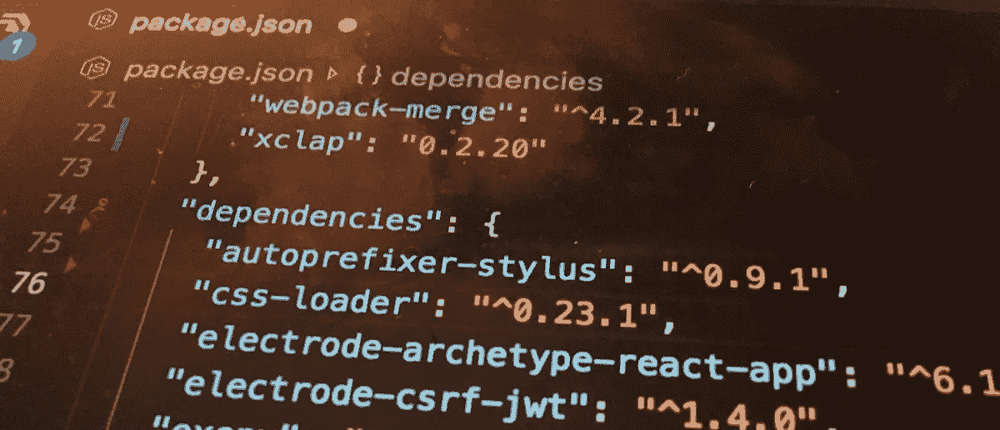
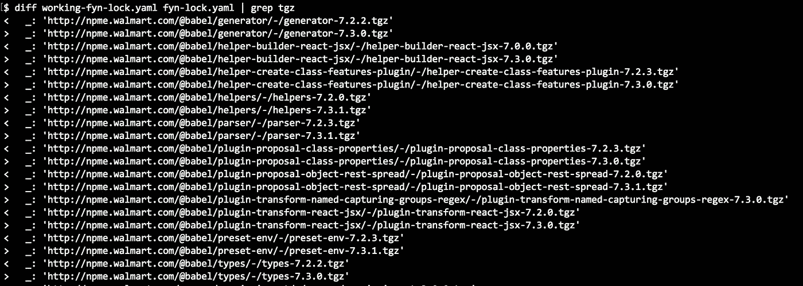
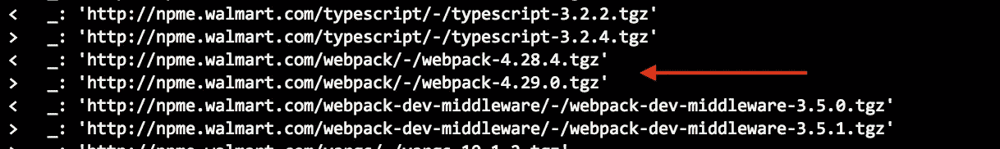

# 调试 Node.js 依赖项

> 原文：<https://medium.com/walmartglobaltech/debug-nodejs-dependencies-51eb40f484ec?source=collection_archive---------5----------------------->

在 Node.js 开发中，你有没有在一个已知工作的 app 上做了全新的`npm install`却发现它开始失败？根据我们的经验，我们偶尔会遇到这个问题。原因是由于一个常见的惯例，我们使用`^`或`~`为我们所依赖的包指定一个[永远](https://semver.org/)的范围。例如，`^1.0.0`意味着任何版本的`1`，比如`1.1.0`或`1.2.1`。

因此，如果一个应用程序有一个依赖关系`X@^1.0.0`并引入当前版本`1.1.0`，但是`X`的所有者发布了一个新版本`1.2.0`，一个新的`npm install`将引入新版本。大多数情况下(比如 99%)这是没问题的，但偶尔它不起作用，你的应用程序开始失败。

有时您对更新了哪些包有一个相当好的想法，并且很容易弄清楚，但是其他时候您可能甚至没有意识到您的问题是由于正在更新的下游依赖项引起的，并且您可能会挠头几个小时。虽然使用锁文件可以更好地控制这种情况，但偶尔当您更新锁时，这种情况仍然会发生。通常我们一次更新一个锁，但仍然可能导致从它的下游获得新的锁，或者有时我们可能希望对整个锁文件进行刷新。

在我支持数百名 Node.js 开发人员的日常工作中，我有时不得不调试这个问题。这是一个从 Node.js 早期就存在的常见问题。在实行依赖锁文件之前，我们习惯于依赖`npm-shrinkwrap.json`并使用精确版本，而不是`package.json`中的 [semver](https://semver.org/) 。

我们最近的事件是由于`webpack`从版本`4.28.4`更新到`4.29.0`。这个问题本身影响了很多人，因为`webpack`非常受欢迎，这里[正在讨论](https://github.com/webpack/webpack/issues/8656)。事实证明，这是由于 npm 中的一个`[peerDependencies](https://github.com/webpack/webpack/issues/8656#issuecomment-456010969)` [相关 bug](https://github.com/webpack/webpack/issues/8656#issuecomment-456010969) 。

我们在一个大型应用程序中独立遇到了这个问题。它拉进了很多发育完全的包`npm install`。当应用程序第一次开始失败时，我们不知道出了什么问题。

我们使用 babel 和动态导入语法插件来传输我们的动态导入代码。由于我们得到了一个与动态导入相关的语法错误，我们查看了明显的疑点，如我们的 babel 配置和动态语法插件。经过一些健全性检查后，我们确认 babel 肯定仍在加载插件，所以我们很困惑，而且我们没有立即意识到原因是下游依赖，因为我们自己做了很多更改。

在查看提交历史记录后，我们发现问题发生在一个分支中，该分支的提交已知是有效的，因为它的 PR 是绿色的，这时我们开始意识到原因是下游包得到了更新。

这对于我们来说并不陌生，我们有一套标准的程序来调试它。在此之前，我将介绍一下 [fyn](https://www.npmjs.com/package/fyn) ，这是我编写的一个节点包管理器，它从经验和工具发展而来，有助于 Node.js 中的开发和调试。我将讨论 [fyn](https://www.npmjs.com/package/fyn) 的一些独特特性如何帮助找出有问题的包。

隔离有问题的包的通常方法是首先找到哪些包已经更新。为此，我们过去依赖于`npm-shrinkwrap.json`，现在依赖于`package-lock.json`，这是定期提交的。我们会`npm install`两个不同的`node_modules`，一个有已知的工作锁，另一个没有。然后我们有定制的工具来比较两个`node_modules`中的包，并显示那些不同的包。然而，这样做的问题是，我们通常只在发布时保留锁文件，并且我们并不总是在我们想要的确切时间拥有锁文件。

在我们的事件中，我们知道 commit 在 1/14 通过了 PR，但是锁文件更老。虽然我们可以使用那个锁文件，但是如果能够从 1 月 14 日开始减少需要更新的包的数量就更好了。这就是 fyn 中锁时间戳特性得以实现的原因。

所以我做了没有任何锁的`fyn install --lock-time=1/14/2019`，得到了一个只发布到 2019 年 1 月 14 日的包的`node_modules`。接下来，我不带锁地运行`fyn install`来获取所有最新的包。现在我可以比较它们了。

不过在我继续之前，我想指出，因为在这个事件中，原因是一个 npm 错误，通常我们可能无法用`fyn`重现它，但巧合的是`fyn`有类似的错误行为，所以这是可能的，或者至少更容易。然而，如果原因与 npm 无关，那么用`fyn`调试它将是一样的。

拿`node_modules`和 fyn 对比其实很简单。我们甚至不需要保存两个不同的`node_modules`副本，因为 fyn 的锁文件可以直接区分，得到非常可读的结果。

在我们的事件中，仅仅一周多一点的时间我们就得到 20 多个更新包。有些是我们的内部包，但大多数是公共包，不直接依赖于我们的应用程序，特别是一半是巴别塔包:

灯泡在我头顶上亮了起来，我心想:“中大奖了！”。我立即更新了 fyn 的锁文件，将这些包设置为旧版本，并期待着好的结果，但可惜的是，结果并非如此。幸运的是，只有大约 10 个其他包，大多数显然是不相关的，然后我注意到 webpack 更新了:

那是最有可能相关的包裹。果然，用 [fyn](https://www.npmjs.com/package/fyn) 更新后，错误没了。厉害！

自从这个问题浮出水面，webpack 的作者很快就找到了原因，并且[提交了一份 PR 在 npm](https://github.com/npm/cli/pull/147) 中修复了它，这和往常一样令人印象深刻。

我写这篇文章是为了讨论 Node.js 中一个常见的依赖相关问题，以及我如何使用 [fyn](https://www.npmjs.com/package/fyn) 来帮助我进行调试。 [fyn](https://www.npmjs.com/package/fyn) 是我在编写帮助管理`node_modules`和依赖关系的工具方面的经验和各种尝试的累积结果，我最终投入了数百个小时来组装一个功能齐全的节点包管理器，以提高生产率和效率。

如果这里讨论的主题对你有意义，并且你有相关的经验或者有你自己的技巧和工具可以分享，那么请留下你的评论。我很想听听你的想法。

哦，最后一件事，我正在[沃尔玛实验室](https://medium.com/u/c884135151a4?source=post_page-----51eb40f484ec--------------------------------)聘请 JavaScript 专家，从事 Node.js/ReactJS 以及任何与平台、基础设施、网络和云相关的工作。我们也做 bash，如果你对 TypeScript 感兴趣的话，这将会非常令人兴奋。如果你感兴趣，请打电话给我。