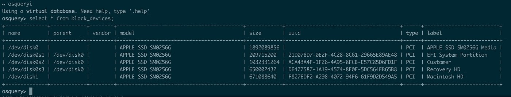

# 调试 osquery 中的一系列计算错误

> 原文：<https://medium.com/square-corner-blog/debugging-a-series-of-miscalculations-in-osquery-14cce2cfe39c?source=collection_archive---------0----------------------->

> 注意，我们已经行动了！如果您想继续了解 Square 的最新技术内容，请访问我们的新家[https://developer.squareup.com/blog](https://developer.squareup.com/blog)

# 什么是 [osquery](https://stackedit.io/osquery.io) ？

osquery 是脸书的一个开源工具，它为系统信息提供了一个 SQL 接口。

在整个夏天，我一直致力于将 osquery 结果集成到我们的内部资产跟踪器中，以实现自动化/验证目的。它对于监控各种统计数据非常有用，SQL 接口使它易于使用。

# 发现计算错误

## 较小的 linux 磁盘大小？

我已经收集了大约 2 周的数据，当我将 UI 改为显示人类可读的数字时，我注意到主机的总磁盘大小为 0.58 GB (585871964 字节)。拥有这么小的磁盘似乎不合逻辑，所以我在那台主机上使用`sudo fdisk -l`查找实际的磁盘大小，它是 300 GB (299966445568 字节。)

结果是`585871964 * 512 = 299966445568`产生了正确的大小。但是 512 到底是什么？

## 什么是[块大小](https://en.wikipedia.org/wiki/Block_%28data_storage%29)？

计算存储中的基本数据原语是字节，但是，出于效率原因，许多存储设备以更大的单位(块大小)执行 I/O 操作。由于磁盘上扇区的物理概念，历史上它是 512 字节(但也可能不同)。

结果是，尽管文档说明这是以字节为单位返回的，但它实际上是以块大小返回的；在这种情况下是 512。
我将它硬编码到我的代码中，并决定向 osquery 提交一个补丁来修复这个问题，并向设备`block_size`的`block_devices`表中添加一列。

# 抓取更多的 bug

当我去修复 Linux 实现并添加列时，我看到还有一个 Darwin 实现。出于好奇，我想知道这个问题是否持续存在，于是在我的 mac 上运行了一下，发现它也不准确。我有一个 256GB 的型号。



osqueryi results on my mac

我的 SSD 是 1892089856 字节？还是`1892089856 * 512 = 968750006272`？(我希望我有差不多 1tb)。天哪，肯定是别的什么东西！
看了一下 Darwin 的实现，发现它使用了一堆我不知道的 IOKit 东西。我四处寻求帮助，我们最终找到了我们需要剖析的方法的苹果开源头文件。(我在 C 语言中了解到，你可以拥有带有隐藏定义的[不透明结构](https://en.wikipedia.org/wiki/Opaque_pointer)

# 不透明的结构一点也不好玩

很难弄清楚它在系统级做什么，但是文档给我指出了一个字典`CFMutableDictionaryRef`，它包含了键`Size`的一些内容。在 StackOverflow 上找到一些代码来打印这本字典，结果它确实返回了正确的数字。这时候，我开始怀疑一个截断错误。

运行`diskutil info -all`本地我发现我有


第一本印刷的字典是`/dev/disk0`。尺寸线:

```
17 : <CFString 0x7fffeb91cd20 [0x7fffeb978da0]>{contents = "Size"} = <CFNumber 0x3a70c7000037 [0x7fffeb978da0]>{**value** = +251000193024, **type** = kCFNumberSInt64Type}
```

立刻注意到了`type = kCFNumberSInt64Type`。

# 休斯顿，我们有一个截断错误

在 ruby 中将它转换为 32 位的 int，它确认了这就是问题所在。

```
2.4.1 :001 > x = 251000193024
 => 251000193024
2.4.1 :002 > x & 0xffffffff
 => 1892089856
```

我看到有检查是什么类型的`CFNumber`，但由于某种原因，它没有被发现。显然，它被硬编码为一系列嵌套方法调用中的某处的`kCFNumberIntType`。我改成了实际使用号码的`CFNumberType`。

在修复了 Darwin 实现之后，我决定也以块大小返回它，以保持与 Linux 实现的一致性。做出这个选择是因为 Linux 已经提供了块大小，而 Darwin 实现毫无意义。将`block_size`列添加到两个表中。

参见 GitHub 上的 [PR](https://github.com/facebook/osquery/pull/3539) / [Issue](https://github.com/facebook/osquery/issues/3538)

# TL；博士；医生

*   处理整数时要注意截断错误
*   让程序员跟踪类型并静默转换通常会导致类型转换错误

## 感谢[埃文](https://github.com/eam)、[迈克尔](https://twitter.com/mtauraso)和[肯](https://twitter.com/kwiggint)的所有帮助:)