# 在 Pinterest 调试广告投放

> 原文：<https://medium.com/pinterest-engineering/debugging-ad-delivery-at-pinterest-8b7b1f562afc?source=collection_archive---------0----------------------->

Nishant Roy |广告服务平台工程经理

# 简介和背景

Pinterest 广告服务平台在 2021 年从成千上万的广告商那里交付了超过 25 亿美元的广告支出。我们的客户运营团队平均每月会收到 600 多张来自广告商的罚单，这些广告商希望了解他们在我们平台上的表现。我们收到的最常见的问题之一是，为什么一个特定的广告商/广告活动没有充分利用其预算。这个问题需要对一个广告推荐系统进行深入分析，该系统由 5+微服务、1M+代码行和 100+活跃开发者组成，每天服务超过 9000 万个请求。这篇博客描述了我们如何建立一个系统来快速回答这些问题，而不需要深入的技术知识或背景。我们有三个主要目标:

*   通过缩短解决问题的时间来提高广告商的满意度
*   自动进行数据分析，并为广告客户提供建议，以提高投放率
*   覆盖系统中的所有组件(索引、预算/速度、候选人生成、排名、广告漏斗、拍卖等)。)

# 设计/挑战

## 数据覆盖范围

大多数可用于调试的数据都是请求级别的，并且经过大量采样以降低成本，这意味着我们没有足够的数据来了解所有广告商的系统行为。我们需要广泛覆盖所有广告客户，在广告推荐系统的所有阶段进行计数，而不会产生巨大的日志和存储成本。

## 解决方案:Druid 上的聚合数据管道

在研究了我们的选项之后，我们选择使用 [Druid](https://druid.apache.org/) 作为我们的存储解决方案，原因如下:

*   **通过 Kafka 的实时高摄取率:**每个广告请求可能包含数千个候选人，我们需要记录所有这些 id 的数据。我们已经广泛使用 Kafka 进行日志记录，所以我们能够重用 Druid 的很多基础设施。通过将 Kafka 与 Druid 结合使用，我们的管道可以在不超过几分钟延迟的情况下为调试实时提供数据。
*   **支持聚合查询:**我们期望的查询模式是检索给定时间段内某个 ID 的计数。Druid 针对时间序列数据进行了优化，并提供了很大的聚合灵活性，因此它符合我们的要求。
*   **低延迟和存储成本:** Druid 允许我们提供 id 级别计数的实时可见性。此外，Druid 支持摄取时的聚合，这可以最小化存储数据的大小。

下面是我们的日志模式和一个 Druid 响应的示例:

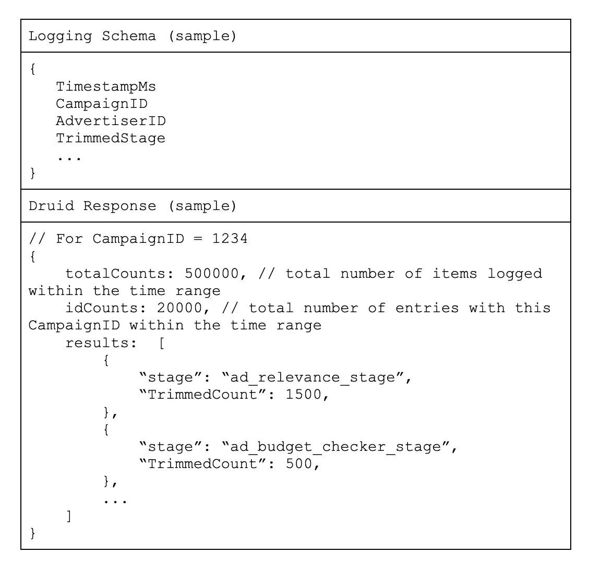

有了这些数据，我们现在可以回答如下问题:

*   一场运动在哪个阶段最容易被淘汰？
*   每个阶段的平均配平率是多少？
*   营销活动的修剪率或插入率每天都在发生怎样的变化？

通过回答这些问题，我们可以快速了解糟糕的广告投放是由系统中的 bug(例如，某个阶段的代码更改)还是糟糕的活动配置(例如，非常低的出价或预算)引起的。

# 微服务

我们的广告投放系统由几个不同的系统组成，每个系统都有自己的职责(候选人生成、调整、评分、投标/预算管理、索引、内容安全过滤等)。活动表现不佳的根本原因可能在于这些系统中的任何一个，这些系统由 Pinterest 的多个不同团队所有，这使得分类和解决交付问题变得非常困难。

## 解决方案:统一调试 UI

为了简化调试过程，我们构建了一个统一的 UI 来可视化从广告投放过程中涉及的所有系统记录的数据。用户现在可以输入一个活动 ID，只需几秒钟就可以查看所有系统的详细调试信息。我们现在可以轻松回答以下问题:

*   哪个阶段的配平率最高？
*   是否有过多的内容过滤？
*   市场活动在索引中不活跃吗？
*   预算有变化吗？
*   广告商对他们的活动设置做了任何改变吗？

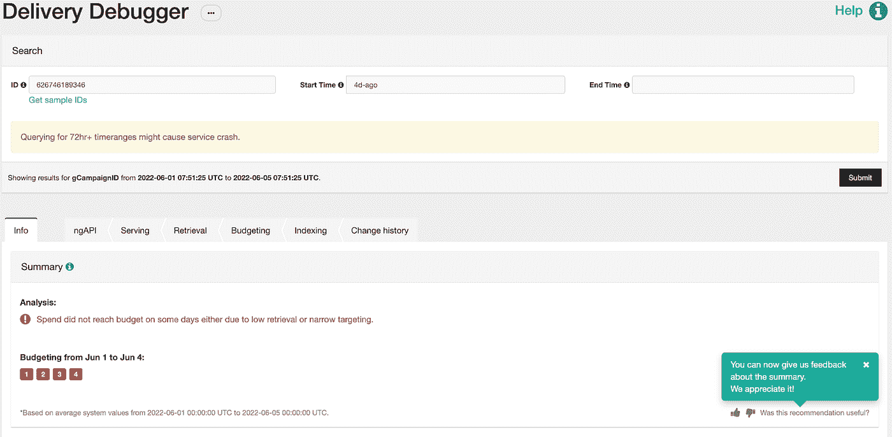

*Fig 1: Unified Debugging UI with tabs for each system in the ad delivery process*

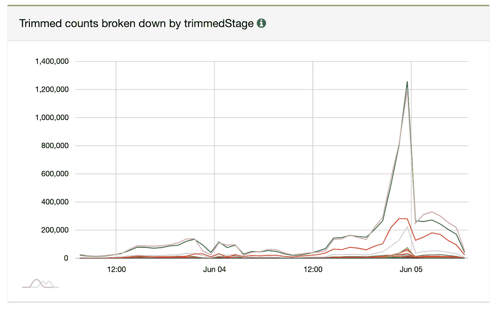

*Fig 2: Trimmed counts by stage in the ad funnel*

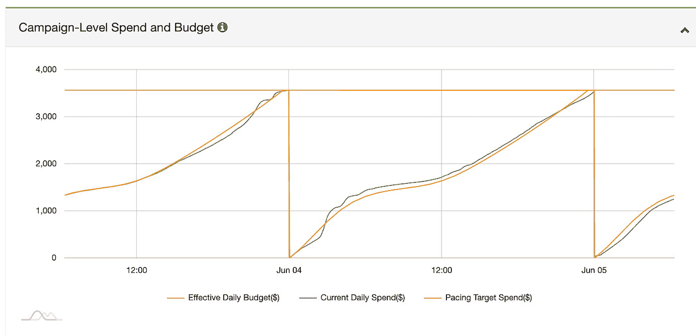

*Fig 3: Campaign spend against target spend and daily budget*

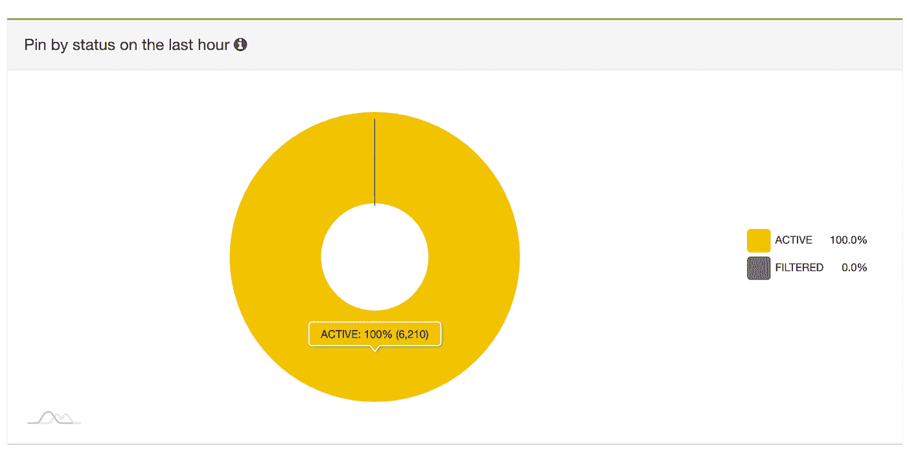

*Fig 4: Number of active vs filtered pins from a campaign in the ads index*

# 非工程团队的可访问性

为了使交付调试成为一个简单且可扩展的过程，我们希望让非工程团队(如客户运营和销售)了解我们的系统，以及可以采取哪些措施来改善广告交付。

## 解决方案:一行摘要诊断和建议

我们的交付调试器提供了简单的、一行的活动健康状况摘要，以及可以改进广告交付的更改建议。这些总结不需要对我们的技术系统有深入的了解，因为它们不需要工程团队的帮助，所以可以更容易、更快地解决一些交付问题。摘要是预先编写的，并且是基于启发式规则选择的，这些启发式规则是我们基于先前的经验和我们对广告投放系统的了解而人工确定的。

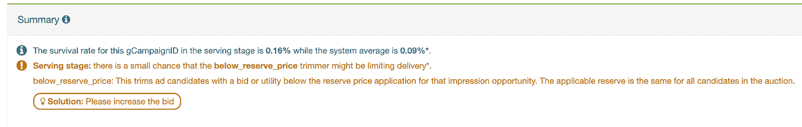

*Fig 5: One-line summary showing which serving funnel stage may be limiting delivery*

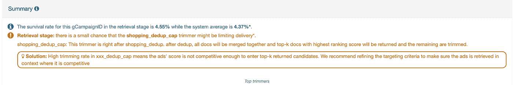

*Fig 6: One-line summary showing which retrieval stage may be limiting delivery*

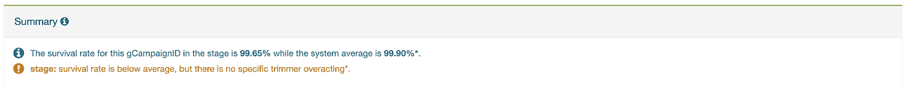

*Fig 7: One-line summary showing that no stage is overacting, suggesting the problem lies in a different system*

如果需要更多的技术理解，我们还添加了关于端到端系统的详细文档，以及广告漏斗中的每个阶段，它的作用，以及在特定阶段出现意外或不良行为时推荐的解决方案。

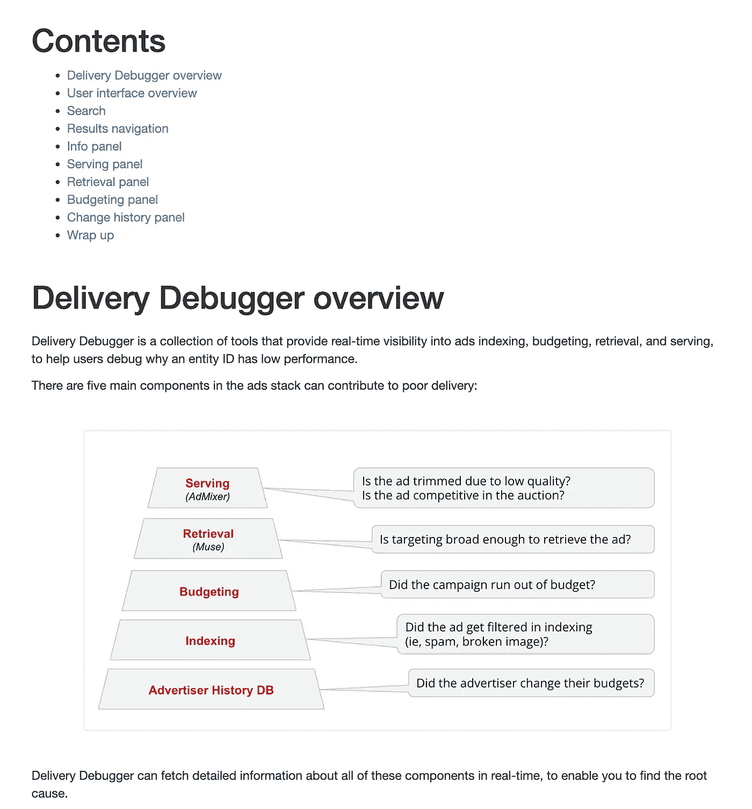

*Fig 8: Delivery Debugger technical documentation*

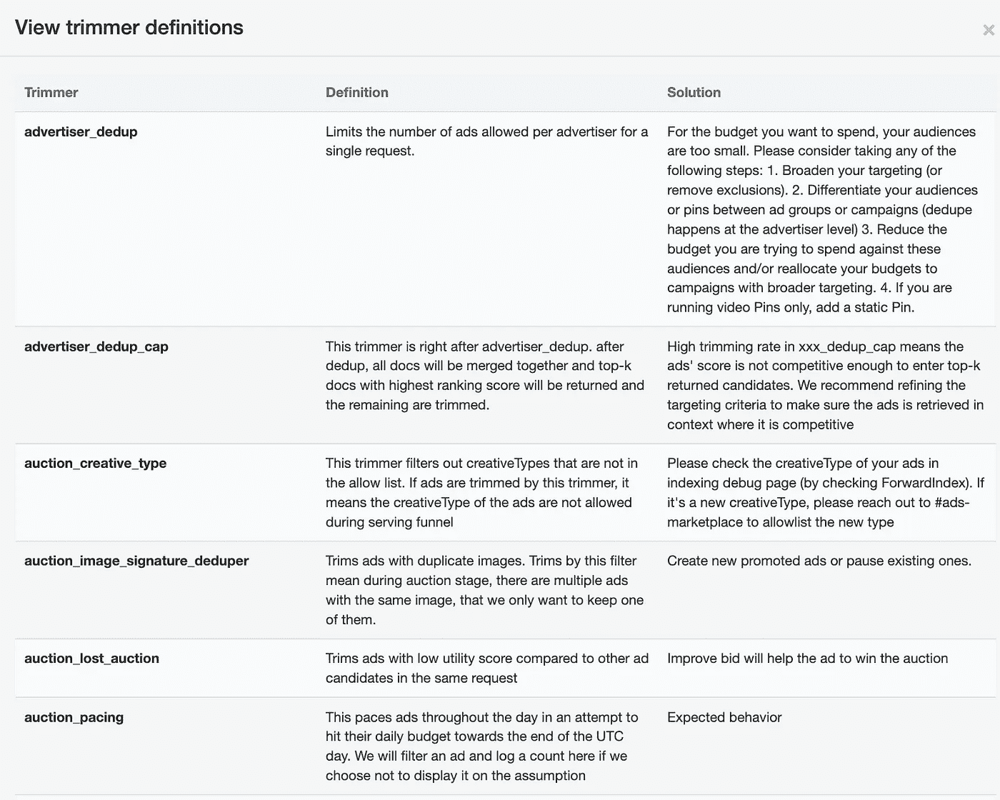

*Fig 9: Definitions and recommended solutions for each stage in the ad delivery funnel*

# 影响

2021 年，我们的客户运营团队共收到 7270 张罚单，其中只有 78 张需要上报给工程团队进行进一步调查。这意味着 99%的故障单都是在没有工程团队任何支持的情况下解决的。有趣的是，我们在客户运营团队中的合作伙伴说，由于交付调试器工具，至少 60–70%的票证由他们的团队独立解决，他们每天都依赖于该工具。

此外，在 2021 年，提出第一个解决方案(向广告商发送分析和建议)平均需要 47 个小时，完整的解决方案需要 67 个小时。

另一个清楚表明 Delivery Debugger 影响的指标是需要上报给工程团队的原始票据数量:2019 年 110 张，2020 年 106 张，2021 年只有 78 张。随着我们继续迭代该工具，对专用工程支持的需求正在下降，允许团队将更多的时间花在更大的项目上，而不是调试。

最后，对于升级到工程团队的票证(如图 10 所示)，只有 2%的错误没有解决；从图 11 中可以看出，我们 90%的时间都达到了固定的服务级别协议。

我们的交付调试程序现在每月被工程和非工程团队的数百名 Pinterest 员工使用，以高效地分类和解决广告交付错误。我们很高兴能够继续让这个工具更强大，让我们的团队在未来变得更加有效。

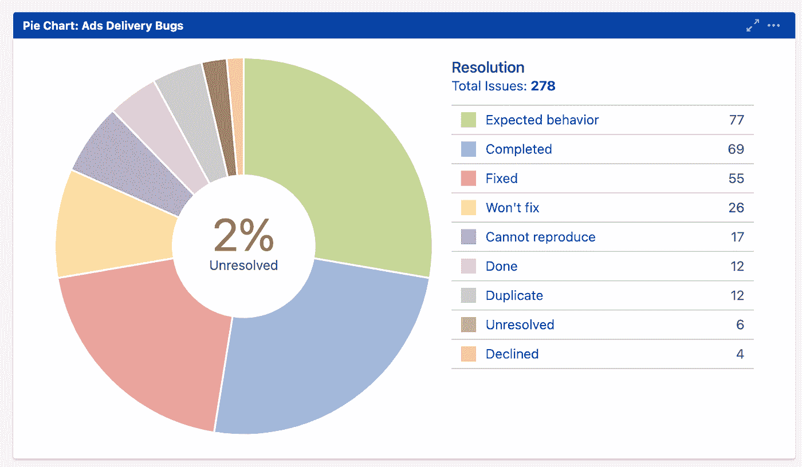

*Fig 10: Breakdown of ad delivery bug ticket status*

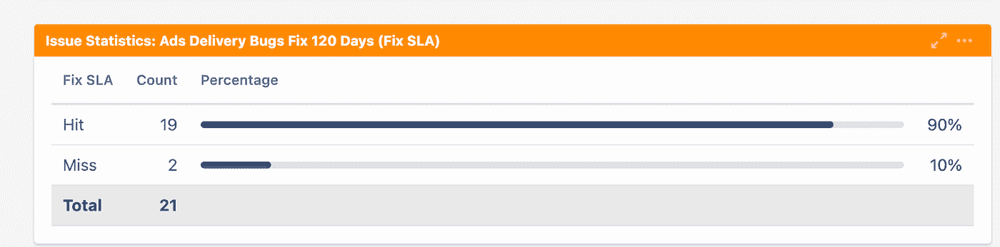

*Fig 11: Ad delivery bug fix SLA metrics*

# 未来的改进

虽然我们已经为许多系统增加了承保范围，但仍有扩展空间。我们的下一步将是添加广泛的检查来分类预算问题，并提供预算变更如何影响交付的单行摘要。在此之后，我们计划扩展我们的工具，以覆盖广告定位配置，以分流因定位规格太窄或太宽而导致的交付问题。随着我们的系统和产品变得越来越复杂，不断需要改进我们的交付调试器，以保持我们的广告推荐系统具有高水平的可观察性。

# 承认

这个项目是多个团队中几个工程师努力工作的结果。特别感谢王泽宇，他在 3 年多的时间里构建了这个工具和底层框架，也感谢丹妮尔·拉扎，在过去的一年里，他接管了所有权并不断更新，以跟上不断变化的业务和产品需求。此外，我还要感谢 Sreshta Vijayaraghavan、Zack Drach、Alexander Rhee、Kenny Valdivia、Alejandro Iglesias、刘明思、ani kite ket kar、胡成成、Shawn Nguyen、Sameer Bhide、Andrei Curelea、谢旦、刘海臣、杨韬、张数、周慧清、徐昂、Filip 亚罗什、王伟鸿、叶明 Shi、Keshava Subramanya 以及工程团队中的其他许多人所做的贡献。我还要感谢我们客户运营团队的合作伙伴，Rivy Obinomen，Erika Martin，Katie Apple 和其他许多人，感谢他们持续的支持和反馈，帮助提高了交付调试程序的质量。

*要在 Pinterest 了解更多工程知识，请查看我们的* [*工程博客*](https://medium.com/pinterest-engineering) *，并访问我们的*[*Pinterest Labs*](https://www.pinterestlabs.com/?utm_source=medium&utm_medium=blog-article-link&utm_campaign=roy-june-24-2022)*网站。要查看和申请空缺职位，请访问我们的* [*招聘*](https://www.pinterestcareers.com/?utm_source=medium&utm_medium=blog-article-link&utm_campaign=roy-june-24-2022) *页面*