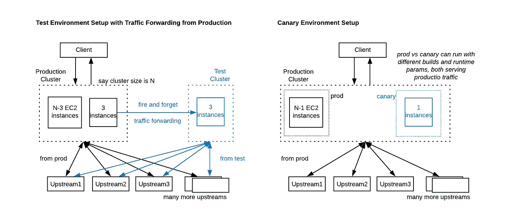
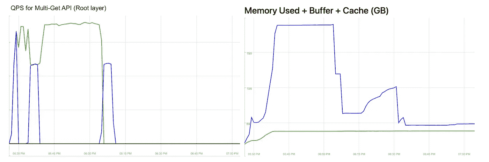
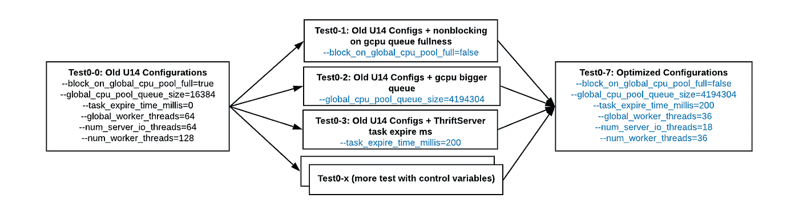
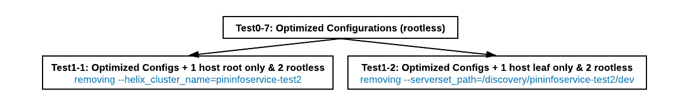

# 调试 PininfoService Ubuntu18 升级中的死锁:第 1 部分，共 2 部分

> 原文：<https://medium.com/pinterest-engineering/debugging-deadlock-in-pininfoservice-ubuntu18-upgrade-part-1-of-2-116bce917ea2?source=collection_archive---------4----------------------->

作者:李康南|关键价值系统软件工程师

Unblock deadlock for PininfoService

这是由两部分组成的博客系列的第一部分。第二部分[此处](/pinterest-engineering/debugging-deadlock-in-pininfoservice-ubuntu18-upgrade-part-2-of-2-f49b654bff37)。

阅读本系列的两个部分将让您深入了解我们在 Pinterest Engineering Key Value Systems 团队(从之前的服务系统衍生而来的团队)中使用的一些调试技术。在 [Terrapin](/pinterest-engineering/open-sourcing-terrapin-a-serving-system-for-batch-generated-data-7aa2f38c4472) 、Rocksplicator ( [1](/pinterest-engineering/open-sourcing-rocksplicator-a-real-time-rocksdb-data-replicator-558cd3847a9d) 和 [2](/pinterest-engineering/automated-cluster-management-and-recovery-for-rocksplicator-f1f8fd35c833) )、 [Aperture](/pinterest-engineering/building-a-dynamic-and-responsive-pinterest-7d410e99f0a9) 和 [Realpin](https://www.youtube.com/watch?v=MtFEVEs_2Vo&ab_channel=MetaDevelopers) 的博客和演示中可以看到该团队拥有的相关项目。

在这个系列中，我们将内容划分如下:

第一部分

*   如何设置**测试/金丝雀环境**
*   如何用**控制变量**设计测试
*   如何设计针对**根/叶的测试(即路由/持久层)分离**

第二部分

*   如何生成**堆转储**
*   如何使用 **GDB** 调试正在运行的进程

Pinterest 是一个月活跃用户超过 4 亿的平台，这意味着工程师有机会大规模解决大数据问题。PininfoService (PIS)是 Pinterest 众多后端服务之一。

PininfoService 是一个*无根*只读缓存服务，为每个集群每秒 1000 万个批处理请求提供服务，以支持 Pinterest Homefeed、相关 pin 和其他服务。它从各种源数据服务(即上游)获取客户定义的信号，并以定制的生存时间(TTL)保存数据。

**注:**在本文中，我们用 ***根、叶、无根*** 来对系统架构进行分类。**根，**也叫*路由层，*负责路由请求和聚合响应。**叶子** *(即持久层)*负责序列化/反序列化 thrift struct 数据，并写入、获取本地缓存存储。**无根**——在**无根**架构中，每个节点同时充当根和叶的角色。每个节点充当根角色，接收作为根请求的客户端请求，并基于数据分布图(即碎片图)；同时，每个节点还接收和处理作为叶请求从根节点路由的请求，以与高速缓存交互并检索源数据。

# 背景

随着 Ubuntu14 在 2019 年达到其生命周期的终点，我们的任务是为 PIS 将操作系统从 Ubuntu14 (U14)升级到 UbuntU18 (U18)。让这变得困难的是，我们的许多系统都是有状态的，这意味着简单的集群轮换不是一个可行的选择。因此，我们认为就地升级对我们的可用性影响最小。

为了确保无缝升级，我们将升级过程分为三个步骤:

1.  更改服务代码，使其与 U18 兼容；
2.  使用暗流量部署 U18 服务构建，以确保可比较的结果；和
3.  将 U14 实例就地升级到 U18。

我们已经成功地采用了这个三步流程来就地升级超过 10，000 个有状态服务实例。

由于我们还没有支持完整克隆(例如[特使影子镜像](https://blog.markvincze.com/shadow-mirroring-with-envoy/))的架构来测试生产集群的数据和流量，我们设计了两个子步骤(测试+金丝雀环境)来验证 U18 版本:

**测试环境:**一个具有期望的构建和运行时配置的测试集群。生产环境中的一些主机被放入一个单独的池中，以“一劳永逸”的方式将可控百分比的流量转发到测试集群。

金丝雀环境:一些主机被放入“金丝雀”环境中。这个 canary 环境继续为相同数量的生产流量提供服务，同时使我们能够部署不同的构建和运行时配置。

***Scheme 1.*** Test/Canary environment setup.

# 观察和假设

## 从生产集群到测试集群的暗流量。

在使用测试设置( ***方案 1)*** 进行测试期间，我们从测试集群中观察到以下两个问题:

1.  QPS 下降到 0
2.  内存使用不一致。根据配置，PIS U14 生产主机通常使用 160–200 GB 内存。在测试集群上，一些主机停滞在<50GB while some increased to ~500GB causing OOM.

First we needed to determine: **这是两个独立的问题，还是由一个底层问题引起的？** 收集测试主机的 *QPS 跌落*和*内存使用*的时间线和统计数据，还不能确定这两个问题是否由一个底层问题引起。

***Graph 1.*** Stats of two U18 hosts with test environment setup in *Scheme1*.

## 假设

考虑到上述问题，我们调查了以下问题以帮助探究这些问题:

*   **U18 语法变化是否存在代码 bug？** *这是通过反复检查代码变化排除的，一个 U18 升级代码变化的例子，参考*[*rocksplicator/pull request 336*](https://github.com/pinterest/rocksplicator/pull/336)*。*
*   **运行时配置需要重新调优吗？** *缓存服务需要根据所提供的硬件进行调整，以最大限度地适应生产流量，这种情况并不少见。*
*   **根还是叶，是哪一层的问题？**
*   **内存泄露？** *考虑到内存使用有时会增加到 500GB，导致 U18 主机上出现 OOM，可能会引入一些内存泄漏，或者 U14 中的一些现有内存错误直到 U18 才会触发。(参见本系列****part 2****)*

# 实验和分析

我们的下一步是设计实验来测试和验证上述假设。在排除了一个代码错误之后，我们通过重新调整运行时参数和分离根/叶层来获得提示，集中精力缩小有问题的部分。

在进行实验时，我们尝试用 [*控制变量*](https://en.wikipedia.org/wiki/Control_variable) **。**如果假设是因素 A 导致了问题，我们设计测试来保持非因素 A 不变，只改变因素 A。然后，该测试可以表明因素 A 是正相关/负相关还是根本不相关。

## 重新调整运行时配置

基于我们对服务的理解，我们用 ***方案 1*** 中的测试环境设置在八个测试中调优了六个运行时参数:通过调整运行时配置，每个测试运行都在三台主机上执行。使用旧的 U14 配置(即 ***方案 2*** 中的*Test0–0*为对照组:

***Scheme 2.*** Tuning runtime parameters for U18 test environment.

在*Test0–1*到*Test0–6*中，一次调整一个运行时配置，所有测试都获得了更好的结果，这表明(正如**暗示 1** 线程池和这两个问题之间存在某种关联。最终，我们用*Test0–7*完成了调优，与*Test0–0*相比，它提供了迄今为止最好的性能，QPS 下降的频率更低，内存使用量稳定在 200GB。然而，问题并没有完全解决，因此我们决定继续进行其他测试，将*Test0–7*配置作为优化的运行时配置。

## 根/叶隔离

PIS 是无根的，这意味着每个节点既是根又是叶。为了缩小问题的来源，我们对仅根节点或仅叶节点执行了测试。

***Scheme 3.*** Root / leaf isolation test.

在上述*Test1–1*&*Test1–2*中，实验组为“仅根”或“仅叶”主机，而对照组为相同测试环境中剩余的 2 台 U18 无根主机。测试结果显示，仅叶主机上仍然存在问题，而仅根主机不再遇到问题，因此我们缩小了范围，认为叶逻辑更有可能是导致进程崩溃和内存使用不一致的原因。**因此，将使用设置为*Test1–2*进行以下测试(1 个仅叶+ 2 个无根主机)。**

**注:**在*试验 1–2*期间，这两个问题不确定地发生在实验组(即只有叶子)或对照组(即无根)上。因此，执行了几次运行以收集稳定的测试结果。

在第 1 部分中，我们已经回答了在 ***假设*** 部分提出的前三个问题。接下来，我们将重点讨论一些工具辅助的内存调试，这将在本系列的第 2 部分中进行总结。

# 第 1 部分概述

在本文中，我们分享了如何设置测试和 canary 环境来调试服务 U18 升级期间遇到的问题。我们采用**控制变量**来设置测试(*Test0–0*到*Test0–7*)以重新调整运行时配置，这给了我们一些提示，线程池可能与观察到的问题有关: *QPS 降至 0* 和*内存使用不一致—增加或保持低水平*。然后，*Test1–1*和*Test1–2*被设计成缩小问题来自叶层而不是根层的范围。

在第 2 部分中，我们将讨论如何使用工具来探测问题，排除内存泄漏，并最终根据本文中描述的“线程池提示( **hint1** )”来确定问题的根本原因。

# 确认

Key Value Systems 的 U14 到 U18 迁移是工程师 Kangnan Li、Rakesh Kalidindi、Carlos Castellanos、Madeline Nguyen 和 Harold Cabalic 几个月来的巨大努力，总共完成了 7 个服务的 12K 多个有状态实例的升级。特别感谢刘波、Alberto Ordonez Pereira、Saurabh Joshi、Prem Kumar 和 Rakesh Kalidindi 在调试过程中提供的丰富信息和帮助。感谢 Key Value 团队经理 Jessica Chan、技术主管 Rajath Prasad 对这项工作的支持。

*要在 Pinterest 了解更多工程知识，请查看我们的* [*工程博客*](https://medium.com/pinterest-engineering) *，并访问我们的*[*Pinterest Labs*](https://www.pinterestlabs.com/?utm_source=medium&utm_medium=blog-article-link&utm_campaign=kangnan-li-january-21-2022&utm_content=part-1)*网站。要查看和申请空缺职位，请访问我们的* [*招聘*](https://www.pinterestcareers.com/?utm_source=medium&utm_medium=blog-article-link&utm_campaign=kangnan-li-january-21-2022&utm_content=part-1) *页面*