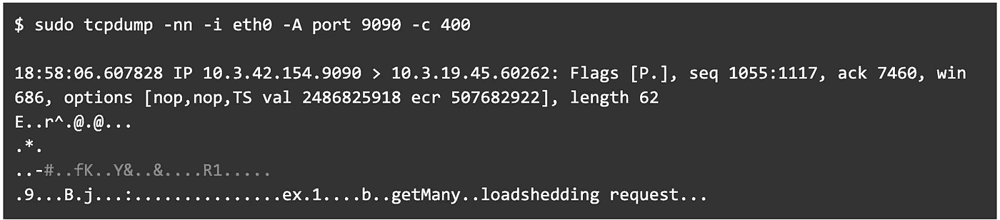
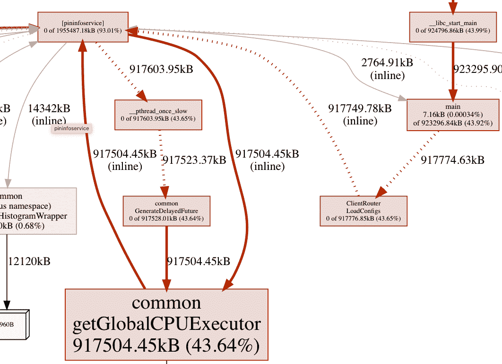
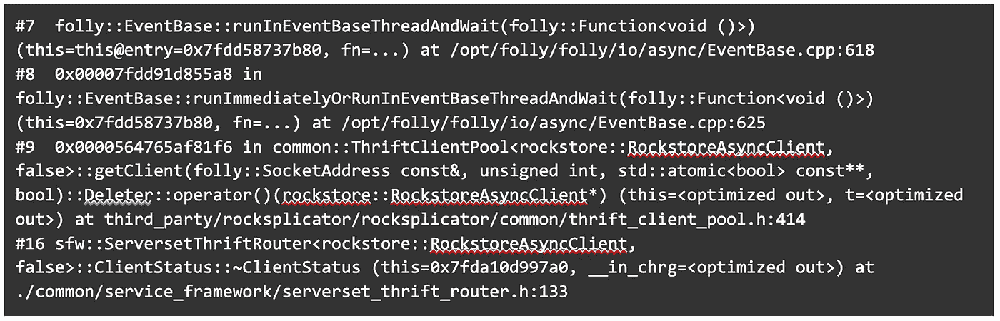
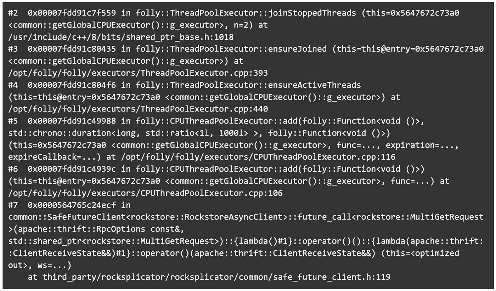
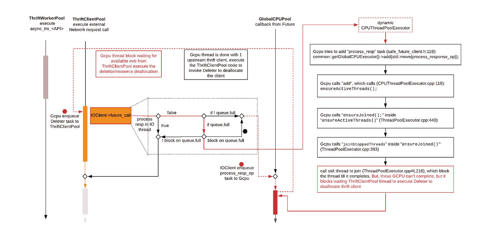
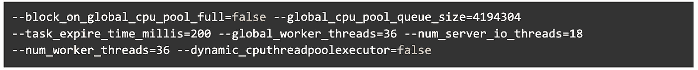

# 调试 PininfoService Ubuntu18 升级中的死锁:第 2 部分，共 2 部分

> 原文：<https://medium.com/pinterest-engineering/debugging-deadlock-in-pininfoservice-ubuntu18-upgrade-part-2-of-2-f49b654bff37?source=collection_archive---------4----------------------->

像做研究一样解决工程问题

李康南|关键价值系统软件工程师


unlock deadlock for PininfoService

这是一个由两部分组成的博客系列的第 2 部分，讲述了在现实世界场景中将有状态系统升级到 U18 的深层系统调试技术。

[在第 1 部分](/pinterest-engineering/debugging-deadlock-in-pininfoservice-ubuntu18-upgrade-part-1-of-2-116bce917ea2)中，我们缩小了观察到的两个问题——QPS 掉线和内存使用不一致——来自 PininfoService 叶层。在本文中，我们将问题进一步缩小到 *GlobalCPUExecutor* (GCPU)，并最终找到问题的根本原因:一个**死锁**。

为了更好地理解请求是如何流入和流出 PininfoService 的，这里简要总结了 PininfoService 中按顺序使用的线程(或池)(也可参考[节约间隔](https://www.avabodh.com/thrift/internals.html)以了解 FB 节约服务器如何工作):

*   *节俭接受线程*:接受来自客户端的连接
*   *thriftopool*:通过 PininfoService 和向 PininfoService 发送请求的客户端之间建立的连接处理数据输入/输出
*   *thriftworerpool*:PininfoService 逻辑中提供的线程管理器，用于处理 aync_tm_ < API >函数调用
*   *GlobalCPUExecutor* :一个全局 CPU 池，用于委派繁重的工作，例如处理来自上游数据存储的响应
*   *ThriftClientPool* :与上游数据存储对话的客户端池

现在，我们将深入探讨如何利用工具来调试观察到的两个问题(QPS 掉线和内存使用不一致)，特别关注内存问题。

# 探究原因:QPS 下降和不一致的内存使用

为了找出 QPS 下降到 0 的原因，我们使用“tcpdump”工具来获得以下跟踪

来自显示从节约服务器卸载的输出包( [tcpdump](https://www.tcpdump.org/manpages/tcpdump.1.html) )。



18:58:06.607828 IP 10 . 3 . 42 . 154 . 9090 > 10 . 3 . 19 . 45 . 60262:Flags[p .]，seq 1055:1117，ack 7460，win 686，options [nop，nop，TS val 2486825918 ecr 507682922]，长度 62
E..r^.@.@……
。*.
..-#..外键(foreign key)..Y &..& ….R1…..
. 9……b . j……:………………例 1……b..getMany..减载请求…

## 使用[五个为什么](https://en.wikipedia.org/wiki/Five_whys#:~:text=Five%20whys%20(or%205%20whys,basis%20of%20the%20next%20question.)进行减载分析

在 Pinterest，我们使用“五个为什么”作为关键的根本原因分析框架。下面是我们如何将它应用到这个场景中:

PininfoService 传出数据包包含“减载”

```
Why? This is likely due to hosts not able to process the amount of thrift requestWhy are hosts not able to process? Thrift server has *active_req (*130K) *> max request (~65K)*, thus load sheddingWhy is there such a high *active_req* queue? High *active_req* could either be due to: 1) traffic increase causing the thrift server overloading, or 2) deadlock which cause requests to be queued up and not passed on to the *ThriftWorkerPool* threads which aim to execute the async_tm_<API> function calls, otherwise QPS stats would have been reported from these API logics.- We are able to rule out 1) since all the system metrics such as CPU, memory are still very low.- Thus, it’s likely a deadlock. But how does deadlock form? We need to investigate and answer this “why”. We turned to the inconsistent memory usage to try to gather more hints into the problem.
```

## 内存使用调试

我们还使用了 [BPF 工具](https://github.com/goldshtn/linux-tracing-workshop/blob/master/bpf-memleak.md)来验证没有检测到内存泄漏。接下来，通过两个工具从内存使用量不断增加的主机获取堆转储:jemalloc/jeprof ( [github](https://github.com/jemalloc/jemalloc/wiki/Use-Case:-Heap-Profiling) )和 tcmalloc/gperftools([Gperftool wiki](https://gperftools.github.io/gperftools/heapprofile.html))。这两个工具为堆转储提供了相似的功能，并生成了相似的结果。

来自 Gperftool 的数据如下所示:



***Graph 2.*** Heap profiling snippet of U18 leaf-only host with Gperftool (tcmalloc)

与健康的 U14 主机相比，来自 GCPU 的这一超高百分比的堆消耗以及上面的"[五个为什么分析](https://docs.google.com/document/d/17yYFBP80F0169Q1bAbw6Aoj81qO4nrJYpU61yL6V9Fc/edit#heading=h.13vvhnlfkzk3)"表明(如**提示 2**)GCPU 可能有"问题"。结合我们在本系列第 1 部分中描述的发现[，线程池运行时参数调优对缓解这两个问题有很大的影响，我们相信线程池可能与这些问题有关，特别是 GCPU。](/pinterest-engineering/debugging-deadlock-in-pininfoservice-ubuntu18-upgrade-part-1-of-2-116bce917ea2)

## 用 GDB 调试

在一次*Test1–2*运行期间， [top](https://man7.org/linux/man-pages/man1/top.1.html) 用于检查经历“QPS 降至 0”的 U18 仅叶主机和健康的 U14 主机的线程状态。虽然健康的 U14 主机有*thriftworperpool*、*thriftwlientpool*和 GCPU 线程主动执行任务并消耗 CPU/内存，但 U18 测试主机的大多数线程都相当空闲。

然后，使用 GDB 来附加“卡住的”PininfoService 进程，以探测线程，如下所示。


需要探测四种类型的线程:

*   *pininfo-thrift* ，*thrift ipool*threads。堆栈跟踪显示空闲。
*   *work-pri-3* ，thriftworerpool*thriftworerpool*线程管理器管理的工作线程。堆栈跟踪显示空闲。
*   “ *g-cpu* ”，来自 GCPU 的线程。堆栈跟踪如下。
*   “ *io- <上游>* ”，线程来自 *ThriftClientPool* 。堆栈跟踪如下。

*检查一个“g-cpu”线程*



g-cpu 线程正在执行来自 ThriftRouter 的代码，thrift router 正在阻塞等待删除一个 *ClientStatus* (即。节俭上游客户端)，其需要将来自 [thrift_client_pool.h](https://github.com/pinterest/rocksplicator/blob/master/common/thrift_client_pool.h#L414) 的*删除器*任务排队到*节俭客户端池*。显然，“*io-rockstorasync*”的 *ThriftClientPool* 不可用，因此 g-cpu 线程正在等待。

*检查 ThriftClientPool 线程“io-RockstoreAsy”*



*ThriftClientPool* 线程正在为 MultiGetRequest 执行一个网络调用，它试图将“ *process_response* ”任务排入 GCPU 队列。它执行 GCPU 代码以**检查**是否需要在该任务入队之前加入停止的 GCPU 线程。然后继续加入已停止的 GCPU 线程，**等待 *std::thread* 上的**加入(阻塞！).但是,“停止”的 GCPU 线程无法成功加入，因为它们正在等待 *ThriftClientPool* 执行 *Deleter* 来释放 GCPU 线程内的 thrift 客户端。因此，GCPU 和 *ThriftClientPool* 互相阻塞等待，形成如下所示的死锁。



***Scheme 4***. Deadlock due to dynamic CPUThreadPoolExecutor

通过检查 git 对 [ThreadPoolExecutor.cpp](https://github.com/facebook/folly/blame/main/folly/executors/ThreadPoolExecutor.cpp#L449) 的指责，可疑的“ThreadPoolExecutor::ensure joined”是大约四年前由 commit ( [68a6b5](https://github.com/facebook/folly/commit/68a6b5b55b177ae5d9c60a65f9e79f3eb57d10af) )添加的，介于我们的 U14 和 U18 folly 版本之间。这个 pull 请求添加了“动态 CPUThreadPoolExecutor”，它在超时后创建 CPUthreads 并加入线程，这很可能就是我们的例子中发生的情况。由于这个动态特性可能被“—dynamic _ cputhreadpoolexecutor = false”禁用，我们通过添加这个标志重新运行测试(重用 [part1](/pinterest-engineering/debugging-deadlock-in-pininfoservice-ubuntu18-upgrade-part-1-of-2-116bce917ea2) 中的*Test1–2*设置)。QPS 保持稳定，内存使用增加到约 200GB 并保持稳定，因此问题(QPS 降至 0 或内存使用不一致)得到解决！通过移除这种“动态 CPUThreadPoolExecutor”更改，当 *ThriftClientPool* 试图将一个“ *process_response* ”任务入队并且 GCPU 队列已满时，它不会因 GCPU 已满而阻塞。入队操作将故障转移到 *ThritClientPool* 线程本身，并完成入队操作，从而防止死锁。

# 将 U18 构建部署到 U14 生产环境的一台主机上

在从测试环境中获得乐观的结果之后，具有以下优化运行时配置的 U18 构建正在向具有一个生产主机的 canary 环境推广(第 1 部分中的 ***方案 1*** ):



这种单主机部署是有意义的，因为在当前生产环境设置中，该主机将接收与所有其他 U14 生产主机相同的流量。在 U18 到 U14 主机之间成功运行了两天多，性能相当之后，我们对整个服务应用了就地升级，并成功升级到 U18，没有任何客户端影响。

# 第二部分摘要

在本文中，我们采用了使用 jemalloc 或 tcmalloc 进行堆转储的工具，这进一步指出了 GCPU 线程池正在消耗额外的堆使用率。最后，我们使用 GDB 来确定死锁，这是由于一个新的特性(即动态 CPUThreadPoolExecutor)是在我们的 U18 docker 映像使用的后来的 Folly 版本中添加的。禁用此功能后，我们能够解决问题并成功完成 U18 升级。

# 教训和最终结果

回顾过去，我们意识到无论是“重新调整运行时参数”测试的结果(如 [**hint1**](/pinterest-engineering/debugging-deadlock-in-pininfoservice-ubuntu18-upgrade-part-1-of-2-116bce917ea2) )还是“内存使用调试”的堆转储(如 [**hint2**](https://docs.google.com/document/d/17yYFBP80F0169Q1bAbw6Aoj81qO4nrJYpU61yL6V9Fc/edit#heading=h.elbxqpjwqs82) )都指出了 GCPU 的问题，而展望未来，我们需要花费大量精力来查明 GCPU 并最终使用 GDB 来找到死锁。

通过禁用动态 CPUThreadPoolExecutor，我们解除了 U18 升级。但仍需解决以下问题:

*   首先是什么原因导致 GCPU 队列爆满？
*   禁用动态 GCPU 队列功能会给我们带来什么好处？

调试让我们持续不断地学习。我们将继续努力解决这些和其他问题，以继续加强我们的技能，加深我们对系统的理解。

总结本案例研究，随着最后一个服务(PininfoService)被解除阻塞并成功升级到 U18，再加上迁移另外约 12K 个有状态实例以提供只读数据的其他努力，我们能够将超过 24K 个有状态实例从 U14 升级到 U18，而没有发生任何影响生产的事件。

# 确认

Key Value Systems 团队的 U14 到 U18 迁移是工程师 Kangnan Li、Rakesh Kalidindi、Carlos Castellanos、Madeline Nguyen 和 Harold Cabalic 几个月来的巨大努力，总共完成了 12K 以上有状态实例的升级。特别感谢刘波、Alberto Ordonez Pereira、Saurabh Joshi、Prem Kumar 和 Rakesh Kalidindi 在调试过程中提供的丰富信息和帮助。感谢 Key Value 团队经理 Jessica Chan、技术主管 Rajath Prasadfor 对这项工作的支持。

*要在 Pinterest 上了解更多工程知识，请查看我们的* [*工程博客*](https://medium.com/pinterest-engineering) *，并访问我们的*[*Pinterest Labs*](https://www.pinterestlabs.com/?utm_source=medium&utm_medium=blog-article-link&utm_campaign=li-march-8-2022)*网站。要查看和申请公开招聘机会，请访问我们的* [*招聘*](https://www.pinterestcareers.com/?utm_source=medium&utm_medium=blog-article-link&utm_campaign=li-march-8-2022) *页面。*