# 在 Android Studio 中调试

> 原文：<https://medium.com/androiddevelopers/debugging-in-android-studio-dfbbf8a8d03c?source=collection_archive---------3----------------------->

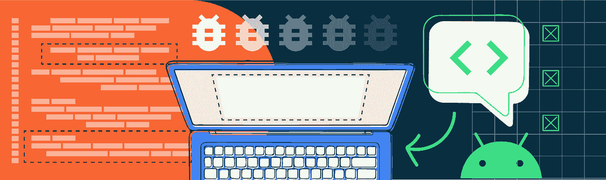

## 在 Android 上更快地消除 bug 的技巧和诀窍

作为开发人员，我们都知道，有时候我们花在调试器上的时间比花在代码编辑器上的时间还要多。考虑到这一点，我最近有机会看看我们的 Android Studio 团队成员有哪些加快调试的技巧和提示。我已经收集了一些最好的，我认为将节省您的时间，并很容易纳入您的调试流程。

虽然您的应用程序可能与我们在这里使用的假设示例游戏应用程序有很大不同，但这些调试技巧将适用于任何应用程序。

如果你想看现场演示，你可以在 YouTube 上找到这篇文章的视频版本[。](https://www.youtube.com/watch?v=rjlhSDhFwzM)

# **日志过滤和折叠**

让我从调试经典的提示开始:`printf` 语句。以一个游戏为例，它记录了每秒的帧数和用户在每局游戏结束时的最终得分。在 **Logcat** 窗口中，这给出:

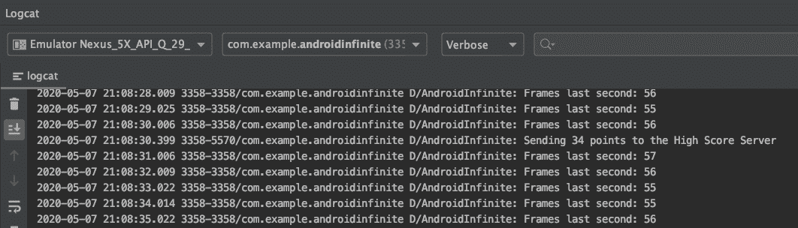

输出中有很多您可能不关心的信息，比如日期和线程 id。您可以轻松配置显示的内容。从 **logcat** 工具栏中，点击**设置**图标，并在**配置 logcat 标题**对话框中，取消选择您不想再看到的信息。

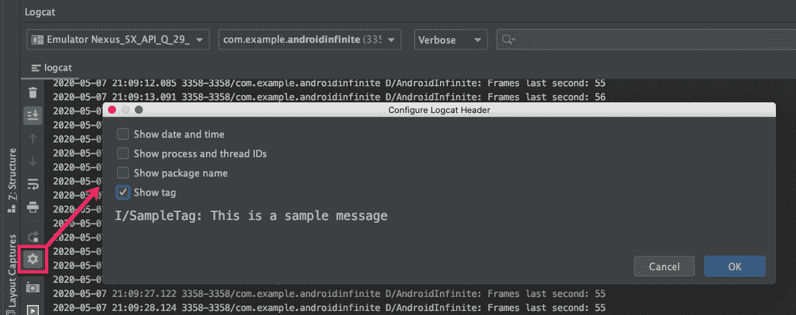

您现在得到了更清晰、更相关的日志输出，如下所示:

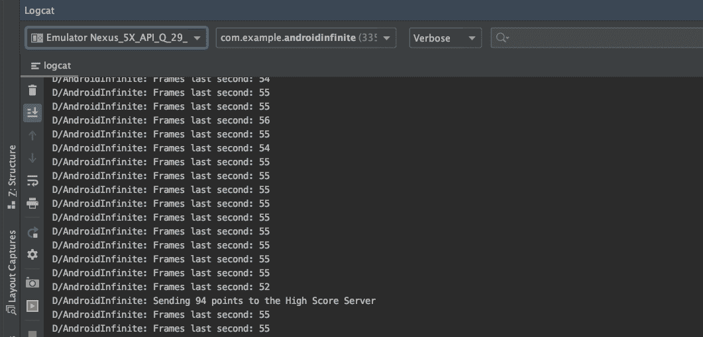

然而，这仍然留下了许多模糊的高分信息。使用 logcat 搜索来关注这些消息。在**搜索**中输入部分调试信息，过滤 **logcat** 窗口。

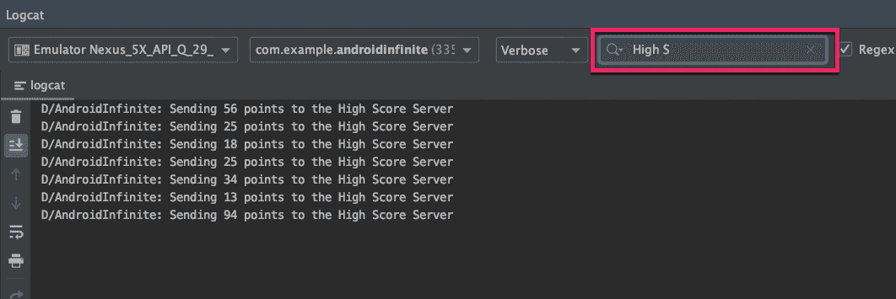

如果这是您经常使用的搜索，您可以通过从**编辑过滤器配置**添加自定义过滤器来保存它。

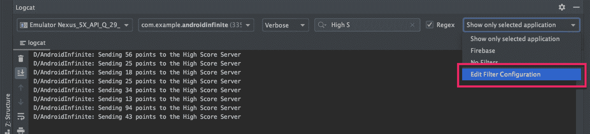

然后，添加过滤器的详细信息。

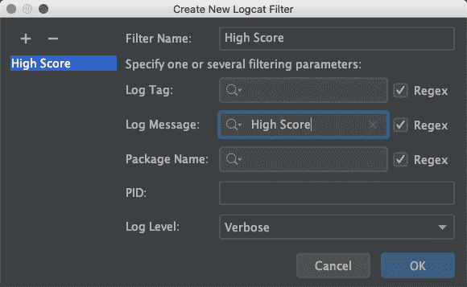

减少日志混乱的另一种方法是使用折叠线功能，该功能将相似的线进行分组和折叠。从日志项中选择一些文本，点击右键，选择**折叠线，像这样**。

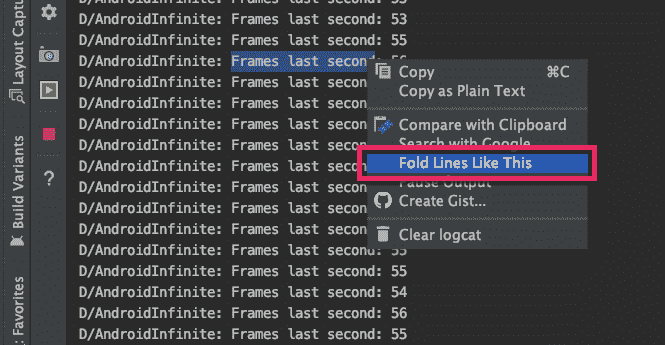

当**控制台**对话框打开时，点击**确定**，包含所选文本的类似消息被折叠。

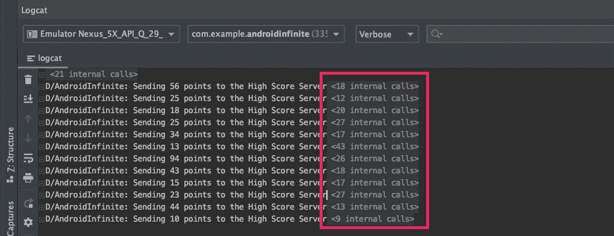

如果您稍后需要查看这些信息，您可以单击这些行来展开它们。还有装订线手柄，使您能够展开和折叠折叠线。

# 附加调试器

通常使用**调试**按钮或菜单选项启动调试会话。但是，如果您通过运行应用程序来启动它，您可以将调试器附加到正在运行的应用程序，而无需重新启动它。为此，点击**将调试器附加到 Android 进程**。

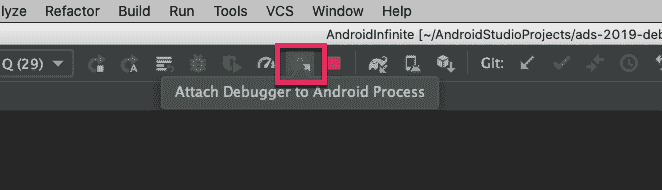

在**选择进程**对话框中，突出显示您想要附加调试器的进程，并点击**确定**。现在，您将像在调试会话中一样开始命中断点。

# 移动断点

如果你发现你在不合适的地方设置了断点，而不是清除并重置断点，你可以把它拖到你关心的那一行。这很有用，因为它保留了断点上的设置，包括我接下来要提到的内容。

# 条件断点

你可能需要追踪一个与你的应用程序或游戏中特定类型事件相关的 bug。例如，在你正在开发的游戏中，当玩家与耗尽他们最后一点生命的物体相撞时，你可能想要停止。您在冲突上设置了一个断点，但现在代码在每次冲突时都会停止。为了避免这种情况，您可以设置一个条件断点。

要设置条件断点，右键单击断点并添加条件。条件可以是等同于布尔值的任何代码表达式。当代码命中该行时，如果表达式的计算结果为 true，断点将被激活。

在这里，在逻辑中当玩家即将与一个物体发生碰撞时，设置一个条件`player.health == 1`可以让你在玩家的生命值降到 0 之前，捕捉到玩家最后一次与物体发生碰撞的时间。

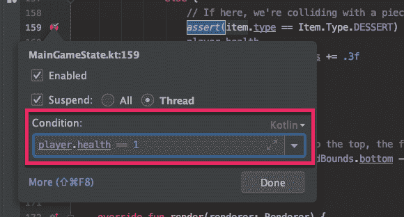

# 从属断点

一个应用程序拥有可以从许多不同路径触发的代码并不罕见。如果您的 bug 只发生在一个特定的路径上，那么在代码中设置断点会导致许多不必要的中断。为了解决这个问题，您可以使用依赖断点，它只在另一个指定断点被命中后触发。例如，您可以创建一个只在您关心的路径中触发的断点，然后将它用作依赖项，这样您的其他断点只在感兴趣的路径中触发。

要设置相关断点，右键单击第二个断点并打开**更多**菜单。在**点击断点前禁用**中，选择您想要依赖的断点。

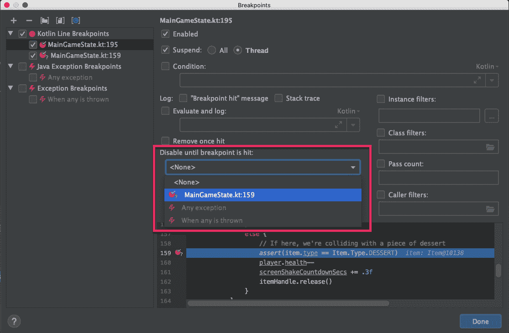

您会注意到断点图标发生了变化:

现在，您只在遇到前一个断点后停止。

如果在其他地方有条件断点，并且希望避免将该条件复制并粘贴到新位置，也可以使用此功能。

# 挂起线程

如果您正在调试多线程应用程序，您会注意到，默认情况下，断点会挂起所有线程。但是，您可能不希望出现这种行为。例如，您可能希望验证您可以阻塞一个线程，而您的应用程序的其余部分仍然工作，或者您希望您的 UI 在您调查后台任务时继续呈现。

要仅挂起当前线程，打开断点选项，在**挂起**设置中选择**线程**。

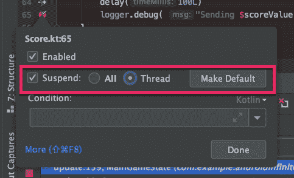

# 评估和记录

有时，您希望看到一些与应用程序状态相关的信息，而不是在断点处停止。您可以在代码中添加`printlns`来实现这一点。您可以使用断点本身来评估和记录，而不是使用这种需要重新编译的方法。

为此，在断点选项中禁用**挂起**并启用**评估和记录**。

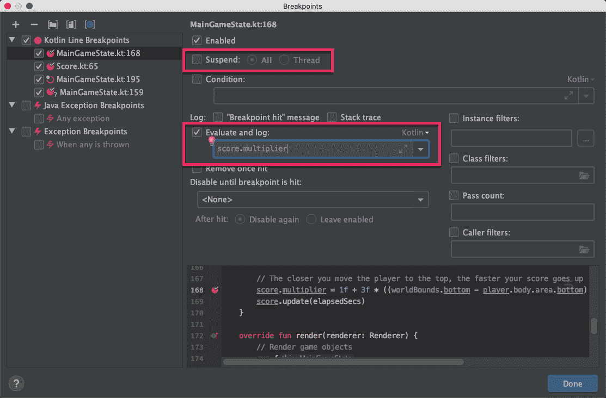

您现在可以添加任何代码表达式，它将被计算并记录到控制台。

如果您只想快速验证您的断点是否被触发，而不关心细节，使用**“断点命中”消息**来记录断点已被命中。甚至有一种快速的方法来创建这种断点:只需按下 Shift 键并在槽中单击。

# 禁用断点

如果您想快速禁用断点，而不是右键单击并取消选择 **Enabled，**您可以点击鼠标中键，或按下`Alt`键(Mac 上的选项)并左键单击，来切换断点的打开和关闭。

# 断点组

您一直在处理一个 bug，创建断点，但发现自己进展甚微。所以你转而研究另一个 bug。然而，很快，您就开始碰到第一个 bug 的断点。碰到不相关的断点可能会令人沮丧，并使您脱离调试流程。

通过使用断点组，您的生活会变得更加轻松。

当你点击第一个不想要的断点时，右击并打开**更多**。您现在会看到所有断点的列表。多选与第一个 bug 相关的所有断点。

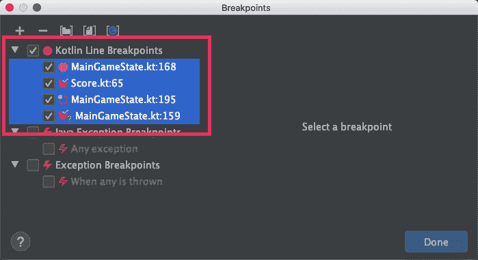

右击选中的断点，点击**移动到组**，然后**创建新的**。给小组命名，也许是以你正在处理的 bug 命名。现在，只需点击一下，您就可以轻松地打开和关闭所有断点。

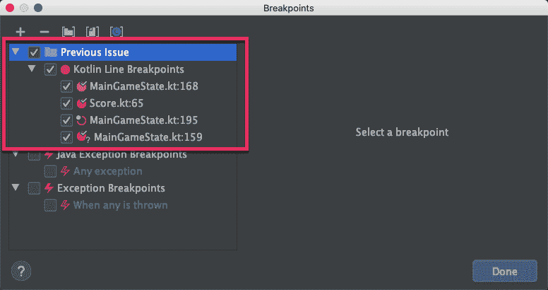

此外，当您处理完 bug 后，可以使用该组删除所有断点。

# 下拉框架

有时候，当你遍历挂起的代码时，你可能会不小心跨过一个方法，而不是进入它。如果你运行的是 Android 10 或更高版本，你现在可以点击调试器工具栏中的**丢帧**返回。

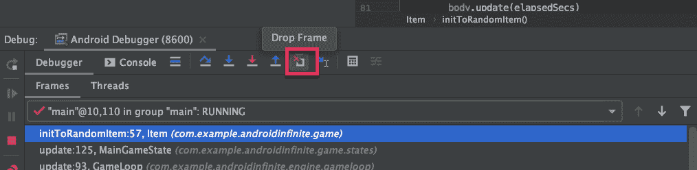

这个特性将您从当前方法中拉出，并使您回到它开始之前的点，给您第二次进入该方法的机会。

这个功能不是“时光机”。如果你正在执行一个长函数，并且它已经完成了很多中间工作，比如修改了当前类的状态，那么当你丢弃这个帧时，这些工作不会被撤销。

# 标记对象

有时候，您希望跟踪一个特定类实例的生命周期，比如这个例子，其中一个项目的 hashcode @10140。

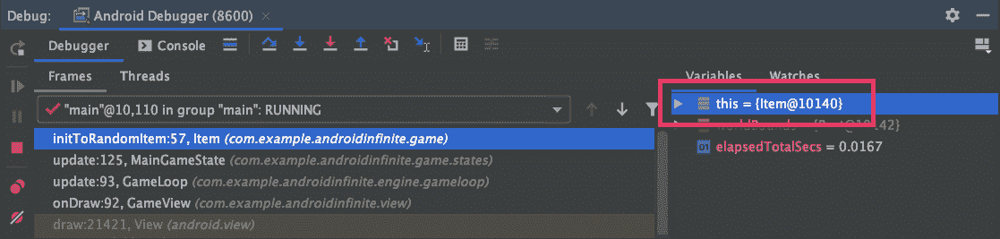

你可能会忍不住拿出一张纸，写下 10140，这样当它再次出现时，你就可以识别它。但是，或者，您可以右键单击该项目，单击**标记对象**，并对其进行标记。

现在，这个标记的对象出现在任何调试窗口中的任何地方，它都有标签，很容易找到。这里，我们将对象标记为“myItem”:

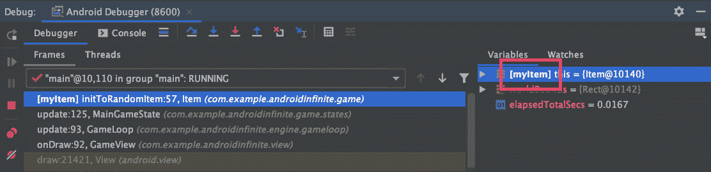

更好地跟踪一个对象的是能够在**手表**窗口中看到它，即使你在一个完全不同的环境中，否则无法到达该项目。无论你在哪里，只要你碰到了一个断点，在**手表**窗口中，添加你的标签，后跟“_DebugLabel”(不要担心记住这个，它会自动完成)。

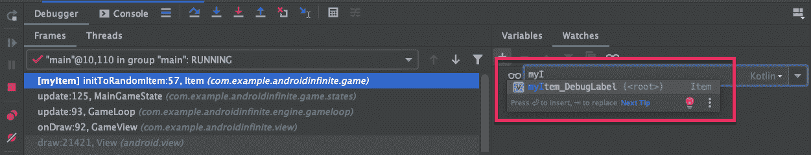

现在，您可以在 **Watches** 窗口中的任何地方跟踪类项目来查看它的状态。

您还可以将此功能与条件断点结合使用。例如，您可以设置一个断点，右键单击它，并设置条件来检查有标签的对象。

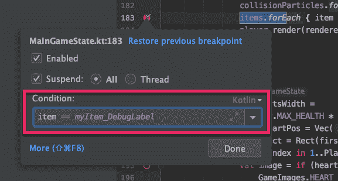

现在，代码会在正确的位置中断，而不是单步执行多个断点，直到特定的项实例在范围内。

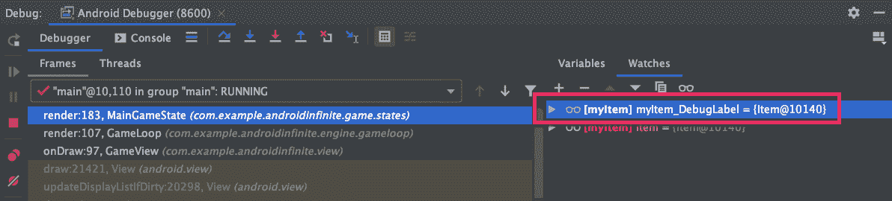

# 评估表达式

虽然**变量**和**监视**窗口对于监视显式值很有用，但有时您希望更自由地探索您的代码，这就是评估表达式的特性发挥作用的地方。当您在断点处时，从调试器工具栏中的**评估表达式**访问此功能。

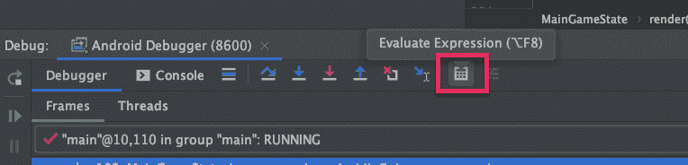

在**表达式**文本输入中，输入任意表达式，按**求值**进行求值。此外，如果您评估一个对象，评估后您可以在**结果**部分浏览该对象。

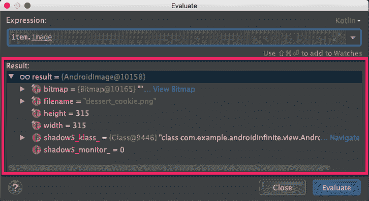

“计算表达式”对话框可能会以单行模式打开。点击**展开**，可以轻松展开成多行。

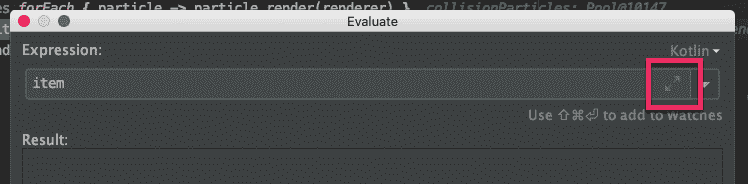

现在，您可以输入复杂的多行表达式。这些可以包括变量和 if 语句等。

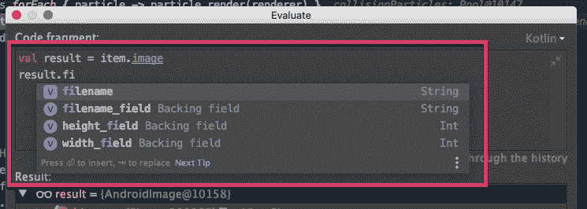

# 应用更改

当你有一个计算表达式的条件断点时，即使你没有在那个断点处停止，调试器仍然必须进行计算。如果你在一个非常紧密的循环中运行一些代码，比如游戏中的动画处理，这会导致应用程序不稳定。尽管条件断点很有用，但这可能是一种边缘情况，在这种情况下，您不能依赖它们。

解决这个问题的一种方法是在代码中添加条件表达式，并使用 no op 表达式，这样就可以附加断点。

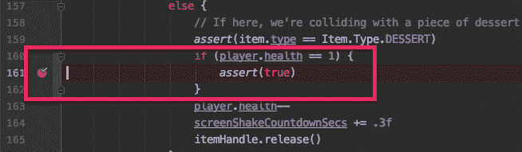

完成这些后，你可能会决定重启你的应用程序并点击**调试**。但是，除此之外，当运行在 Android 8 和更高版本上时，您可以使用**应用代码更改**。

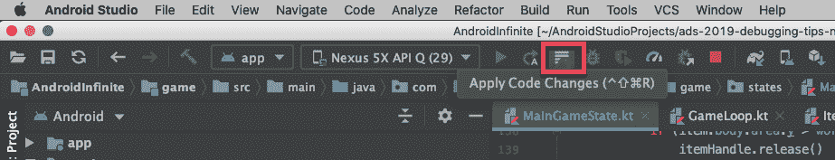

现在，您的代码已经用嵌入的表达式修补好了。但是，您会在**框架**窗口中看到，您更新的方法被标记为**过时**。

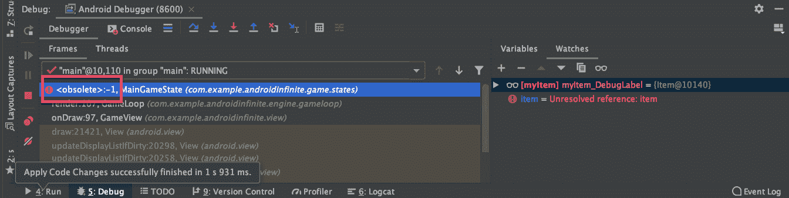

这是因为新代码已经打了补丁，但是你的调试器仍然指向旧代码。您可以使用丢帧功能离开旧方法，进入新方法。

虽然在这种情况下我们不需要它，但是还有第二个选项，**应用更改并重启活动**。与 **Apply Code Changes** 不同，该选项还会重新启动活动，这在您修改了布局资源或者您试图调试的代码位于`onCreate`方法中时非常有用。

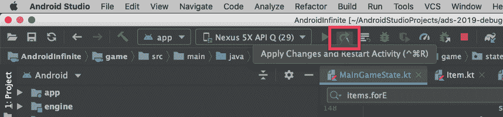

# 分析堆栈跟踪

尽管有这些提示和技巧，不幸的是，您可能会在代码中遇到错误并得到错误报告。当您收到这些错误报告时，报告者可能已经包含了异常堆栈的文本副本。您可以在 Android Studio 中使用 **Analyze** 菜单中的 **Analyze Stack Trace 或 Thread Dump** 将这些转换成有意义的信息。

此工具提供了一个粘贴堆栈跟踪的位置，但是它会自动填充剪贴板中的任何文本。

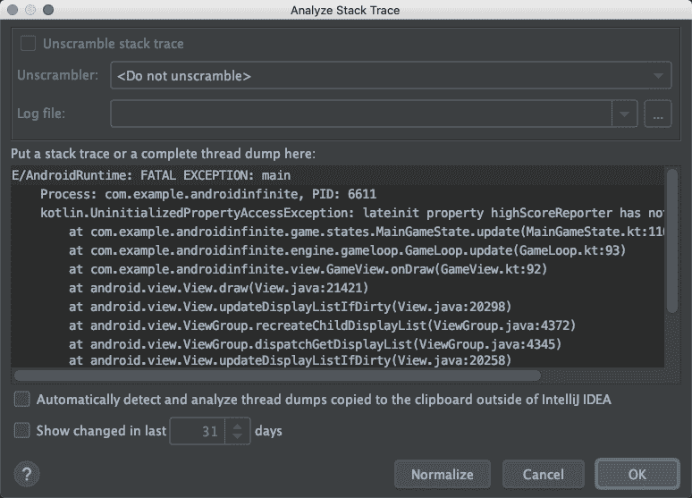

点击 **OK** ，完整注释版本的堆栈跟踪被添加到控制台。

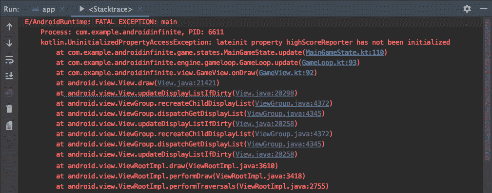

您可以一眼看出哪些代码来自您的代码库(上面以蓝色突出显示)，哪些代码您可能不需要关注(以灰色突出显示)。而且，你可以点击链接快速浏览你的代码库。

# 最后的话

这些只是可以用来加快调试速度的一些技巧和窍门。我们没有时间在这里详细讨论的几个例子包括:

*   在调试模式下，单击装订线中的行号运行到该行。
*   `Ctrl+drag`复制一个断点。
*   您可以在函数的右大括号上设置断点。
*   您可以在字段和属性上设置断点(称为“字段观察点”)。
*   您可以在接口方法上设置断点，以中断其所有实现。

还有几个与此主题相关的链接，您可能想查看一下，包括:

*   [数据视图控制数据在调试器中的显示方式](https://www.jetbrains.com/help/idea/debugger-data-type-renderers.html)
*   [如何使用和理解开销页签](https://www.jetbrains.com/help/idea/monitor-debugger-overhead.html)
*   [APK 调试](https://goo.gle/2BOk5mb)
*   [IntelliJ IDEA 调试代码](https://goo.gle/2NnbA79)
*   [安卓工作室:2019 年 1 月发布的小技巧](https://goo.gle/3630bBZ)