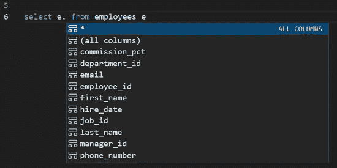

# 使用 Visual Studio 代码调试 PL/SQL(以及更多)

> 原文：<https://medium.com/oracledevs/debugging-pl-sql-with-visual-studio-code-and-more-45631f3952cf?source=collection_archive---------0----------------------->

针对 VS 代码 21.4.0 的 Oracle 开发人员工具中的新特性


Debugging PL/SQL from inside Visual Studio Code

在[早期的博客文章](/@christian.shay)中，我介绍了[Oracle Developer Tools for VS Code](https://marketplace.visualstudio.com/items?itemName=Oracle.oracledevtools)，这是 Oracle 对 Visual Studio 代码的免费扩展，支持使用 Oracle 数据库和 Oracle 自治数据库编辑和执行 SQL 和 PL/SQL(以及更多内容)。由于 Visual Studio 代码可以在 Linux、macOS 和 Windows 上运行，任何 Oracle 开发人员都可以使用这个扩展。

许多 Oracle 开发人员使用 Visual Studio 代码编写访问数据库的 Python、Java 或 C#应用程序，从代码中调用 PL/SQL 存储过程或函数。使用 Oracle Developer Tools for VS 代码，您可以编辑存储过程和函数，并对它们进行测试。然后，您可以将相应的 SQL 脚本与您的应用程序代码一起签入源代码控制。我希望你安装这个扩展(如果你还没有的话，[注册一个 OCI 自由层账户](https://signup.cloud.oracle.com/?language=en&sourceType=:ex:tb:::::RC_WWMK220209P00057:Medium_debuggingPLSQL_w_vscode&SC=:ex:tb:::::RC_WWMK220209P00057:Medium_debuggingPLSQL_w_vscode&pcode=WWMK220209P00057))并试用它！

我们已经在每个版本中添加了很多新特性，我们最近的 21.4 版本也不例外。在今天的博客中，我将重点介绍 21.4 版本的主要特性，从一个真正令人兴奋的特性开始:我们新的 PL/SQL 调试器。

## 从 Visual Studio 代码调试 PL/SQL

我们在 21.4 中添加的 PL/SQL 调试器使用了[同样出色的 VS 代码调试基础设施](https://code.visualstudio.com/docs/editor/debugging)，如果您已经在 VS 代码中调试过任何其他语言，例如，设置断点、查看、更改和监视变量值，以及查看堆栈，您就已经很熟悉了。您应该对 PL/SQL 调试器如鱼得水。

只需设置断点并通过 Oracle Database Explorer 运行，输入任何所需的参数值，就可以调试过程、函数或程序包。PL/SQL 调试器还可以监听对存储过程或函数的调用，并在调用它们时开始调试 PL/SQL。任何应用程序(任何机器上使用任何编程语言的 web 应用程序或命令行)都可以调用 PL/SQL 来启动调试会话。例如，您可以调试由驻留在远程 web 服务器上的 web 应用程序调用的存储过程。或者，您可以使用 Visual Studio 代码来调试 Java (JDBC)代码，并在 JDBC 应用程序调用存储过程时继续调试，从而进入 PL/SQL 代码。当您调试完 PL/SQL 后，您可以无缝地继续调试 Java 代码。

要试用我们的调试器，您需要[安装扩展并在 Oracle Database Explorer](https://www.oracle.com/database/technologies/appdev/dotnet/odtvscodequickstart.html) 中创建到您的数据库的连接。(在这个第一版中，PL/SQL 调试将适用于除自治数据库之外的任何数据库——但是 ADB 支持即将到来)。

第一次使用时，您需要配置 PL/SQL 调试。在 Oracle 数据库浏览器中，右键单击一个连接名，选择 ***PL/SQL 调试器和编译器设置*** *。*


在打开的对话框中，设置调试器将使用的 IP 地址和端口号范围(Oracle 数据库将使用该 IP 地址和其中一个端口连接回您的计算机)。


The database will connect back to the VS Code debugger on this IP using a port in this port range

在同一个对话框的屏幕下方，您将看到一个方便的 SQL 脚本，您可以复制它，以便轻松地授予必要的调试权限和配置数据库 ACL，以便它可以连接回 VS 代码。复制脚本然后右击 Oracle Explorer 连接节点并选择 ***打开新的 SQL 文件*** 。将脚本粘贴到新文件中，根据需要进行修改，然后在编辑器中点击右键，选择 ***执行所有*** 来运行命令。


You’ll need to grant debugging privileges and set up an ACL the first time you use the debugger

您应该只需要在每台机器上运行这个脚本一次，除非 ACL 中提供的 IP 地址或端口需要更改。

要调试的 PL/SQL 过程或函数必须使用调试信息进行编译。在 Oracle 数据库浏览器中，右击过程/函数/包，从菜单中选择 ***编译调试*** 。Oracle Explorer 图标会发生变化，提醒您在完成调试后发出 ***编译器*** 命令，将它们恢复到非调试状态。


You’ll need to do a “Compile Debug” on the PL/SQL program units. Note the “DBG” added to the icon.

一旦完成了这一步，就可以开始调试了！右键单击您想要调试的程序/函数/包，从菜单中选择 ***打开*** ，或者 ***打开包体*** 。根据需要设置断点(在第一版中不支持条件断点)。然后，要开始调试，从同一菜单中选择 ***单步执行*** 在 PL/SQL 的第一行停止，或 ***运行调试*** 运行到您设置的第一个断点。系统会提示您输入过程或函数需要的任何参数，然后您就可以进行调试了！


Open the PL/SQL, set breakpoints, then choose “Run Debug” or “Step Into”.

## 调试由 SQL 脚本或应用程序调用的 PL/SQL

正如我提到的，PL/SQL 调试器还可以监听对过程、函数或包的调用，并在它们被调用时开始调试它们。任何应用程序(web 应用程序或命令行，使用任何编程语言，在任何机器上)都可以进行 PL/SQL 调用，或者可以通过在 VS 代码中运行的 SQL 脚本来调用。


Start the debugger listener

要启动调试器监听器，右键单击任意连接名称并选择 ***启动外部应用程序调试器*** 。调试控制台将显示正在使用的 IP 地址和端口号。把这些记下来，因为你一会儿会需要它们。


Make a note of the IP and port being listened on

## 从 SQL 脚本调用存储过程或函数

从 Visual Studio 代码中执行 SQL 和 PL/SQL 脚本很容易，在该 SQL 脚本中，您可以调用想要调试的过程或函数。为了进行测试，在 Oracle Explorer 中右键单击一个连接并选择 ***打开新的 SQL 文件*** 。


在调用要调试的存储过程或函数之前，在 SQL 脚本中添加以下行:

```
**exec DBMS_DEBUG_JDWP.CONNECT_TCP(‘ip address’, ‘port’);**
```

例如:

```
**exec DBMS_DEBUG_JDWP.CONNECT_TCP(‘127.0.0.1’, ‘65000’);** 
```

IP 地址和端口号应该与您刚才记下的调试控制台中报告的值相同。

在调用 PL/SQL 并完成调试后，在脚本中的某个位置添加以下行:

```
**exec DBMS_DEBUG_JDWP.DISCONNECT();** 
```


我建议您突出显示这些连接和断开命令，并从 SQL 编辑器菜单中选择 ***书签 SQL*** 。这将把它们存储在您的 Oracle Developer Tools for VS 代码书签列表中，以便您可以在任何时候使用 SQL 脚本进行调试时轻松地将它们粘贴到脚本中。

如前所述，在 Oracle Database Explorer 中右键单击要调试的过程或函数，并从菜单中选择 ***打开*** 或 ***打开包体*** 。根据需要设置断点。当您运行 SQL 脚本时，您应该在调试控制台中看到一条消息，说明: ***一个数据库已经连接到主机上的 PL/SQL 调试器:< youripaddress >和 port:<your port>****。*这表明 Oracle 数据库已成功连接回 Visual Studio 代码，调试可以开始了。幸运的话，您的断点将被触发，您将像冠军一样进行调试！


This lets you know the database successfully connected back to the debugger

## 调试应用程序调用的 PL/SQL

您可能有一个调用存储过程或函数的应用程序(也就是 web 应用程序或命令行，使用任何编程语言，在任何机器上)。该应用程序可能会传递大量数据，可能会使用包含数千个元素的关联数组，而只有一部分数据会导致 PL/SQL bug 出现。用来自应用程序的实时数据来调试 PL/SQL 并修复这个 bug 不是很好吗？为什么，是的，它会！

有两种方法可以做到这一点。最简单的方法是在 app 连接数据库之前设置一个环境变量，***ORA _ DEBUG _ JDWP***。

ORA_DEBUG_JDWP 环境变量包含调试器侦听的主机/ip 和端口号。格式是:

```
***host=HostorIPaddr;port=portnum***
```

例如，(从 Windows 命令外壳):

```
***SET ORA_DEBUG_JDWP=host=127.0.0.1;port=65000***
```

或者，在 VS 代码中的 [launch.json](https://code.visualstudio.com/docs/editor/debugging#_launch-configurations) 文件中:

```
"configurations": [
    {
       "env": {
       "ORA_DEBUG_JDWP": "host=127.0.0.1;port=65000" 
        }
    }
]
```

这个环境变量在数据库连接时由 Oracle 客户机代码自动读取并发送到数据库，然后数据库使用主机和端口连接回 VS 代码调试器。使用 Oracle(胖)客户端的任何平台上的任何 Oracle 应用程序或应用程序驱动程序都支持环境变量，例如 ODBC、Python (cx_Oracle)、ODP.NET 非托管驱动程序、Oracle 调用接口和 SQL*Plus 等 Oracle 工具。它还受到 ODP.NET 托管驱动程序和 ODP.NET 核心的支持。目前唯一不支持它的驱动程序是 JDBC 瘦(但是我有一个针对 JDBC 开发者的解决方案，稍后我会谈到)。

我不建议在系统级别设置这个环境变量。相反，您应该尝试将它定位到感兴趣的特定应用程序的环境中，例如，在 VS 代码项目中的 launch.json 文件中。使用系统环境变量，每个新的 Oracle 连接都将尝试连接回调试器，即使在调试器关闭并且不再侦听之后。这将导致许多令人讨厌的 ***ORA-30683:无法建立与调试器*** 的连接错误。

为了演示如何使用这个环境变量，我将使用无处不在的熟悉工具 SQL*Plus。但是我可以使用任何连接到数据库的应用程序。

确保在我的 ORAMAG 中设置了断点之后。IS_PRIME 程序包函数，我将把 ORA_DEBUG_JDWP 环境变量设置为我们启动调试器侦听器时在调试控制台中报告的值。然后，我将使用数据库的连接字符串启动 SQL*Plus。在 SQL*Plus 提示符下，我执行存储函数，SQL*Plus 冻结，没有返回任何结果。为什么？因为我的断点已经命中！


Setting the ORA_DEBUG_JDWP environment variable before SQL*Plus connects to the database

和以前一样，我可以逐句通过 PL/SQL 代码，当我完成时，控制将返回到 SQL*Plus。


## 奥拉 _ 调试 _JDWP 环境变量的替代变量

有些情况下，使用 ORA_DEBUG_JDWP 环境变量并不适合您。正如我前面提到的，JDBC 瘦还不支持它。或者，您可能无法在建立连接之前设置环境变量，这在某些 web 应用程序中肯定会发生。

在这种情况下，只要您能够修改您的应用程序代码，您就可以简单地调用 **DBMS_DEBUG_JDWP。CONNECT_TCP** 在您希望触发断点之前的某个时间点。

在我的 JDBC 应用程序中，我添加了这样一个例程:

```
private void startPLSQLDebugging(Connection conn, String host, String port) throws SQLException {String sql = "CALL DBMS_DEBUG_JDWP.CONNECT_TCP(?,?)";
    try (CallableStatement callStmt = conn.prepareCall(sql)) {

      callStmt.setString(1, host);
      callStmt.setString(2, port);  
      callStmt.execute();
    }catch (SQLException sqlEx) {
      Util.showError("Error:", sqlEx);
      sqlEx.printStackTrace();
    } 
  }
```

然后，在执行我希望调试的 PL/SQL 存储过程或函数之前，我调用这个例程。


Debugging a JDBC app and the PL/SQL stored function it called

当完成调试时，我同样调用 **DBMS_DEBUG_JDWP。断开()。**

我应该提到，如果您是唯一一个将调用存储过程或函数的人，您可以简单地修改 PL/SQL 本身。例如，我可以将这一行添加到存储过程中:

```
DBMS_DEBUG_JDWP.CONNECT_TCP('127.0.0.1', '65000');
```

并将其添加到 PL/SQL 中的其他地方:

```
DBMS_DEBUG_JDWP.DISCONNECT();
```

您在这两个调用之间设置的任何 PL/SQL 断点都将触发 VS 代码调试器。如果任何人或任何东西可能正在使用存储过程，您可能不希望像这样修改 PL/SQL，因为如果您的调试器停止侦听，它们将触发您的断点或获得 ORA-30683 错误！

我很快会写一些独立的博客文章，带你在调试 PL/SQL 的同时，用 VS 代码调试 JDBC、Python 和 C#应用程序。订阅我的博客，以便在这些演练发布到这里时得到通知。

## 21.4 中增加了更多好东西:智能感知

21.4 中有很多好东西。首先，我们做了大量工作来改进 SQL 和 PL/SQL 编辑器中的智能感知。 *IntelliSense* 是微软所说的一组代码自动完成功能，比如 autocomplete。当您键入 SQL 或 PL/SQL 时，会得到弹出的建议，如列名、表名或存储过程或函数中的参数列表。然后，您可以用箭头键选择您想要的选项，然后按 tab 键接受建议。这真的加快了你写剧本的速度！

在 21.4 中，我们改进了 SQL 片段的解析，大大提高了弹出建议的质量。此外，我们添加了对表和视图别名的支持。我们还添加了一个 ***(所有列)*** 选项来显式包含选择列表中的每一列。



IntelliSense providing a list of column names for an alias

## 悬停、转到并查看您的 SQL 和 PL/SQL

Visual Studio 代码有一些很棒的代码导航和洞察特性，特别是悬停、转到和查看。在 21.4 中，这些特性现在可以与 SQL 和 PL/SQL 一起使用。

要尝试这一点，请在您的 SQL 或 PL/SQL 中选择一个变量、函数或过程调用，并将鼠标悬停在它上面以查看定义。

例如，我可以将鼠标悬停在对 IS_PRIME 函数的调用上，以查看关于它的详细信息:


右键单击变量、函数或过程，选择 ***转到定义*** ， ***转到类型定义*** ，或 ***转到实现。*** 这将打开一个包含定义或实现代码的新标签页。

我可以右击一个变量并查看类型定义的*:*

**

*由于我选择了***Peek****而不是***Go***，我可以在我当前的编辑器中编辑定义，而不是打开一个新的:**

****

## **选择列表中的用户定义类型**

**Oracle Developer Tools for VS Code 21.4 现在支持选择列表中的用户定义类型(UDT)，任何 UDT 列都使用 JSON 显示。对于那些需要从包含 Oracle Spatial 类型(如 SDO_GEOMETRY)的表中进行选择的人来说，这个特性是个好消息。在下面的屏幕截图中，我从一个名为 CONTACTS 的表中进行选择，该表包含一个名为 CONTACT 的 PERSON 类型的列。人员类型由姓名和电话属性组成。**

****

**Selecting from a table that contains a User Defined Type**

## **支持苹果芯片(ARM64)**

**最后但同样重要的是，对于那些使用 macOS 和 Apple Silicon 的人来说，你需要做的就是安装 21.4.0 并确保。你的机器上是否安装了[NET Runtime 6.0。](https://www.oracle.com/database/technologies/appdev/dotnet/install-dotnetcore-macos.html)**

## **一会儿见…**

**这个版本包括我在这里没有提到的额外特性和错误修复。更完整的列表可在[变更日志](https://marketplace.visualstudio.com/items/Oracle.oracledevtools/changelog)中找到。**

**请试用 21.4.0 版本的 Oracle Developer Tools for VS Code，并在[我们蓬勃发展的社区论坛](https://community.oracle.com/tech/developers/categories/oracle-developer-tools-for-vs-code)上告诉我们您的想法。我希望您能尽快回到这些页面，在 Visual Studio 代码中使用 JDBC、Python 和 C#应用程序进行 PL/SQL 调试。**

# **加入对话！**

**如果你对甲骨文开发人员在他们的自然栖息地发生的事情感到好奇，来加入我们的[公共休闲频道](https://join.slack.com/t/oracledevrel/shared_invite/zt-uffjmwh3-ksmv2ii9YxSkc6IpbokL1g?customTrackingParam=:ex:tb:::::RC_WWMK220210P00062:Medium_debuggingPLSQL)！我们不介意成为你的鱼缸🐠**