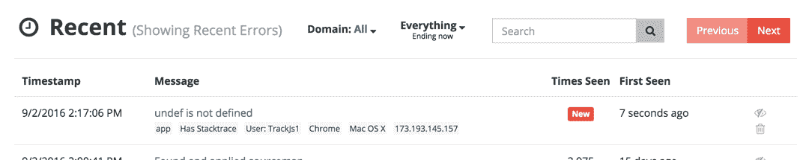

# 调试生产 JavaScript

> 原文：<https://medium.com/javascript-scene/debugging-production-javascript-469668ba247b?source=collection_archive---------1----------------------->

托德·h·加德纳

> **编者按:**最难修复的 bug 是你从未见过的 bug。你可能看不到它们，但也许成千上万甚至数百万的用户每天都会看到它们，在对他们成功使用你的应用程序至关重要的工作流程中。
> 
> 有很多旨在解决这个问题的解决方案，但是很少有错误跟踪服务像 TrackJS 一样为 JavaScript 错误提供如此多的上下文和清晰度。Flux & Redux 用户尤其会喜欢 TrackJS 的上下文特性。
> 
> 偶尔，我们会发现我们强烈推荐的产品或服务，并邀请其背后的公司参与赞助帖子。我很高兴给你带来这篇由托德·h·加德纳赞助的文章。
> 
> 我喜欢读它，并且学到了一些东西。我想你也会的。

网络可能是一个充满敌意的地方，对于一些用户来说，我们的 JavaScript 应用将不可避免地崩溃。浏览器变化、入侵性插件、不稳定的网络，或者仅仅是简单的错误——总会出问题。当它到来时，我们需要做好准备。我们需要知道哪里出了问题，如何解决，否则我们的用户就不会回来了。

[TrackJS](https://trackjs.com/?utm_source=jssource&utm_medium=blog&utm_content=debug)的 JavaScript 错误监控是快速了解您的生产环境的一个很好的选择。微软、Twitter、StackOverflow 和 Atlassian 的团队使用 TrackJS 来快速识别和分类用户 bug。在本文中，我们将了解监控 JavaScript 应用程序的基础知识，以及如何开始调试报告的错误。然后，我们将了解发生错误的最常见原因以及如何识别它们。

# 记录我们的第一个错误

为了从我们的应用程序中捕获错误，我们需要向页面添加 TrackJS tracker 代理。它将包装我们的应用程序和浏览器的 API 来捕捉错误，并将它们发送出去进行规范化和记录。

如果你还没有，那么[获取 TrackJS](https://trackjs.com/signup?utm_source=jssource&utm_medium=blog&utm_content=debug) 的免费试用账户，它会向你展示一个安装代码片段，如下所示:

这不一定要在 *` <头> `* 里，但很可能应该是页面上的第一个脚本。否则，在我们捕获它之前发生的任何错误都不会被报告！还有一个 [NPM 包](https://www.npmjs.com/package/trackjs)，这样你就可以把他们的脚本和你应用的其他部分捆绑在一起。

如果你喜欢在没有 TrackJS 的情况下自己动手，你应该从连接到 *`window.onerror`* 开始。所有浏览器(实际上是所有浏览器)都支持这个全局函数钩子，当浏览器遇到页面上任何 JavaScript 中的未处理错误时，就会得到通知。

Posting an error with jQuery.ajax()

较新的浏览器会给你一个带有堆栈跟踪的 *`Error`* 实例，但是许多较老的浏览器只提供消息、文件和行。像 TrackJS 这样的错误监控库可以通过在更多可能发生错误的地方注入监听器来改进错误收集。

现在我们已经有了一些东西来监听我们的应用程序的错误，让我们确保它正在工作。打开浏览器控制台，尝试如下操作:

你应该会在你的网络调试器中看到一个错误，如果你正在使用 TrackJS，它应该会弹出到你的**最近**错误列表中。

您可能想知道为什么我们需要在示例中放一个 *`setTimeout()`* 。大多数浏览器调试器在其控制台周围创建一个沙箱，以防止错误泄漏到页面中。然而，在我们的情况下，这正是我们正在努力做的！ *`setTimeout()`* 允许我们将错误注入到将在下一个事件循环周期执行的页面中。

# 对错误的剖析

现在我们正在捕捉错误，让我们来看看它们。JavaScript 错误有几种类别，如 *`TypeError`* 、 *`ReferenceError`* 和 *`SyntaxError`* ，但它们都有一些共同的基本结构:

等等，那堆栈呢？奇怪的是，错误堆栈跟踪是一个非标准属性！10 年前的 Internet Explorer 和 6 年前的 Safari 甚至不包括它。即使对于新的浏览器，堆栈跟踪的结构和语法也是不同的。

TrackJS 将自动规范化堆栈跟踪的结构。如果你自己正在构建一些东西，你应该看看 [StackTrace JS](https://www.stacktracejs.com/) ，它可以帮助你获得类似的能力。

# 网络错误

并非所有的 web 应用程序错误都涉及 JavaScript 错误对象。大多数浏览器应用程序会与服务器聊天，有时这种通信会中断。跟踪网络错误是了解最终用户体验的重要部分。

不幸的是，没有标准的方法来描述网络错误。TrackJS 将网络错误记录为网络请求的方法和 URL，以及响应的状态代码。为了保护敏感数据，它不捕获请求或响应正文或标头。如果您正在定制您自己的工具，您可能想要考虑根据您的应用程序的上下文来捕获它

> **提示:**由于 TrackJS 记录传递到控制台的消息，您可以通过将它们写入控制台来添加您自己的请求和响应主体和头。

# 控制台错误

许多第三方 JavaScript 库将错误和配置问题作为 *`console.error`* 消息透露给浏览器控制台。虽然我不同意揭示错误的机制，但这是一种足够常见的做法，当它发生时我们应该知道。

TrackJS 会自动记录传入 *`console.error`* 的消息。如果您想这样做，或者向传递到控制台的内容添加额外的上下文，您可以包装控制台函数。

# 增强错误上下文

TrackJS 自动记录大量的上下文，并为您提供了一个强大的钩子来定义关于应用程序状态的自定义元数据。但真正有趣的是遥测时间线。

遥测是指在错误发生之前，应用程序正在做的所有事情。比如改变状态、发出网络请求或响应用户操作。TrackJS 代理正在记录这种遥测，以便它可以提供导致问题的活动的时间表。这是一种非常好的可视化错误发生方式。

如果您使用的是 Flux 这样的架构模式，这将是一种非常强大的可视化导致错误的状态转换的方式。

# 越过“脚本错误”

您可能记录的第一个错误是*`脚本错误`*。这是由于作为同源策略的一部分，浏览器混淆了来自不同来源的脚本的错误。例如，如果您的脚本是从 CDN 加载的，或者是从第三方引用的，那么源自这些脚本的错误将被删除。

剧本错误烂透了。没有上下文。没有线索。没有迹象表明您的用户会受到什么影响。我们需要尽快解决这个问题，以了解我们真正的问题。

处理脚本错误最兼容的方法是从与页面相同的源加载脚本。您可能会失去 CDN 和多路复用加载的一些性能优势，因此可能会考虑暂时这样做，或者只为一小部分流量这样做。例如，您可以让 10%的流量负载脚本来自同一个来源，并使用此流量进行错误监控。

要获得更全面的讨论、原因和其他解决方案，请查看关于脚本错误的 [TrackJS 博客。](https://trackjs.com/blog/script-error-javascript-forensics/?utm_source=jssource&utm_medium=blog&utm_content=debug)

# 识别和修复错误

一旦我们报告了好的上下文错误，我们就需要实际修复它们。是的，现在艰苦的工作开始了。根据您对应用程序、用户和环境的独特理解，筛选错误取决于您。

# 广义误差原因

我通常首先试图找到错误的一般原因，因为这有助于缩小进一步调试所需的问题范围。这里有一些错误的一般原因和一些线索，您可以在错误数据中查找以识别它们。

## 浏览器兼容性错误

该应用程序在特定(或一组)浏览器中无法正常工作。也许有一个预期的界面或行为并不存在，或者浏览器有意想不到的性能特征。

**症状**:受影响的浏览器基数低。如果有少数浏览器报告了错误，并且您没有用浏览器专门测试应用程序。

**调试使用:**使用报告错误的浏览器提供的开发人员工具来调试兼容性。如果浏览器不提供开发者工具，你可以随时返回到*`控制台`*和*`警报`*。

## 用户配置错误

用户以与应用程序不兼容的方式定制了他们的网络或浏览器环境。这可能包括操纵文档的入侵性浏览器扩展，或者在传输过程中重写内容的网络代理。

**症状:**错误源自不属于您的原始应用程序的不可识别的来源。

**调试方式:**扩展您的错误上下文，记录文档和脚本的内容，作为错误捕获的一部分。将它们与预期的应用程序进行比较，以确定它们是否被操纵过。

## 网络弹性错误

当发生某种网络故障时，应用程序会失败。互联网并不总是可靠的，尤其是在移动网络上，当页面的部分或全部资产无法加载时，应用程序可能会以有趣的方式失败。

在 2016 年谷歌 I/O 大会上，[伊利亚·格里戈利克分享了一项指标，即由于连接或处理限制，1%-10%的移动设备网络请求可能会失败](https://trackjs.com/blog/fast-and-resilient-webapps/?utm_source=jssource&utm_medium=blog&utm_content=debug)。

**症状:**报告 *`TypeError`* 和 *`ReferenceError`* 可能表示基础接口不可用。例如， *`$未定义`*。如果提供这些基础的脚本无法加载，就会出现这些问题。

**调试方式:**使用错误报告检查资产的加载和存在。探索如果关键资产被移除，您的应用程序将如何加载。如果可能，在使用类型之前，为它们构造合理的回退和安全检查。渐进增强仍然是最佳路径。

## 集成误差

web 应用程序的本质要求许多集成在运行时发生在浏览器中。当其中一方改变接口时，这些集成可能会失败。如果您正在调用第三方 HTTP API(如 Firebase)或与第三方 JavaScript 库(如 Stripe)交互，则可能会发生这种情况。

**症状:**在与您自己的发布时间表不一致的特定日期和时间开始报告的错误。当与第三方集成时，请注意他们的变化会影响您的客户的体验。

**调试用:**这应该可以通过运行在你的应用程序中的标准开发工具来调试，比如 Chrome Developer Tools。

## 逻辑应用程序错误

当我们没有其他可责备的东西时，那一定是我们自己的代码。现实世界的异步事件或应用程序状态的边缘情况的定时可能不被考虑。

**症状:**各种

**调试:**记录应用程序的定制上下文，以更好地了解当前状态和时间。

# 勇往直前，构建更好的应用！

JavaScript 发生了，我们需要为它做好准备。当错误发生时，我们需要了解它们以及如何调试它们。

如果您想了解更多调试 JavaScript 错误的信息和演示，请查看我在 NDC·奥斯罗发表的关于 [JavaScript 取证](https://vimeo.com/133137606)以及如何使用 Chrome Developer Tools 对一些特定错误进行分类的演讲。

从我们的生产环境中得到一点反馈，我们的应用程序会变得更好，这真是令人惊讶。通常，只有少数微妙的问题会阻碍应用程序变得伟大。我很乐意帮忙把你的做得更好，并碾碎一些臭虫。[免费获取 30 天的视频。](https://trackjs.com/signup/?utm_source=jssource&utm_medium=blog&utm_content=debug)让我们构建一个更好的网络。

*Todd H. Gardner 是一名 JavaScript 开发人员，也是 track js JavaScript Error Monitoring 的创始人之一，致力于提高 JavaScript web 应用程序的质量和可维护性。当他不在参加技术会议时，你可以看到他在明尼苏达州明尼阿波利斯市品尝最新的餐馆和酒吧。*