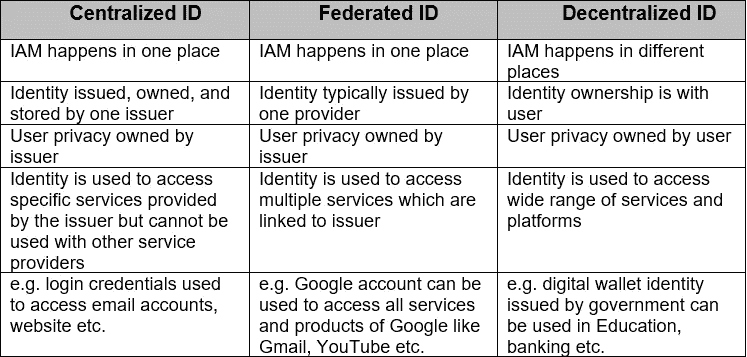
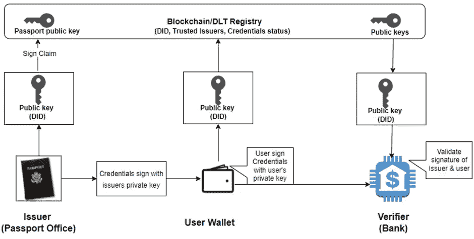

# 使用区块链加强数据隐私的分散式身份管理

> 原文：<https://medium.com/globant/decentralized-identity-management-using-blockchain-to-strengthen-data-privacy-65e1949a7a77?source=collection_archive---------2----------------------->

物理身份由物理文档表示，如护照、政府 id 等。在这些文件的帮助下，任何人都可以表现出你是谁？

但是，现在在数字世界里，大多数人都在向互联网移动。在这个互联网世界里，用数字身份来代表你是谁在线？这些物理文档的数字副本不能作为可靠的来源，因为它很容易伪造。

有三种主要的数字身份管理类型:

*   集中式 ID
*   联合 ID
*   分散 ID (DID)

**分散身份(DID)** :-

分散身份意味着将用户身份的完全控制权交给用户，并在 wallet 中管理该身份，并与可信方共享该身份。在这里，用户可以通过仅向验证者共享所需的信息来管理他的隐私，例如，用户可以仅向验证者共享 DOB，而不共享地址和其他身份信息(声明)。

DID 中使用的以下术语

用户——人的身份

颁发者——谁向用户颁发凭证，用户将凭证存储在数字钱包中

验证者—请求用户证明身份并验证该身份的组织

在了解 DID 是如何工作的之前，让我们快速浏览一下区块链及其在 DID 中的作用

区块链包含相互链接的块列表，并使用前一个块的加密哈希值来保护每个块的安全
。区块链以数字格式存储电子信息。区块链的主要目的是允许数字信息被记录和分发，但不能被编辑。这样，区块链就是不可变分类账的基础，也就是不能被修改、删除或销毁的交易记录的基础。这就是为什么区块链也被称为[(DLT)](https://www.investopedia.com/terms/d/distributed-ledger-technology-dlt.asp)分布式账本技术。

**作品如何**？

用户需要在智能手机上安装身份钱包。这个钱包安全地保存凭证，并用于与发行者和验证者交互。发行者发行可验证凭证并将公钥附加到该凭证上。这个公钥存储在区块链上。

我们要理解的一个重要术语是，什么是索赔？它是一个人的信息，如姓名、地址、出生日期等。这证明了用户身份。这一组索赔被转换成文件，如护照，驾驶执照等。被称为凭证

使用防篡改的加密技术确保可验证凭证的安全。公钥需要使加密元素工作，它作为 DIDs 的一部分存储在注册表中。在 DID 方法的情况下，我们不要求在分类账中存储任何敏感数据，如 PII。分类帐仅作为信任的存储，其中验证者确认由用户发送的凭证由适当的发行者加密签名。

让我们以颁发给在银行、办公室、政府等部门使用的个人的数字护照为例。

1.  政府护照办公室在注册中心生成其自己的 DID，用其私钥签署凭证，其对应的公钥存储在区块链 DLT 注册中心的 DID 中。
2.  签名的凭证被直接发送到用户的智能手机。
3.  比方说，如果我们想开一个银行账户，用户用他/她自己的私钥对凭证进行会签，并将其直接发送给银行。
4.  作为验证者，银行可以参考 DLT 注册中心来确认凭证上的两个签名代表了发行者和用户。

以下是实现 DID 的一些方法

自我主权身份(SSI)(公共区块链) :在这种方法中，用户控制他们持有的[可验证凭证](https://en.wikipedia.org/wiki/Verifiable_credentials)，使用这些凭证需要他们的同意。这要求用户只与验证者共享要求的和必要的数据

企业 DID(私有区块链):-在这种方法中，身份实现在组织内部是私有的。发行者和验证者都留在控制身份数据的组织中。

**词汇**

IAM —身份和访问管理

DID —分散式身份管理

PII —个人身份信息

DLT —分布式账本技术

**关于作者**

[**GLOBANT**](https://community.nasscom.in/user/40196/profile)

作为一家数字化的本土公司，Globant 帮助组织重塑自我，创造前进的道路并释放他们的潜力，是创新、设计和工程达到规模的地方。Globant 是专业服务领域的颠覆者，我们利用数字和认知领域的最新技术和方法来帮助组织在各个方面进行转型。作为数字和认知领域的纯粹参与者，Globant 在北美、拉丁美洲、欧洲和亚洲设有交付中心，我们通过这些交付中心提供对最新趋势和技术的深入了解。超过 23，500 名专业人员分布在 18 个国家，为 Google、Rockwell Automation、Electronic Arts 和 Santander 等公司工作，除了是网络安全技术协议(2019)的成员之外，我们还是哈佛大学、麻省理工学院和斯坦福大学的商业案例研究。欲了解更多信息，请访问[www.globant.com](http://www.globant.com)