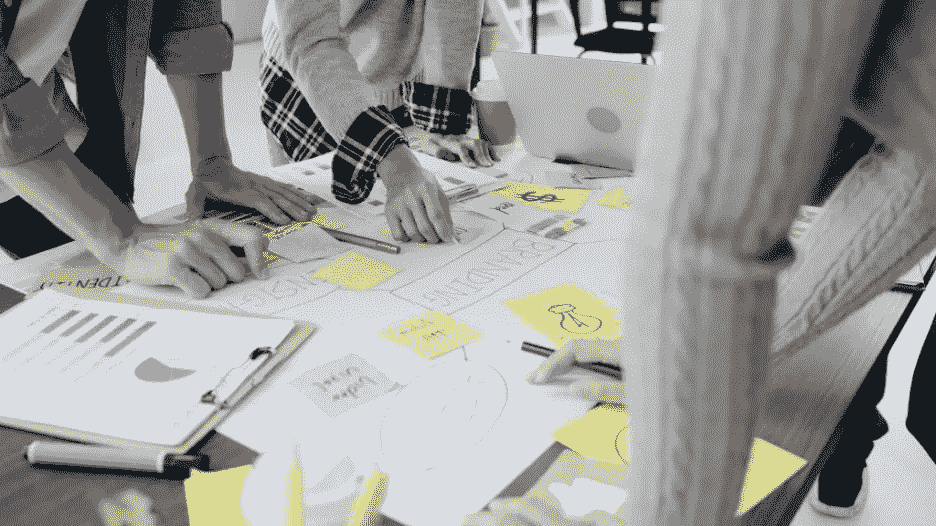

# 决策偏差和软件设计:为什么它很重要

> 原文：<https://medium.com/capital-one-tech/decision-bias-software-design-why-it-matters-2457bdcd8881?source=collection_archive---------1----------------------->

## 理解在软件开发中偏见如何阻碍理性的设计决策

# 介绍

《牛津词典》将偏见定义为*“与另一事物、人或群体相比，偏向或反对一事物、人或群体，通常是以一种被认为不公平的方式。”*许多组织投入巨资对员工进行工作场所偏见教育，包括基于种族、信仰、宗教、性别、残疾或年龄的偏见。但是这些组织经常忽视我们日常决策过程中存在的认知偏差。你可能想知道这可能会导致什么问题。让我们以软件业为例。

在软件行业，我们所做的每件事都有一个强大的反馈因素，帮助我们在新的想法上创新。产品设计师、所有者、软件架构师和开发人员都试图解释这些反馈，将它们局限于他们的工作范围，并得出解决方案。想象一下，如果这些参与者中只有一个人以有偏见的方式做出决定，会出现什么问题？如果不加以解决，这些决策偏差可能会导致不可预见的后果，渗透到我们在工作中如何做出决策，最终影响我们的客户，并随着时间的推移导致昂贵的修复和重构。因此，为了让组织消除这些偏见，在制定决策时，一个可靠的、数据驱动的方法是必要的。

如果您拥有您的业务线或组织的软件设计决策，那么确保您和您的同事对您的设计决策进行彻底的评审，并且实现适当的缓解策略以将任何决策偏差的影响保持在最小是很重要的。

在这篇文章中，我将强调一些在软件设计和开发领域最普遍的，团队领导需要注意的顶级决策偏差和设计偏差。然后，我将介绍一些处理和抵消这些偏见的策略。我的希望是，有了这些信息，你将更好地配备创建健壮的设计建议所需的工具，尤其是围绕建筑和 UX 设计。

# 为什么偏见如此普遍？

《福布斯》杂志最近的一篇关于认知偏见的文章指出:

*“人类的大脑最初是为生存而建造的。为了避免被杀，我们必须在战斗或逃跑之间迅速做出决定。在这种情况下，我们的祖先需要一些信息处理的捷径。选择的选项可能是上次发生这种情况时有效的选项。因此，认知偏见帮助我们中足够多的人活到今天思考这个过程。”*

这个基本的思维过程帮助了我们的祖先几千年，磨练了我们逃跑或战斗的反应。毕竟，一个不带偏见的思考过程需要大量的计算和时间来得出结果。由于在许多生存情况下，时间是一种奢侈品，依靠假设帮助我们的祖先假设一个直接的理解，并继续这种理解，以帮助他们生存。这种简单的认知反应导致许多核心偏见进入我们处理信息和做决定的方式。

快进到今天。当我们设计软件架构时，设计通常是由业务需求发起的，并伴随着严格的时间限制。这给快速设计应用程序增加了压力，这会影响预先收集所有相关信息和潜在选项的能力。虽然许多设计缺陷可以通过软件应用程序开发过程中的迭代开发模型来纠正，但真正的问题在于决策空间。

那么，在从事软件设计时，我们需要注意哪些偏见呢？在这篇文章中，我强调了我在旅途中遇到的一些重要的决策和设计偏见。我还提供了关于如何识别、分析和纠正上述偏见的建议。这篇文章不是所有可能的偏见或陷阱的目录，而是旨在让你在这方面思考。

# 1.锚定偏差

从逻辑上来说，我们在做出决定之前很久就开始收集数据。然而，我们大多数人不会质疑数据从何而来。我们只是简单地相信这些数字，更多的时候，我们的决定是基于这些有时未经证实的信息。[锚定偏差](https://thedecisionlab.com/biases/anchoring-bias/)因此是我们在软件开发中遇到的最基本和最常见的决策偏差。

在 2006 年 1 月的[《HBR 日报》](https://hbr.org/2006/01/the-hidden-traps-in-decision-making)中，工作场所的锚定偏见用下面的例子来说明，*“试图预测来年产品销量的营销人员通常从查看过去几年的销量开始。旧的数字成为锚，然后预测者根据其他因素进行调整。这种方法虽然可能导致相当准确的估计，但往往过于重视过去的事件，而对其他因素重视不够。在市场快速变化的情况下，历史锚会导致糟糕的预测，进而导致错误的选择。”*

根据我在软件开发方面的经验，一个例子是当一个基础设施专家团队的任务是调整他们的基础设施的规模时。想象一下，如果团队考虑最近的一个数据点，而不是验证去年的流量模式、响应时间和基础架构负载，提案中会出现什么样的对比？我还在许多设计中看到锚定偏差，在这些设计中，选择了一种设计模式，却没有理解导致该设计中某些决策的变量。我没有分析特性背后的基本原理，也没有理解保持某种有效性的变量，而是经常看到决策日志声明选择设计的原因仅仅是“遵循标准”

在 Capital One 的加拿大工作室，我召集了一个对这一领域感兴趣的中小企业团队，我们一起举办了一个设计纠纷会议(被称为 2D)，我们的重点不是设计的 ***如何*** ，而是设计的 ***为什么*** 。在建筑设计过程的每一个点上问为什么会从我们的设计师同事那里引出一系列丰富多彩的推理。这有助于团队发现设计决策背后的任何偏见，并在协作环境中提供解决这些偏见的建议。这个过程最好的部分是它是吸引人的，而不仅仅是一个复选框活动。在这些会议中，参与活动的团队和开展活动的团队都有机会从讨论中学习和获得有价值的见解。

## 对于锚定偏差我们能做些什么？

虽然将处理这些偏见的方法内在化是向前推进的最佳方式，但是已经有大量关于如何有效处理锚定偏见的研究。

《今日心理学》[上一篇名为《用三个简单的步骤战胜主播偏见》的文章](https://www.psychologytoday.com/us/blog/stretching-theory/201902/outsmart-the-anchoring-bias-in-three-simple-steps)提出了以下易于实施和采纳的建议:

*   **承认锚定偏差**——理解你可能有偏差，你应该期望在你的判断中发现锚定偏差。每当我参加设计会议时，我都会有意识地提醒自己，我有偏见。这有助于我在清单中添加一点，以识别和解决我可能在解决方案提案中引入的任何偏见。
*   **拖延你的决定** —拖延你的决策过程，总是寻求多种意见。在上面提到的设计分歧会议中，团队创建并签署一份文档，该文档记录了对设计的共识。直到团队的每个成员都签署了提议的建议，我们才标记活动结束，即使这意味着捕捉到一些不同的意见。
*   **放下你自己的锚**——将你经过充分分析的锚应用到你的决策中，如果有新的数据出现，随时准备改变参考点。在我的团队中，当我们提出一个设计建议时，我们总是用一个明确定义的基本原理来补充它。这确保了当基线理由不再成立时，应该重新审查设计。

前面提到的 HBR 的文章包括了我在自己的工作中发现的其他一些有价值的建议:

*   **从不同角度看问题** —最好的起点之一是从多个角度定义和重新定义问题陈述。这给了我们一个很好的视角来看待问题，甚至在进入解决方案之前。在我们的设计分歧会议中，我们从容量、业务优先级、资源技能和时间线的角度描述问题。然后，我们选择一个与演讲者有密切共鸣的陈述，并从那里开始工作。出于存档的目的，其他透视图保留在文档中。
*   **自己思考问题**——在咨询他人之前这样做，以减少他们的偏见对你思考过程的影响。例如，当你参加一个会议时，如果你在参加之前先了解一下议程，你会觉得更有成效。这将真正把你的观点带入讨论中，而不会冒别人的偏见说服你的观点的风险。
*   **拓宽你的参考框架**——试着保持开放的心态，从不同的人那里寻求信息和意见。在我们的设计分歧会议中，我们经常邀请来自多个领域的中小企业来获取他们的意见。虽然我们将法定人数保持在最低限度，比如说 5 名成员或更少，但这些专家带来的独特观点在我们投票支持某项建议时是无价的。
*   **避免固定你的同事**——鼓励你的同事将他们自己的思考过程带入讨论。这对于达成公正的协议至关重要。当你这样做的时候，确保即使你们都不同意，至少在某些方面达成一致。不要让会议以[零和](https://en.wikipedia.org/wiki/Zero-sum_game)约定结束。

# 2.现状偏见

简而言之，[现状偏见](https://www.verywellmind.com/status-quo-bias-psychological-definition-4065385#:~:text=The%20status%20quo%20bias%20is,sociology%2C%20politics%2C%20and%20economics.)意味着我们经常做一些事情，只是为了坚持一个完善的流程，并轻松地避免吸引对自己的审查。在 [HBR 日报](https://hbr.org/2006/01/the-hidden-traps-in-decision-making)中，可以在这段引文中找到对此的清晰解释。“现状陷阱的根源深藏在我们的内心深处，在我们保护自我不受伤害的欲望中。打破现状意味着采取行动，而当我们采取行动时，我们就承担了责任，从而使自己容易受到批评和后悔。不足为奇的是，我们自然会寻找什么都不做的理由。在大多数情况下，维持现状代表着更安全的做法，因为这让我们的心理风险更小。”

世界上第一辆汽车看起来就像它取代的童车。同样，世界上第一份电子报纸的结构类似于已知的手持报纸。虽然坚持“规范”或“标准”没有错，但我们应该确保它不会抑制创新。我见过许多解决方案架构师从其他著名的应用程序中获得灵感，只是因为如果有人质疑他们的设计，这更容易解释。虽然带着完全激进的、不受支持的想法走向另一端可能对组织有害，但仔细承认和分析这种偏见对于深思熟虑的设计和决策过程至关重要。

## 对于现状偏见我们能做些什么？

请注意，我所涉及的大多数偏见都与其他偏见交织在一起。挑出他们或以独特的方式接近他们可能会很有挑战性。关于现状偏见的讨论本身就可以成为一本书，因为在这种偏见下有无数的变化。然而，在分析这些建议之前，理解你的立场是至关重要的:

*   **创建决策日志** —当提出设计时，创建一个清晰的决策日志，记录围绕设计做出的所有关键决策。这些决定将清楚地揭示为什么选择一个选项而不是另一个。在同事的帮助下，你可以看看你是否可以安全地冒险，而不影响你决策的整体意图。在我们的设计分歧会议中，会议从决策日志开始，在那里我们开始描绘给定问题陈述的多个视角。这为我们指明了前进的方向。
*   **成为一个实验组织**——实验应该融入到你的日常工作中。快速失败，更多地失败，并从这些失败中学习，以更快地达到成熟的模型。鼓励团队进行实验，并欣赏来自实验的失败。
*   **避免夸大你的第二个和第三个选择所涉及的成本或努力**——我们经常倾向于夸大我们个人不喜欢的选择的风险，并首先将它们置于一个糟糕的境地。尽量避免根据你的便利来框定选择。从多个角度分析所有选项将有助于一个人在不损害预期结果的完整性的情况下，得出一个可以使用的无偏见的选择列表。
*   **总是评估选项** —在丢弃选项之前，从现在和未来的角度评估选项。让同事参与决策过程，以中和你自己的现状偏见的影响。在我们的设计分歧会议中，当我们提出设计建议时，我们通常会考虑企业中其他团队设定的目标状态愿景。例如，为了在未来使用无服务器技术(例如 AWS Fargate ),我们可能会选择激励我们的团队现在转向容器解决方案(例如 AWS ECS ),以适应当前虚拟服务器实例在控制方面的差异。

# 3.沉没成本偏见

在《思考快慢 一书中，丹尼尔·卡内曼谈到了[沉没成本谬误](https://en.wikipedia.org/wiki/Sunk_cost)。他指出，*“人们不考虑增量投资产生正回报的可能性，而是倾向于‘投其所好’,继续投资于前景不佳、已经消耗了大量资源的项目。这在一定程度上是为了避免后悔的感觉。”*换句话说，即使过去的决定不再有效，我们现在也倾向于根据过去的决定做出选择，以证明我们的行为是正确的。

通过证明我们过去的行为，即使结果被证明是无效的，我们也必须承认错误并继续前进。我认为人们不能为了一棵树而牺牲森林。当我们有意识地选择有益于整个社区的行动时，我们可以很容易地更好地识别这种偏见。

早先引用的《HBR 日报》文章补充道，*“为什么人们不能从过去的决定中解放出来？通常，这是因为他们有意无意地不愿意承认错误。承认个人生活中的一个糟糕决定可能纯粹是一件私事，只涉及一个人的自尊，但在商业中，一个糟糕的决定往往是一件非常公开的事情，会招致同事或老板的批评。如果你解雇了自己雇佣的表现不佳的员工，你就是在公开承认自己的判断失误。让他或她留下来似乎在心理上更安全，尽管这种选择只会加剧错误。”*

这种保护自尊的愿望经常会导致糟糕的决定再次出现。这是迄今为止最容易发现的偏见，但我很少看到有人公开提出这个问题。作为一名领导者，直面这种偏见并确保我们的决策不会对我们服务的客户和社区产生负面影响是非常重要的。

## 对于沉没成本偏差，你能做些什么？

沉没成本偏差在不同的工作职责中有不同的表现形式。因此，将针对您的角色提出的建议内化很重要:

*   **注意你团队中的这种偏见**——注意团队或报告给出的建议中的沉没成本偏见。鼓励在适当的时候重新分配职责，这样团队可以通过确保团队成员轮换工作职责来扩展他们的观点，从而减少证明过去行为的必要性。您可以帮助减少这种偏见。。
*   **不要为你的团队营造一个害怕失败的环境** —我强烈推荐《团队合作——组织如何在知识经济中学习、创新和竞争》这本书，作者是 Amy C.Edmondson。这本书的观点引起了我的强烈共鸣，因为当你的团队处于实验模式时，在失败中证明过去行为的需要不再盛行，因为失败是前进的道路。
*   **从完全不同的专家那里获得见解** —从与意图或解决方案无关的人那里寻求意见。
*   **从不同的角度挑战你的想法** —有意识地寻找新的参考框架，看看如果某些限制不再存在，解决方案会如何变化。

# 4.确认证据偏差

你有没有为了支持一个内在的直觉而四处搜寻信息？你并不孤单。作为一名领导者，有时候你必须对高风险问题做出战略决策。这是一场赌注很高的残酷游戏。如果你没有注意到它，你的大脑会通过寻找支持证据来为你的逃跑或战斗反应做准备，而不是评估数据。以下是前面提到的 [HBR 日报](https://hbr.org/2006/01/the-hidden-traps-in-decision-making)的摘录。

*“这里有两种基本的心理力量在起作用。首先是我们倾向于在弄清楚为什么要做之前下意识地决定我们想做什么。第二是我们倾向于更多地关注我们喜欢的事情，而不是我们不喜欢的事情——这种倾向甚至在婴儿身上也有详细的记录。自然地，我们会被支持我们潜意识倾向的信息所吸引。”*

另一个证实证据偏差的经典例子是从 SDLC 的角度。我们经常看到单元测试试图确认代码是否有效，而不是证明它可能揭示失败的场景。开发人员倾向于用与预期行为一致的数据来测试他们的程序，而不是那些会暴露差距的数据。通常这种差距是通过同行评审来弥补的，但是在编码时理解这一点的价值将有助于将我们的代码质量提升到新的高度。

## 你能为证实证据偏见做些什么？

当你与理解问题陈述和提议的解决方案的团队或同事达成共识时，可以解决确认证据偏差的问题。有几种技术可以用来减轻这种偏差:

*   不要不加质疑就接受证据——总是检查你是否同样严谨地检查了所有的证据。避免不加质疑地接受确认证据的倾向。
*   引入矛盾的想法——试着通过花时间考虑矛盾的想法来挑战你的想法。
*   **依靠数据** —做决策时依靠统计和预测等数据。
*   **避免问诱导性问题**——与他人讨论问题时，避免问可能导致你确认的诱导性问题。例如，不要问类似*“这个设计可以扩展吗？”*使用开放式问题，如*“您能解释一下这个组件的可扩展性吗？”像这样问中立的开放式问题会给你更多的数据来分析和整理。*

# 5.框架陷阱

形成问题陈述的框架会对解决方案的结果产生不利影响。心理学家丹尼尔·卡内曼和阿莫斯·特沃斯基观察到，人们倾向于按照给他们的框架接受问题，而不是重新表述。这个陷阱是最危险的认知偏差陷阱之一，通常也是最难发现的。

此外，这个陷阱可以突出显示到目前为止我们讨论过的所有陷阱。例如，当一个问题被框定为一个得失框架时，观察者通常使用他们的内部风险评估来坚持一个解决方案。这是因为当一个问题被放在一个收益框架中时，观察者被发现是规避风险的。当同样的问题被假设为避免损失框架时，观察者表现出承担更高风险的迹象。

## 对于框架陷阱你能做些什么？

这是我在设计演练中遇到的最常见的陷阱类型。设计的结果受限于观察问题的框架。通常这个框架是由利益相关者或者设计者自己放置的。框架陷阱很容易检测，但需要花费大量时间来解决，因为找到正确的参考框架通常具有挑战性。一个框架不当的问题甚至会破坏解决偏见的最佳努力:

*   **不接受原框架** —不接受张贴问题的框架。尝试从多个引用重新构建框架。在我们的设计分歧会议中，我们从通过多个参考框架捕获问题陈述开始。这有助于我们选择与利益相关者产生共鸣的陈述，并从那里着手。
*   **创造一个中性的框架**——尝试用中性的方式发布问题。如果那个解决方案看起来很理想，涉众可能会被说服重新访问问题陈述。在我们的讨论中，如果我们审查一个带有一组约束的设计，我们会尝试移除其中一个选项中的约束，只是为了给出一个解决方案在一个没有约束的世界中会是什么样子的视角。*请注意，这个观点提供了更多的理由来选择一个在约束边界内发挥作用的理想解决方案，而不是我们推荐的替代选择。*
*   **找到同事看待问题的框架** —当其他人推荐解决方案时，试着理解他们看待问题陈述的框架。

# 结论

在本文中，我们了解了偏见如何影响我们代表组织或客户所做的决策。我们讨论了一些关键的决策偏差和设计偏差，它们会影响我们作为软件开发人员和架构师在日常工作中做出的决策的质量。我们还了解了这些偏见是如何表现出来的，以及它们最初形成的原因。最后，我们介绍了一些推荐的方法，可以帮助我们在工作中减少这些偏见。

像这样的话题在技术领域通常被认为不太重要。虽然所述的偏见问题本质上是心理问题，但在任何涉及人的因素的决策过程中，克服偏见应该是第一步。因此，有必要了解我们作为人类是如何工作的，以确保我们在解决行业挑战的同时做到最好。

如果你已经做到了这一步，谢谢你的时间。我鼓励你做更多的研究，并与他人分享。如果你有兴趣进一步讨论这个话题，请随时在 Twitter ( [@IamSrivatssan](https://twitter.com/IamSrivatssan) )或 Linkedin ( [srivatssan](https://linkedin.com/in/srivatssan/) )上联系我。

[*商务照*](https://www.freepik.com/photos/business) *由 tirachardz—*[*www.freepik.com*](http://www.freepik.com/)创作

# 参考

[1] — [HBR 文章](https://hbr.org/2006/01/the-hidden-traps-in-decision-making)
【2】—[福布斯文章](https://www.forbes.com/sites/forbescoachescouncil/2019/04/17/cognitive-bias-human-brains-are-only-human/?sh=610fb2b977be)
【3】[—设计心理学](https://growth.design/psychology/)
【4】—[HBR 十大必读](https://learning.oreilly.com/library/view/hbrs-10-must/9781422191439/Text/00_Cover_Page.html)
【5】—[思考的快与慢，来自亚马逊的书](https://www.amazon.com/dp/0374275637/ref=cm_sw_em_r_mt_dp_4PXYA0EE7QSM6VMP1KQQ)

*披露声明:2021 资本一。观点是作者个人的观点。除非本帖中另有说明，否则 Capital One 不隶属于所提及的任何公司，也不被这些公司认可。使用或展示的所有商标和其他知识产权是其各自所有者的财产。*

*最初发表于*[*【https://www.capitalone.com】*](https://capitalone.com/tech/culture/understanding-decision-bias/)*。*