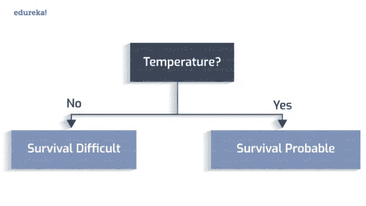
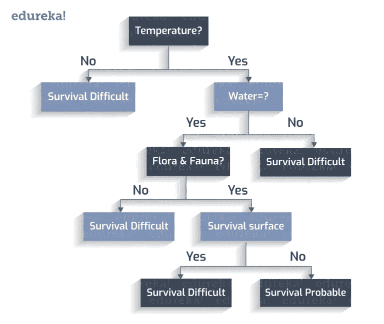

# 如何创建完美的决策树？

> 原文：<https://medium.com/edureka/decision-trees-b00348e0ac89?source=collection_archive---------0----------------------->

How To Create A Decision Tree? — Edureka

***决策树*** 在现实生活中有很多相似之处，它影响了**机器学习**的广泛领域，涵盖了**分类**和**回归**。在决策分析中，决策树可以用来直观、明确地表示决策和决策制定。

因此，我将在这个博客中概述以下内容。

*   什么是决策树？
*   决策树的优点和缺点
*   创建决策树

# 什么是决策树？

决策树是一系列相关选择的可能结果的映射。它允许个人或组织根据成本、概率和收益来权衡可能的行动。

顾名思义，它使用类似于树的决策模型。它们既可以用来推动非正式讨论，也可以用来设计一种算法，从数学上预测最佳选择。

决策树通常从单个节点开始，分支成可能的结果。这些结果中的每一个都会导致额外的节点，这些节点会分支到其他可能性中。这使它呈树状。

有三种不同类型的节点:机会节点、决策节点和终端节点。由圆圈表示的机会节点显示了某些结果的概率。决策节点(用正方形表示)显示了要做出的决策，而端节点显示了决策路径的最终结果。

# 决策树的优缺点

## 优势

*   决策树生成可理解的规则。
*   决策树在不需要大量计算的情况下执行分类。
*   决策树能够处理连续和分类变量。
*   决策树清楚地表明了哪些字段对预测或分类最重要。

## 不足之处

*   决策树不太适合于以预测连续属性的值为目标的估计任务。
*   决策树在分类问题中容易出现错误，类别多，训练样本相对较少。
*   决策树的训练在计算上可能很昂贵。生成决策树的过程在计算上很昂贵。在每个节点上，在找到最佳分割之前，必须对每个候选分割字段进行排序。在一些算法中，使用字段组合，必须搜索最佳组合权重。 ***修剪算法*** 也可能很昂贵，因为必须形成并比较许多候选子树。

# 创建决策树

让我们考虑一个场景，一群天文学家发现了一颗新行星。现在的问题是，它是否可能是“下一个地球”这个问题的答案将彻底改变人们的生活方式。嗯，真的！

要做出明智的决定，有 n 个决定因素需要彻底研究。这些因素可以是地球上是否存在水，温度是多少，表面是否容易发生连续的风暴，植物和动物是否能在气候下生存，等等。

让我们创建一个决策树，看看我们是否发现了一个新的栖息地。

适宜居住的温度在 0 到 100 摄氏度之间。

是否存在水？

动植物是否繁盛？

这个星球有一个多风暴的表面？

因此，我们有一个决策树。

# 分类规则:

分类规则是将所有场景都考虑在内并为每个场景分配一个类变量的情况。

## 类别变量:

每个叶节点被分配一个类变量。一个类变量是导致我们决策的最终输出。

让我们从创建的决策树中导出分类规则:

1.如果温度不在 273 到 373K 之间，->生存困难

2.如果温度在 273 到 373K 之间，并且没有水存在，->生存困难

3.如果温度在 273 到 373K 之间，有水存在，而动植物不存在->生存困难

4.如果温度在 273 到 373K 之间，有水，有植物和动物，并且没有风暴面->可能存活

5.如果温度在 273 到 373K 之间，有水，有植物和动物，并且有风暴面->生存困难

## 决策图表

决策树有以下组成部分:

*   根节点:在这种情况下,“温度”因素被视为根。
*   内部节点:具有一条输入边和两条或多条输出边的节点。
*   叶节点:这是没有向外边缘的终端节点。

现在构建了决策树，从根节点开始，我们检查测试条件并将控制分配给一个输出边，因此再次测试条件并分配一个节点。当所有的测试条件都指向一个叶节点时，就说决策树是完整的。叶节点包含类别标签，用于投票支持或反对决策。

现在，你可能会想，为什么我们从根的“温度”属性开始？如果选择任何其他属性，构造的决策树会有所不同。

正确。对于一组特定的属性，可以创建许多不同的树。我们需要选择最佳的树，这是通过遵循算法的方法来完成的。我们现在将看到“贪婪方法”来创建一个完美的决策树。

# 贪婪的方法

贪婪方法基于通过在每个节点做出最优局部选择来解决启发式问题的概念。通过做出这些局部最优选择，我们在全局范围内达到近似最优解。”

该算法可以概括为:

1.在每个阶段(节点)，挑出最好的特征作为测试条件。

2.现在将节点分割成可能的结果(内部节点)。

3.重复上述步骤，直到所有的测试条件都被排到叶子节点。

当你开始实现算法时，第一个问题是:*‘如何挑选起始测试条件？’*

这个问题的答案在于*、【熵】、*、【信息增益】、*的值。让我们看看它们是什么，以及它们如何影响我们的决策树创建。*

**熵:**决策树中的熵代表同质性。如果数据是完全同质的，熵为 0，否则如果数据被分割(50–50%)，熵为 1。

**信息增益:**信息增益是节点分裂时熵值的减少/增加。

属性应该具有最高的信息增益以被选择用于分裂。基于熵和信息增益的计算值，我们在任何特定步骤选择最佳属性。

让我们考虑以下数据:

从这些属性集合中可以形成 n 个决策树。

## 树创建试验-1:

这里，我们将属性“Student”作为初始测试条件。

## 树创建试验-2:

同样，为什么要选择*‘学生’？*我们可以选择*‘收入’*作为测试条件。

# 用贪婪方法创建完美决策树

让我们遵循“贪婪方法”,构建最优决策树。

这里涉及到两个等级:*‘是’*即这个人是否买电脑，或者*‘否’*即他没有买电脑。为了计算熵和信息增益，我们正在计算这两类的概率值。

“肯定:对于‘buys _ computer = yes ’,概率为:

“否定:对于‘buys _ computer = no ’,概率为:

D 中的熵:我们现在通过在上面陈述的公式中输入概率值来计算熵。

我们已经对熵值进行了分类，它们是:

熵=0:数据是完全同质的(纯的)

熵=1:数据被分成 50- 50 %(不纯)

我们的熵值是 **0.940** ，这意味着我们的集合几乎是*不纯的*。

让我们深入研究，找出合适的属性，并计算信息增益。

**如果在“年龄”上分裂，什么是信息增益？**

该数据代表了有多少人属于特定年龄段，购买和不购买该产品。

例如，对于 30 岁或以下的人，2 个人购买(是)产品，3 个人不购买(否)，计算这 3 类人的信息(D ),显示在最后一列。

年龄属性的信息(D)由这三个年龄值范围的总和计算得出。现在的问题是，如果我们把“年龄”属性分开，那么“信息增益”是什么。

总信息值(0.940)和为年龄属性计算的信息(0.694)之差给出了“信息增益”。

这是我们是否应该在“年龄”或任何其他属性上分裂的决定性因素。类似地，我们计算其余属性的“信息增益”:

**信息增益(年龄)=0.246**

**信息增益(收入)=0.029**

**信息增益(学生)= 0.151**

**信息增益(信用评级)=0.048**

比较所有属性的这些增益值，我们发现“年龄”的“信息增益”是最高的。因此，在“年龄”分裂是一个好的决定。

类似地，在每次拆分时，我们比较信息增益，以确定是否应该选择该属性进行拆分。

因此，创建的最佳树如下所示:

如果一个人的年龄小于 30 岁，并且不是学生，他就不会购买该产品。

如果一个人的年龄小于 30 岁，并且不是学生，他就不会购买该产品。

年龄(< 30) ^ student(no) = NO

If a person’s age is less than 30 and he is a student, he will buy the product.
年龄(< 30) ^学生(是)=是

如果一个人的年龄在 31 岁到 40 岁之间，他最有可能购买。

年龄(31…40) =是

如果一个人年龄大于 40，信用等级优秀，就不会买。

*年龄(> 40) ^信用等级(优秀)=否*

如果一个人的年龄大于 40 岁，有一个公平的信用评级，他可能会购买。
*年龄(> 40) ^信用等级(一般)=是*

这样，我们就实现了完美的决策树！！

如果你想查看更多关于 Python、DevOps、Ethical Hacking 等市场最热门技术的文章，那么你可以参考 [Edureka 的官方网站。](https://www.edureka.co/blog/?utm_source=medium&utm_medium=content-link&utm_campaign=decision-trees)

请留意本系列中的其他文章，它们将解释数据科学的各个方面。

> *1。* [*数据科学教程*](/edureka/data-science-tutorial-484da1ff952b)
> 
> *2。* [*数据科学的数学与统计*](/edureka/math-and-statistics-for-data-science-1152e30cee73)
> 
> *3。*[*R 中的线性回归*](/edureka/linear-regression-in-r-da3e42f16dd3)
> 
> *4。* [*数据科学教程*](/edureka/data-science-tutorial-484da1ff952b)
> 
> *5。*[*R 中的逻辑回归*](/edureka/logistic-regression-in-r-2d08ac51cd4f)
> 
> *6。* [*分类算法*](/edureka/classification-algorithms-ba27044f28f1)
> 
> *7。* [*随机森林中的 R*](/edureka/random-forest-classifier-92123fd2b5f9)
> 
> *8。* [*决策树中的 R*](/edureka/a-complete-guide-on-decision-tree-algorithm-3245e269ece)
> 
> *9。* [*机器学习简介*](/edureka/introduction-to-machine-learning-97973c43e776)
> 
> *10。*[*R 中的朴素贝叶斯*](/edureka/naive-bayes-in-r-37ca73f3e85c)
> 
> 11。 [*统计与概率*](/edureka/statistics-and-probability-cf736d703703)
> 
> *12。*[*5 大机器学习算法*](/edureka/machine-learning-algorithms-29eea8b69a54)
> 
> *13。* [*关于数据科学家角色的十大神话*](/edureka/data-scientists-myths-14acade1f6f7)
> 
> *14。* [*顶级数据科学项目*](/edureka/data-science-projects-b32f1328eed8)
> 
> *15。* [*数据分析师 vs 数据工程师 vs 数据科学家*](/edureka/data-analyst-vs-data-engineer-vs-data-scientist-27aacdcaffa5)
> 
> *16。* [*人工智能的种类*](/edureka/types-of-artificial-intelligence-4c40a35f784)
> 
> *17。*[*R vs Python*](/edureka/r-vs-python-48eb86b7b40f)
> 
> *18。* [*人工智能 vs 机器学习 vs 深度学习*](/edureka/ai-vs-machine-learning-vs-deep-learning-1725e8b30b2e)
> 
> *19。* [*机器学习项目*](/edureka/machine-learning-projects-cb0130d0606f)
> 
> *20。* [*数据分析师面试问答*](/edureka/data-analyst-interview-questions-867756f37e3d)
> 
> *21。* [*面向非程序员的数据科学和机器学习工具*](/edureka/data-science-and-machine-learning-for-non-programmers-c9366f4ac3fb)
> 
> *22。* [*十大机器学习框架*](/edureka/top-10-machine-learning-frameworks-72459e902ebb)
> 
> *23。* [*统计机器学习*](/edureka/statistics-for-machine-learning-c8bc158bb3c8)
> 
> *24。* [*随机森林中的 R*](/edureka/random-forest-classifier-92123fd2b5f9)
> 
> 25。 [*广度优先搜索算法*](/edureka/breadth-first-search-algorithm-17d2c72f0eaa)
> 
> *26。*[*R 中的线性判别分析*](/edureka/linear-discriminant-analysis-88fa8ad59d0f)
> 
> *27。* [*机器学习的先决条件*](/edureka/prerequisites-for-machine-learning-68430f467427)
> 
> 28。 [*互动 WebApps 使用 R 闪亮*](/edureka/r-shiny-tutorial-47b050927bd2)
> 
> *29。* [*机器学习十大书籍*](/edureka/top-10-machine-learning-books-541f011d824e)
> 
> 三十。 [*无监督学习*](/edureka/unsupervised-learning-40a82b0bac64)
> 
> *31.1* [*0 本数据科学最佳书籍*](/edureka/10-best-books-data-science-9161f8e82aca)
> 
> *32。* [*监督学习*](/edureka/supervised-learning-5a72987484d0)

*最初发表于 2015 年 1 月 28 日*[*https://www.edureka.co*](https://www.edureka.co/blog/decision-trees/)*。*