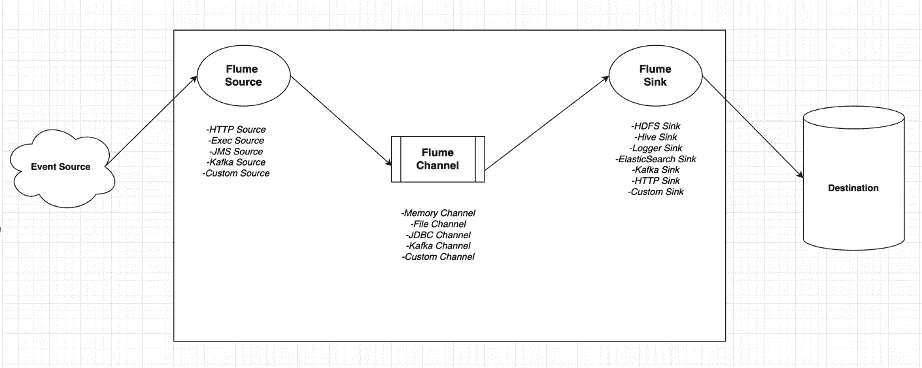
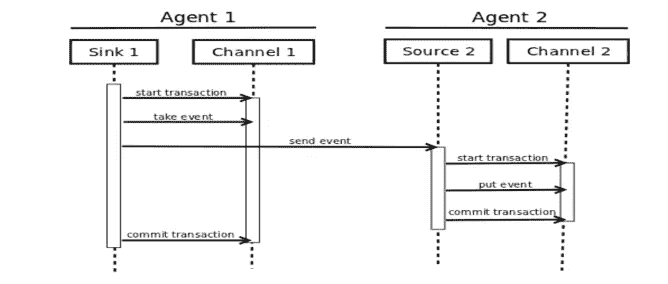
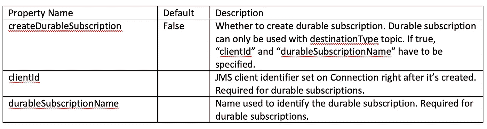
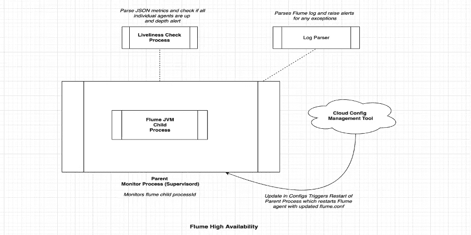
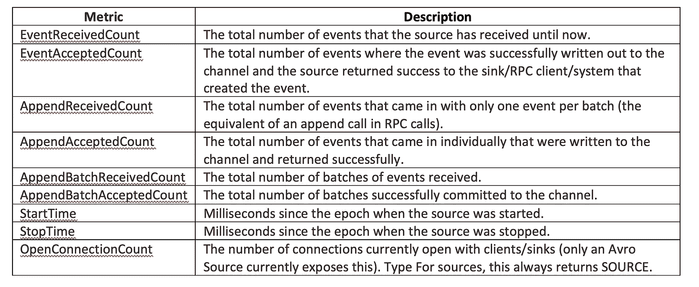
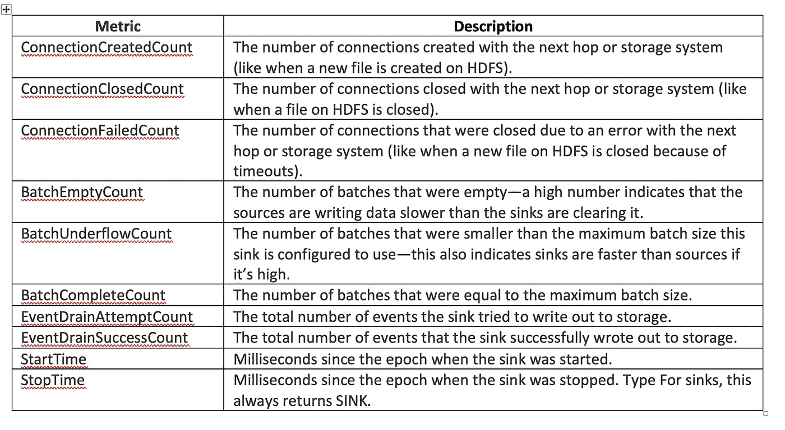
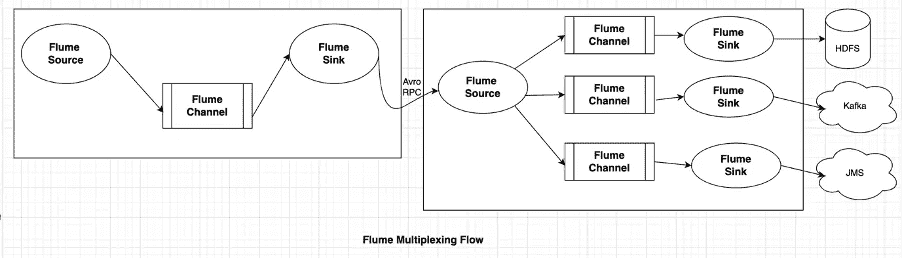

# 解码 Apache Flume 及其自动化数据传输的能力

> 原文：<https://medium.com/walmartglobaltech/decoding-apache-flume-and-its-capabilities-to-automate-data-transfer-500b9ee651d3?source=collection_archive---------6----------------------->


Photo Credit: [manfredsteger](https://pixabay.com/vectors/pixel-cells-download-data-transfer-3947910/)

将不同来源的数据移动到一个存储库中进行消费是非常耗时和复杂的。当我的团队遇到这个问题时，我们求助于开源项目 Apache Flume 来自动化数据传输过程。

Apache Flume 使我们能够通过简单地编辑一个配置文件，自动地从遗留的 Informix 数据库、ActiveMQ、IBM MQ、MAAS、Kafka 和其他来源中转移数据。在本文中，我们将解码 Apache Flume，并分享我们的一些经验，以帮助您更好地利用 Apache Flume 的功能。

# **阿帕奇水槽概述**

Flume 是一个分布式的、可靠的、可用的数据收集服务，用于从事件源收集、聚合和移动大量数据到目的地。

水槽代理是一个 JVM 进程，它有三个组件:水槽源、水槽通道和水槽。



Flume Components

*   在上图中，事件源生成的事件被 Flume Source 消耗。
*   Flume Source 接收一个事件，并将其存储在一个或多个通道中。channel 充当一个存储，它保存事件，直到它被 Flume Sink 使用。
*   Flume Sink 从通道中移除事件，并将其存储在外部目的地(例如，HDFS)。

# **使用卡夫卡频道的优势**

Apache Flume 还支持 Kafka 通道，该通道需要单独安装，用于存储事件。

Kafka 通道可用于多种场景:

1.  **带水槽源和水槽:**它为事件提供了一个可靠且高度可用的通道。
2.  **有 Flume source 和 interceptor，但没有 sink:** 它允许将 Flume 事件写入 Kafka 主题，供其他应用程序使用。
3.  **有 Flume sink，但没有 source:** 这是一种从 Kafka 向 Flume sink 发送事件的低延迟、容错方式，如 HDFS、HBase 或 Elastic Search。

Flume 使用事务方法来保证事件的可靠交付。它使用两个独立的事务，分别负责从源到通道和从通道到接收器的事件传递。该事务有两个特征:成功的提交和失败的回滚。



Picture Credit: [Flume Event Transaction](https://blogs.apache.org/flume/entry/flume_ng_architecture)

为了**可靠性**和在事务失败和回滚的情况下保证零数据丢失，需要根据源配置 Flume。

*   **Kafka Source:** 通过为 Kafka Source 主题配置消费者组，这确保了在事务失败的情况下指针不会向前移动。


*   **JMS 源:**如果源类型是队列，则可以配置死信队列以确保零数据丢失和可恢复性。对于主题，需要在 JMS 源中定义以下属性:



*   **定制 JDBC 源:**在定制源(例如，JDBC)的情况下，在成功提交的情况下，可以维护和更新最后成功读取 last_change_ts 的相应表。

# **可用性**

为了确保高可用性和低事件延迟，Apache Flume 需要启动并运行，并且能够在流程关闭时自我恢复。

以下是一些确保 Flume 高可用性的技巧:

*   将 Flume 代理启动命令配置为 supervisord(进程管理系统，负责在自己调用时启动子程序，响应来自客户端的命令，并重新启动崩溃或退出的子进程)中的子进程。
*   如果整个 Flume JVM 停止运行，上述要点可以解决任何问题。然而，由于 Flume JVM 有 *n* 个代理，为了确保所有代理都启动并运行，可以使用 JMX 在 Flume 代理级别进行监控。
*   可以解析 Flume 代理日志，并且可以在日志监控工具中为任何异常设置警报。



Apache Flume 的 Supervisord 配置文件示例:

```
[program:flumetask-agent-1]command=/home/flume/apache-flume-1.9.0-bin/scripts/flume-agent.sh agent-1 8080
autostart=true
autorestart=true
startretries=3
stderr_logfile=/home/flume/apache-flume-1.9.0-bin/conf/agent-1/flumetest-supervisor-agent-1.err.log
stdout_logfile=/home/flume/apache-flume-1.9.0-bin/conf/agent-1/flumetest-supervisor-agent-1.out.log
user=flumeuser
logfile_maxbytes=10MB
logfile_backups=0-bash-4.2$
```

在上面的配置文件中，命令键指向脚本文件“flume-agent.sh ”,该文件将在 flume 进程退出时运行。

# **监控**

对于监控，Apache Flume 报告了 JMX 指标。可以用不同的形式(例如 JSON)来报告度量，并且可以编写任何其他定制的监视类来轮询平台 MBean 服务器并将其发送到报告服务器。

对于 JSON 报告，需要将以下属性添加到 Flume 代理启动命令中:

```
-Dflume.monitoring.type=http -Dflume.monitoring.port=34545
```

我们现在将讨论如何将 JMX 指标用于监控目的。

**活动性检查:**

Get 调用可以在**http://<% FlumeServerIP %>:<% FlumeMonitoringPort %>/metrics**(用于 HTTP 报告)上进行，如果 API 返回 200 OK 以外的任何内容，则意味着需要查看 Flume 代理配置和日志。

**使用 JMX 指标:**

如上所述，Flume 为每个组件(源、通道和汇)报告多种类型的 JMX 度量。指标定义如下:

**来源指标:**



**渠道指标:**


**汇指标:**



上述指标特定于组件类型(源、通道和接收器),可以多种方式使用:

1.要确定单个水槽组件而不是整个流程是否存在问题，可以使用度量标准。

每个组件的指标都以键值的方式报告。例如，关键是“来源”。”并且该值将是包含源指标的 JSON。

警报应用程序可以获得指标的 API 响应，并检查每个组件是否存在原子活动性。

**示例指标:**

```
**{**"CHANNEL.fileChannel"**:{**"EventPutSuccessCount"**:**"468085"**,**"Type"**:**"CHANNEL"**,**"StopTime"**:**"0"**,**"EventPutAttemptCount"**:**"468086"**,**"ChannelSize"**:**"233428"**,**"StartTime"**:**"1344882233070"**,**"EventTakeSuccessCount"**:**"458200"**,**"ChannelCapacity"**:**"600000"**,**"EventTakeAttemptCount"**:**"458288"**},**"CHANNEL.memChannel"**:{**"EventPutSuccessCount"**:**"22948908"**,**"Type"**:**"CHANNEL"**,**"StopTime"**:**"0"**,**"EventPutAttemptCount"**:**"22948908"**,**"ChannelSize"**:**"5"**,**"StartTime"**:**"1344882209413"**,**"EventTakeSuccessCount"**:**"22948900"**,**"ChannelCapacity"**:**"100"**,**"EventTakeAttemptCount"**:**"22948908"**}****}**
```

2.正如我们所知，用户通常可以定义源和接收器之间的多跳，因此为了将事件延迟保持在最低水平，可以使用源度量设置警报延迟。

(EventReceivedCount—EventAcceptedCount)给出源未标记成功提交的事件数。阈值可以保持在该值上，如果超过阈值，就会发出警报。

# **可扩展性**

Apache Flume 是**水平可伸缩的**，这意味着多个代理可以被配置为连接到同一个源，并且可以为每个代理指定相似的数据流。

为了使单个代理达到最大吞吐量，可以进行以下调整。

**配料:**

Flume 成批地从数据源读取数据，对于该批数据，要么完成成功的提交，要么完成失败的回滚。

可以调整源和接收器中的参数 **batchSize** 和 **batchDurationMillis** 来增加吞吐量。调整后的值取决于所用的源/宿类型和所需的事件延迟。

```
*<agent_name>.sinks.<sink_name>.batchSize = 10000
<agent_name>.sinks.<sink_name>.batchDurationMillis = 10000*
```

对于 Flume Kafka Source，可以为多个 Flume 代理配置同一个消费者组，这样每个代理将读取一个主题的一组唯一的分区。

如果瓶颈不在源头，渠道/汇点无法赶上摄入吞吐量，那么可以使用以下策略。

**多水槽-多通道:**

一个源可以连接多个通道，一个接收器可以连接到每个通道。Flume 提供了两种类型的通道选择器(复制或多路复用)，可以编写自定义的通道选择器来均匀地将事件分配给通道并平衡负载。



# **部署管道**

使用名为 flume-ng 的 shell 脚本启动 flume 代理，该脚本位于 Flume 分布的 bin 目录中。Flume 代理名称、配置目录和配置文件是启动代理所需的强制参数。

```
$ bin/flume-ng agent -n $agent_name -c conf -f conf/flume-conf.properties.template
```

为了涵盖可靠性和可恢复性方面，并为部署编写自定义 Flume 组件，需要以下附加步骤:

*   为每个 Flume 代理配置 supervisor.d
*   配置用于启用 JMX JSON 报告的参数
*   在部署期间，将所需的 jar 添加到 Flume lib 文件夹中，以便自定义代码能够工作
*   在一台机器上启动多个水槽代理

以下脚本在 Flume 部署过程中负责上述步骤:

```
cd /home/flume
echo "Validating supervisord installation" >> $FLUME_DEPLOY_LOGsupervisor_pid='ps -aef | grep java | grep supervisor | grep -v grep | awk '{print$2}''*;  //Check if supervisord is installed or not*if [ $supervisor_pid -gt 0 ]; then
echo "Supervisord already installed" >> $FLUME _DEPLOY_LOG
echo "Stopping supervisord to configure flume" >> $FLUME _DEPLOY_LOG
sudo systemctl stop supervisord
else
echo "Installing supervisord" >> $FLUME_DEPLOY_LOG
sudo yum -y install supervisor
fiecho "Killing existing flume agents:" >> $FLUME_DEPLOY_LOG *//Step to kill any current agent and do fresh deployment* for pid in `ps -aef | grep flume | awk '{print $2}'`
do
kill -9 $pid
done;echo "Copying Flume:" >> $FLUME_DEPLOY_LOG
cp /home/flume/current/flume-$FLUME_VERSION/apache-flume-1.9.0-bin.tar /home/flumeecho "Unzip Flume Tar:" >> $FLUME_DEPLOY_LOG
tar xf apache-flume-1.9.0-bin.tar
echo "Copy jars and scripts to flume:" >> $FLUME_DEPLOY_LOG    *//Step which take care to copy additional jars and any script to the flume folder*cd /home/flume/current/flume-$FLUME_VERSION
rm -f $FLUME_HOME/lib/flume-*.jar  //Remove any previous jar
cp *.jar $FLUME_HOME/lib/
cd bin
cp *.sh $FLUME_HOME/scriptsecho "Configuring Supervisord" >> $FLUME_DEPLOY_LOG
sudo rm -rf /etc/supervisord.d/*echo "Copying supervisor supervisord configs to /etc/supervisord.d" >> $FLUME_DEPLOY_LOGexport port=8079
for agent in $(echo ${FLUME_AGENT_NAME} | sed "s/,/ /g") *//Loop to deploy supervisord for each flume  agent* do
cd /home/flume/apache-flume-1.9.0-bin/conf
mkdir ${agent}
cd ${agent}
cp /home/flume/apache-flume-1.9.0-bin/conf/log4j.properties .
mkdir logs
export port=$((port+1))
sudo cp /home/flume/current/flume-$FLUME_VERSION/bin/flume-supervisor.ini.template /etc/supervisord.d/flume-supervisor.$agent.ini
sudo sed -i 's/agentName/'"${agent}"'/g' /etc/supervisord.d/flume-supervisor.$agent.ini
sudo sed -i 's/portNum/'"${port}"'/g' /etc/supervisord.d/flume-supervisor.$agent.iniecho "Copied supervisor ini for agent name : $agent" >> $FLUME_DEPLOY_LOG
done
echo "Starting supervisord" >> $FLUME_DEPLOY_LOG
sudo systemctl enable supervisord
sudo systemctl start supervisord
```

注意:所有的部署日志都被写到变量$FLUME_DEPLOY_LOG 中指定的位置。