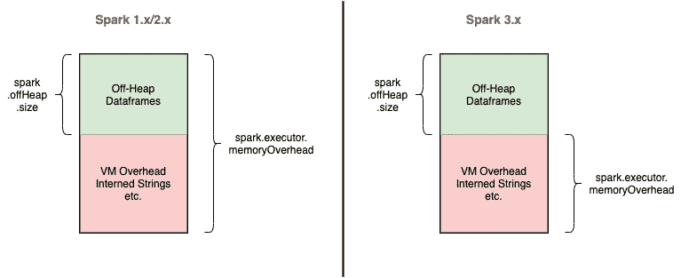

# Spark 中的解码记忆——经常被混淆的参数

> 原文：<https://medium.com/walmartglobaltech/decoding-memory-in-spark-parameters-that-are-often-confused-c11be7488a24?source=collection_archive---------0----------------------->

Photo by [Chris Ried](https://unsplash.com/@cdr6934?utm_source=medium&utm_medium=referral) on [Unsplash](https://unsplash.com?utm_source=medium&utm_medium=referral)

Apache spark ️is 最活跃的开源项目之一。它在每个版本中不断改进其以前的模型，这导致了大量令人困惑的参数和配置，这些参数和配置有时看起来相似，但实际上有不同的用例。在本帖中，我们来看一看 Spark 中关于内存管理的常见误解参数。

# 火花记忆块—快速回顾

Spark 是使用 Scala 作为主要语言开发的。因此，Spark 中的操作发生在 JVM 内部，即使用户的代码是用不同的语言编写的，如 python 或 r。Spark 运行时将驱动程序和执行器中的 JVM 堆空间分成 4 个不同的部分:

1.  **存储内存** —为缓存数据保留的 JVM 堆空间
2.  **执行内存** —洗牌操作(连接、分组和聚合)期间数据结构使用的 JVM 堆空间。更早的时候(Spark 1.6 之前)，混洗内存这个术语也是用来描述这部分内存的。
3.  **用户内存** —用于存储由用户代码创建和管理的数据结构
4.  **保留内存** —由 Spark 保留供内部使用。

除了 JVM 堆，还有两个内存段被 Spark 访问

1.  **堆外内存** —这部分内存位于 JVM 之外，但是被 JVM 用于某些用例(例如，字符串的内部化)。Spark 也可以显式地使用堆外内存来存储序列化的数据帧和 rdd。
2.  **外部进程内存** —特定于 PySpark 和 SparkR，这是驻留在 JVM 之外的 python/R 进程使用的内存。

有一些很好的文章(参见[参考文献](#7a05))详细讨论了这些内存扇区。

但偶尔也有火花配置看似一样。但是对这些配置的深入理解有助于理解它们各自的含义，以及通过调整相同的值来解决什么问题。

# 火花存储存储器

## spark . storage . memory 分数 vs spark . memory . storage 分数

这两个参数都设置了用作存储内存(用于缓存数据)的 JVM 空间量。但是不清楚应该设置哪个参数。

Spark 在 1.6 版本中对存储和执行空间的处理做了重大的检修。遗留的处理模式被称为 [StaticMemoryManager](https://github.com/apache/spark/blob/branch-1.6/core/src/main/scala/org/apache/spark/memory/StaticMemoryManager.scala) ，新的模式是[unifiedmorymanager](https://github.com/apache/spark/blob/branch-1.6/core/src/main/scala/org/apache/spark/memory/UnifiedMemoryManager.scala)。

在 StaticMemoryManager 中，存储和执行内存(在本例中为 shuffle 内存)在配置中是固定的。配置参数`spark.storage.memoryFraction`和`spark.shuffle.memoryFraction`分别控制存储和随机存储器的大小。这些参数从 Spark 1.6 开始被弃用，设置这些参数没有任何效果，除非`spark.memory.useLegacyMode`设置为 true。

在 UnifiedMemoryManager 中，存储内存和执行内存之间的界限是不固定的。因此，如果存储块是空闲的，它可以占用部分执行内存，反之亦然。参数`spark.memory.fraction`决定了专用于 Spark 的总内存(用于混洗和存储)。受保护不被驱逐的存储内存量由`spark.memory.storageFraction`控制。

> **TL；DR:最好使用** `**spark.memory.fraction**` **和** `**spark.memory.storageFraction**` **来配置火花存储段。**

# 堆外内存

## spark . executor . memory overhead vs . spark . memory . off heap . size

JVM Heap vs Off-Heap Memory

尽管 Spark 中的大多数操作发生在 JVM 内部，并且随后使用 JVM 堆作为其内存，但是每个执行器都能够在某些情况下利用堆外空间。这个堆外空间位于 JVM 空间之外，通常通过`sun.misc.Unsafe`API 来访问。堆外内存不在垃圾收集的范围内，因此它为应用程序开发人员提供了更细粒度的内存控制。

Spark 使用堆外内存有两个目的:

*   一部分堆外内存由 Java 内部使用，用于字符串存储和 JVM 开销等目的。
*   作为[项目钨](https://issues.apache.org/jira/browse/SPARK-7075)[【5】](#f407)的一部分，Spark 也可以明确使用堆外内存来存储其数据。

Spark 执行器的总堆外内存由`spark.executor.memoryOverhead`控制。默认值是 10%的执行器内存，最少 384MB。这意味着，即使用户没有明确设置这个参数，Spark 也会为 VM 开销留出 10%的执行器内存(或 384MB，以较高者为准)。Spark 用来存储实际数据帧的堆外内存量由`spark.memory.offHeap.size`控制。这是一个可选功能，可通过将`spark.memory.offHeap.use`设置为真来启用。

在 Spark 3.x 之前，由 memoryOverhead 指示的总堆外内存还包括 Spark 数据帧的堆外内存。因此，在为 memoryOverhead 设置参数时，用户还必须考虑数据帧对 Spark 堆外内存的使用。Spark 3.0 使 Spark 离堆成为一个独立于 memoryOverhead 的实体，因此用户在设置 executor memoryOverhead 时不必显式地考虑它。

Off-Heap Memory Allocation in Spark

> **TL；DR:对于 Spark 1.x 和 2.x，总堆外内存= Spark . executor . Memory overhead(Spark . Off Heap . size 包含在内)
> 对于 Spark 3.x，总堆外内存= Spark . executor . Memory overhead+Spark . Off Heap . size**

# Python 内存

## spark . python . worker . memory vs spark . executor . py spark . memory

在执行 PySpark 时，这两个参数似乎都限制了分配给 python 的内存。但实际上，它们限制了 executor 中非常不同的内存部分。在 PySpark 中，两个独立的进程在执行器中运行，一个 JVM 执行代码的 Spark 部分(连接、聚合和洗牌),一个 python 进程执行用户的代码。这两个进程通过一个 [Py4J 桥](https://www.py4j.org/)进行通信，这个桥公开了 python 进程中的 JVM 对象，反之亦然。

Configuring Python worker memory

参数`spark.python.worker.memory`控制为每个 pyspark 工作线程保留的内存量，超过该内存量，它将溢出到磁盘。换句话说，它是在 Spark 操作期间通过 Py4J 桥创建的对象可以占用的内存量。如果未设置该参数，默认值为 512MB。

在 Spark 2.4 中引入的`spark.executor.pyspark.memory`控制 python 工作进程的实际内存。使用 python 中的`system.RLIMIT_AS`属性为每个 python 工作进程设置了它可以寻址的内存空间的限制。

如果没有通过`spark.executor.
pyspark.memory`设置 python 工作内存，python 工作进程可能会占用整个节点的内存。由于这部分内存不是由 YARN 跟踪的，这可能会导致节点中的过度调度(因为 YARN 假设 python worker 占用的内存是空闲的)。这会导致内存中的页面交换，并降低该节点上所有纱线容器的速度。

> **TL；DR:** `**spark.python.worker.memory**` **限制 Python 对象在 JVM 中的内存，而** `**spark.executor.pyspark.memory**` **限制 Python 进程的实际内存**

# 总容器内存

Total Memory Request to YARN

如图所示，Spark 向容器管理器(如 YARN)请求的总内存是执行器内存、内存开销和 python 工作内存限制的总和。这确保了执行器的适当资源调度。

# 参考

1.  [火花配置](https://spark.apache.org/docs/latest/configuration.html)
2.  [调优火花:内存管理概述](https://spark.apache.org/docs/latest/tuning.html#memory-management-overview)
3.  [火花存储器管理](https://0x0fff.com/spark-memory-management/)
4.  [Apache Spark 内存管理](/analytics-vidhya/apache-spark-memory-management-49682ded3d42)
5.  [钨计划:让阿帕奇火花更接近裸机](https://databricks.com/blog/2015/04/28/project-tungsten-bringing-spark-closer-to-bare-metal.html)