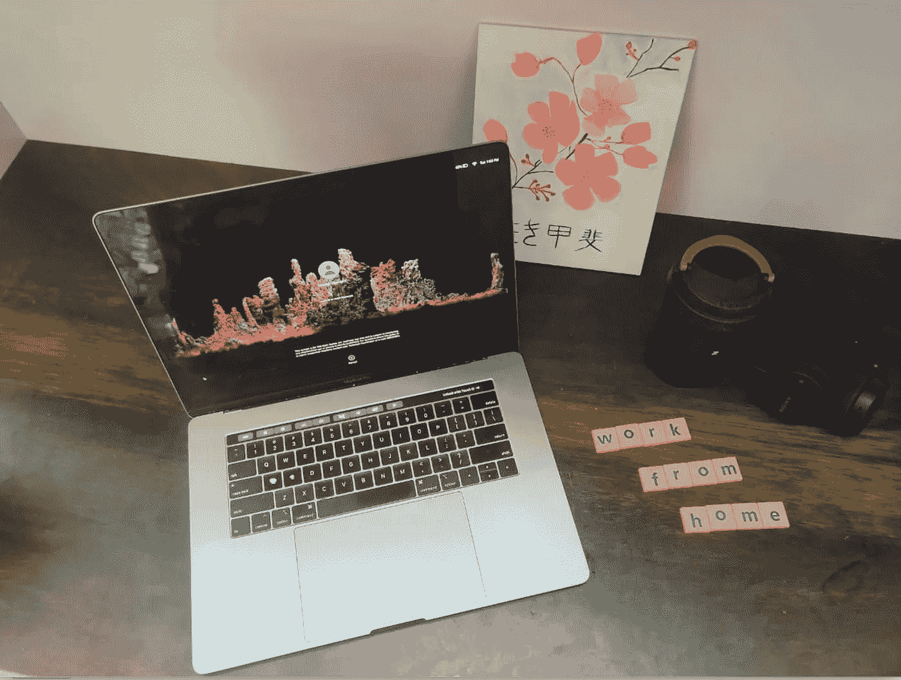
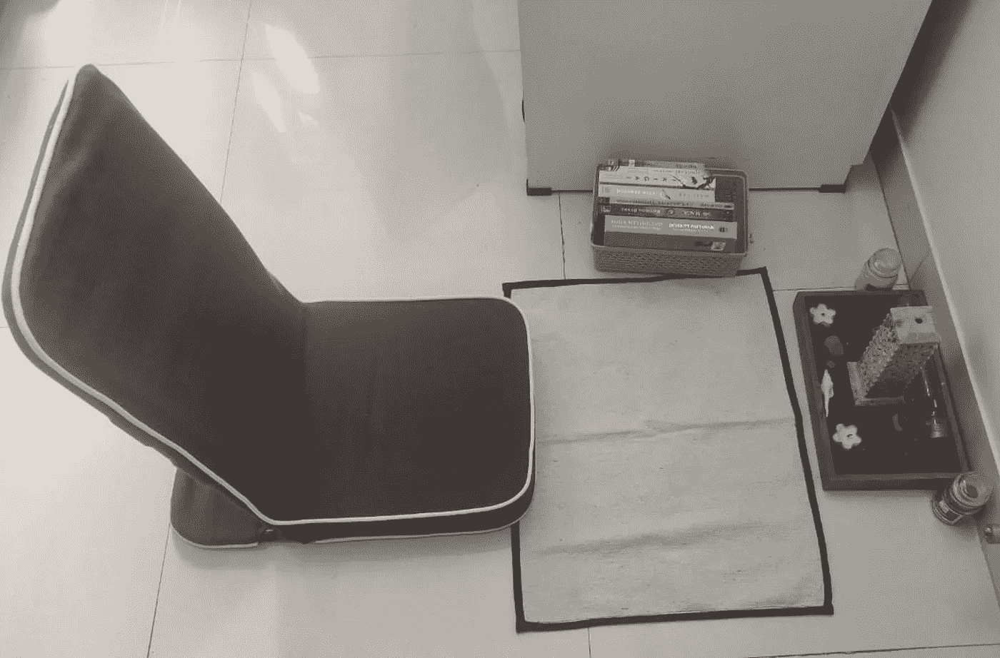
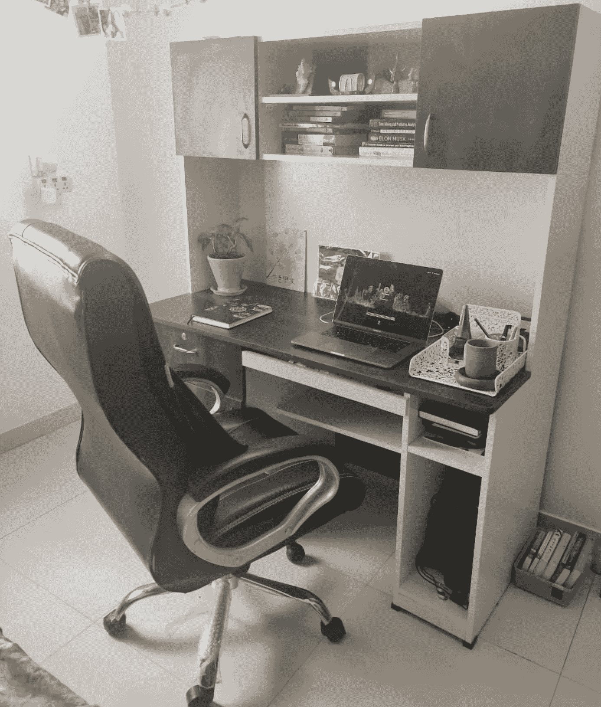

# 解读 WFH 的工作方式，提高生产力

> 原文：<https://medium.com/walmartglobaltech/decoding-wfh-ways-of-working-for-more-productivity-32e67cc3afcc?source=collection_archive---------0----------------------->

在家工作，对我们大多数人来说是八九个月前开始的，被认为不会持续一两个月，但事实上，它得到了永久的扩展，并成为新的正常工作方式。

虽然去办公室的旅行完全取消了，但这也带来了许多其他管理方面的挑战:

1.工作日开始和结束时间主要是开机和关机

2.会议间隙的身体休息/身体运动。

3.屏幕时间，因为大多数会议是通过缩放而不是会议室/面对面进行的。

4.工作与生活的平衡:与大部分时间呆在家里但不完全和家人在一起有关的担忧。

5.把全部注意力放在工作上，尤其是当一方既有工作的伴侣又有小孩的时候。

6.社交互动有限:喝茶/喝咖啡休息时的同事互动，以及在同事的小隔间里没有快速的个人或工作相关的聊天。

这些担忧和持续在家工作成为一种新常态，这增加了压力水平，也可能导致压力和久坐不动的生活方式相关的疾病。

这里有一些建议，人们可以在日常生活中反复灌输，以确保一天可以更好地计划，并可以适当地分为工作和休闲相关的活动。这些建议分为多个部分，考虑到日常生活的各个方面，还提到了一些关键的预期结果。

**晨练:**

这些建议主要集中在需要在清晨进行的活动上。一些灵感来自于 Kaizen*的工作方式，在这种方式下，你需要一步一步地改变，而不是计划一个人生活中的剧烈变化，这在大多数情况下是不可持续的。

a." **T.I.M.E . "常规**(灵感来自杰伊·谢蒂的 ***像和尚一样思考*** *)试着在早上获得额外的 30 分钟到 1 小时，并将其用于一些个人时间，包括下面提到的一组或多组活动:*

**a.1:感恩**:以积极的方式开始一天，表达感激之情。建议你在闹铃时听轻音乐/舒缓的音乐，而不是吵闹的音乐。起床后不要看手机，而是去看一些自然景观/绿色植物(露台花园或室外景观，如果有的话)。

**a.2:洞察力:**花些时间获取一些额外的信息，这些信息可以通过读报(最好是真正的报纸，而不是平板电脑或手机，因为一天中的大部分时间都只在屏幕前度过)或听播客获得。

Basic Meditation setup with mat, incense and candles

**a.3:冥想:**这包括专注于一个人的呼吸和执行基本的正念练习。建议在一个安静的地方进行，那里没有噪音或者有自然的声音可以帮助人平静下来。深呼吸，从 1-4 数到 1-8，再从 1-8 数到 8，这样的基本练习对放松大脑很有帮助。还可以有一些其他的方式来进行冥想，比如视觉化，但这里的基本建议是放松大脑，这样一天会更有成效。

**a.4:锻炼:**从一些基本的伸展运动到快走/跑步，再到在健身房锻炼。正确的组合应该是步行(10-15 分钟)，伸展和基本锻炼(10-15 分钟)加上呼吸练习(5-10 分钟)。清晨晒晒太阳也很重要，因为大部分时间都在室内。这也是获得额外剂量维生素 d 的最佳时机。

**b.** 有些人通常会在一天结束前这样做，但如果你在早上例行公事后完全放松了，也这样做，可以有更好的计划。这可以通过使用物理或数字清单来完成，确保涉及更多战略思考或解决方案执行的会议在上半年举行。

**工作场所**

a.**专用空间和合适的办公家具**:就像普通的工作场所一样，确保有一个专用空间供你工作，避免在卧室工作，因为大脑会把卧室当成放松的地方。椅子和桌子也需要特别关注。椅子应该足够高以支撑你需要限制的背部运动。桌子也需要有一个最佳的高度，确保一个人不会弯腰太多，并有一个适当的步态，以避免任何颈部或背部的污渍。

b.**整理工作空间**:你面前的杂乱最终会扰乱你的思维，建议保留最少的需要的东西。保持一些散发积极能量的文章总是更好的，比如一些鼓舞人心的名言，一个人最喜欢的地方(已经去过或在遗愿清单上)的照片，室内植物。

**c.** **合适的照明:**最好是去一个可以获得自然照明的地方，如果这是一个挑战，那么选择白光而不是黄光将是一个更好的选择。灯的正确位置最好在顶部，避免光源正好在前面，这会给眼睛带来额外的压力。

**d.** **分心:**避开有电视/互动屏幕的房间，并确保其他家庭成员通常使用的物品不在场，以确保会议期间的深入思考时间得到充分利用，避免任何不必要的干预，直到非常必要。另一个建议是去预付送货费，这样任何外出/下楼取货的情况都可以推迟到深夜或其他规定的休息时间。

**中间休息和饮食**

在会议之间休息一下真的非常重要，这样可以避免精疲力尽，并确保可以为接下来的会议恢复精力和注意力。人们可以务实地计划会议，以便有 5-7 分钟的准备时间，可以进行一些休息。下面分享一些相关的建议，以便有效地利用这些休息时间。

**a.** 进行一些基本的拉伸练习非常重要，主要集中在关节上，这样可以消除长时间会议可能带来的任何潜在的紧张感。如果你搜索“椅子瑜伽”、“基本拉伸”或“5 分钟办公室练习”，有大量的 YouTube 视频可以帮助你完成一些基本练习。在精神压力大于身体压力的情况下，你也可以做一个基本的呼吸练习来平静大脑。

**b.** **保持水分:**大多数人犯的一个基本错误是，他们在上班时间不喝水，只有当身体发出脱水的恐慌信号时，才会喝水。建议是，根据气候和其他因素，确定一天中理想的水摄入量，并记录下达到相同摄入量的百分比。你可以在手边放一个瓶子(建议放一个 ***陶制瓶子或玻璃*** 瓶子，这样可以保持水自然冷却，而不是直接从冰箱里拿冷水),然后在间歇休息时再去倒水。适量的绿茶、普通茶或咖啡也是保持水分的一种额外方法。

**c.** **移动会议:**在讨论中，人们不应该展示任何演示文稿，重点是进行正常的互动，建议尝试使用**移动缩放**应用程序连接会议，使用优质耳机(带噪音消除功能)并出去散步。由于大多数会议都是由需要演示或观看的演示组成的，因此对于一些屏幕时间最少的会议来说，会议可以这样进行就好了。

**d.** **午休期间的家庭/我时间:**确保 1:00 小时的休息时间得到妥善规划，重点是在 30 分钟内吃完食物，接下来的 30 分钟可以用来与你爱的人共度美好时光。除了给你时间来恢复精神之外，还能保证你在吃完午饭后不会犯困。这也可以有效地替代人们通常在工作时间进行的午餐后散步。基本的情况是确保这些活动提前计划好，以便有效地管理时间。

**e.** 一个更好的主意是吃水果或干果，而不是油炸小吃，并避免暴饮暴食。

**关闭**

一旦上班时间结束，你做一次精神上的封闭或关闭工作日是非常重要的。根据不同的时区，这个时间可能因人而异，但我们总是建议有一个固定的时间范围，在工作日内执行。

a.**为第二天保留一份待办事项清单:**每天留出 15-20 分钟的时间，列出第二天需要紧急关注的任务的相对优先级。你可以使用日记、记事本(根据你的喜好，可以是实体的，也可以是数字的)，但关键是要确保未完成的活动被相关的细节记录下来。

b.回到家里:工作日需要有一个合乎逻辑的休息或结束，一旦你离开工作场所，思想需要与回到办公室时相似。时间需要有效管理，以确保同样的时间用于家庭或自我完善。如何度过这段时间当然会因人而异，但重要的是要有一个合理的工作安排，并务实地计划剩余的时间。这段时间对于重新启动身体非常有效，尤其是在工作日特别忙碌的情况下。

c.社交互动:有时，每天也可以留出时间与朋友、远方的家人或其他熟人互动，最好是通过电话，而不是社交媒体。这段时间也可以用于发布一些社交媒体更新，但这里主要考虑的是，这需要适当的时间限制，以确保主要部分不会花在翻找社交媒体账户上，以免侵入其他重要活动。

d.**阅读和/或听力:**晚餐后，个人/家庭时间，确保在睡觉前留出 30-40 分钟完全没有设备(至少是为了观看)是非常重要的。这些时间可以用来散步，阅读一本书(不是电子书)，或者听一些播客或有声读物。另一个建议是听一些轻柔的音乐(最好是乐器)，这将有助于获得良好的睡眠，最终有助于重新启动身体，为第二天的行动做好准备。

除了工作日之外，提前计划周末并定期休息以恢复未来几天的精力，努力实现更好、更可持续的工作生活平衡和生产力也是非常重要的**。**

通过一些小的改变，你可以带来大量的改变，反过来有助于减轻压力，保持充足的精力来完成日常任务。

最后，为了过上健康而富有成效的生活，非常重要的一点是，一个人应该专注于获得身心两方面的稳定。在一个人的日常生活中采用其中的一些做法，肯定会有助于获得最佳平衡，并努力提高生产率。