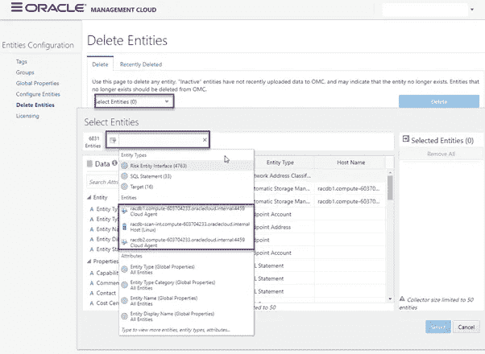

# 采用自下而上的方法淘汰 Oracle 管理云体系

> 原文：<https://medium.com/oracledevs/decommissioning-oracle-management-cloud-stack-with-top-down-approach-808d4b7d7e7e?source=collection_archive---------0----------------------->

## 作者:[mono war Mukul](https://medium.com/u/3757393c69bd?source=post_page-----808d4b7d7e7e--------------------------------)(OCM)[NASS yam Basha](https://medium.com/u/ba3f0a72ff81?source=post_page-----808d4b7d7e7e--------------------------------)(甲骨文王牌总监，OCM)

## **简介**

考虑到某些情况是销毁所有 Oracle 管理云服务和存储库，在这种情况下总会有一种方法到位。本文将帮助您在自底向上的方法中，使用适当的协议来移除每个组件，从而安全地删除 OMC 实例。

这种做法通常发生在 Oracle 管理云投入生产之前的测试阶段。

## **OMC 组件**

在 Oracle Management Cloud 中，我们将按照适当的方法依次列出我们要删除的组件。当组件相互依赖时，总是存在父子关系，因此我们需要小心确保在删除 Oracle management cloud 实例之前没有留下任何组件。

1.  禁用实体的许可证
2.  删除 OMC 的实体
3.  移除 OMC 代理
4.  从 Oracle 云中删除 OMC 实例

## **禁用实体许可证**

向 Oracle Management Cloud 添加实体时，我们还为每个实体分配了许可证类型(EE 或 se ),在删除实体之前，最好禁用所有实体的许可证。转到 OMC 控制台，导航到“管理云→管理→实体配置”

Navigation to Entity Configuration

在实体的配置面板中，选择“许可证”部分，以便我们可以查看为 Oracle Management Cloud 中的实体启用的许可证数量。

Number of Licensed entities

单击版本(标准版或企业版)下的数字，然后将选项更改为“全部设置为无”

Change License Edition

然后保存更改，这样它将在存储库中更新。

Save the licenses information

保存更改后，Enterprise Edition 的实体为 none，所有实体恢复为 unlicensed。

Latest status of Licenses.

## **删除 OMC 实体**

禁用许可证后，下一步是从 Oracle 管理云中删除实体或目标，不再作为配置的一部分。导航到与上述“管理云+管理+实体配置”相同的控制台选择“删除实体”选项卡

Delete Entities

在“选择实体”下拉框中-选择所有要删除的实体。要删除实体，我们可以选择实体类型过滤器。

Entity Filtering

要删除的实体已被过滤，请在继续下一步之前重新检查所有实体。

Delete Entities — filtered

在下一个屏幕中，我们可以看到实体类型的实体数量，然后单击“删除”

Deleting entities — Final

将提示最终确认，继续删除。提交请求后，我们可以看到删除作业是成功的。

Final confirmation for deleting entities

Status of Delete Entities

要验证已删除的实体，请停留在相同的控制台导航上。从“删除实体”控制台点击“最近删除”的时间范围。

Recently deleted entities

## **移除云代理**

到目前为止，我们已经删除了所有实体，现在我们将从实体依赖的所有目标上卸载代理。为此，我们必须在所有目标上阻止代理。

使用以下语法和命令连接到目标主机并停止 OMC 代理。

$/bin/omcli 停止代理

Agent Stopped for all the targets

停止代理后，转到 OMC 控制台，导航到“管理云→管理→代理”

Navigation to Agents

从 Oracle 管理云代理控制台中，单击“云代理”选项卡。在这里我们可以看到所有在 OMC 注册的代理商名单。单击每个选项卡的汉堡菜单(或者),我们可以通过单击“卸载”来卸载所有代理，如下所示。

Deinstall Agents

在这篇文章中，我们的目标是消除所有的 OMC 设置。因此，请继续卸载所有代理。

Confirmation — Deinstall Agents

根据状态栏信息，代理卸载过程已经开始。

Agents deletion — Job status

我们可以从栏目中看到代理的优秀状态。

Status of an agent from version column.

另一方面，点击每个代理的汉堡菜单并点击“查看详情”，该选项有助于跟踪代理删除的实时状态。

Agent view details

In Detail Agent View with current status

代理卸载完成后，作为清理过程的一部分，删除目标代理软件的空目录。

Remove directory structure from all the targets

## **从甲骨文云中删除 OMC 实例**

我们已经从 Oracle 管理云中删除了实体和代理。现在，OMC 由空目标或实体组成。此任务将被视为 Oracle 管理云退役过程中的最后一项任务。导航到“服务→管理云”，我们可以查看已创建的 OMC 服务列表。

Navigation to OMC Service

在实例选项卡下，单击 OMC 服务的汉堡包菜单，然后单击删除 OMC 实例。

Deleting the OMC instance

OMC 服务控制台将提示最终确认，单击“强制服务删除”以避免 PaaS 脚本失败(如果有)。

Final confirmation of OMC instance

OMC 服务因不再使用而终止，删除过程立即开始。

OMC instance termination & deletion

## **总结**

我们已经了解了如何采用自下而上的方法停用 Oracle 管理云服务，从许可证、实体、代理卸载开始，最后是 Oracle 管理云服务，并给出了逐步说明。

## **作者简介**

***纳西姆·巴沙*** 是数据库管理员。他有大约十年的 Oracle 数据库管理员工作经验，目前是 eprosed KSA 公司的数据库专家。他拥有马德拉斯大学的计算机应用硕士学位。他是 Oracle 11g 认证大师和 Oracle ACE 总监。他以超级英雄的身份积极参与甲骨文相关论坛，如 OTN，甲骨文支持被授予“大师”称号，并担任 OTN 版主，与 OTN 一起撰写了大量关于 Toad World 的文章。他维护着一个与甲骨文技术相关的博客，www.oracle-ckpt.com，可以通过 https://www.linkedin.com/in/nassyambasha/找到他

***Monowar Mukul*** 目前担任首席 Oracle 数据库专家。我是 Oracle 认证大师(Oracle 12c 认证大师管理、Oracle 12c 认证大师 MAA 和 Oracle 11g 认证大师管理)。他在 Oracle MAA 空间担任了 17 年的 Oracle 数据库管理员顾问，负责数据库云服务器和非数据库云服务器系统、Oracle 云空间和 SOA 中间件。他曾在澳大利亚的多个商业领域工作，包括高等教育、能源、政府、采矿和运输。作为一名首席 Oracle 数据库专家，他展示了高度发展的批判性思维和分析技能。你可以在[https://www.linkedin.com/in/monowarmukul/](https://www.linkedin.com/in/monowarmukul/)找到关于他和他的工作成就的更多细节