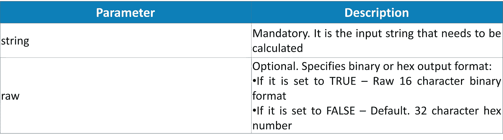

# PHP 中如何解密 md5 密码？

> 原文：<https://medium.com/edureka/decrypt-md5-password-php-c9cb0f927922?source=collection_archive---------1----------------------->


Decrypt md5 Password in PHP — Edureka

网站最重要的部分之一是认证系统，开发人员犯错误留下漏洞让他人利用是很平常的事。由于 PHP 是一种服务器端脚本语言，它负责网站所需的所有后端功能。在本文中，我们将按照以下顺序学习如何在 PHP 中解密 md5 密码:

*   PHP 中为什么需要 MD5？
*   什么是 MD5 哈希？
*   PHP 中如何使用 MD5？
*   句法
*   PHP 中如何解密 MD5 密码？
*   例子

我们开始吧。

# PHP 中为什么需要 MD5？

一个基本的例子是以真实形式存储和使用用户密码，在这种情况下，未经授权的人可能会访问数据库，从而危及整个系统。为了防止这种情况，使用了密码散列法。密码哈希可以定义为一种方法，它将用户密码或字符串加密为固定长度的密码，PHP 有几个函数可以实现相同的功能，如 md5()、sha1()、hash()。

# 什么是 MD5 哈希？

MD5 哈希算法为我们输入的任何单词或短语生成一个 32 个字符的字符串(十六进制)。我们甚至可以将整个文件加密成 MD5 散列。该算法也可用于数字签名应用，其中大文件以安全方式压缩，然后在私钥的帮助下加密。

# PHP 中如何使用 MD5？

为了计算一个字符串的 md5 散列值，PHP 有一个预定义的函数 MD5()。md5()函数计算字符串输入的 MD5 散列，并返回散列的十六进制数。md5()函数使用 MD5 消息摘要算法。

## 语法:

```
md5(string,raw)
```



**返回类型:**

md5()以 32 个字符的十六进制数返回哈希。

# PHP 中如何解密 MD5 密码？

MD5 加密算法是不可逆的，也就是说，我们无法解密 MD5 创建的哈希值来将输入恢复到其原始值。所以没有办法解密 MD5 密码。但是，我们可以使用类似暴力破解的方法，这种方法非常耗费资源，不切实际，也不道德。因此，如果有人输入了正确的密码，我们需要找到用户输入的任何内容的哈希值，并查看它是否与我们数据库中的内容相匹配，因此这是一项需要大量时间和资源的工作。

可以通过查看许多已知单词的 MD5 哈希字典来猜测原始密码，这些字典可以用来告诉用户他选择的密码可能很容易被发现，因此我们可以要求用户建立一个更强的密码。

# 解密 MD5 密码的示例

## 示例 1:

```
<?php  
$string = " PHP with Edureka";  
echo "Your string is:".$string;  
echo "<br>";  
echo "Hex formed by md5 function is ".md5($string);  
?>
```

## **输出:**


在上面的例子中，我们打印了 md5()函数生成的“PHP with Edureka”的哈希值。

## 示例 2:

```
<?php  
$string = ' PHP with Edureka';  
if (md5($string) =='9a1359e7be2d2670780b85471675dc72'){  
    echo "PHP with Edureka is Fun";  
}  
else {
    echo"look for the error";
}
?>
```

## **输出:**


在上面的例子中，我们检查变量$string 的哈希值是否等于 9a 1359 e 7 be 2d 2670780 b 85471675 DC 72 程序输出“PHP with Edureka is Fun”否则它输出“look for the error”

## 示例 3

```
<?php   
$string = " PHP with Edureka";   
echo "Your string is: ".$string."<br>";   
echo "Setting raw input to TRUE getting 16 character binary: ".md5($string, TRUE)."<br>";   
echo "default raw input set to FALSE giving 32 charater hex number: ".md5($string)."<br>";   
?>
```

**输出:**


在上面的例子中，我们看一下 md5()函数中 raw 参数的应用。如果我们将它设置为 TRUE，它会给出 16 个字符的二进制输出，否则它会给出 32 个字符的十六进制数。

## 示例 4:

```
<?php   
$password= "pass123";   

if (isset($_POST['password']) && !empty($_POST['password']))
{
$new_password=$_POST['password'];

    if(md5($new_password)==md5($password))
    {
        echo "<br> Correct password ";
    }
    else{
        echo "<br> Incorrect password ";
    }
}

?>  

<form action="md5.php" method="post">
<input type="text" name="password">
<br>
<input type="submit" >
</form>
```

**输出:**

上面的代码给出了一个带有文本块和提交按钮的 HTML 表单的输出，如果我们输入了正确的密码，它将打印“正确的密码”，否则它将打印“不正确的密码”。


例如，当我们键入错误的密码时，它会使用“pass123”的哈希来检查“pass”输入的哈希。如果不匹配，它会给出正确的密码，如下所示


它打印出“不正确的密码”


如果我们键入正确的密码(即“pass123”)，则输入的哈希与正确密码的哈希匹配，并给出以下输出


它打印出“正确的密码”


说到这里，我们已经到了这篇文章的结尾。我希望你们喜欢这篇文章，并且理解解密的概念。因此，随着本 PHP 教程的结束，您不再是脚本语言的新手。

如果你想查看更多关于人工智能、Python、道德黑客等市场最热门技术的文章，你可以参考 [Edureka 的官方网站。](https://www.edureka.co/blog/?utm_source=medium&utm_medium=content-link&utm_campaign=decrypt-md5-password-PHP)

请留意本系列中的其他文章，它们将解释 PHP 的各个方面。

> 1. [PHP 教程](/edureka/php-tutorial-beginners-guide-to-php-f78a189de6f)
> 
> 2.[在 PHP 中拆分](/edureka/php-str-split-c16abd038bb7)

*原载于 2019 年 11 月 14 日*[*https://www.edureka.co*](https://www.edureka.co/blog/decrypt-md5-password-PHP/)*。*