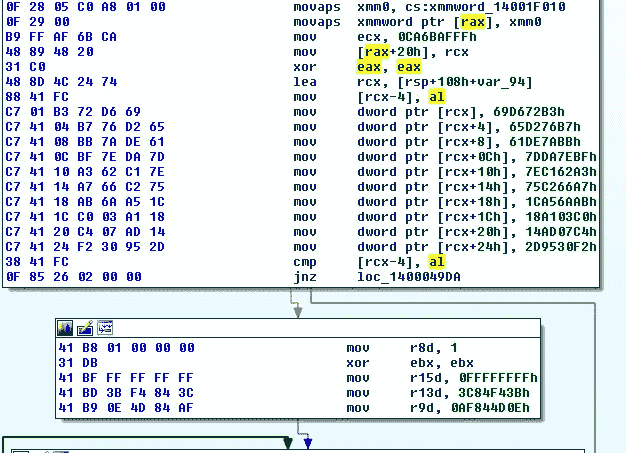
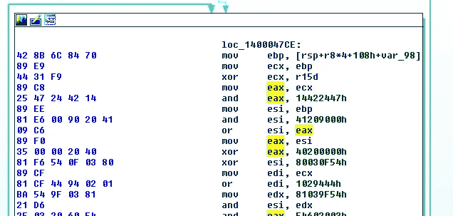

# 用独角兽解密 BazarLoader 字符串

> 原文：<https://medium.com/walmartglobaltech/decrypting-bazarloader-strings-with-a-unicorn-15d2585272a9?source=collection_archive---------1----------------------->


BazarLoader[1，2，6]在过去的一年中已经被许多团队使用，主要被 TrickBot[3]相关的团队用于垃圾邮件活动。虽然最初的恶意软件改变了目标 TTP(trick bot 攻击团队行动手册)，但它们仍然与大多数感染非常相似，以高优先级服务器上的锚点和最终的勒索病毒感染结束[4，5，7]。

最近我注意到在加载端，两个版本使用了不同的模糊处理，并出现在不同的活动中。参与 Bazar 的各种团队使用的混淆方法很少，但出于本报告的目的，我们将重点关注使用 LLVM 的样本[8]。我的目的是展示一种有趣的技术，我认为这种技术在恶意软件分析中没有得到充分利用，在恶意软件分析中，您可以利用 CPU 仿真器来解码各种类型的字符串编码，我多年来一直使用这种技术来解码 H1N1[9]加载程序的各个部分，并且多年来还利用它来创建解密器，例如 man 1 的旧 crypter[10]。

我们将看到的一些未包装的样品自称为:

```
exeLoaderDll_LLVMO.dll
```

这些样本以一种混淆的方式存储它们的大多数相关字符串，其中数据被手动加载，然后经过一个相当长的解码数据的过程。



Loading data



Start of decode loop

在同一个样本中调查这个过程的更多实例显示了变化，这意味着它是使用宏或较低级别的混淆器动态生成的，TrickBot 组在历史上利用了 ADVobfuscator[11]和 LLVM[8]。

为了用仿真器[12]解码字符串，我们需要捕获加载字节的数据块以及解码它的循环，幸运的是，对于这样的混淆器，我们通常可以为样本签名:

```
import sys
import re
import binascii
import struct
from unicorn import *
from unicorn.x86_const import *STACK=0x90000
code_base = 0x10000000
mu = Uc(UC_ARCH_X86,UC_MODE_64)data = open(sys.argv[1], 'rb').read()
test = re.findall(r'''488d.{3,20}c70.+0f......ffff''',binascii.hexlify(data))
```

在这个代码块中，我们正在为 unicorn[12]做一些初始设置，然后找到我们的代码块，因为 python regex 在这里的使用方式，我们将从文件的第一个块一直到最后一个块。这意味着我们将需要分解和解析出单独的块，我更喜欢这种方法，因为它让我在一定程度上控制这个过程。

```
temp = test[0]
temp = ['488d'+x for x in temp.split('488d')]
tempp = []
for x in temp:
 xx = x.split('feffff')
 if 'fdffff' in xx[0]:
  xx = x.split('fdffff')
  tempp.append(xx[0]+'fdffff')
 else:
  tempp.append(xx[0]+'feffff')
temp = tempp
```

因此，我们根据开始和结束来分解每个块，同时考虑到我在一些结束字节的示例中注意到的变化。接下来，我们将完成模拟器的设置，然后遍历并模拟每个代码块:

```
mu.mem_map(code_base, 0x100000)mu.mem_map(STACK, 4096*10)
for i in range(len(temp)):
 try:
  blob = binascii.unhexlify(temp[i])
 except:
  blob = binascii.unhexlify(temp[i][1:])
 mu.mem_write(code_base, '\x00'*0x100000)
 mu.mem_write(STACK, '\x00'*(4096*10))

 mu.mem_write(code_base,blob)
 mu.reg_write(UC_X86_REG_ESP,STACK+4096)
 try:
  mu.emu_start(code_base, code_base+len(blob), timeout=10000)
 except:
  pass
```

在仿真之后，我们将读入为堆栈分配的整个内存，然后通过剥离所有空字节打印出找到的任何字符串:

```
 a = mu.mem_read(STACK,4096*10) 
 a = a[len(blob):].split('\x00')
 a = filter(lambda x: x != '', a)
 a = map(str,a)
 print(str(''.join(a)))
```

一个例子给了我们一个健康的数据块:

```
# python str_decode.py 9d76e72fb45bb059b64c58d10da43cbac1487f8b396d705eae0a427974587171.bin  |strings
Mozilla/5.0
ABCDEFGHIJKLMNOPQRTSUVWXYZ0123456789
%s.%d.%d.%d%s.%s.%d.%d.%d%s.%s
%%s.%d.%d.%d%s.%s.%d.%d.%d%s.%s
 Avast.exe
c34.212.193.150 35.166.147.40
rareanimalsofcanada.bazar wildwinternature.bazar coldmountainsanimals.bazar
Software\%s
cmd /c ping 8.8.7.7 -n 2 & 
8Y3y
start %s %s
GGNY
 yyyy-MM-dd
SHA384
HashDigestLength8
 ECDSA_P384
kernel32.dll
[@advapi32](http://twitter.com/advapi32).dll
xuser32.dll
ws2_g
+ntdll.dll
shell32.dll
crypt32.dll
shlwapi.dll
owinhttp.dll
netapi32.dll
bcrypt.dll
userenv.dll
```

运行 VirusTotal 的一组文件，我们可以快速生成一些 C2 列表。

样品:

```
0c2e254376127f76d44fc9276000697e45a2977fca4384705e84994ab63fdc37  90d0c4995ce53077cd2fbc00a248f02df108b42b4df1ba84b89ea014fae4ea01
0d53ed1eca1a3d28e0227055f66f6d2de1b2606e30f10982967509df4e478ee1  9296e1fef0356eab2956aac2d010dac587d55ae2de7f520deb97d1dfcc4e4a9a
1c27d4dc6fef72e096b06662908d7c5b225cecdbfc66c8f19db78b76008fac63  
270890cfa6621fa3b5c6edcdd2bb15760b97abd43245d6673eee9dca23c77d40  
2ea153ff7675c15adcda2bff88958be2004f9d32f6d67d9fabd3c872eeb07505
2eec5366c21fc1bc9c11c2afbf66368fc704175231ab63659b3e8b839e5c9e71  
37aae88b9a3f942952c258d611c2c629116fcc077079e3698590c3f8aab3e684  
37e587e6b801e926dc31da093c55f1f834edcb8c1971c40869a8054580e39e42  9d76e72fb45bb059b64c58d10da43cbac1487f8b396d705eae0a427974587171
447b4c867b7147afe178d73adf8113fc33f6399f03707e4308efa36e0859bf86  9f6ae735999f98738022b1784d1b46975ae16069c260656646fbcfeaeef35a06
47eb57d467c4330269a5238a53dd399c5183b338a8bbead88bb8b88b4396a80c  ae6e6dd4f2aa22ccc395ade0ae713000af9d3dc189651e054b46540647ec891c
5791ef7d6916f8c14d3261a9c3d9b68b30e208e2ddd74d0dae1ad0a476504e2a  c0a087a520fdfb5f1e235618b3a5101969c1de85b498bc4670372c02756efd55
664e8512cd3ce3552f33878e26800184e0cff8ee54c75bfa93f19ad97615bb56  
68b4f6fde1a2d1024f4028d22d12daeaf3f4ae4ffb46cc07cf11cf6a2cb35e90  d5df7e82b5ff898d49f3f779f2064491654ae3d50129aa0bd48a88cd43c42113
69f897a4ccf41cdf3f0c7903fc740b6914707d3286a5b5c8ca1ff90487b1c4ef  e06473cad41789dddc88aa58b2f1433023637c468a88bbe364db50c1e4513744
87ad0b1bd7a18ff2aa975991cd15725b4ddfa0d0ef972cbe2f57a789582aa675  f18c2a8922bbe7b8f12980a46cc3548e9a0903a7294206eeb2d01f7923cdb8eb
8a0fbcde56a9a817c10b0fe5ae281f75385c2a28ca271d736484e689c104e96c  f29253139dab900b763ef436931213387dc92e860b9d3abb7dcd46040ac28a0e
```

IP、域名和 URIs:

```
18.188.232.155
18.191.220.165
18.222.240.99
194.5.249.30
3.134.106.170
34.209.40.84
34.212.193.150
35.166.147.40
45.142.158.252
54.184.178.68
54.184.52.204
54.190.171.88
acghilbdihio.bazar
achiikbdjiin.bazar
adehjkbeghjn.bazar
adfhikbehhin.bazar
adggklbeigko.bazar
afegkmbgggkp.bazar
bceikkccgikn.bazar
bchgjlcdjgjo.bazar
begiklceiiko.bazar
bffhklcghhko.bazar
cegiikdeiiin.bazar
coastalbrezecarwash.com
coldmountainsanimals.bazar
deehimeeghip.bazar
rareanimalsofcanada.bazar
wildwinternature.bazar
/thirst/honor/commerce
/no/link/1
```

**参考文献**

1:[https://www . bleeping computer . com/news/security/bazarbackdoor-trick bot-gang-s-new-secretable-network-hacking-malware/](https://www.bleepingcomputer.com/news/security/bazarbackdoor-trickbot-gang-s-new-stealthy-network-hacking-malware/)

2:[https://blog . fox-it . com/2020/06/02/depth-analysis-of-the-new-team 9-malware-family/](https://blog.fox-it.com/2020/06/02/in-depth-analysis-of-the-new-team9-malware-family/)

3:[https://cyber security . att . com/blogs/labs-research/trick bot-bazar loader-in-depth](https://cybersecurity.att.com/blogs/labs-research/trickbot-bazarloader-in-depth)

4:[https://thedfirreport . com/2021/03/08/bazar-drops-the-anchor/](https://thedfirreport.com/2021/03/08/bazar-drops-the-anchor/)

5:[https://thedfirreport.com/2020/10/18/ryuk-in-5-hours/](https://thedfirreport.com/2020/10/18/ryuk-in-5-hours/)

6:[https://mal pedia . caad . fkie . fraunhofer . de/details/win . bazarbackdoor](https://malpedia.caad.fkie.fraunhofer.de/details/win.bazarbackdoor)

7:[https://labs . sentinel one . com/inside-a-trick bot-cobalt strike-attack-server/](https://labs.sentinelone.com/inside-a-trickbot-cobaltstrike-attack-server/)

https://github.com/obfuscator-llvm/obfuscator

9:[https://malpedia.caad.fkie.fraunhofer.de/details/win.h1n1](https://malpedia.caad.fkie.fraunhofer.de/details/win.h1n1)

10:[https://vixra.org/pdf/1902.0257v1.pdf](https://vixra.org/pdf/1902.0257v1.pdf)

11:[https://github.com/andrivet/ADVobfuscator](https://github.com/andrivet/ADVobfuscator)

12:[https://www.unicorn-engine.org/docs/](https://www.unicorn-engine.org/docs/)