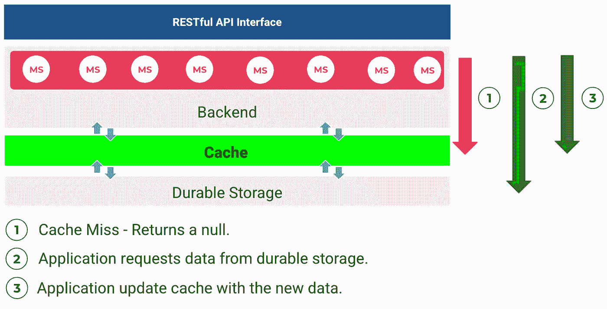

# 深入了解 AWS 中基于 Redis 的服务

> 原文：<https://medium.com/globant/deep-dive-in-redis-based-services-in-aws-4f96df34dfad?source=collection_archive---------0----------------------->

## 介绍

我一直喜欢尝试新的 AWS 服务，做许多实验来学习和教授我的学生。然而，我经常遇到各种各样的具有相似用例的服务；为此，我想向您展示我在 AWS 提供的缓存数据库服务中看到的内容。

在本文中，我们将讨论以下几点:

1.  常见应用程序架构介绍。
2.  AWS 上的通用应用架构。
3.  带缓存层的 AWS 通用应用架构。
4.  Amazon elastic cache for Redis vs Amazon memory db for Redis 服务。
5.  亚马逊 ElastiCache 中的缓存策略。
6.  亚马逊 DynamoDB 加速器(DAX)中的缓存策略。
7.  将缓存层和持久存储层结合在一起。

# 1.通用架构介绍。

我想从我的角度解释我们如何理解 Amazon ElastiCache 和 Amazon MemoryDB for Redis 服务，但是为了实现这个目标，我们必须考虑一个应用程序的标准架构，在这个架构中我们可以看到一些组件，如图所示:

Typical application architecture

通常，我们在架构中需要一个持久的信息数据库(持久存储),无论是关系的还是非关系的。然而，随着我们的应用程序流量的增加，在后端和持久存储之间实现一个中间层是非常有意义的。这就是缓存发挥作用的地方，它将帮助我们减少对后端的响应时间。有了这个新组件，体系结构将如下所示:

Common application architecture with a cache layer

# 2.AWS 上的通用应用程序架构

为了了解我们如何将这些架构引入 AWS 这样的云提供商，我们必须在每一层中关联可以帮助我们的服务:

Common application architecture in AWS

*   [**亚马逊 API 网关**](https://aws.amazon.com/es/api-gateway/) **:** 它是管理一个 API 的托管服务，可以是 RESTful，也可以是 WebSocket。
*   [**亚马逊弹性 Kubernetes 服务(EKS)**](https://aws.amazon.com/es/eks/) **:** 它是一种在 Kubernetes 上实现大规模应用的部署、管理和执行的服务。
*   [**亚马逊弹性容器服务(Amazon ECS)**](https://aws.amazon.com/es/ecs/) **:** 由 AWS 创建的容器编排服务使大规模应用的部署、管理和执行成为可能。
*   [**AWS Lambda**](https://aws.amazon.com/es/lambda/)**:**它是一个无服务器服务，允许根据事件按需执行代码。
*   [**Amazon dynamo db**](https://aws.amazon.com/es/dynamodb/)**:**它是一个无服务器、非关系型键值数据库，专为大规模、高性能工作负载而设计。
*   [**亚马逊 DocumentDB**](https://aws.amazon.com/es/documentdb/) **:** 它是一个基于工作负载的数据库服务，兼容 MongoDB。

# 3.具有缓存层的 AWS 上的通用应用架构

在我们的通用应用程序架构中，我们为数据库添加了 AWS 缓存服务，它将在后端层和持久存储层之间起作用。

Common application architecture with a cache layer in AWS

*   [**亚马逊 DynamoDB 加速器(DAX)**](https://aws.amazon.com/es/dynamodb/dax/) :它是亚马逊 DynamoDB 的一个完全托管且高度可用的内存缓存。

在这种情况下，缓存层负责处理易变数据或临时数据，这些数据将由后端使用。为此，必须建立缓存策略。

# 4.Amazon Elasticache for Redis 与 Amazon MemoryDB for Redis 服务

下面我对 AWS 中的两个带有 Redis 的内存数据库服务进行了比较:

# 5.Amazon ElastiCache 中的缓存策略

缓存策略 Amazon ElastiCache 使用 elastic cache 时，您必须确定如何向缓存层提供来自持久存储的数据。

## 5.1 延迟加载

只有必要的数据被加载到缓存中。

如果数据位于缓存层，则存在缓存命中，它会直接响应应用程序。

Lazy Loading with Cache Hit

如果数据不在缓存层，它必须从持久存储中获取数据，然后将其存储在缓存中。

Lazy Loading with Cache Miss

## 5.2 直写

来自持久存储的所有数据都存储在缓存层。

# 6.Amazon DynamoDB 加速器(DAX)中的缓存策略

## 5.1 写操作

在 DynamoDB 上执行以下写操作时，数据会自动写入 Dynamo 表中，在 DAX 中，它们是直写操作:

*   BatchWriteItem
*   更新项目
*   删除项目
*   PutItem

# 7.将缓存层和持久存储层结合在一起

在这种情况下，我们可以将缓存和持久存储层结合起来，为了实现这一目标，我们必须使用 Amazon MemoryDB for Redis 服务，它将为我们提供非常快速地访问数据和持久存储的功能。

在这种情况下，我们不需要缓存策略。

# 8.结论

*   另一个需要考虑的基本标准是每项服务的成本，因此，您可以查看[Amazon elastic cache for Redis](https://aws.amazon.com/es/elasticache/pricing/)和[Amazon memory db for Redis services](https://aws.amazon.com/es/memorydb/pricing/)的价格，这一点很重要。
*   在键值持久场景中，我们可以将缓存和持久存储层结合起来。
*   在定义要使用的数据库之前，您应该查看[性能效率支柱](https://wa.aws.amazon.com/wellarchitected/2020-07-02T19-33-23/wat.pillar.performance.en.html)中设计良好的框架，以根据可用性、一致性、分区容差、延迟、持久性、可伸缩性和查询能力的要求来确定系统的最佳数据库解决方案。

[卡洛斯·桑布拉诺](https://www.linkedin.com/in/carlos-zambrano-aws/)