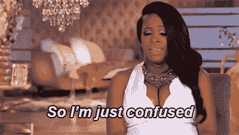
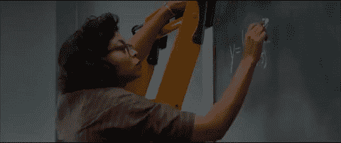
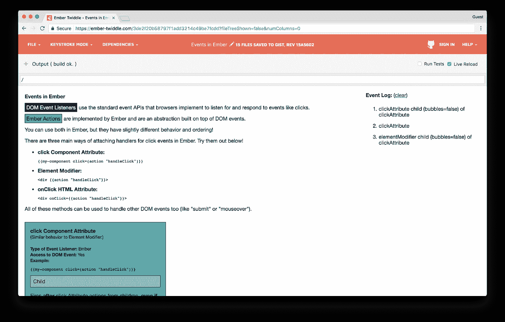
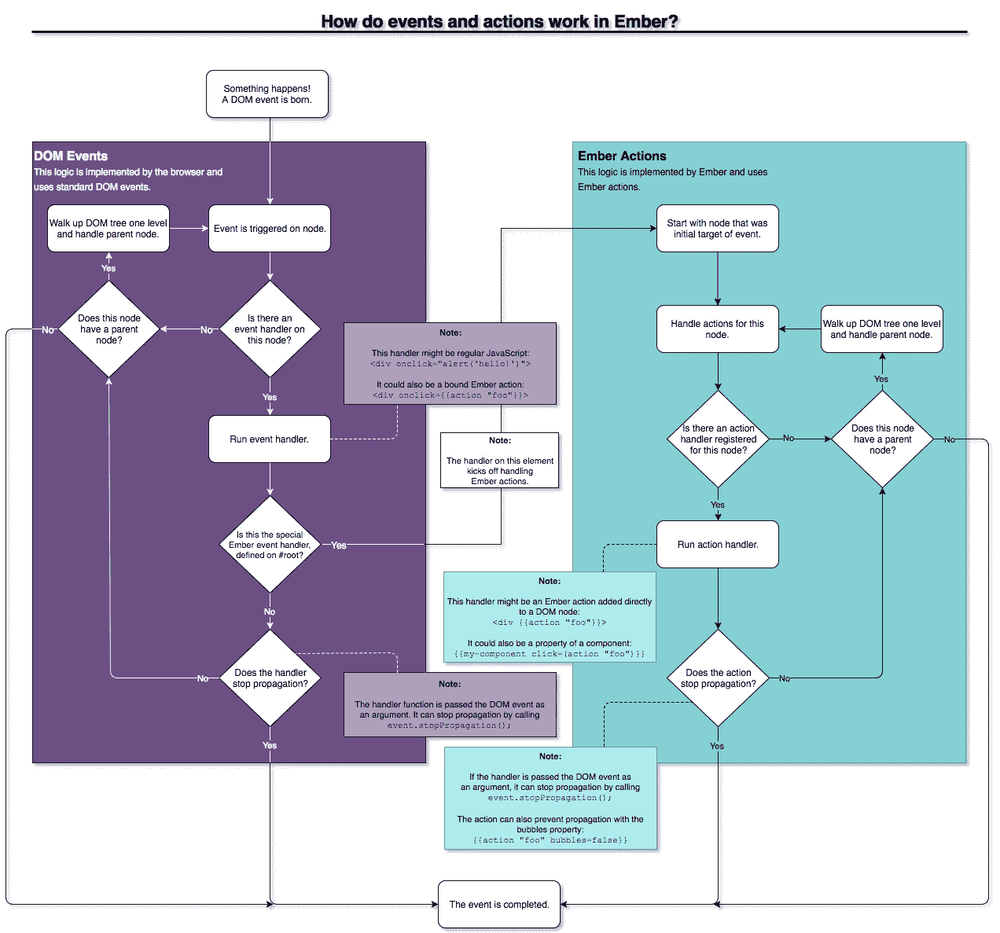
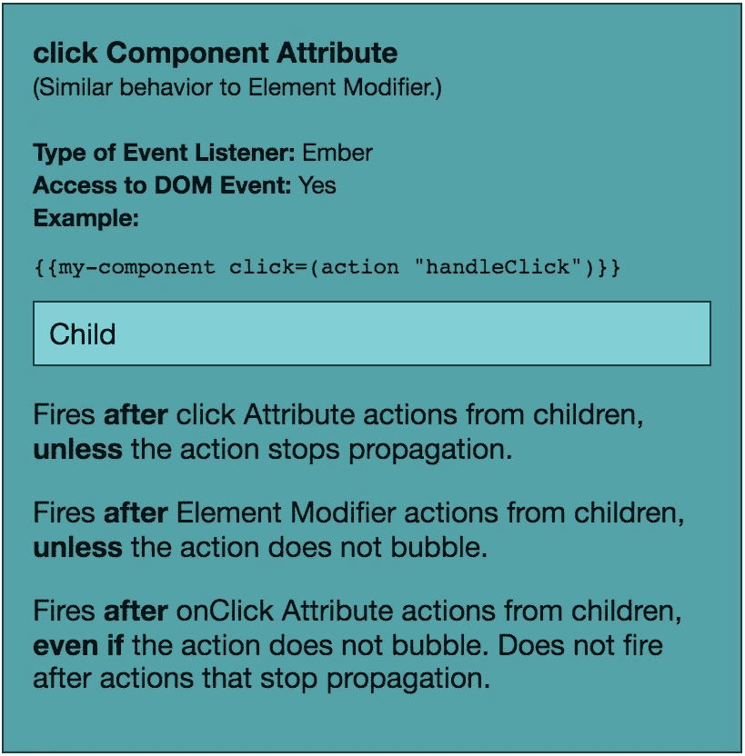
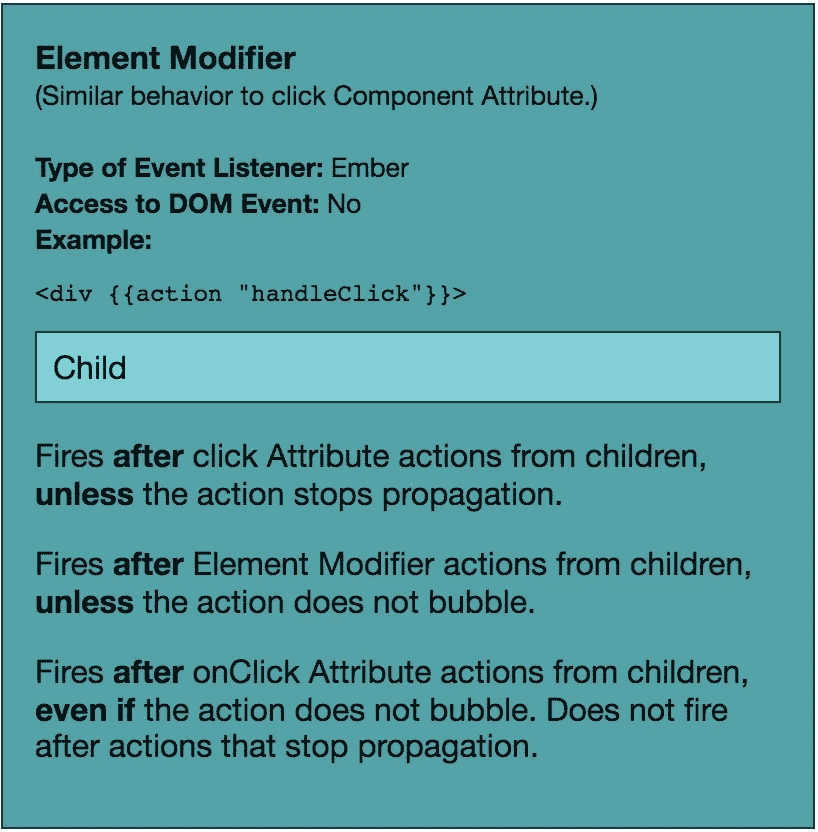
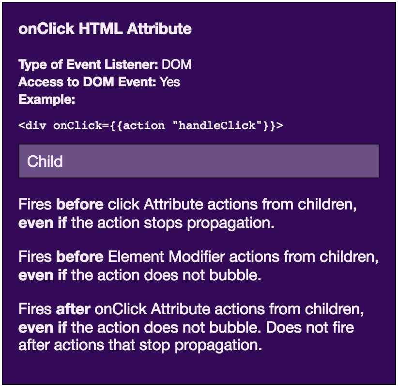
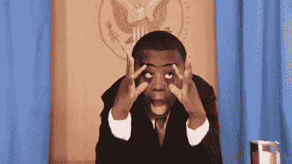
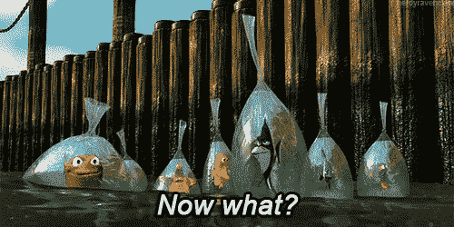
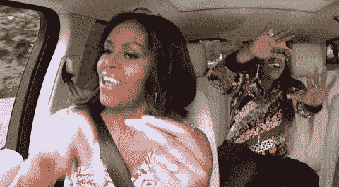

# 深入探讨余烬事件

> 原文：<https://medium.com/square-corner-blog/deep-dive-on-ember-events-cf684fd3b808?source=collection_archive---------0----------------------->

## Ember 动作和 DOM 事件的区别以及它的重要性，还有一个非常棒的流程图。

> 注意，我们已经行动了！如果您想继续了解 Square 的最新技术内容，请访问我们的新家[https://developer.squareup.com/blog](https://developer.squareup.com/blog)

几天前，我正在开发一个非常令人兴奋的新功能。作为推出这些变化的一部分，我实现了一个 on boarding tour——一系列工具提示，教导用户如何与不同的部分进行交互。

我对我们的 Ember 应用程序中的一个模板做了一个小小的改动，然后一切都崩溃了。你能猜到发生了什么吗？

**之前:**点击“下一步游览”打开东西。

```
<div class="cool-new-button" **{{action "toggleTheThing"}}**> {{#if shouldShowThisTooltip}}
    <div class="tour-tooltip">
      This button can open and close The Thing!

      <a {{action "toggleTheThingAndAdvanceToNextStep" bubbles=false}}>
        Next Step of the Tour
      </a>
    </div>
  {{/if}}</div>
```

**之后:**点击“游览的下一步”打开了这个东西，然后马上就关上了——速度之快，看起来就像什么都没发生一样。

```
<div class="cool-new-button" **onClick={{action "toggleTheThing"}}**> {{#if shouldShowThisTooltip}}
    <div class="tour-tooltip">
      This button can open and close The Thing!

      <a {{action "toggleTheThingAndAdvanceToNextStep" bubbles=false}}>
        Next Step of the Tour
      </a>
    </div>
  {{/if}}</div>
```

**唯一的变化:** `<div **{{action "toggleTheThing"}}**>`变成了`<div **onClick={{action "toggleTheThing"}}**>`

**我:**嗯，什么？



Gif of Kandi Burruss speaking with caption “So I’m just confused” ([source](https://giphy.com/gifs/confused-kandi-burruss-im-just-eojbwsT5POMak/))

所以我去了调试比赛，做了一点工作后得出结论，尽管视觉上很相似，`{{action "foo"}}`和`onClick={{action "foo"}}` 代表了完全不同的聆听咔哒声的方式。

使用`onClick={{action "foo"}}`监听浏览器直接发送的 DOM 事件，而`{{action "foo"}}`监听 Ember 为响应浏览器事件而触发的动作。我可以看出这两种类型的事件监听器有细微的不同行为，但还不能清楚地说出*什么*或*为什么*。

我意识到我只是触及了 Ember 事件处理方式的皮毛，还有很多东西需要学习。



Gif of Taraji P. Henson writing math equations on a chalkboard in Hidden Figures movie ([source](https://giphy.com/gifs/taraji-p-henson-octavia-spencer-hidden-figures-3o6Mbg856XV76hkYtq/))

在接下来的三天里，我一直盯着我的电脑屏幕，在下班回家的路上喃喃自语，并在我的厨房里跳舞，最终我设法全面理解了 DOM 事件和 Ember 操作是如何结合在一起的。

这是我学到的！

# 互动演示:余烬事件

如果你是一个喜欢视觉的人，并且想要获得一些代码来探索这些想法，我建立了一个方便的 [Ember 旋转演示](https://ember-twiddle.com/3de2f20b58797f1add3214c49be7fcdd?openFiles=templates.application.hbs%2C)，它解释了在 Ember 中收听事件的三种常见方式以及它们的交互方式。

如果您想在试用演示之前对所有内容有一个清晰的了解，请继续阅读！

[](https://ember-twiddle.com/3de2f20b58797f1add3214c49be7fcdd?openFiles=templates.application.hbs%2C)

Screenshot of Ember Twiddle Demo. [Link to interactive demo](https://ember-twiddle.com/3de2f20b58797f1add3214c49be7fcdd).

# 基础知识

让我们从几个定义开始，以确保我们都在同一页上。

**DOM:** 文档对象模型(Document Object Model)，一个描述网页如何工作的 API——HTML 如何呈现在页面上，当用户与该页面交互时会发生什么事件等等。Chrome、Firefox 和 Safari 等浏览器实现了这个 API 来显示网站。(更多信息，请查看这个 [DOM 文档](https://developer.mozilla.org/en-US/docs/Web/API/Document_Object_Model)。)

**DOM 节点:**DOM 中的单个元素。例如，`<div>`是一个单独的 DOM 节点。节点可以有父节点和子节点:

```
<div id="parent">                  <!-- This is a node. -->
  <button id="child"></button>     <!-- This is also a node. -->
</div>
```

**DOM event:** 描述页面上发生的*事情的标准方式。这包括点击、键盘输入、表单提交和在屏幕上拖动元素。(你可以在这个[事件参考](https://developer.mozilla.org/en-US/docs/Web/Events)中看到 DOM 事件的完整列表。)*

您可以向任何 DOM 节点添加一个**事件监听器**,当特定事件发生时，它应该做一些事情；例如，您可能会关心按钮何时被单击或者用户何时在文本字段中键入内容。侦听器是一个 JavaScript 函数，每当事件在指定节点上发生时，浏览器都会调用它。当侦听器被调用时，它会被传递一个带有相关信息的`Event`对象。

默认情况下，浏览器调用事件的目标节点的监听器，然后调用该节点的每个父节点的事件监听器——这个过程称为**传播**。这是有帮助的；假设您有一个带有图标和一些文本的按钮。如果用户准确地点击了图标，您仍然希望按钮接收点击。然而，链中的任何节点都可以覆盖这种行为，并**停止其侦听器中的传播**,以防止其祖先触发其侦听器——确保该事件不会导致任何其他事情发生。

Ember 动作:一个特定于 Ember 的抽象，位于 DOM 事件之上。成员动作本质上也是函数，但是可以访问额外的应用程序上下文和逻辑(比如相关控制器或组件中定义的属性或函数)。Ember 动作是 DOM 事件的结果，但是由框架调用，而不是由浏览器调用，并且可能有权也可能无权访问导致它们的原始 DOM 事件。

# 余烬事件的顺序

当用户点击你的新按钮时，你的组件中定义的函数是如何被触发的？如果前一个动作在事件上调用了`stopPropagation()`，或者另一个动作已经设置了`bubbles=false`，会发生什么？

基本概述是:

1.  创建一个 DOM 事件
2.  所有本机 DOM 事件侦听器都会被触发，从目标节点开始沿着树向上遍历——除非其中一个停止传播
3.  所有的 Ember 动作监听器都被触发，从目标节点开始，沿着树向上走——除非其中一个停止传播

完整的概述在我制作的**超级 rad 流程图**中有解释(之前参考的《厨房之舞》的创意)。

*Pro 提示:此图表中的所有颜色都与* [*Ember Twiddle 演示*](https://ember-twiddle.com/3de2f20b58797f1add3214c49be7fcdd?openFiles=templates.application.hbs%2C) *中不同事件监听器所用的颜色相匹配，所以您可以在闲暇时进行交叉引用！*



Flowchart titled: “How do events and actions work in Ember?” [Link to plaintext outline of chart](https://gist.githubusercontent.com/mchat/ccacbb7202819092e6b697eb8b42e3a5/raw/33b3adc4919557d901ddc61459d85bcb5c681c86/events_actions_flowchart_caption.txt) .

# Ember 中事件侦听器的类型

如何知道您使用的是 DOM 事件监听器还是 Ember 动作监听器？您的操作何时可以访问原始 DOM 事件？你的动作能阻止其他动作被激发吗？

在 Ember 中添加侦听器有三种主要方式:

1.  将**成员动作监听器**添加到具有事件名称属性的组件中。

```
{{some-component click=(action “handleClick”)}}
```

2.通过使用`action`助手修改元素，将**成员动作监听器**添加到 DOM 节点。

```
<div {{action "handleClick"}}></div>
<div {{action "handleDoubleClick" on="doubleClick"}}></div>
```

3.通过使用事件 HTML 属性将 **DOM 事件监听器**添加到 DOM 节点。

```
<div onclick={{action "handleClick"}}></div>
```

*(专业提示:如果你还没有体验过* [*余烬旋转演示*](https://ember-twiddle.com/3de2f20b58797f1add3214c49be7fcdd?openFiles=templates.application.hbs%2C) *，这是一个很好的机会！您可以自己看到这些事件的不同组合是如何从孩子到父母的，并修改运行演示的源代码以进一步探索。)*



Screenshot of click Component Attribute in [Ember Twiddle demo](https://ember-twiddle.com/#/3de2f20b58797f1add3214c49be7fcdd?openFiles=templates.application.hbs%2C).

## 1.组件事件属性

**监听器类型:**余烬动作

**访问原始 DOM 事件:**是

**支持的事件:** [由 Ember 定义。组件](https://emberjs.com/api/ember/2.14/classes/Ember.Component/properties/actions#responding-to-browser-events)

**它能停止传播:** *对其他余烬动作*是，因为那些都是在这个动作之后被发射的。*
*No for DOM events* ，因为那些是在这个动作之前被触发的。

*不能将`bubbles=false`作为闭包动作散列的一部分传递(像`click=(action "foo" bubbles=false)`)。如果你想停止传播，你必须在你的处理程序中调用`event.stopPropagation()`。更多信息参见[GitHub 发布](https://github.com/emberjs/ember.js/issues/12632#issuecomment-158657664)或[动作助手](https://emberjs.com/api/ember/2.14/classes/Ember.Templates.helpers/methods/action?anchor=action)的文档。

Code examples for click Attribute actions. [Link to examples in GitHub Gist](https://gist.github.com/mchat/54905616e05f17021771fa043b9c387a).



Screenshot of Element Modifier in [Ember Twiddle demo](https://ember-twiddle.com/#/3de2f20b58797f1add3214c49be7fcdd?openFiles=templates.application.hbs%2C).

## 2.元素修饰符

**监听器类型:**成员操作

**访问原始 DOM 事件:**否

**支持的事件:** [由 Ember 定义。模板.助手](https://emberjs.com/api/ember/2.14/classes/Ember.Templates.helpers/methods/action#specifying-dom-event-type)

**它能停止传播:** 对其他余烬动作是，因为那些是在这个动作之后被发射的。*
*No for DOM events* ，因为那些是在这个动作之前触发的。

*这种类型的动作不能访问原始的 DOM 事件，所以它不能调用`event.stopPropagation()`。如果你想停止传播，你必须在动作辅助上设置`bubbles=false`。

Code examples for Element Modifier actions. [Link to examples in GitHub Gist](https://gist.github.com/mchat/ad3c99550a5e880bafd75c8e6deb4ab3).



Screenshot of onClick HTML Attribute in [Ember Twiddle demo](https://ember-twiddle.com/#/3de2f20b58797f1add3214c49be7fcdd?openFiles=templates.application.hbs%2C).

## 3.DOM 事件属性

**监听器类型:** DOM 事件

**访问原始 DOM 事件:**是

**支持的事件:** [由 DOM API](https://developer.mozilla.org/en-US/docs/Glossary/Global_attribute) 定义

**它能停止传播吗:** *对 DOM 事件和 Ember 动作*都是，因为这两个都是在这个事件之后触发的。* **

*在 action helper 上设置`bubbles=false`实际上并不会停止 DOM 事件的传播——这是一个特定于 Ember 的抽象。如果你想停止传播，你必须在你的处理程序中调用`event.stopPropagation()`。

* *这就是它变得特别有趣的地方——调用`event.stopPropagation()`将会阻止*任何* Ember 动作因为那个事件而被触发— **甚至是子动作，这完全违背了正常的 DOM 传播顺序**,但是你可以在这个 Ember 旋转中看到[动作。为什么？这是因为此时调用`stopPropagation`会阻止事件冒泡到特殊的`<div id="root">`节点，该节点是 Ember 应用程序中所有内容的父节点。那个节点的处理程序是启动 Ember 操作的过程——如果这仍然令人困惑，请参见上面的流程图！](https://ember-twiddle.com/95bf1c8bcbbbe3569fe17dcfcf27e27c?openFiles=templates.application.hbs%2C)

Code examples for onClick Attribute actions. [Link to examples in GitHub Gist](https://gist.github.com/mchat/04e61443dc21e0198425798fe0511b99).

# 学习和建议



Gif of Robby Novak (aka Kid President) holding eyes open ([source](https://giphy.com/gifs/soulpancake-youtube-eyes-efwfOma7Fm31S/))

所有这些可能很有趣，但它与最初将我引入这个兔子洞的错误有什么关系呢？

当你在 Ember 处理事件时，这对你意味着什么？

让我们再来看看这个有问题的代码示例:

```
<div class="cool-new-button" **onClick={{action "toggleTheThing"}}**>{{#if shouldShowThisTooltip}}
    <div class="tour-tooltip">
      This button can open and close The Thing!

      <a **{{action "toggleTheThingAndAdvanceToNextStep" bubbles=false}}**>
        Next Step of the Tour
      </a>
    </div>
  {{/if}}</div>
```

我们有一个子节点正在使用 Ember 动作监听器来监听`toggleTheThingAndAdvanceToTheNextStep`。当它处理 Ember 事件时，它停止任何其他 Ember 事件的触发(感谢`bubbles=false`)。这个*看起来*像是应该阻止父动作被开除。

*然而—* 在调用子节点的动作处理程序之前，会调用其父节点的 DOM 事件监听器(`toggleTheThing`)。这孩子还没有机会停止传播。父动作将它打开，子动作稍后将它关闭。

在本例中，事件将按以下顺序触发(假设没有处理程序停止传播):

1.  `<a>`上的 DOM 事件
2.  `<div class="tour-tooltip">`上的 DOM 事件
3.  `<div class="cool-new-button">`上的 DOM 事件(打开东西)
4.  `<a>`上的余烬动作(关闭东西)
5.  `<div class="tour-tooltip">`上的余烬动作
6.  `<div class="cool-new-button">`上的余烬动作

## **外卖**



Gif of fish from Finding Nemo with caption “Now what?” ([source](https://giphy.com/gifs/c5gKu4AQ4Y64g/))

*   DOM 事件总是在余烬动作之前触发。
*   将动作直接附加到 DOM 事件属性(如`onclick`)会直接使用浏览器的 DOM events API。
*   将动作附加到 Ember 属性(比如组件的`click`属性或者用`action`助手修改元素)使用 Ember 的动作 API，这是 DOM events API 之上的一个抽象。
*   如果您使用的是常规形式的动作模板助手而不是闭包形式的动作模板助手，那么您可以使用`bubbles=false`来阻止事件传播*仅*(例如`{{action "foo" bubbles=false}}`有效，而`click=(action "foo" bubbles=false)`无效)。
*   如果您使用的是可以访问原始 DOM 事件的处理程序，那么您可以使用`event.stopPropagation()`来阻止事件只传播*或`click`这样的组件事件属性。*
*   在 DOM 事件处理程序上调用`event.stopPropagation()`将会阻止*任何*成员动作因为那个事件而触发——有风险的事情！
*   为了一致性和防止细微的错误，我建议总是在 DOM 事件上使用 Ember 操作。

**总是使用 Ember 动作的一个可能的例外**:如果你想选择性地添加一个事件到一个 DOM 节点。目前，Ember 模板助手**不支持**使用内嵌条件修改元素:

```
<div {{if shouldRespondToClick (action "handleClick")}}></div>
```

因为那不是有效的把手，所以你必须这样做:

```
<div onClick={{if shouldRespondToClick (action "handleClick")}}</div>
```

或者，您可以在您的动作处理程序中执行这个逻辑检查，并提前返回:`if (!this.get('shouldRespondToClick')) { return; }`。然而，您的元素将具有与点击能力相关联的样式，因此您可能还需要可选地添加一个设置`cursor: default`的样式。

仅仅为了保持事件更加一致，就需要做大量的工作；您可以决定自己喜欢哪种方法。



Gif of Michelle Obama and Missy Elliott dancing in a car ([source](https://giphy.com/gifs/latelateshow-james-corden-michelle-obama-missy-elliot-l41Ymn9tf1TIJm1gY/))

最大的收获是:**现在你知道余烬事件是如何运作的了！您可以做出明智的决策，并满怀信心地进行调试。**

开始厨房舞蹈，或者用我个人最喜欢的 Slack 表情符号的话说，**:柯基:在**。

另外，你喜欢研究软件和学习技术吗？你应该[在广场](https://squareup.com/careers/jobs?role=Engineering)加入我们，这样我们可以一起学习和开发伟大的产品！