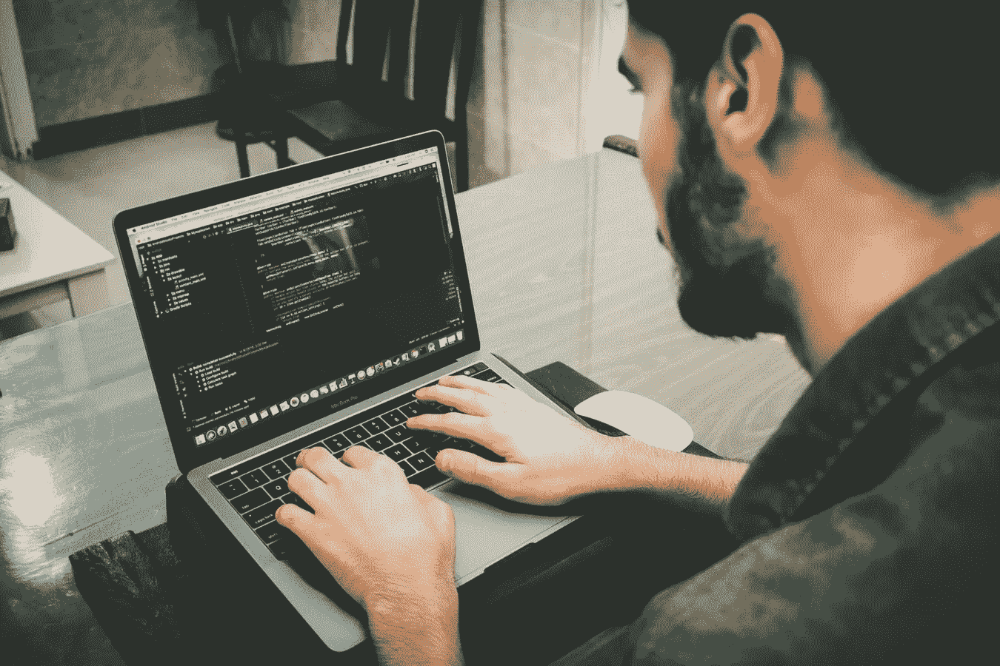

# 深入代码训练营体验

> 原文：<https://medium.com/quick-code/deep-into-the-code-bootcamp-experience-f13eacb84f82?source=collection_archive---------9----------------------->

Photo by Henry [Danial RiCaRoS](https://unsplash.com/@ricaros) on [Unsplash](https://unsplash.com/photos/FCHlYvR5gJI)

大家好！本周我想谈谈我迄今为止的编码训练营经历。真的很酷！:D

我们已经进入 12 周的第 9 周，我觉得我学到了很多。时间过得真快；很难相信这就要结束了。

我尽力提前做好准备，但我不认为我意识到节奏会有多快。每个工作日我们至少要交 2 到 3 份作业，所以现在已经超过 100 份了。(有些很短，有些需要很长时间。)

我所在的班级有 10 名学生，这是一个非常积极的环境。每个人都在这里，因为他们想在这里学习和提高。有几个同学对编码是全新的，有几个对编码和高级概念有很多经验。很容易向对方求助，真的很好。

2 我们讨论了很多不同的领域，但我觉得我对以下三个主题了解最多:

**Python 和 Django:**
——以前从未和 Django 合作过，现在我有了很多为后端编写 Python 的经验。

**大 O 符号和算法:**
——起初这是一个非常陌生的话题，但我正在理解这个概念(如果还不太明白如何应用的话)。

**Axios 和 AJAX:**
——过去我很难让 AJAX 请求正常工作，但现在我觉得使用它们更舒服了。

编码快乐！