# 深度学习—使用 Detecto 构建对象检测模型

> 原文：<https://medium.com/quick-code/deep-learning-build-object-detection-models-using-detecto-7c1e2ad4a8dd?source=collection_archive---------0----------------------->

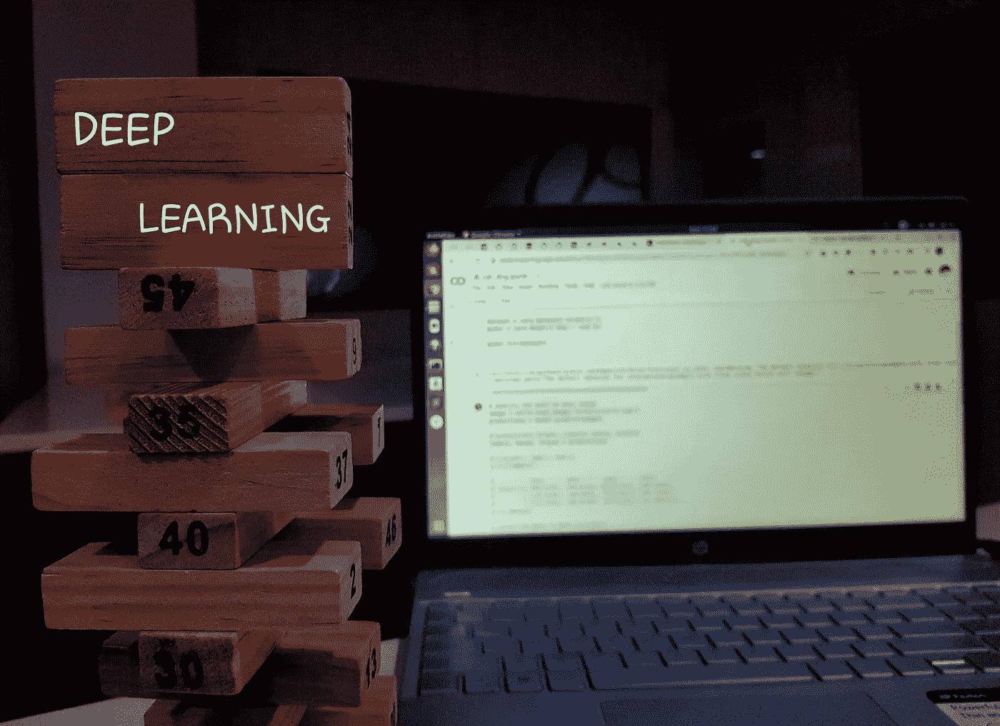

如今，大多数人都对机器学习和计算机视觉着迷。因为，它做了一些不可思议的事情。最近听说了关于**自动驾驶汽车**和**口罩检测**还有**人脸识别**的消息。在**新冠肺炎隔离期间，**很多人都做过口罩检测**。**是的，我也是其中之一。但在这里，我不会谈论面具检测。在这里，我主要讲述了如何使用 Detecto 创建一个自定义的对象检测模型？

我觉得，在机器学习中，最复杂的部分是如何训练一个模型。最初，我主要只与预先训练好的模型一起工作。因为自定义的需要很长的时间来处理，而且要处理大量的文件修改。现在我不担心了。是的，我有一个更好的解决方案来训练一个定制模型。

# 为什么我们需要训练一个定制模型？

例如，我需要在一些图像上检测猫。如果我使用预先训练好的公共模型来做这件事，我会得到一个类似下图的结果。所以，预训练的模型有很多对象。这就是为什么我们需要一个定制模型。

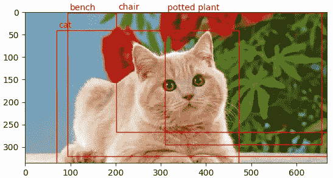

Output for public pre-trained model

大多数开发人员只使用现有的经过训练的模型。甚至他们也很难建立他们的计算机视觉模型。

我为任何人提供了一种简单的方法，只需几行代码就可以构建全功能的对象检测模型。更具体地说，我们将使用 [Detecto](https://github.com/alankbi/detecto) ，这是一个构建在 PyTorch 之上的 Python 包，它使这个过程变得简单，并对所有级别的程序员开放。

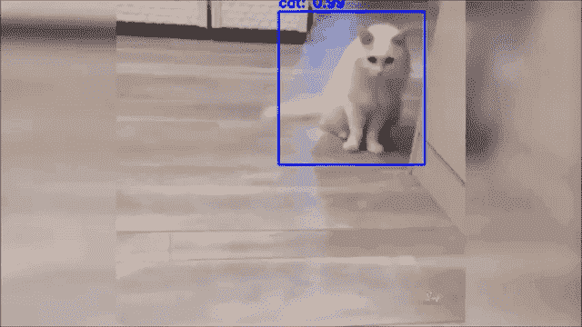

The output of my custom model

# 如何使用 Detecto

[Detecto](https://github.com/alankbi/detecto) 是训练定制模型与其他事物进行比较的最佳方式之一。我们不需要下载任何类似 TensorFlow 或者 skeleton 这样的 Github 回购。简单的复制过去的作品。

这是一个简单的 python 包，用于定制模型中的火车。在这里我将解释它是如何工作的。您可以使用 pip 安装 Detecto 软件包:

```
pip3 install detecto
```

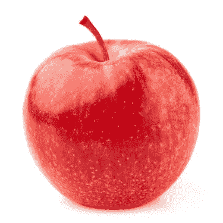

sample images from the [google](https://www.google.com/search?q=cat+images&safe=active&sxsrf=ALeKk01BBy3DOfU5eS-4VUToaSSl9iOQ2g:1589105730891&source=lnms&tbm=isch&sa=X&ved=2ahUKEwj6reaUiKnpAhU14jgGHWCDBx8Q_AUoAXoECBIQAw&biw=1315&bih=669#imgrc=TnSE0T8m6bgdOM)

以'**apple.jpg**'的名称下载这个示例图像，并在与图像相同的文件夹中创建一个 Python 文件。文件里面复制粘贴下面的代码。

```
from detecto import core, utils, visualize
image = utils.read_image(‘apple.jpg’)
#Initializes a pre-trained model
model = core.Model()
labels, boxes, scores = model.predict_top(image)
visualize.show_labeled_image(image, boxes, labels)
```

运行这段代码后，您会看到类似下图的结果。

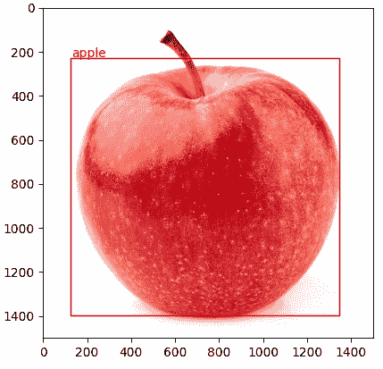

Image Detection with Detecto

它与现有的**探测器的预训练模型**一起工作。在开始训练您的模型之前，您需要检查您的计算机以启用 GPU。下面的代码可以让你检查你的 GPU 状态。

```
import torch 
print(torch.cuda.is_available())
```

如果打印结果为真，则 GPU 已启用。如果打印错误，GPU 未启用。我强烈推荐使用支持 GPU 的计算机来完成这个过程。如果没有，您可以继续此过程。但是训练你的模型需要一些时间。

# 为数据集准备图像

无论何时你要训练一个定制模型，重要的是**图像**。是的，当然，图像在深度学习中起着主要作用。因为，准确性将基于图像。所以，在训练一个定制模型之前，你需要计划**如何获取图像？**在这里，我将分享我对获取数据集图像的简单方法的想法。

## 从谷歌上获取图片

[](https://chrome.google.com/webstore/detail/download-all-images/ifipmflagepipjokmbdecpmjbibjnakm) [## 下载所有图像

### 将活动选项卡中的所有图像保存为. zip 文件。轻松保存来自 Instagram、谷歌图片等的照片。

chrome.google.com](https://chrome.google.com/webstore/detail/download-all-images/ifipmflagepipjokmbdecpmjbibjnakm) 

是的，我们可以从谷歌上获取图片。使用 [**下载所有图片**](https://chrome.google.com/webstore/detail/download-all-images/ifipmflagepipjokmbdecpmjbibjnakm) 这个扩展让我们可以在几分钟内轻松获得图片。如果你需要定制你已经下载的图片，我的意思是删除 png 文件，然后像那样重命名文件。下面我添加了一些代码片段。如果你想自定义你的图像，你可以使用它。否则，你可以跳过。

**从下载的图像文件夹中删除 PNGs。**

```
import glob
import pathlib
for file in glob.glob('frames/*.png'):  
  path = pathlib.Path(file)
  path.unlink()
```

**重命名您的图像文件**

```
import os
os.getcwd()
collection = "images/cat"
for i, filename in enumerate(os.listdir(collection)):            
  print(filename)
  os.rename(collection + "/" + filename, collection + "/cat" + str(i) + ".jpg")
```

## 从视频中获取图像

Detecto 提供了一个简单的解决方案来从视频中获取图像。使用以下[代码](https://gist.github.com/karthick965938/b8a72af1fcc106782ab6f9256480267d)从视频文件中提取图像。

```
from detecto.utils
import split_videosplit_video(‘images/dog.mp4’, ‘images/dog/’, step_size=10)
```

## 使用你的图像

你也可以使用你的图像，我的意思是你可以拍一张你要用来训练你的模型的物体的照片。但重要的是你需要改变图像的分辨率。因为，你拍摄的图像将是高分辨率的。所以，训练你的模型要花很长时间。使用下面的代码你可以很容易地降低图像的分辨率。

# 带标签的图像注释

LabelImg 是一个可以辅助标签图片的工具，个人觉得这个对于标注很有用。Detecto 支持 PASCAL VOC 格式，在这种格式中，XML 文件包含图像中每个对象的标签和位置数据。要创建这些 XML 文件，您可以使用开源的 [LabelImg](https://github.com/tzutalin/labelImg) 工具，如下所示:

```
pip3 install labelImg # Download LabelImg using pip
labelImg # Launch the application
```

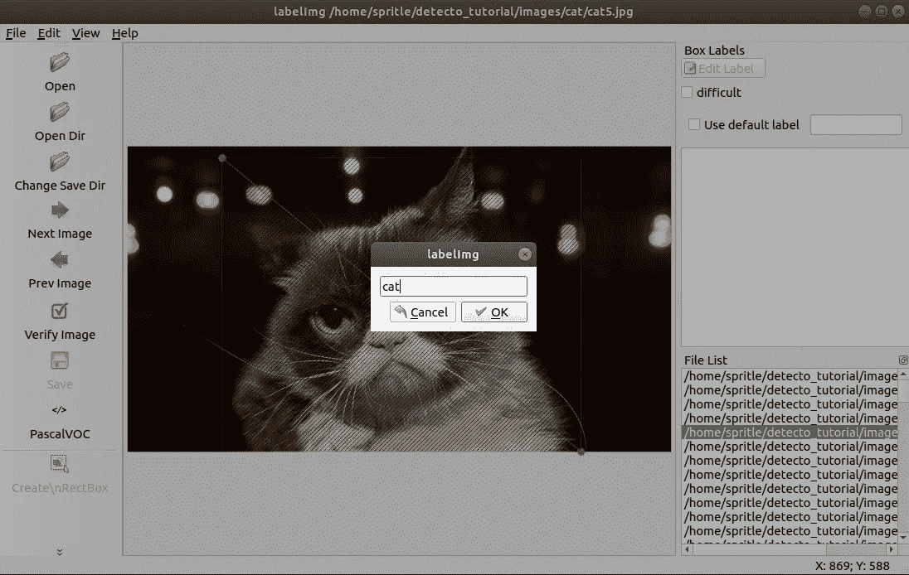

Annotations with LabelImg

贴上标签后，你的图像文件夹将会是这样的。如果你想了解更多关于 LabelImg 的信息，请点击这里查看。

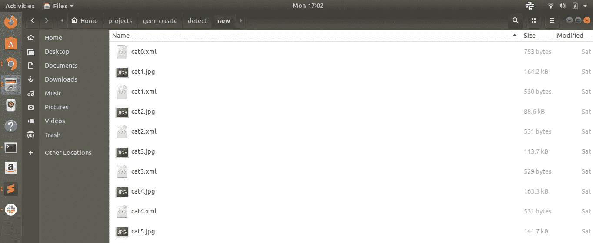

DataSet folder’s an inside view

[](https://github.com/tzutalin/labelImg) [## 佐他林/标签

### LabelImg 是一个图形化的图像注释工具。它是用 Python 写的，使用 Qt 作为它的图形界面…

github.com](https://github.com/tzutalin/labelImg) 

# 设置 Google 协作笔记本

Collaboratory，或简称为“Colab ”,允许您在浏览器中编写和执行 Python，使用

*   不需要配置
*   免费访问 GPU
*   轻松分享

按照下面的步骤创建一个[谷歌协作](https://colab.research.google.com/notebooks/intro.ipynb)笔记本，这是一个带有免费可用 GPU 的在线编码环境。对于本教程，您将只是在 Google Drive 文件夹中工作，而不是在您的计算机上。

*   第一步:我在你的 Google Drive 中创建了一个名为 **object_detection** 的文件夹。
*   第二步:我在 object_detection 里面创建了**图片**文件夹。
*   第三步:上传你的数据集图片到**图片**文件夹。
*   步骤 4:创建一个名为 **object_detection.ipynb** 的 Google Colab 文件
*   步骤 5:你可以看到文件 **object_detection.ipynb** 创建的结果。

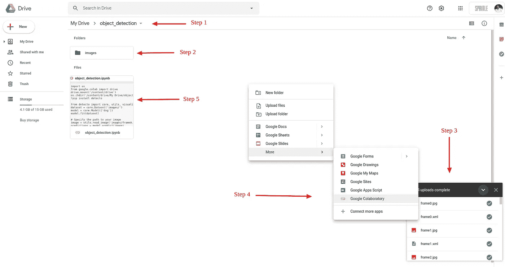

Upload DataSet and Create a [Google Colaboratory](https://colab.research.google.com/notebooks/intro.ipynb) notebook

还有一点更重要的是，你需要启用 GPU
**编辑⇾笔记本设置⇾硬件加速器并选择 GPU**

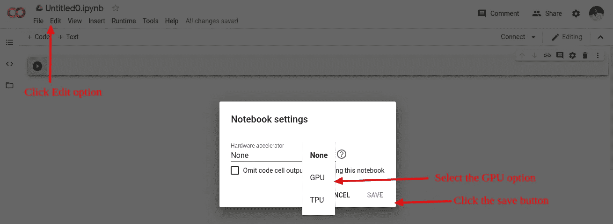

Enable the GPU option

[](https://colab.research.google.com/) [## 谷歌联合实验室

### 编辑描述

colab.research.google.com](https://colab.research.google.com/) 

# 使用 Detecto 训练自定义模型

我们建立了谷歌协作笔记本来训练一个模型。现在我们可以开始编码了。你可以在这里下载我的谷歌合作笔记本文件。

[](https://github.com/karthick965938/detecto_tutorial/blob/master/short.ipynb) [## karthick 965938/detecto _ tutorial

### permalink dissolve GitHub 是超过 5000 万开发人员的家园，他们一起工作来托管和审查代码，管理…

github.com](https://github.com/karthick965938/detecto_tutorial/blob/master/short.ipynb) 

## 步骤 1:插入一个新的代码单元格，并添加下面的代码。在您的 Colab 笔记本中运行安装检测器的代码单元。

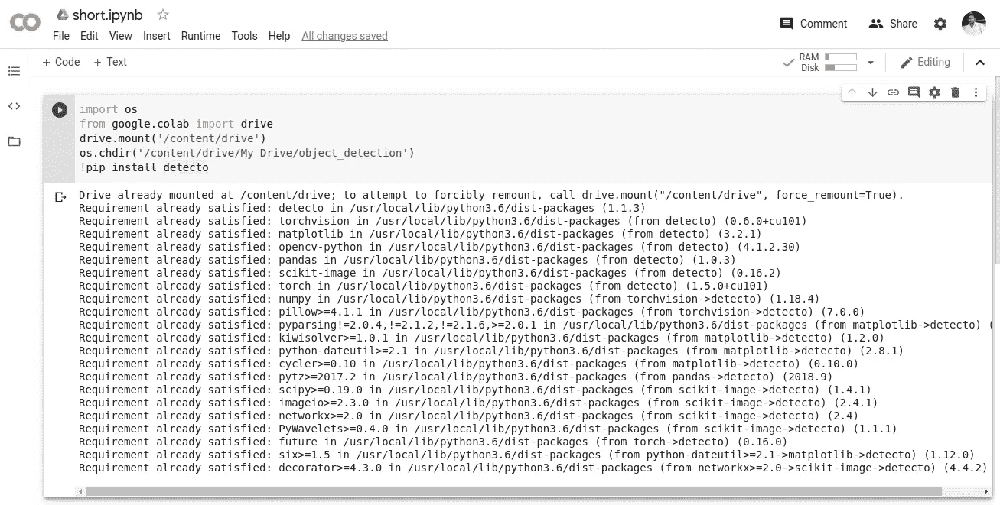

Installed detecto in google colab notebook

## 第二步:再次插入一个新的代码销售和复制粘贴下面的代码开始训练你的模型。

所以，这个过程需要一些时间，这取决于你有多少数据集。一旦完成训练，没有任何错误，你会得到确切的结果如下图。您可以跳过用户警告。

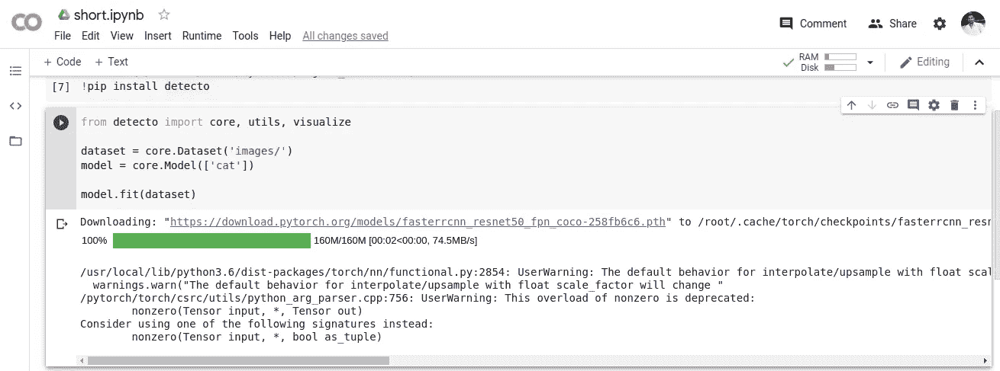

Successful message for the custom model

是啊！！定制模型文件现在可以测试了。

# 测试并保存您的模型

我们已经成功训练了我们的模型文件。现在我们需要使用下面的代码测试模型文件。我们需要遵循上面已经完成的相同过程。插入一个新的代码单元格，并添加以下代码。

如果我们的模型训练完全正确，您可以得到如下图所示的结果:)

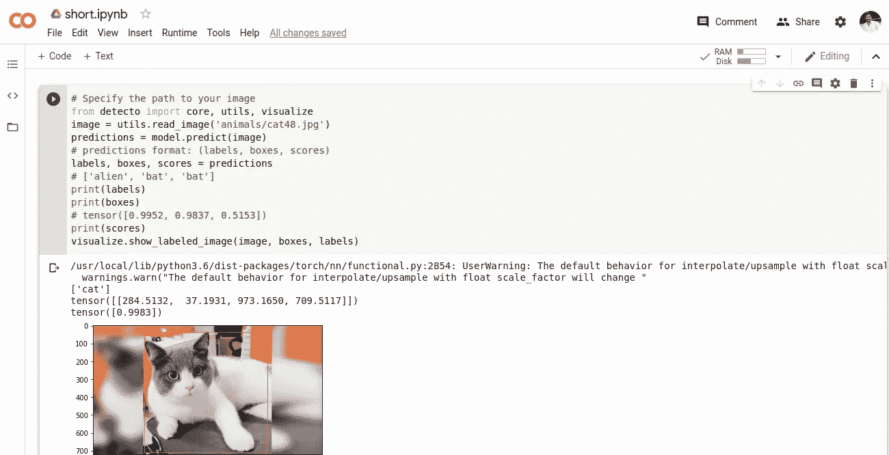

对，就是这样。我们已经训练好了自定义模型:)；)所以您可以使用下面的代码保存这个训练好的模型。

```
model.save('cat_model_weights.pth')
```

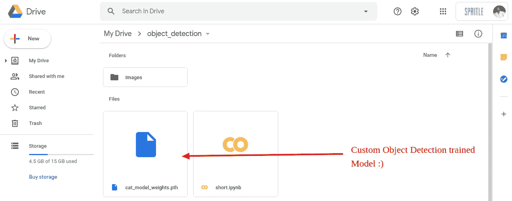

model file saved in the google drive folder

自定义模型文件已保存在 google drive 文件夹中。你可以下载，也可以测试。查看下面的文档以获得更多帮助！；)

 [## 探测器

### Detecto 是一个 Python 包，它允许你用…

detecto.readthedocs.io](https://detecto.readthedocs.io/en/latest/) 

这是关于学习训练定制模型的最佳体验。因为，我已经为训练好的模型使用了一些其他的 python 包。那些很难用。现在我要把不同的对象训练成我未来的想法。

特别感谢艾伦·毕，在我学习侦探的时候，他给了我很多帮助