# 深度学习揭开神秘面纱

> 原文：<https://medium.com/walmartglobaltech/deep-learning-demystified-693a2d7ec79e?source=collection_archive---------0----------------------->

从优化到深度学习

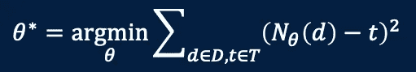

DL in 1 equation: *N* — a deep model, *θ* — its parameters, D — data, T — targets for supervision which can be external labels (supervised learning) or data themselves (unsupervised learning)

# 1.介绍

([Source](http://www.rackwise.com/))

如今，神经网络以其规模而自豪:数百层、数万亿个参数和复杂的微结构。早在今年 1 月，谷歌的[开关变压器](https://towardsdatascience.com/google-switch-transformers-scaling-to-trillion-parameter-models-with-constant-computational-costs-806fd145923d)就创下了人工智能语言模型 1.6T 参数的新记录(比去年发布的 OpenAI 的 [GPT-3 模型](https://www.techradar.com/news/microsoft-deploys-gpt-3-to-let-devs-code-using-everyday-language)中的 175B 参数大 8 倍)。最近，随着 BAAI 的[五刀 2.0](https://towardsdatascience.com/gpt-3-scared-you-meet-wu-dao-2-0-a-monster-of-1-75-trillion-parameters-832cd83db484) 模型的发布，这个记录再次被设定为 1.7T。听起来很有趣，但是有点吓人，对吧？你并不孤单。如果你是一个人工智能爱好者谁是热切地成为熟悉这个否则势在必行的技术，这个博客是为你。

目标是通过将深度学习(DL)与微积分的一些基本概念联系起来，揭开无意中出现的困境的神秘面纱，让它在你看来更有吸引力，而不是令人望而生畏。最后，您需要带回家的关于 DL 的所有信息都被总结成了三个备忘单。你永远不会害怕那些巨大的人工智能模型，因为你知道不管它们有多复杂，它们都可以归结为你拥有的三张桌子。

# 2.最佳化

首先要知道的是，深度学习(通常是机器学习)只是通过成本函数优化进行参数估计的另一个用例。如果您仍然有疑问，请查看顶部的等式——这就是 DL 的全部内容。它说的是，深层模型可以被认为是一个函数 *N、*通过 *θ、*参数化，给定输入数据 *d* ，生成输出 *N* ( *d* )。训练是指通过使用多对数据-目标( *d* 、 *t* )将 *N* ( *d* )与已知目标 *t* 进行比较，找到 *θ* 。差异*又名*错误*N*(*D*)-*t*)在整个数据集 *D* 和目标集*t*之间聚合。最佳解 *θ** 对应于使总错误最小的解。多亏了两个神奇的符号 *N* 和 *θ* ，DL 周围所有可怕的东西都被围了起来*。*

在本节的剩余部分，我将更详细地讨论函数优化，从简单的类型到适合表达深度神经网络(DNN)的更复杂的类型。

**2.1 单变量函数优化**

先说最简单的情况——单变量函数——*y*=*f*(*x*)。假设 *f* 的导数不为零，即*f’*(*x*)≠0(一会儿就知道为什么需要这个条件)。我们的目标是找到它的根(其中 *f* ( *x* )=0)。

一个例子是*f*(*x*)=*x*谁的答案比较猥琐: *x* =0。作为理解后面章节的准备，让我们把它作为一个优化问题来解决。我们采取以下步骤:

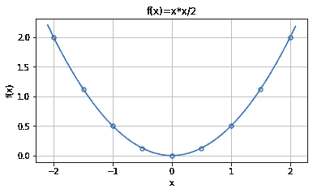

Fig. 2.1 Shape of the cost function C(f(x))=x²/2

1.  构造一个**代价函数***C*(*f*)=*f*(*x*)/2 这是最简单的[凸函数](https://en.wikipedia.org/wiki/Convex_function)并保证单个最小值。
2.  对新构建的成本函数执行**梯度下降** (GD)。当 *f* ( *x* )是复杂函数时，直接优化 *C* ( *f* )很难。在这种情况下，迭代梯度下降是一种方法。诀窍是用它的一阶泰勒展开式来近似*f*(*x*):*f*(*x*f*(*x*₀)+*f’*(*x*₀)(*x*-*x*₀)，即然后我们不求解 *f* ( *x* )=0，而是求解*f*(*x*₀)+*f’*(*x*₀)(*x*-*x*₀)=0.找到的 *x* 成为下一次迭代的 *x* ₀，并且该过程一直重复，直到达到最小值。下面是算法，*

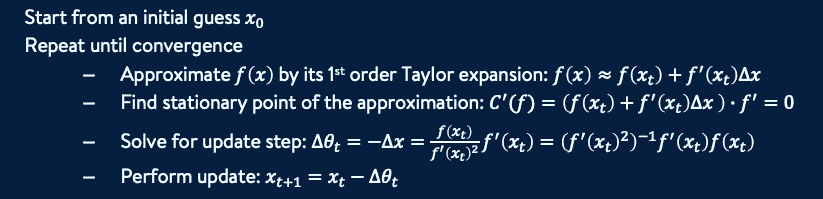

Univariate function optimization by Gradient Descent. Start from a initial guess x0\. Iteratively update it with the calculated ▵x until convergence.

当迭代停止时，最后一个 *xₜ* 就是寻找的根。这里注意三个细节:

*   使用▵ *θ i* s 代替 *-* ▵ *x* ，以与神经网络的典型参数表示一致。
*   导数*f’*(*x*)不必要地同时出现在分子和分母中。当处理更复杂的函数类型时，其中导数的概念变为梯度，原因将很快变得清楚。
*   因为*f’*(*x*)出现在分母中，所以它不能为零，这就是条件*f’*(*x*)≠0 的原因。

**问题**:我们怎么知道 *C* 的最小值与 *f(* x *)* 的根相同？

**答**:已知作为凸函数， *C* 的最小值在其[驻点](https://en.wikipedia.org/wiki/Stationary_point)—*C’*s 导数消失的地方。遵循导数计算规则:*C '(f)*=*f(*x*f '(*x*)。这样 C'(f)* = *0 导致 f(x)=0 s* 因为*f '(x)*≦*0*。换句话说，新构建的成本函数为我们指出了原始问题的相同解决方案。

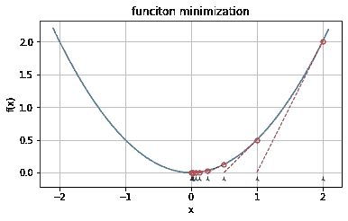

Fig. 2.2 GD example. Green triangles: x sequence; red circles: f(x) sequence; dashed red lines: tangent lines at the data points.

图 2.2 显示了最小化上述成本函数时的梯度下降。在这种情况下，▵*θ= f*(*x*)/*f’*(*x*)*= x*/2，这意味着每一次迭代都将之前找到的根减半。从 *x* =2 开始，接下来的值是 *x* =1，0.5，0.25，…等等。在 10 次迭代中， *x* 达到 1/1⁰ ~1e-3，代价 *C* 降低到 7.63e-6。请注意，每条红色虚线的斜率，相当于成本函数在矩的根 *x* 处的导数或梯度，在此过程中保持下降(因此得名梯度下降)。

**2.2 多元函数优化**

顾名思义，多元函数涉及多个变量。他们长得像 *f* ( *x* ₀， *x* ₁，…， *xₙ* )。有时它们被写成向量形式 *f* ( *X* )其中 *X* =[ *x* ₀， *x* ₁，……， *xₙ* 。由于 *X* 是多维的，单个方程 *f* ( *X* )=0 不足以解决问题。而是需要 *m* ≥ *n* 个方程，即 *f* ₀( *X* )=0， *f* ₁( *X* )=0，…， *fₘ* ( *X* )=0。定义 *F* =[ *f* ₀， *f* ₁，……， *fₘ* ]一个向量函数，以及【0】*ₘ=*【0，0，…，0】， *m* 零点*一个向量。*与一元情形类似，多元求根问题*f*(*x*)=【0】*ₘ*通过代价函数*c*(*f*(*x*)=(*f*)/2 转化为优化问题，其中符号

*有人想知道一元导数的多元等价物是什么。这是一个名为**雅可比矩阵**的矩阵，定义如下:*

*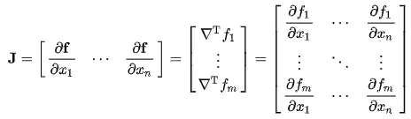*

*其中▽*fᵢ*(*x*)=[*fᵢ*'(*x*₀)， *fᵢ* '( *x* ₁)，…， *fᵢ'* ( *xₙ* )]为第 I 个函数的梯度 *fᵢ* w.r.t .变量将所有这些梯度向量叠加在一起就形成了雅可比矩阵。*

*在单变量情况的类似操作之后，多变量优化过程给出如下:*

*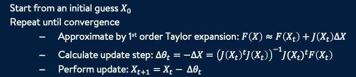*

*Multivariate function optimization by GD. Notice the resemblance to the univariate case.*

*从上面可以注意到一些有趣的事情。首先，从结构上来说，单变量和多变量过程是完全一样的。第二，就像前面要求 *f'* ( *x* )≠0 一样，*j*(*x*)*ᵗj*(*x*)必须满秩，即 *J* ( *X* )不能消失。第三，适应可以通过以下互换来完成:*

*   **x → X**
*   **f→F**
*   **f*'(*x*)*→j*(*x*)或其转置*j*(*x*)*ᵗ**
*   **1/(f*'(*x*)*f*'(*x*)*→**j*(*x*)*ᵗj*(*x*)*

*图 2.3 演示了最小化一个二元函数*f*(*x*)=*x*₀+*x*₁的梯度下降，从顶部位置开始，到底部中心结束。*

**

*Fig. 2.3 GD of function *x*₀²+*x*₁², starting from (-2,2), ending at (0,0), following the red trajectory. ([Source](/analytics-vidhya/gradient-descent-part-2-the-math-c23060a96a13))*

****以运动为例****

*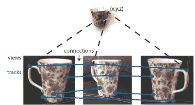*

*A 3D point can be recovered from a connection — multiple 2D image pixels connected to that point. ([Source](https://ww2.mathworks.cn/help/vision/ug/structure-from-motion.html))*

*一个经典的计算机视觉问题是从运动中得到结构，即从移动摄像机(运动)的多个图像中找到一个点(结构)的 3D 坐标。左图是从三幅 2D 图像的连接中恢复出杯把上一点 *X* (即 *n* =3)的三维坐标( *x* 、 *y* 、 *z* )。*

*已知摄像机投影矩阵 *Pᵢ* 和该点的二维图像像素( *uᵢ* 、 *vᵢ* )、 *i* =1，2，3，等式为 *PᵢX* =( *uᵢ* 、 *vᵢ* )，或者等价地 *PᵢX-* ( *uᵢ* 、 *v 每个图像提供 2 个等式。三幅图像总共提供 6 个等式，因此 *m* =6。优化问题是:**

*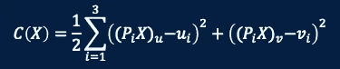*

*Cost function of an example SFM problem: 6 equations, 3 unknowns.*

*一般来说，有了 *a* 未知摄像机和 *b* 未知点，假设所有的点都在所有摄像机中被观测到，那么就有 2 个 *ab* 方程和 6 个 *a* +3 个 *b* 未知量。当 and *m* 和 *n* 足够大时，方程比未知数多。因此梯度下降可以找到解决方案。人们可以想象拍摄许多建筑物的照片并恢复其完整的 3D 结构。*

> *在这个项目中，我们考虑从网上获取的图像中重建整个城市的问题。我们的目标是建立一个并行分布式系统，从 Flickr.com 下载与一个城市相关的所有图像，比如说罗马。下载后，它匹配这些图像以找到共同点，并使用这些信息来计算城市的三维结构和拍摄这些图像的相机的姿态。所有这些都要在一天内完成。*

*[Building Rome In a Day](https://grail.cs.washington.edu/rome/) — Point cloud reconstruction of the Colosseum. Triangles show camera positions.*

***2.3 随机梯度下降(SGD)***

*梯度下降有两个缺点:*

1.  *它要求(函数的)非零梯度，这在复杂函数的情况下很难保证。否则在计算过程中会出现数值不稳定性。*
2.  *求逆*j*(*x*)*ᵗj*(*x*)耗时(复杂度 O( *mn* + *n* ))，esp。当 *m* 时， *n* 是当代神经网络中的巨大数字。*

*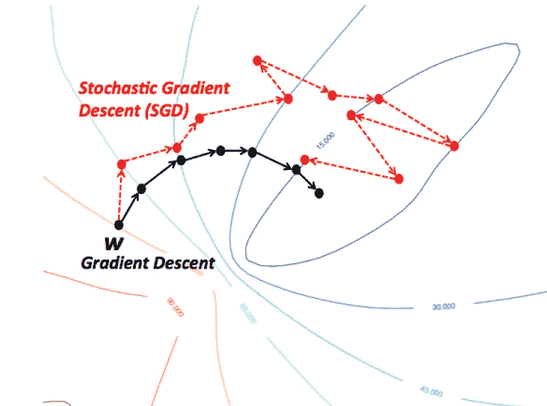*

*Fig. 2.4 Comparison between GD and SGD (s[ource](https://wikidocs.net/3413)): Colored curves indicate contour lines of the cost function. SGD shows a zig-zag pattern and often settles at a suboptimal solution. But it is computationally much more efficient.*

*虽然有计算技巧来处理第一个问题，但第二个问题需要新的技术。其中，随机梯度下降法应用最为广泛。这个想法是把矩阵求逆取出来，用一个叫做**学习率**的非零标量代替(一般写成 *⍺* )。由于现在更新向量▵ *X* 不再是最优的，所以选择小的 *⍺* ( < 0.01)来限制不良更新的损害，希望它们可以被后面的更新纠正。图 2.4 是 SGD 的一个示例，其中收敛轨迹显示为之字形。在实践中，有一些方法可以减轻这种次优性，这将很快给出。*

*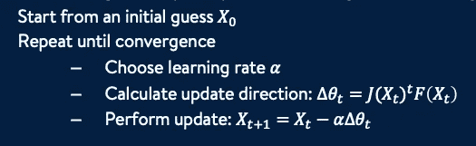*

*SGD: matrix inversion and multiplication replaced by a scalar learning rate*

***2.4 小批量 SGD***

*即使消除了逆，计算矩阵向量乘法*j*(*x*)*ᵗf*(*x*)—o(*Mn*)—的复杂度仍然很高，因为两个 *m，n* 都可能很大。这由**小批量 SGD** 解决，它仅使用总 *m* 方程式中的一小部分，称为*小批量*，用 *B* 表示。理论上 *B* 可以小到 1，即一次一个方程。在实践中，它是根据资源可用性(如内存和 GPU 核心)来选择的。以随机顺序选择小批量，不重复，一个接一个地运行，直到消耗完所有方程式。每次完整运行被称为一个**时期**。增加一个外部循环来执行多个时期，随着越来越接近根，学习率降低。下面是小批量新币:*

*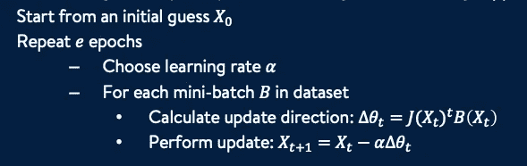*

*Mini-batch SGD: small batch size allows for many epochs of partial optimizations*

*小批量 SGD 的成功来自于 *B* 的小得多的尺寸，这允许运行许多次局部优化以达到最终的解决方案。如果硬件允许，也可以并行执行多个批处理，从而获得更快的速度。*

# *3.深度学习*

*随着函数优化的引入，从这一节开始，我开始描述它是如何用于深度学习的。请记住，现在深度学习很大程度上意味着神经网络训练。此外，人们很难找到任何不深的有用的神经网络。至此，两个短语— *深度学习*和*神经网络—* 可以互换使用。监督学习和非监督学习都不会被区分，因为本质上两者都被认为是由成本函数指导的神经网络训练。*

***3.1 神经网络作为复合函数***

*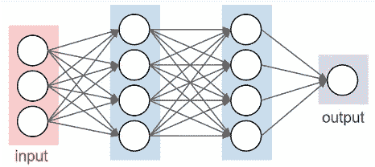*

*Fig. 3.1 A two-layer neural network: 3 input, 2 hidden layers, 1 output*

*图 3.1 左侧是一个简单的神经网络，有 3 个输入(红色)，两个隐藏的神经元层(蓝色)和 1 个输出层(绿色)。圆圈代表神经元。每个都有激活功能。两个相邻层之间的箭头表示突触，这些突触具有权重并被编码到矩阵中，该矩阵将值从输入神经元转换到输出。下面是同一网络的功能视图。*

*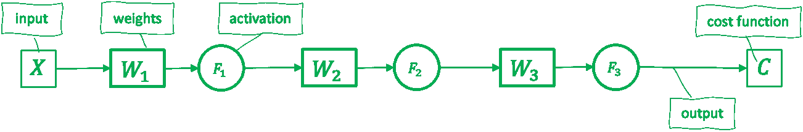*

*Fig. 3.2 Functional picture of the same neural network above*

*具体来说，数据输入 *X* 是一个三维向量。 *W* ₁是一个 4✕3 矩阵(注意输入的列和输出的行)， *W* ₂和 *W* ₃分别是 4✕4 和 1✕4. *F* ₁和 *F* ₂都是 4 元向量函数，称为激活函数。₃是一元元素。成本函数 *C* 也是 1 元的。*

****表象的概括****

*有人可能会问:*CNN*(卷积神经网络)在哪里？*

***答**:实际上 CNN 只是上述结构的一个特例，其中变换矩阵 *W* 为对角带状形式。每行的非零元素构成卷积核。*

*第二个问题是:*CNN 的图片怎么样*？*

***答**:同样是上面的特例。人们可以把 2D 图像想象成一个扁平 1D 矢量。然后可以将图像卷积核编码到 *W* 的行中。*

*最后，还有一个问题:*偏见术语*在哪里？*

***回答**:那可以用计算机图形学中很常见的齐次坐标的概念来处理——在每个矢量函数的末尾附加一个值为 1 的常数激活函数。*

*现在到了**第一个**有趣的点——把神经网络写成复合函数。以下是一些例子:*

*   *单层—*C*(*F*(*WX*))*
*   *两层—*c*(*f*₂(*w*₂*f*₁(*w*₁*x*))*
*   *三层—*c*(*f*₃(*w*₃*f*₂(*w*₂*f*₁(*w*₁*x*))*
*   **L* 层—*c*(*fₗ*(*wₗfₗ*-₁(…(*w*₂*f*₁(*w*₁*x*))))*

*对这种复合函数的评估是从里到外进行的。例如，*c*(*f*₂(*w*₂*f*₁(*w*₁*x*))意味着 *X* 首先与 *W* ₁相乘，然后被馈送到激活功能 *F* ₁.其结果乘以 *W* ₂，并馈送到₂.的 *F* 最后，后者被馈送到成本函数 *C* 。*

*现在，神经网络被写成一个复合函数，在应用 SGD(或小批量 SGD)求解之前，只需要导出一种计算网络参数或矩阵权重的梯度的方法。但在此之前，需要一些必要的工具，即向量外积和元素积。*

****矢量外积****

*让我用一个例子来说明什么是外部产品。给定两个向量 *A* =[ *a* ₁、 *a* ₂、 *a* ₃】和 *B* =[ *b* ₁、 *b* ₂]，它们的外积⊗是这样构造的:将第一个向量作为一列，第二个向量作为一行，将它们组合成一个按元素乘法的矩阵。*

*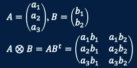*

*|*A*|=*m,* |*B*|=*n. O*uter product A⊗B is a matrix of size *m*x*n**

****矢素积****

*它被定义在两个相同长度的向量之间。输出也是相同的长度。*

*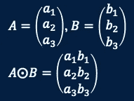*

*|*A*| = |*B*|. Element product A⨀B is a vector of the same length*

***3.2 神经网络梯度-链式法则***

*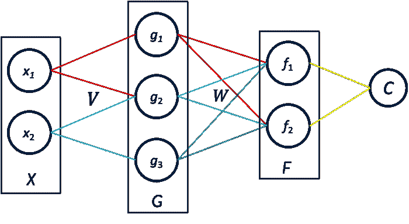*

*Fig. 3.3 A double layer network*

*现在是第二个**有趣的也是这个博客最重要的一点——链式法则——它允许计算成本函数 w.r.t .任何参数的部分梯度。例如:图 3.3 中，参数为两个矩阵 *V* 和 *W* 。成本函数为 *C* 。链式法则允许计算; *Cᵥ、*ψ、 *C𝓌* 、部分梯度的 *C* 对比 *V* 和 *W* 。***

*在不太深入技术细节的情况下，让我们先看看结果。请注意元素产品和外部产品在这里是如何使用的。要注意的第二件事是公式的递归性质，这是后面要介绍的反向传播的基础。*

*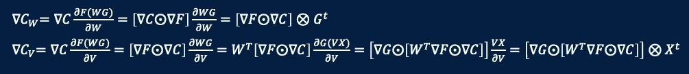*

*在神经网络上下文中理解链式规则时，一个关键概念是*错误传播*。在网络训练期间，首先将输出与目标进行比较，并确定它们的差ψ;*C =*输出-目标，然后将其传播到输入，以计算在反向过程中遇到的参数梯度。*

*参考图 3.3，想象一下▽ *C* 的第一个逆止点就在*f*那里，它变成了 *ϵ* ₁=▽ *F* ☉▽ *C* 。偏渐变是▽ *C𝓌=ϵ* ₁⊗ *Gᵗ.*在 *G* 正前方的第二个逆止点，误差变为*ϵ*₂=▽*g*☉[*wᵗϵ*₁】给出部分坡度 *Cᵥ=ϵ* ₂⊗ *Xᵗ.**

*一般 *N-* 层网络的链式法则总结如下。关于推导的更多细节可以在这个优秀的[教程](http://neuralnetworksanddeeplearning.com/chap2.html)中找到。*

*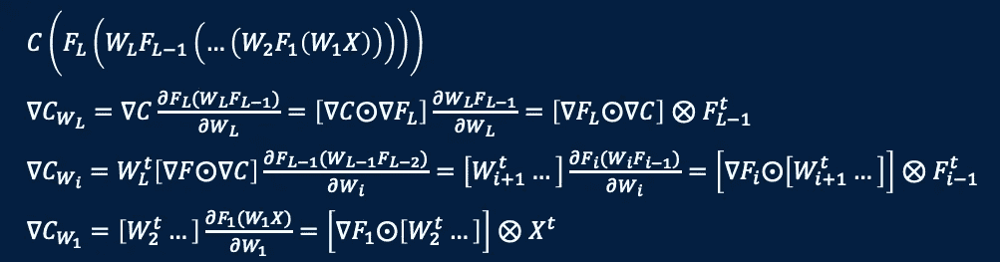*

*Chain rule of a general L-layer neural network*

***3.3 反向传播***

*给定一般的链式法则，不难得到用于网络梯度计算的反向传播方法，这是这里的第三个有趣的事情。在向前传递期间，所有层输出和激活渐变都被缓存。在反向传播步骤中，误差首先通过权重矩阵的转置进行变换，然后通过前一层的激活函数的梯度进行缩放。之后，获得部分参数梯度作为更新的误差向量和缓存的输出之间的外积。*

*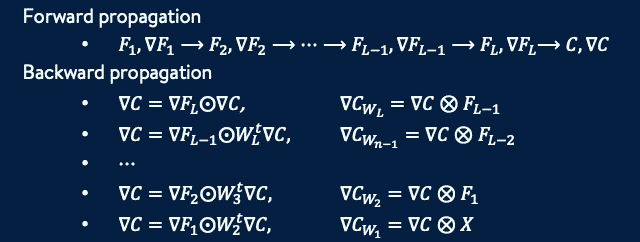*

*Forward and backward propagation based on chain rule*

***3.4 使用小批量 SGD 训练神经网络***

*我们现在手头有了训练神经网络的所有工具:*

*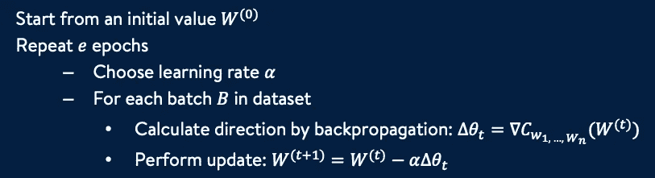*

*Neural network training using Mini-batch SGD*

*图 3.4 是典型的 SGD 成本降低曲线。这种波动与图 2.4 所示轨迹中的锯齿形一致。出现这种情况是有原因的。如何处理这一缺陷引出了下一个主题，即提高基于 SGD 的培训的性能。*

*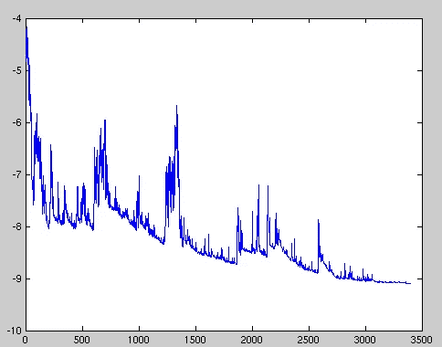*

*Fig. 3.4 SGD convergence curve ([source](https://en.wikipedia.org/wiki/Stochastic_gradient_descent)) — fluctuation as a result of gradient step zip-zag*

# *4.优化者*

*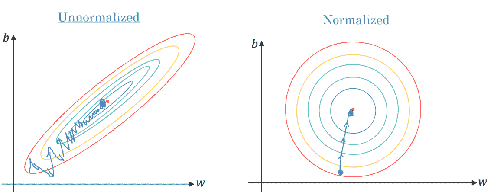*

*Fig. 4.1 Wiggling appears in a uneven error surface ([source](https://machinelearningnotepad.wordpress.com/2018/04/15/gradient-descent/))*

*SGD 的波动行为是因为极高维度成本函数的误差曲面一点也不均匀。图 4.1 中的图像展示了梯度不均匀性导致阶跃波动的现象。显然，更新步骤 *⍺▽⍬* 需要在学习速率或方向上或者两者上进行修改。这是本节介绍的不同优化器的工作。完整的在线教程可以在这里找到[。](https://ruder.io/optimizing-gradient-descent/index.html#rmsprop)*

***4.1 动量***

*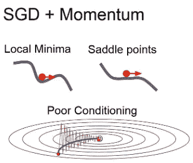*

*Fig. 4.2 Momentum uses historical average of gradients as update direction as shown by the smooth blue trajectory ([source](https://www.programmersought.com/article/46834640604/))*

*如前面的分析所示，SGD 面临一些挑战:*

*   *如果使用小的学习率，收敛速度很慢*
*   *如果采用较大的学习速率，收敛会出现波动甚至发散*
*   *此外，必须处理梯度接近零的鞍点，这意味着迭代更新停止在局部最小值。*

*这个想法实际上很简单——用所有历史梯度的平均值替换当前梯度。平均值像低通滤波一样平滑波动。与此同时，鞍点被**动量**超越(该方法因此得名)。动量的积累由*vₜ*+₁*=βv*ₜ*+*(1*-β*)▽*c𝓌*完成，其中 *β* 为衰减因子。 *β* 通常设置为 0.9 或更大的值，这意味着在每一步，90%或更多的更新来自动量。电流梯度仅贡献 10%或更少。在鞍点，即使梯度为 0，更新仍以先前动量的 90%继续。一旦鞍点通过，新的梯度变得可用，训练获得新的速度。*

*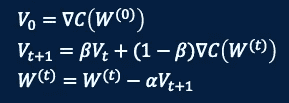*

*Update formulae of Momentum via historical gradient average*

*4.2 阿达格拉德*

*动量只改变方向分量 *▽⍬* 而不改变学习速率。有时，希望采用每个参数的速率，使得较稀疏的参数(较平坦的误差区域)比不太稀疏的参数移动得更快。这是由 AdaGrad(对于 T21 Grad)通过添加与每个渐变的相应分量的累积长度成反比的每参数缩放来实现的。*

*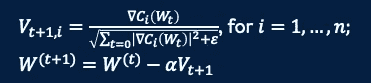*

*Update formulae of AdaGrad — index i loops through each component of W. *ϵ is a small number to avoid division by zero,* usually on the order of 1e−8.*

*在上面的等式中，分母上的累积试图达到动量的历史平均值的类似效果。*

*AdaGrad 的好处之一是，它消除了定期调整学习率 *⍺* 的需要。大多数实现使用默认值 0.01，并在整个时期保持不变。*

*4.3 RMSProp*

*AdaGrad 的主要弱点是它在分母中积累平方梯度——它在训练过程中不断增长——导致学习率收缩，最终变得无穷小，此时训练无法再前进。rms Prop(**R**oot**M**ean**S**quare**Prop**agation)通过限制过去渐变的窗口大小来解决这一缺陷。*

*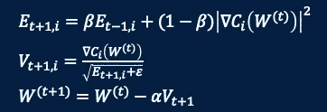*

*Update formulae of RMSProp via the introduction of a decay factor, similar to that of Momentum*

*它以一种巧妙的方式实现了这种效果，而没有通过使用衰减因子显式存储多个梯度，就像在动量中一样。由于 *β <* 1，经过许多步骤后，更早的动量的累积重量变得如此之小，以至于它们的贡献实际上可以忽略，有点像软窗。RMSProp 继承了动量的历史平均和 AdaGrad 的每个参数的缩放，因此具有两者的优点。*

***4.4 亚当***

*最后， **Ada** 感受性 **M** 矩估计结合了所有先前方法的优点，即衰减、动量和每参数缩放。*

*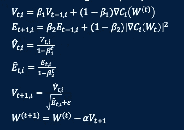*

*Update formulae of Adam*

*由于 *V* 和 *E* 被初始化为 0 向量，初始更新步长可能太小，尤其是当学习率很小时(即 *β* ₁和 *β* ₂接近 1)。上面的两个中间等式旨在抵消这种影响。在早期阶段，当 *t* 较小时，1/(1- *β* ₁ *ᵗ* )和 1/(1- *β* ₂ *ᵗ* 相对较大。因此 *V* 和 *E* 都被放大。在后期阶段，两个标度都接近 1，从而将校正减少到几乎为零。建议的缺省值为:₁*β*0.9，₂*β*0.999，ϵ*1e 8*。*

*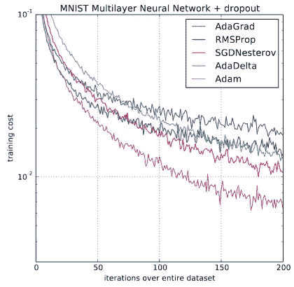*

*Fig. 4.3 Comparison of multiple optimizer’s performances ([Source](https://www.fast.ai/2018/07/02/adam-weight-decay/))*

*右边的图 4.3 是刚刚介绍的一些优化器的比较。说明亚当的表现最好。特别是，在本地 SGD 中看到的波动在这里大大缓解。*

# *5.所有关于 DL 的数学都在三个表格中*

*这篇博客旨在剥离关于深度学习的令人费解且有时令人生畏的观点。它建立了从基本微积分概念，即导数和梯度到最新的 DL 算法的联系。它解释了为什么使用小批量 SGD 来代替简单梯度下降，以及优化器的设计背后的动机，这些优化器改善了训练性能，一次解决一个问题。最后，更简单的是，这里涉及到的所有关于 DL 的数学知识都被打包到下面的三个表格中，供你带走。*

***5.1 功能优化***

*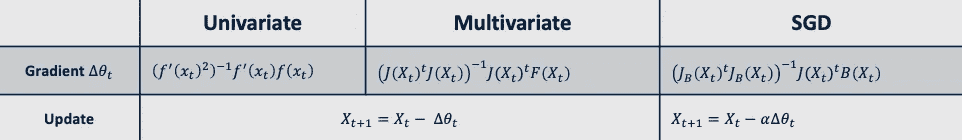*

*Notice the change from derivative to Jacobian, and appearances of mini-batch and learning rate.*

***5.2 反向传播***

*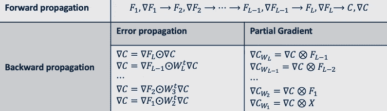*

*Notice the use of caching in the forward pass for the later back-propagation, and the elegant structure.*

***5.3 优化器***

*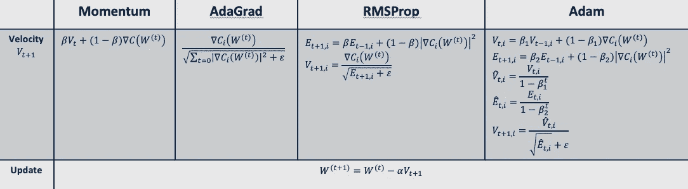*

*Notice the migration of the formulae (left to right) and recall what issue each aims to address.*