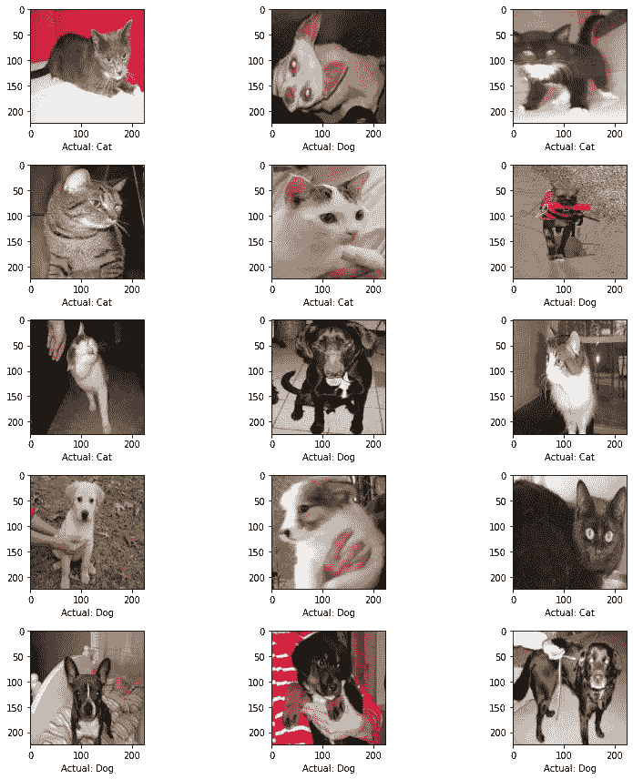
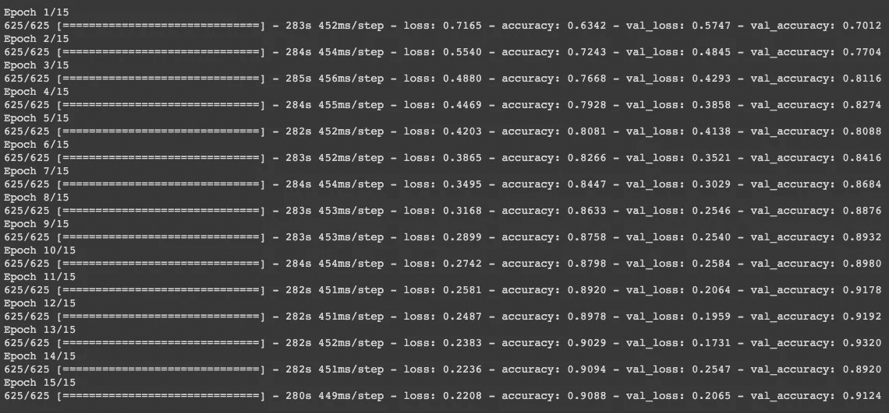
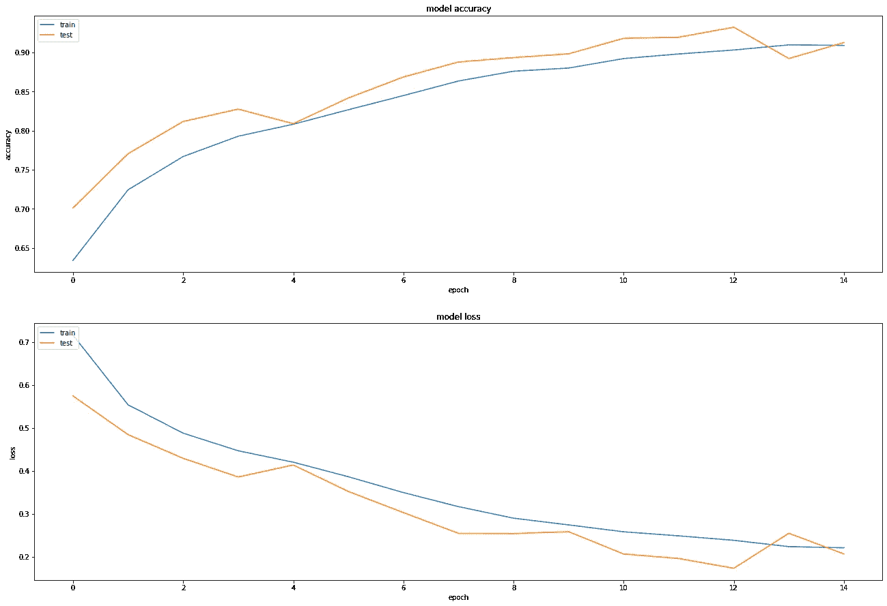
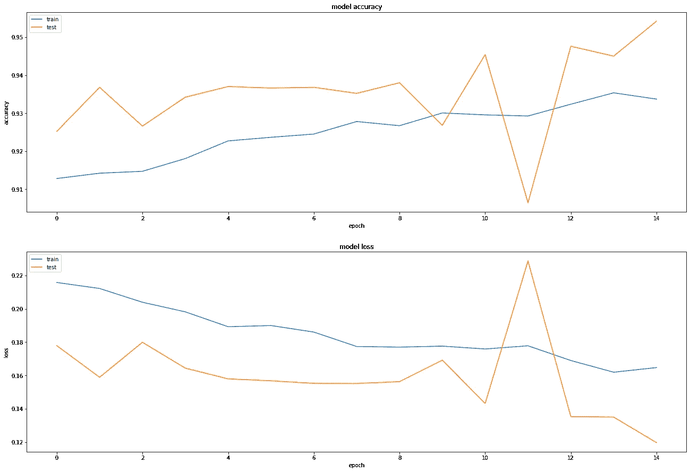
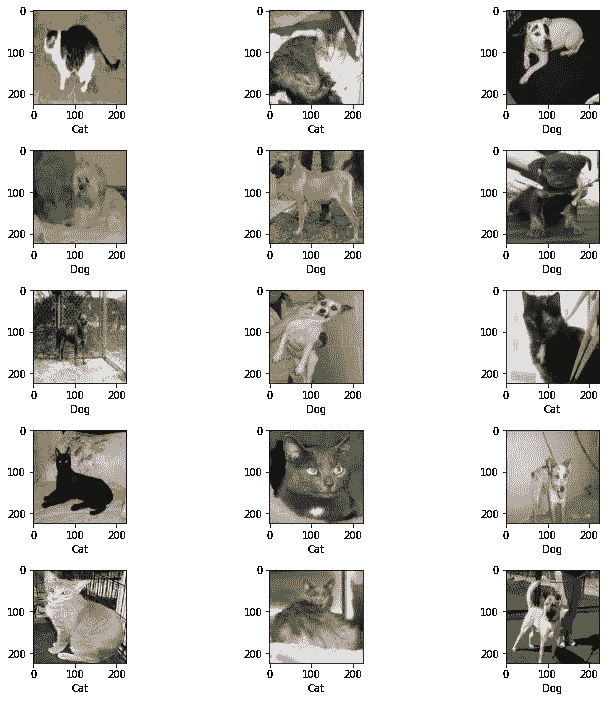
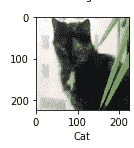

# 针对猫 vs 狗分类的深度学习！

> 原文：<https://medium.com/quick-code/deep-learning-for-cats-vs-dogs-classification-309463f3fc46?source=collection_archive---------0----------------------->

## [深度学习](/topic/machine-learning)

区分猫狗的循序渐进指南！


Photo by [Jamie Street](https://unsplash.com/@jamie452?utm_source=medium&utm_medium=referral) on [Unsplash](https://unsplash.com?utm_source=medium&utm_medium=referral)

被困在付费墙后面？点击[这里](/@D3nii/deep-learning-for-cats-vs-dogs-classification-309463f3fc46?sk=e572054a8b05733214e12e8923bc2313)阅读完整故事与我的朋友链接！

根据 BarkPost.com[的说法，长得一样的狗和猫大概有 14 种。所以，我认为这将是一个有趣的项目，提出一个模型，成功地在它们之间进行分类。](https://barkpost.com/discover/breeds-that-look-like-cats/)


Picture from [noerihito](https://www.instagram.com/p/BEPePitO3xK/)

# 概观

这个项目的主要目的是区分哪张图片中有一只狗，哪张图片中有一只猫。

与以下任务相比，这实际上是一项相对简单的任务:

[](/swlh/deep-learning-for-dog-breed-classification-77ef182a2509) [## 用于狗品种分类的深度学习

### 一步一步的指南来分类 115 个品种的狗图片！

medium.com](/swlh/deep-learning-for-dog-breed-classification-77ef182a2509) 

但是，让我们看看模型的表现。

# 环境和工具

*   [Keras](https://keras.io/)
*   [numpy](https://www.numpy.org/)
*   [熊猫](https://pandas.pydata.org/)
*   [matplotlib](https://matplotlib.org/)
*   [sklearn](https://scikit-learn.org)

# 密码？

实际代码可以在我的 [Github](https://github.com/D3nii/Keras-Projects/blob/master/Dogs_Vs_Cats.ipynb) 上找到。

# 数据

我使用的数据集取自 [Kaggle](https://www.kaggle.com) 。

> Kaggle 是世界上最大的数据科学社区，拥有强大的工具和资源来帮助您实现数据科学目标。

该数据集是在平台上举行的[狗对猫比赛](https://www.kaggle.com/c/dogs-vs-cats/overview)的一部分。它包含了大约 25000 张不同的狗和猫的图片。

> 训练档案包含 25，000 张狗和猫的图片。在这些文件上训练您的算法，并预测 test1.zip 的标签(1 =狗，0 =猫)。

# 导入库

```
import os
import json
import random
import pandas as pd
from keras.regularizers import l2
from keras.models import Sequential
from matplotlib import pyplot as plt
from keras.preprocessing.image import load_img
from sklearn.model_selection import train_test_split
from keras.preprocessing.image import ImageDataGenerator
from keras.layers import Conv2D, MaxPooling2D, Dropout, Flatten, Dense, Activation, BatchNormalization
```

# 数据处理

我不得不把数据从 Kaggle 直接下载到 Colab。

```
import json
!mkdir .kaggletoken = {"username":"USER_NAME", "key":"YOUR_KEY"}with open('/content/.kaggle/kaggle.json', 'w') as file:
json.dump(token,file)!mkdir ~/.kaggle!cp /content/.kaggle/kaggle.json ~/.kaggle/kaggle.json!kaggle config set -n path -v{/content}
!kaggle competitions download -c dogs-vs-cats -p/content!unzip -q test1.zip -d .
!unzip -q train.zip -d .
```

# 数据预处理

为了进行预处理，我所做的只是获取文件名，并使用 [train_test_split](http://scikit-learn.org/stable/modules/generated/sklearn.model_selection.train_test_split.html) 对它们进行拆分，稍后会详细介绍。然后我用另一个发生器在训练前得到图像。因为摆弄 20k+的图像和使用 for 循环是一件麻烦的事情。

```
filenames = os.listdir('/content/train/')
categories = []for filename in filenames:
category = filename.split('.')[0]if category == 'dog':
categories.append(1)
else:
categories.append(0)df = pd.DataFrame({
'filename': filenames,
'category': categories
})df.category = df.category.map({
0: '0',
1: '1'
})
```

现在，我手里有了文件名和类别。我们正在使用来自 *sklearn.model_selection* 的 [*train_test_split*](https://www.google.com/url?sa=t&rct=j&q=&esrc=s&source=web&cd=&cad=rja&uact=8&ved=2ahUKEwjNl_SCxq_rAhXkzIUKHUdoA1kQFjAAegQIAxAB&url=http%3A%2F%2Fscikit-learn.org%2Fstable%2Fmodules%2Fgenerated%2Fsklearn.model_selection.train_test_split.html&usg=AOvVaw0VvM_hdQkS03aadJz9AKKA) 依赖项。

> `*train_test_split*` *是* ***Sklearn 模型选择*** *中的一个函数，用于将数据数组拆分为* ***两个子集*** *:用于训练数据和测试数据。有了这个函数，就不需要手动划分数据集了。*
> 
> *默认情况下，sk learn****train _ test _ split****会对两个子集进行随机分区。但是，您也可以为操作指定随机状态。*

```
train_df, test_df = train_test_split(df, test_size=0.20, random_state=42)
train_df = train_df.reset_index(drop=True)
test_df = test_df.reset_index(drop=True)
```

我使用了 20%的分割值，这意味着我们的训练集将占整个集的 80%，而 test_set 将只占 20%。

接下来，我使用 [ImageGenerator](https://www.tensorflow.org/api_docs/python/tf/keras/preprocessing/image/ImageDataGenerator) 函数来稍微改变图像。

```
# For train settrain_datagen = ImageDataGenerator(
rotation_range=15,
rescale=1./255,
shear_range=0.1,
zoom_range=0.2,
horizontal_flip=True,
width_shift_range=0.1,
height_shift_range=0.1
)train_generator = train_datagen.flow_from_dataframe(
train_df,
"/content/train/",
x_col='filename',
y_col='category',
target_size=(224, 224),
class_mode='categorical',
batch_size=32)# For test settest_datagen = ImageDataGenerator(
rescale=1./255
)test_generator = validation_datagen.flow_from_dataframe(
test_df,
"/content/train/",
x_col='filename',
y_col='category',
target_size=(224, 224),
class_mode='categorical',
batch_size=32)
```

# 查看初始数据

```
# Helper Functiondef check(t):
if t[0] == 1:
return "Cat"
return "Dog" plt.figure(figsize=(12, 12))for i in range(0, 15):
plt.subplot(5, 3, i+1)for X_batch, Y_batch in validation_generator:
image = X_batch[0]
plt.xlabel(check(Y_batch[0]))
plt.imshow(image)
breakplt.tight_layout()
plt.show()
```



Picture by [Author](/@D3nii)

# 模型架构

最后，我们现在在有趣的部分！我在这里设计的架构由 4 个[卷积](https://en.wikipedia.org/wiki/Convolutional_neural_network)层组成！

现在，我使用卷积层:

*   [内核大小](https://www.google.com/url?sa=t&rct=j&q=&esrc=s&source=web&cd=&cad=rja&uact=8&ved=2ahUKEwjWmNaWlP_qAhXC3YUKHZ5EDIIQFjAXegQIAhAB&url=https%3A%2F%2Fwww.sciencedirect.com%2Ftopics%2Fengineering%2Fkernel-size&usg=AOvVaw2o-WRxmZrPtY0R_gavIhr3) : ***5，3***
*   [内核初始化器](https://keras.io/api/layers/initializers/) : [***何 _ 制服***](https://www.google.com/url?sa=t&rct=j&q=&esrc=s&source=web&cd=&cad=rja&uact=8&ved=2ahUKEwjN2-SNlf_qAhXFxoUKHaNACgUQFjAAegQIARAB&url=https%3A%2F%2Fwww.tensorflow.org%2Fapi_docs%2Fpython%2Ftf%2Fkeras%2Finitializers%2FHeUniform&usg=AOvVaw3JZZwRf8N4yIseWbjODgD6)
*   [激活](https://www.google.com/url?sa=t&rct=j&q=&esrc=s&source=web&cd=&cad=rja&uact=8&ved=2ahUKEwjX9Lr4lP_qAhXHxYUKHfy9DFQQFjAIegQIAhAB&url=https%3A%2F%2Fen.wikipedia.org%2Fwiki%2FActivation_function&usg=AOvVaw1mbqcQWcxK0bwZ0LpjldIN):[***elu***](https://www.google.com/url?sa=t&rct=j&q=&esrc=s&source=web&cd=&cad=rja&uact=8&ved=2ahUKEwjU1-mBlf_qAhUCy4UKHb5eCuEQFjAGegQIARAB&url=https%3A%2F%2Fsefiks.com%2F2018%2F01%2F02%2Felu-as-a-neural-networks-activation-function%2F&usg=AOvVaw3OnGX-Nu0Z-iPbWFQMBt3t)
*   [最大池](https://www.google.com/url?sa=t&rct=j&q=&esrc=s&source=web&cd=&cad=rja&uact=8&ved=2ahUKEwjj6r-elf_qAhUIfBoKHZ8GAm0QFjAAegQIBRAB&url=https%3A%2F%2Fkeras.io%2Fapi%2Flayers%2Fpooling_layers%2Fmax_pooling2d%2F&usg=AOvVaw0lrhZz3TwYno3YFpazYe5U) : (2，2)
*   [批量归一化](https://www.google.com/url?sa=t&rct=j&q=&esrc=s&source=web&cd=&cad=rja&uact=8&ved=2ahUKEwi__uTLlf_qAhVKzoUKHcMKAvMQFjAAegQIARAB&url=https%3A%2F%2Fkeras.io%2Fapi%2Flayers%2Fnormalization_layers%2Fbatch_normalization%2F&usg=AOvVaw2NT_Zm_P4hYX3yYxWZvzEb)
*   [辍学](https://www.google.com/url?sa=t&rct=j&q=&esrc=s&source=web&cd=&cad=rja&uact=8&ved=2ahUKEwjMtarblv_qAhVExYUKHUpSCS8QFjACegQIDRAG&url=https%3A%2F%2Fmedium.com%2F%40amarbudhiraja%2Fhttps-medium-com-amarbudhiraja-learning-less-to-learn-better-dropout-in-deep-machine-learning-74334da4bfc5&usg=AOvVaw30V8kJm9MAXcaoR1SGrsJj)***30%***

```
model = Sequential()model.add(Conv2D(64, kernel_size=5, kernel_initializer='he_uniform', padding='same', input_shape=(224, 224, 3)))
model.add(Activation('elu'))
model.add(BatchNormalization())
model.add(Dropout(0.3))model.add(Conv2D(128, kernel_size=3, strides=2, kernel_initializer='he_uniform'))
model.add(Activation('elu'))
model.add(MaxPooling2D(2, 2))
model.add(BatchNormalization())
model.add(Dropout(0.3))model.add(Conv2D(64, kernel_size=3, kernel_initializer='he_uniform', padding='same'))
model.add(Activation('elu'))
model.add(MaxPooling2D(2, 2))
model.add(BatchNormalization())
model.add(Dropout(0.3))model.add(Conv2D(128, kernel_size=5, strides=2, kernel_initializer='he_uniform', padding='same'))
model.add(Activation('elu'))
model.add(MaxPooling2D(2, 2))
model.add(BatchNormalization())
model.add(Dropout(0.3))
```

然后是三层[密层](https://www.google.com/url?sa=t&rct=j&q=&esrc=s&source=web&cd=&cad=rja&uact=8&ved=2ahUKEwim8uz8lf_qAhXQy4UKHZJaDBYQFjAZegQIDBAQ&url=https%3A%2F%2Fwww.tutorialspoint.com%2Fkeras%2Fkeras_dense_layer.htm&usg=AOvVaw0URJwEDmeThpxsnyoLRBA-)同:

*   [激活](https://www.google.com/url?sa=t&rct=j&q=&esrc=s&source=web&cd=&cad=rja&uact=8&ved=2ahUKEwjX9Lr4lP_qAhXHxYUKHfy9DFQQFjAIegQIAhAB&url=https%3A%2F%2Fen.wikipedia.org%2Fwiki%2FActivation_function&usg=AOvVaw1mbqcQWcxK0bwZ0LpjldIN) : [***热路***](https://machinelearningmastery.com/rectified-linear-activation-function-for-deep-learning-neural-networks/) ***，*** [***乙状结肠***](https://en.wikipedia.org/wiki/Sigmoid_function)
*   [批量归一化](https://www.google.com/url?sa=t&rct=j&q=&esrc=s&source=web&cd=&cad=rja&uact=8&ved=2ahUKEwi__uTLlf_qAhVKzoUKHcMKAvMQFjAAegQIARAB&url=https%3A%2F%2Fkeras.io%2Fapi%2Flayers%2Fnormalization_layers%2Fbatch_normalization%2F&usg=AOvVaw2NT_Zm_P4hYX3yYxWZvzEb)
*   [辍学](https://www.google.com/url?sa=t&rct=j&q=&esrc=s&source=web&cd=&cad=rja&uact=8&ved=2ahUKEwjMtarblv_qAhVExYUKHUpSCS8QFjACegQIDRAG&url=https%3A%2F%2Fmedium.com%2F%40amarbudhiraja%2Fhttps-medium-com-amarbudhiraja-learning-less-to-learn-better-dropout-in-deep-machine-learning-74334da4bfc5&usg=AOvVaw30V8kJm9MAXcaoR1SGrsJj)***30%***40%

```
model.add(Dense(756, kernel_initializer='he_uniform'))
model.add(Activation('relu'))
model.add(BatchNormalization())
model.add(Dropout(0.4))model.add(Dense(256, kernel_initializer='he_uniform'))
model.add(Activation('relu'))
model.add(BatchNormalization())
model.add(Dropout(0.5))model.add(Dense(2, kernel_initializer='he_uniform'))
model.add(Activation('sigmoid'))
```

然后，我使用以下代码编译模型:

*   [损失](https://machinelearningmastery.com/loss-and-loss-functions-for-training-deep-learning-neural-networks/) : [二元交叉熵](https://machinelearningmastery.com/adam-optimization-algorithm-for-deep-learning/)
*   [优化器](https://ruder.io/optimizing-gradient-descent/) : [亚当](https://www.tensorflow.org/api_docs/python/tf/keras/losses/binary_crossentropy)

```
model.compile(
loss = 'binary_crossentropy',
optimizer='adam',
metrics=['accuracy'])
```

# 模特培训

我做了两组训练。

```
history = model.fit(
YOUR_DATA,
epochs=YOUR_EPOCHS,
validation_data=YOUR_DATA)
```

## 第一组

我做了 15 个时代:



Picture by [Author](/@D3nii)



Picture by [Author](/@D3nii)

## 第二组

这次又训练了 15 个纪元。


Picture by [Author](/@D3nii)



Picture by [Author](/@D3nii)

# 图表

如果你想知道，这是图表的代码。

```
score = model.evaluate(validation_generator, verbose=0)
print("%s: %.2f%%" % (model.metrics_names[1], score[1]*100))# summarize history for accuracyplt.subplot(211)plt.plot(history.history['accuracy'])
plt.plot(history.history['val_accuracy'])
plt.title('model accuracy')
plt.ylabel('accuracy')
plt.xlabel('epoch')
plt.legend(['train', 'test'], loc='upper left')# summarize history for lossplt.subplot(212)
plt.plot(history.history['loss'])
plt.plot(history.history['val_loss'])
plt.title('model loss')
plt.ylabel('loss')
plt.xlabel('epoch')
plt.legend(['train', 'test'], loc='upper left')plt.subplots_adjust(right=3, top=3)plt.show()
```

# 结果和结论

于是，经过两轮训练，我可以达到 95.42%*。*

*事实上，我对事情的结果很满意。让我展示一个模型在测试集上表现的例子。*

**

*Picture by [Author](/@D3nii)*

*正如我们所看到的，这个模型只错了一次。这一个*

**

*Picture by [Author](/@D3nii)*

*但是是的，这个可以忽略。😅*

*好了，我希望这篇文章能帮助你。我们上 [*Linkedin*](https://www.linkedin.com/in/d3ni/) 连线吧！*

# *参考资料/进一步阅读*

*[](/swlh/deep-learning-for-dog-breed-classification-77ef182a2509) [## 用于狗品种分类的深度学习

### 一步一步的指南来分类 115 个品种的狗图片！

medium.com](/swlh/deep-learning-for-dog-breed-classification-77ef182a2509) [](/@D3nii/just-finished-a-paid-career-path-am-i-a-web-developer-now-85ff53b7580c) [## 刚刚完成一个付费的职业道路，我现在是一个网页开发人员吗？

### 你所想的和真实的。

medium.com](/@D3nii/just-finished-a-paid-career-path-am-i-a-web-developer-now-85ff53b7580c) [](/towards-artificial-intelligence/deep-learning-for-house-number-detection-25a45e62c8e5) [## 用于门牌号检测的深度学习

### 让我带你走一遍。

medium.com](/towards-artificial-intelligence/deep-learning-for-house-number-detection-25a45e62c8e5) 

# 联系人

如果你想了解我最新的文章和项目[，请关注我的媒体](/@D3nii)。以下是我的一些联系人详细信息:

*   [领英](https://www.linkedin.com/in/d3ni/)
*   [GitHub](https://github.com/D3nii?tab=repositories)
*   [推特](https://twitter.com/danyal0_o)

> 快乐学习。:)*