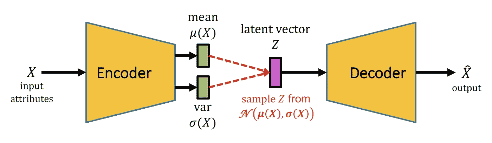
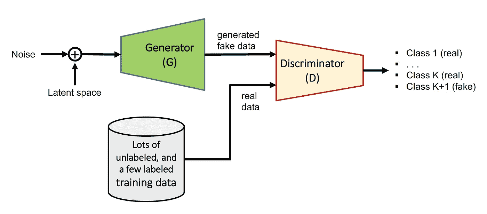
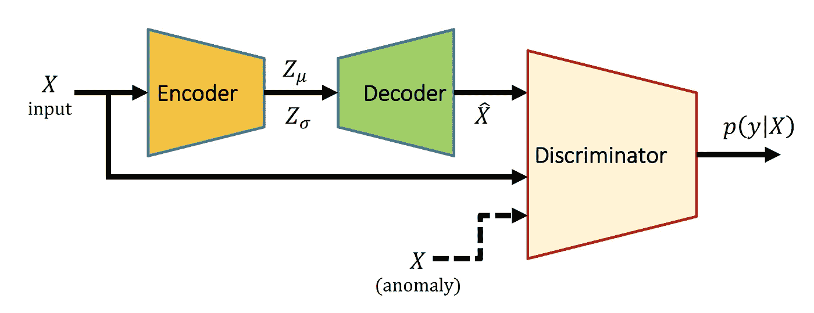
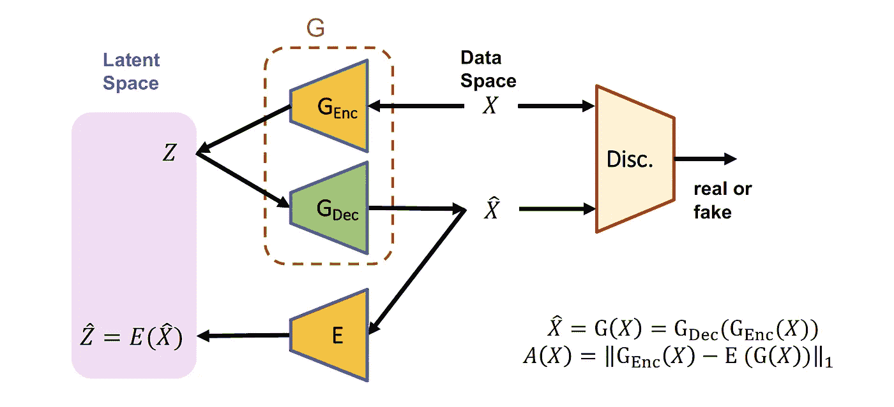

# 用于零售交易中欺诈检测的深度学习

> 原文：<https://medium.com/walmartglobaltech/deep-learning-for-fraud-detection-in-retail-transactions-564d31e5d1a3?source=collection_archive---------0----------------------->

## 挑战和基于深度学习的解决方案概述

随着 ***【网上购物】***[***电子商务***](https://en.wikipedia.org/wiki/E-commerce) 和 ***电子零售*** 的不断发展，前所未有的新增网络用户和网购者的新渠道也为欺诈和滥用创造了更多的机会。为了理解这个问题的范围和复杂性，这里有一个例子。考虑到*身份被盗*、*账户被接管*或信用卡被盗的可能性，我们如何确定新老客户购物或退货并获得退款(在线或店内)是否真正合法？

欺诈检测是 [***异常检测***](https://en.wikipedia.org/wiki/Anomaly_detection) 的一个例子，它是 [**机器学习**](https://en.wikipedia.org/wiki/Machine_learning)[**【人工智能】**](https://en.wikipedia.org/wiki/Artificial_intelligence) (AI)中更广泛的主题，并且遭受在定义异常(或离群值)方面的不确定性以及在结果验证和性能监控方面的困难。大多数异常检测方法可以被认为是无监督或半监督学习问题，但是如果我们的数据库中有足够的标记或验证数据来学习，那么监督学习可以用于建立检测模型。

除了金融交易中巨大的数据量和复杂性之外，欺诈检测还有一些挑战需要克服，下面将进行总结。在这篇文章中，我们将重点关注基于**人工神经网络** (ANN)或 [**深度学习**](https://www.deeplearningbook.org/) 的零售交易欺诈检测解决方案，并探讨该领域的几个主题。正如在许多其他机器学习问题中一样，深度学习(DL)方法有望表现得更好。DL 的好处包括对特征工程的需求大大降低，随着我们获得越来越多的数据，学习和性能会更好。

# **检测欺诈有哪些挑战？**

从讨论的示例中可以看出，解决大多数欺诈和滥用检测问题需要访问大量关于客户和交易的当前和历史信息，包括客户的购物概况、进行购买的客户与其他客户之间的关系，以及他们过去在哪里以及如何进行购买或退货。接下来的问题是如何以及何时确定购买是欺诈性的。这里要讨论的另一个问题是，传统的欺诈检测解决方案需要大量的数据预处理和工程步骤。具体来说，

*   建立欺诈检测模型是一项机器学习任务，它处理由拥有**高维特征空间**引起的难题。在预处理、量化和特征嵌入之后，我们最终得到大量不同种类的输入属性或特征。我们从当前交易中获取这些特征，并结合从关于客户的历史数据以及所有相关的过去交易和相关事件中生成的属性。
*   金融欺诈检测的主要挑战之一是，只有非常小比例(远低于 1%)的交易是欺诈:不平衡的机器学习问题。因此，很难了解如何以高准确度识别欺诈案件，同时限制**假阳性率(FPR)** 。仅仅专注于提高欺诈检测(或真阳性)率会导致更高的 FPR。如果一个正常的交易被错误地预测为欺诈(即误报)，这将导致销售损失，但更重要的是，这将导致客户不满，随后*客服*(即更高的人力成本)将进一步介入调查该案件，并帮助感到不安和受到侮辱的客户。因此，具有较高 FPR 的检测模型将转化为较高的**客户侮辱**率，并可能导致失去一些合法客户。并不是所有的客户侮辱都会联系客服。
*   建立或开发欺诈检测模型的另一个挑战是**数据标记**问题(监督或半监督学习所需)，即确定交易是否实际上是欺诈。
*   关于数据标签的另一个问题是，欺诈有各种类型、复杂程度和形式。此外，欺诈者不断使用新方法实施欺诈。因此，我们的历史数据库可能缺少这种欺诈或滥用模式。在这种情况下，无监督或半监督的异常检测模型可能会有所帮助。
*   当执行欺诈检测时，给定交易的检测模型的输出可能是连续的'**欺诈得分**或欺诈概率，我们通常需要选择一些阈值，以便将其转换为最终决策。
*   当前部署或工作的金融欺诈检测系统包括若干基于规则的决策的组合、若干数据预处理步骤，包括从历史数据中提取有用的属性和网络信息，以及最后在将数据馈送到基于机器学习的检测模型之前的大量特征工程，(流行的机器学习方法包括无监督聚类方法，如*'*[*k-means*](https://en.wikipedia.org/wiki/K-means_clustering)*'、* [*隔离森林*](https://en.wikipedia.org/wiki/Isolation_forest)*和 *'* )流行的监督方法有 *'* [*logistic 回归*](https://en.wikipedia.org/wiki/Logistic_regression) *'，* [*随机森林*](https://en.wikipedia.org/wiki/Random_forest) *'，* [*渐变助推机*](https://en.wikipedia.org/wiki/Gradient_boosting) *'，*和*'*[*XGboost*](https://www.kdd.org/kdd2016/papers/files/rfp0697-chenAemb.pdf)*')。*一般来说，这意味着很高的维护成本。*
*   *即使基于深度学习的解决方案仍然需要数据预处理和特征嵌入，但其对特征工程的需求低于经典(非深度学习)解决方案。深度学习检测模型的问题在于训练或构建它们的难度，通常在生成预测时会有更高的**延迟**，这使得在运营或生产模式下更难扩展以服务于每秒钟的大量交易。*

# *基于深度学习的解决方案*

*我们将在本博客的剩余部分更详细地回顾几种欺诈检测方法，包括编码器-解码器结构、生成式对抗网络、其他半监督方法、监督方法和迁移学习。*

## *编码器-解码器结构或自动编码器*

*由于大量的未标记数据以及标记数据的困难和不确定性(欺诈与正常)，将欺诈检测视为无监督或自我监督的异常检测问题并不罕见，而[自动编码器](https://en.wikipedia.org/wiki/Autoencoder) (AE)可能是解决这一问题的好办法。*

*   *自动编码器的基本目标是学习数据的压缩表示或学习“正常”数据的生成模型。然后，我们可以通过检查重构误差是否超过阈值来检测“异常”输入。AE 具有 ***编码器*** 部分，其将输入特征压缩成瓶颈或潜在空间向量，其后是 ***解码器*** 部分，其基本上基于压缩的潜在向量创建或生成类似于输入的输出。*
*   *由于 AE 从大量正常数据中学习紧凑的生成模型，当异常数据作为输入时，输出将很可能不同于输入。为了我们的目的，重构误差(即输入和输出之间的差异)可以用作**欺诈分数**。*

*有许多自动编码器方法，其中最有前途的是**变型自动编码器** (VAE) [ [金玛和韦林](https://arxiv.org/pdf/1906.02691.pdf)。同样参见[这个](https://arxiv.org/pdf/1606.05908.pdf)*

**

*Fig. 1\. Basic structure of a variational auto-encoder (VAE). It includes probabilistic encoder and decoder structures. The model learns to reconstruct the input, and the output is controlled by the random latent vector Z, which is a low-dimensional representation of input.*

*VAE 是初始 AE 结构的概率生成扩展。VAE 编码器估计的压缩向量有两个:均值和标准差，代表数据在压缩低维空间的概率分布。潜在向量 *Z* 从分布中采样以生成输出，当数据正常时，该输出与输入 *X* 非常“相似”,并且与 VAE 训练期间看到的大多数数据相似。*

*   *在几个数据集中，被用于异常检测和欺诈检测[参见，例如，由 [Jinwon](http://dm.snu.ac.kr/static/docs/TR/SNUDM-TR-2015-03.pdf) 、 [Alazizi](https://link.springer.com/chapter/10.1007/978-3-030-44584-3_2) 、 [Xu](https://arxiv.org/pdf/1802.03903.pdf) 和他们的共同作者的工作]。注意，根据输入数据的类型和设计者的选择，编码器和解码器部分中的每一个都可以是****【conv net，或 CNN】**[**递归神经网络**](https://en.wikipedia.org/wiki/Recurrent_neural_network)**【RNN】**或 [**全连接网络**](https://en.wikipedia.org/wiki/Feedforward_neural_network) (也称为前馈网络或多层感知器)结构或它们的组合。***
*   ***另一种用于异常检测的 AE 结构是所谓的**‘鲁棒深度自动编码器’**[【周等，2017】](https://www.kdd.org/kdd2017/papers/view/anomaly-detection-with-robust-deep-auto-encoders)，其承诺处理不完全正常的训练数据，即，它可能包含异常或异常样本。该方法基于“[鲁棒 PCA](https://arxiv.org/pdf/0912.3599.pdf) ”，并通过将输入数据 X 分成两部分 X = L + S 来工作，其中 L 可以由自动编码器有效地重构，S 模拟难以重构的噪声和异常分量，然后最小化具有两项的正则化目标(或损失)函数。***

***尽管使用自动编码器存在一些挑战，但它们并不总是像预期的那样工作。局限性在于，当输入数据噪声很大或包含大量不相关或大部分随机的特征或属性时，它们可能无法很好地工作。这是因为自动编码器将很难学会重建这些属性。此外，解码或数据生成过程是有损耗的，并不完美，主要是由于瓶颈处使用的压缩，这可能会删除一些有用的信息。自动编码器可能会导致问题的次优解决方案，因为自动编码器的训练通常独立于我们报告异常检测的最终决策部分(无论是应用简单的阈值，还是在重建误差的最终阶段应用另一个机器学习模型以得出最终的欺诈检测)。***

## *****生成对抗网络**(甘)***

***gan 是 VAE 的扩展，但不需要明确的概率密度估计。gan 由生成器部分和鉴别器部分组合而成，相互竞争，其中**生成器**从随机且紧凑的潜在空间向量中创建合成或虚假数据，并试图使其尽可能接近真实数据，**鉴别器**学习识别输入数据的真假，挑战生成器。生成器的潜在空间向量决定了生成数据的分布或属性，[ [Goodfellow](http://papers.nips.cc/paper/5423-generative-adversarial-nets.pdf) 。见[这](https://arxiv.org/pdf/1710.07035.pdf)也一样】。***

*   ***GAN 的训练过程通常包括多个目标的同时优化(例如，以多个加权损失函数的最小化的形式)。例如，训练可能包括损失函数的最小化，该损失函数是*生成误差*和*辨别误差*的加权或正则化组合，但是研究人员开发了几个 GAN 版本，这些版本在如何进行这种优化方面有所不同，并且可能包括其他误差或损失项。***

***如果我们有一些标记的数据，我们可以使用它们来更好地训练鉴别器模型。就在训练过程中使用数据标签而言，存在无监督、半监督和监督版本的 GAN。在监督版本中，GAN 的鉴别器部分也学习输出输入数据的类别标签，或者在训练期间使用标记的数据作为附加的(监督的)损失项。***

******

***Fig. 2\. A semi-supervised GAN-based model for anomaly detection. The generator and discriminator networks are learned using a training dataset by optimizing a loss function which includes a combination of an unsupervised and a supervised loss terms, [[He, et al., 2017](https://www.mdpi.com/2072-4292/9/10/1042/htm)].***

***对于 GAN 中的数据发生器，如前所述，通常使用 VAE 结构的解码器部分。请注意，VAE 是一个用于数据生成的无监督学习任务，GAN 添加了一个监督学习组件，即鉴别器，以便通过同时学习生成器和鉴别器部分来挑战 VAE 并帮助提高其性能。***

******

***Fig. 3\. Structure of a VAE-GAN model: The encoder decoder parts make a variational auto-encoder which are trained in unsupervised way using all normal data. The discriminator can be trained using normal data as well as any available labeled abnormal (fraud) data, [[Kimura, et al., 2020](https://openaccess.thecvf.com/content_WACV_2020/papers/Kimura_Adversarial_Discriminative_Attention_for_Robust_Anomaly_Detection_WACV_2020_paper.pdf)].***

***在使用 GAN 进行异常检测时，在另一种称为 [AnoGAN](https://arxiv.org/pdf/1703.05921.pdf) 的方法中，对于输入数据样本 X，在潜在空间中搜索样本 Z，使得对应生成的合成数据和 X 相似。训练后，由于潜在空间覆盖了法线的分布，当输入异常时，真实数据和生成的伪数据会有很大的差异。***

******

***Fig. 4\. [GANomaly](https://arxiv.org/pdf/1805.06725.pdf) structure: G, E, Disc and A denote generator, encoder, discriminator, and ‘anomaly score’ respectively. The ‘anomaly score’ in this method is the encoder loss in the ‘latent space’, i.e., the difference between *Z* and its reconstructed version, E(G(*X*)). The loss function used to optimize or train this structure is a combination of several parts, including the construction loss, encoder loss and adversarial loss, [[Akcay et al., 2018](https://arxiv.org/pdf/1805.06725.pdf)]. This structure is similar to bidirectional GAN ([BiGAN](https://arxiv.org/pdf/1605.09782.pdf)).***

***还有其他版本的 GAN 可能对这里有用。[条件 GAN](https://arxiv.org/pdf/1411.1784.pdf) (CGAN)模型学习生成以额外输入为条件的样本，如数据标签。在 CGAN 中，数据标签向量作为第二个输入提供给生成器和鉴别器。经过训练后，CGAN 使我们能够生成我们想要的特定类型的数据。***

***[Wasserstein GAN](https://arxiv.org/pdf/1701.07875.pdf) (WGAN)是 GANs 的扩展，目标是可解释性和使训练更加稳定，(另见 [this](https://arxiv.org/pdf/1807.01202.pdf) )。WGAN 使用 [Wasserstein 距离](https://en.wikipedia.org/wiki/Wasserstein_metric)(或推土机距离)来测量分布之间的距离。推土机的距离被解释为运输一个分布的概率质量直到它与另一个匹配的成本，并且两个分布不需要有重叠。WGAN 的一个特性是它能够生成分类数据，这在这里是一个有用的特性，因为欺诈检测的一些输入特征或属性是分类数据。***

***除了使用 GAN 中的“生成器”来学习数据生成模型和底层紧凑潜在空间之外，一旦被训练，它还可以用于创建额外的合成数据来扩充用于某些目的的训练集。请注意，总的来说，真实数据比 GAN 创建的合成数据更有价值，但是 GAN 可以在某些情况下帮助扩充数据。***

***一般来说，与自动编码器相比，GAN 在训练过程中有更多的损耗分量需要优化，可以生成看起来更真实的合成数据，最终可以用于检测复杂的异常情况。然而，培训 GANs 更加困难，培训可能无法达成可接受的解决方案。最后，由于训练基本版本的 GANs 的主要目的是从紧凑的潜在空间生成数据，而不是异常检测，因此对于我们这里的目的来说，结果可能不是最理想的。***

## ***其他半监督方法***

***还有其他几种方法可用于构建半监督和弱监督异常检测模型:***

*   ***[偏差网络](https://arxiv.org/pdf/1911.08623.pdf)【Pang，et al .，2019】使用大量未标记的数据以及少量标记的异常和基于异常分数的高斯先验来训练异常检测模型。其思想是使用正态数据的先验概率信息，以确保对于异常数据，我们的异常得分与位于分布尾部的正态数据的异常得分有显著的偏差。***
*   ***由 [Ruff 及其同事【2020】](https://arxiv.org/pdf/1906.02694.pdf)提出的半监督异常检测方法基于集成或组合损失函数的最小化，包括学习未标记的正常数据表示以及学习稀疏或有限数量的标记异常样本的异常分数，确保异常远离正常。它使用的思想是，与异常数据相比，正常数据的潜在分布熵应该更低，因此他们的方法通过最小化正常数据的潜在分布熵，同时最大化异常数据的潜在分布熵来工作。他们得出结论，当一些标记数据可用时，采用这些数据标签的半监督方法比建立完全无监督的异常检测模型(并忽略所有标签)更好。***

## ***使用监督方法进行欺诈检测***

***如果我们有足够大的一组历史标记数据集，我们就可以非常有把握地知道哪些数据样本以及何时发生了**退款，哪些交易是欺诈性的，何时发生了客户侮辱事件，以及何时发生了退货滥用案例等。基于监督的深度学习的欺诈检测方法可以提供较高的准确性和性能。*****

*****由于存在各种类型的输入特征或属性(包括点数据以及事件和序列数据)，因此在特征提取过程中可以采用两种方法:*****

1.  *****我们可以直接将序列数据和事件时间序列提供给康文网络或 RNN 深度学习模型，其中特征提取任务将由深度学习模型自动完成；这是一个所谓的**端到端**机器学习设计的例子。*****
2.  *****除了关于当前交易的信息之外，我们还可以从连续的历史信息以及过去的网络或交互信息中导出或提取各种相关属性或特征。然后，我们可以将所有这些提取的定量特征输入到深度学习模型中。与传统的机器学习方法相比，深度学习模型在高维数据上表现更好。*****

*****为了解决不平衡训练数据集的问题，欺诈样本的过采样和正常样本的欠采样非常有用。*****

## *****迁移学习*****

*****如果我们有一个基于 DL 的模型，最初是为欺诈检测问题或具有大型数据集的应用程序训练的，那么我们可以通过微调其参数将该模型用于另一个类似的问题或应用程序，即使新问题的数据集很小。这叫做迁移学习，**学习的迁移**，或者“**领域适应**”。换句话说，假设我们的另一个新的欺诈检测问题没有足够的数据来从头训练一个新的检测模型，但它使用相同的输入数据属性。然后，如果我们有一个良好且训练有素的欺诈检测模型，可以很好地处理不同但相似的问题，我们可以使用预训练的模型作为初始网络，使用我们在新问题中拥有的小数据集执行有限的额外训练或**微调**。通过这样做，我们实际上是在推广经验，并将从解决一个问题(有时称为“源领域”)中学到的知识**转移到另一个训练数据不足的问题(称为“目标领域”)中，从而提高性能，否则这是不可能的。[例如，参见[庄](https://arxiv.org/pdf/1911.02685.pdf)和[乐比丘](https://www.researchgate.net/publication/332180999_Deep-Learning_Domain_Adaptation_Techniques_for_Credit_Cards_Fraud_Detection) ]。*******

*   *****我们可以通过各种方式使用迁移学习，从无监督的方法到有监督的方法。例如，在受监督的方法中，由于 DL 模型的初始层执行特征提取任务，一种方式是我们保持原始预训练 DL 模型的初始层完整无损，并且仅使用我们新的但较小的数据集来微调或调整顶层(即，接近输出的层)。另一种方式是，我们允许调整原始 DL 模型的所有参数或网络层，但是通过降低学习率、对每一层使用不同的学习率(其中靠近输入的层获得非常小的学习率)、或者通过限制训练迭代的次数来限制调整量。*****
*   *****迁移学习可能有帮助的另一个领域是当我们做**数据扩充**和使用合成数据时，特别是对于时间序列或顺序数据。请注意，异常事件在现实生活中非常稀少，因此生成合成异常可能有助于训练过程。例如，【Wen】和 Keyes 在一大组合成序列数据上预先训练了用于异常检测的 ConvNet 模型，然后在一小组真实数据上微调了模型参数。*****

# *****结束语*****

*****与传统的机器学习方法相比，深度学习模型可以帮助降低假阳性率(FPR)(这意味着更少的客户侮辱)，并减少退款和欺诈。请注意，当我们处理大规模且竞争激烈的电子商务时，即使 FPR 和退款率的小幅降低(如 5%至 10%的降低)也可能转化为业务利润或绩效的显著增加。*****

*****基于深度学习的模型的一个关键优势是它们的**学习能力**，这意味着随着我们数据库规模的增长，它们能够自动提取更复杂的特征，学习更复杂的检测模型，并通过更多或更大的训练数据来提高性能。另一个主要好处是它们能够处理各种各样的输入特征或属性，而不必太担心属性的统计特性、它们的依赖性或相关性以及特征工程工作。深度学习方法的许多应用是针对非常复杂问题的**端到端**解决方案，这意味着在特征提取或维度的**诅咒**方面的挑战更小。然而，鉴于欺诈检测中固有的复杂性和挑战，正如我们在本帖中所讨论的，仍有改进的空间和研究的需要:需要设计一种适合异常检测目的的深度学习方法，以优化探索未标记数据中的丰富信息，改进各种输入数据和属性的处理方式，然后输入到深度学习模型中，同时降低计算复杂性，以便它可以在生产中扩展，以每秒处理大量交易，并具有合理的检测延迟。*****

******我要感谢我在沃尔玛的同事 James Tang、Henry Chen、Julia Albath、Camilo Rivera、Jan Johnson 和夏静，他们阅读了草稿，并提供了他们的宝贵意见，帮助改进了这篇文章。******